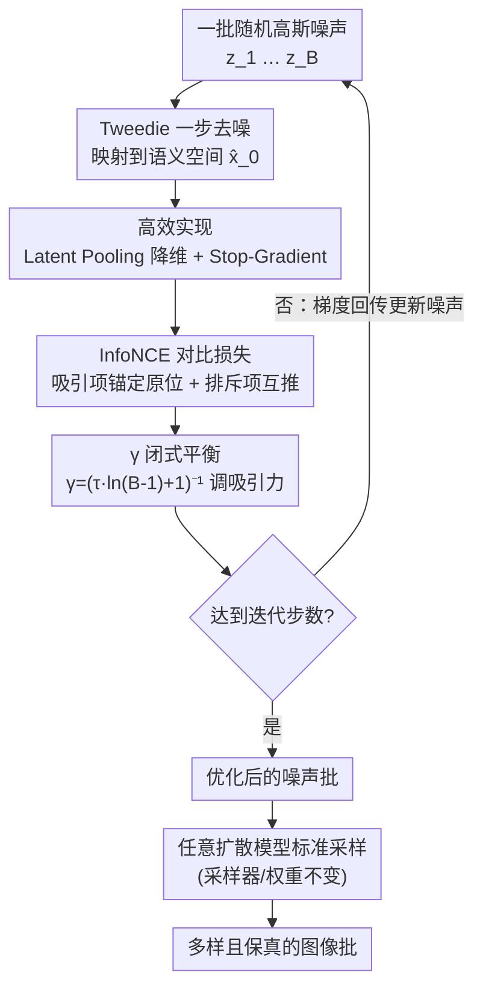

# Diverse Text-to-Image Generation via Contrastive Noise Optimization

**会议**: ICLR 2026  
**arXiv**: [2510.03813](https://arxiv.org/abs/2510.03813)  
**代码**: 有（官方开源）  
**领域**: 扩散模型 / 图像生成  
**关键词**: 扩散模型, 文本到图像生成, 多样性, 对比学习, 噪声优化, InfoNCE

## 一句话总结

提出 Contrastive Noise Optimization (CNO)，通过在 Tweedie 去噪预测空间上对初始噪声施加 InfoNCE 对比损失，以预处理方式提升扩散模型生成多样性，同时保持保真度，无需修改采样过程或模型本身。

## 研究背景与动机

**扩散模型的多样性瓶颈**：当前文本到图像扩散模型（如 SD1.5、SDXL、SD3）在给定相同 prompt 时，生成结果往往高度相似（mode collapse / 模式坍缩），特别是在确定性采样器（如 DDIM、FM-ODE）下，输出多样性严重不足。

**根源在噪声空间分布**：随机采样的高斯初始噪声并不保证在去噪后的语义空间中均匀分散，导致多个噪声映射到相似的生成结果。

**已有方法的局限**：增加随机性（如 stochastic samplers）会牺牲质量；后处理方法（如 rejection sampling）计算开销大；修改模型结构或训练流程侵入性强。

**对比学习的启发**：InfoNCE 损失天然具有"拉近正样本、推远负样本"的结构，适合在噪声批次中同时维持保真度（吸引项）和提升多样性（排斥项）。

**预处理范式的吸引力**：如果能在采样前仅优化初始噪声，就能与任意扩散模型和采样器组合，具有极强的通用性和即插即用特性。

**理论可控性需求**：需要一个可解析的参数来平衡多样性与保真度，而非依赖手动调参。

## 方法详解

### 整体框架

CNO 要解决的是确定性采样器下扩散模型"同一个 prompt 生成结果高度雷同"的模式坍缩问题，它的思路是把"提升多样性"从采样过程里彻底剥离出来，做成一道一次性预处理。给定一批随机高斯初始噪声 $\{z_i\}_{i=1}^B$，在送入扩散模型之前先对它们做几步梯度优化：每一步用扩散模型的一步去噪把每个噪声映射到语义空间，在这个空间里算一个对比损失——既让每个噪声各自守住自己的原始位置（保真度），又让一批噪声互相推开（多样性），再把梯度回传去更新噪声本身。迭代若干步后得到一批"语义上彼此分散、又没偏离原分布"的噪声，直接喂给任意扩散模型的标准采样流程。整个过程只动噪声向量、不碰模型权重，因此与采样器、模型结构完全正交，即插即用。

### 关键设计

**1. Tweedie 去噪预测空间：在语义空间而非噪声空间衡量距离**

直接在原始噪声空间里把两个噪声推远是没用的，因为高斯噪声彼此之间的欧氏距离与它们最终生成图像的语义差异几乎不相关——两个相距很远的噪声完全可能去噪成几乎一样的图。CNO 的做法是先用扩散模型的一步去噪（Tweedie's formula）把每个 $z_i$ 映射成对干净 latent 的最优估计 $\hat{z}_{0|T}^{i}$，再在这个语义空间里算距离。这一步把"噪声是否分散"翻译成了"生成结果是否分散"，让优化直接作用在有意义的语义信号上，是整个方法能起作用的前提。

**2. InfoNCE 对比损失：吸引项保真、排斥项促多样**

CNO 借用表示学习里的 InfoNCE 形式，把保真和多样统一成一个损失。对每个锚点噪声 $z_i$，分子上的吸引项把它的去噪预测 $\hat{z}_{0|T}^{i}$ 锚定在自己原始（未优化）版本 $\hat{z}_{0|T}^{i,\text{ref}}$ 附近，作为固定参考点防止噪声跑偏导致质量崩坏；分母里其余 $B-1$ 个样本构成排斥项，把不同噪声在去噪预测空间里互相推开，逼出输出多样性。基础损失写作

$$\mathcal{L}_{\text{InfoNCE}} = \frac{1}{B}\sum_{i=1}^{B}\left[-\log\frac{\exp(f(\hat{z}_{0|T}^{i}, \hat{z}_{0|T}^{i,\text{ref}})/\tau)}{\sum_{j=1}^{B}\exp(f(\hat{z}_{0|T}^{i}, \hat{z}_{0|T}^{j})/\tau)}\right]$$

其中 $f(\cdot,\cdot)$ 是余弦相似度，$\tau$ 是温度。这种"锚定正样本、推远负样本"的结构天然契合多样性生成：一个项管住质量，另一个项撑开分布，无需在两个独立目标之间手动调权重。

**3. γ 闭式公式：让多样性—保真度的平衡随 batch 自适应**

上面的损失有个隐患：batch size $B$ 越大，每个锚点要被推开的负样本越多，累积排斥力随之膨胀，可能把噪声推出原高斯分布、生成不合理或离群的图。CNO 引入系数 $\gamma$ 专门调节吸引力——把分子吸引项的温度从 $\tau$ 改成 $\gamma\tau$，即损失变为

$$\mathcal{L}_{\text{CNO}}^{\gamma} = \frac{1}{B}\sum_{i=1}^{B}\left[-\log\frac{\exp(f(\hat{z}_{0|T}^{i}, \hat{z}_{0|T}^{i,\text{ref}})/(\gamma\tau))}{\sum_{j=1}^{B}\exp(f(\hat{z}_{0|T}^{i}, \hat{z}_{0|T}^{j})/\tau)}\right]$$

关键是 CNO 不把 $\gamma$ 留给网格搜索，而是令"吸引项最大值 = $B-1$ 个排斥项最大值之和"解出闭式解 $\gamma = (\tau \cdot \ln(B-1) + 1)^{-1}$。它随 $B$ 增大自动减小、强化吸引来抵消排斥膨胀。例如 $\tau=0.1$、$B=5$ 时算得 $\gamma\approx 0.88$，与实际常用的固定值高度吻合，等于免去了一整轮调参。$\gamma$ 在效果上类似一个把噪声拉回高斯先验的正则项。

**4. 高效实现：Latent Pooling 降维 + Stop-Gradient 截断模型梯度**

前两个设计在原始全分辨率 latent $(B,C,S,S)$ 上算两两相似度，且每步要对扩散模型反向传播，对现代 T2I 骨干来说开销难以承受，CNO 用两个工程组件把它压下来。其一是**自适应 latent pooling**：用窗口 $w$ 把 latent 空间下采样到 $(B,C,w,w)$ 再算对比损失，大幅削减相似度矩阵的计算和显存；窗口太小（$w=4$）省不下计算、太大（$w=32$）又丢掉过多空间信息拉低多样性，$w=16$ 是最优、$w\in[8,32]$ 内都很稳。其二是 **stop-gradient**：在计算 Tweedie 估计所用的扩散模型路径上加截断算子，避免昂贵的逐步反传穿过整个模型；消融显示这样做对多样性与质量几乎无损（MSS 0.1321 vs 0.1317），却显著省下训练开销。

### 损失函数 / 训练策略

整个优化只针对噪声向量 $z_i$，不更新任何模型参数：以最小化 $\mathcal{L}_{\text{CNO}}^{\gamma}$ 为目标，用标准优化器对一批噪声跑少量迭代即可（完整流程见原文 Algorithm 1）。温度 $\tau$ 是唯一需要设的超参数，且通过闭式公式与 $\gamma$ 联动自动确定平衡点，因此实际部署时几乎没有要调的旋钮。

## 实验关键数据

### 主实验

在多个扩散模型上对比 CNO 与基线方法的多样性和质量指标：

| 模型 | 方法 | MSS ↓ | Vendi Score ↑ | Coverage ↑ | PickScore ↑ |
|------|------|-------|--------------|------------|-------------|
| SD1.5 | DDIM | 0.1657 | 4.6949 | - | - |
| SD1.5 | **CNO** | **0.1317** | **4.7855** | - | - |
| SDXL | DDIM | 0.2169 | - | - | - |
| SDXL | **CNO** | **0.1623** | - | **0.7568** | - |
| SD3 | FM-ODE | - | 4.2205 | - | - |
| SD3 | **CNO** | - | **4.2644** | - | - |

### 消融实验

| 组件 | MSS ↓ | Vendi ↑ | 说明 |
|------|-------|---------|------|
| 完整 CNO (w=16) | **0.1317** | **4.7855** | 最优配置 |
| 无吸引项 | 0.1285 | 4.8012 | 多样性略高但质量下降 |
| 无排斥项 | 0.1648 | 4.7011 | 多样性提升不明显 |
| w=4 | 0.1325 | 4.7801 | 计算开销大，收益有限 |
| w=32 | 0.1398 | 4.7512 | 信息损失过多 |
| 无 stop-gradient | 0.1321 | 4.7830 | 效果接近但计算量翻倍 |

### 关键发现

1. **Pareto 最优**：CNO 在 PickScore（质量）vs Vendi Score（多样性）散点图上占据主导 Pareto 前沿
2. **少步采样兼容**：在 FLUX 和 SDXL-Lightning 等少步采样器上依然有效，证明预处理范式的通用性
3. **γ 闭式公式验证**：理论推导的 $\gamma$ 值与网格搜索最优值高度吻合，免去超参数调优
4. **window size 鲁棒**：$w \in [8, 32]$ 范围内性能稳定，$w=16$ 最优

## 亮点与洞察

- **即插即用**：作为预处理方法，与任意扩散模型和采样器正交组合，工程部署成本极低
- **理论优雅**：$\gamma$ 的闭式公式将 batch size 和温度的影响统一到一个可解释的参数中
- **对比学习新视角**：将 InfoNCE 从表示学习迁移到噪声空间优化，是一个巧妙的概念迁移
- **Tweedie 空间的洞察**：在语义相关的去噪预测空间（而非噪声空间）中衡量距离，是方法有效的关键

## 局限与展望

1. **额外计算开销**：每次生成需要额外的优化迭代（尽管是 one-shot），对实时应用有延迟影响
2. **batch 依赖**：方法需要同时优化一批噪声，单张生成场景下无法使用
3. **语义多样性验证不足**：MSS 和 Vendi Score 主要衡量像素级多样性，缺乏对语义层面多样性的深入分析
4. **Tweedie 预测精度**：依赖一步去噪预测的质量，对某些模型或时间步可能不够准确
5. **可扩展性**：batch size 很大时，对比损失的计算和内存开销可能成为瓶颈

## 相关工作与启发

- **DDIM / DPM-Solver**：确定性采样器效率高但多样性差，CNO 恰好补足这一短板
- **DPP（行列式点过程）**：经典的多样性采样方法，CNO 的对比损失可视为连续版本的 DPP
- **对比学习（SimCLR/MoCo）**：InfoNCE 在表示学习中被广泛验证，CNO 将其迁移到生成模型的噪声空间
- **Noise scheduling 研究**：已有工作关注噪声调度对质量的影响，CNO 首次关注噪声初始化对多样性的影响

## 评分

- **新颖性**: ⭐⭐⭐⭐ — 将对比学习应用于噪声优化是一个简洁而新颖的idea，闭式 γ 公式增添理论深度
- **实验充分度**: ⭐⭐⭐⭐ — 覆盖 SD1.5/SDXL/SD3/FLUX 多个模型，消融实验完整，Pareto 分析有说服力
- **写作质量**: ⭐⭐⭐⭐ — 动机清晰，方法推导流畅，图表质量高
- **价值**: ⭐⭐⭐⭐ — 即插即用的实用性强，对扩散模型生成多样性问题提供了一个干净的解决方案

<!-- RELATED:START -->

## 相关论文

- [\[CVPR 2025\] Learning to Sample Effective and Diverse Prompts for Text-to-Image Generation](../../CVPR2025/image_generation/learning_to_sample_effective_and_diverse_prompts_for_text-to-image_generation.md)
- [\[ICLR 2026\] PCPO: Proportionate Credit Policy Optimization for Aligning Image Generation Models](pcpo_proportionate_credit_policy_optimization_for_aligning_image_generation_mode.md)
- [\[CVPR 2026\] Neighbor GRPO: Contrastive ODE Policy Optimization Aligns Flow Models](../../CVPR2026/image_generation/neighbor_grpo_contrastive_ode_policy_optimization_aligns_flow_models.md)
- [\[ICLR 2026\] Improved Object-Centric Diffusion Learning with Registers and Contrastive Alignment (CODA)](improved_object-centric_diffusion_learning_with_registers_and_contrastive_alignm.md)
- [\[ICML 2026\] Offline Preference Optimization for Rectified Flow with Noise-Tracked Pairs](../../ICML2026/image_generation/offline_preference_optimization_for_rectified_flow_with_noise-tracked_pairs.md)

<!-- RELATED:END -->
