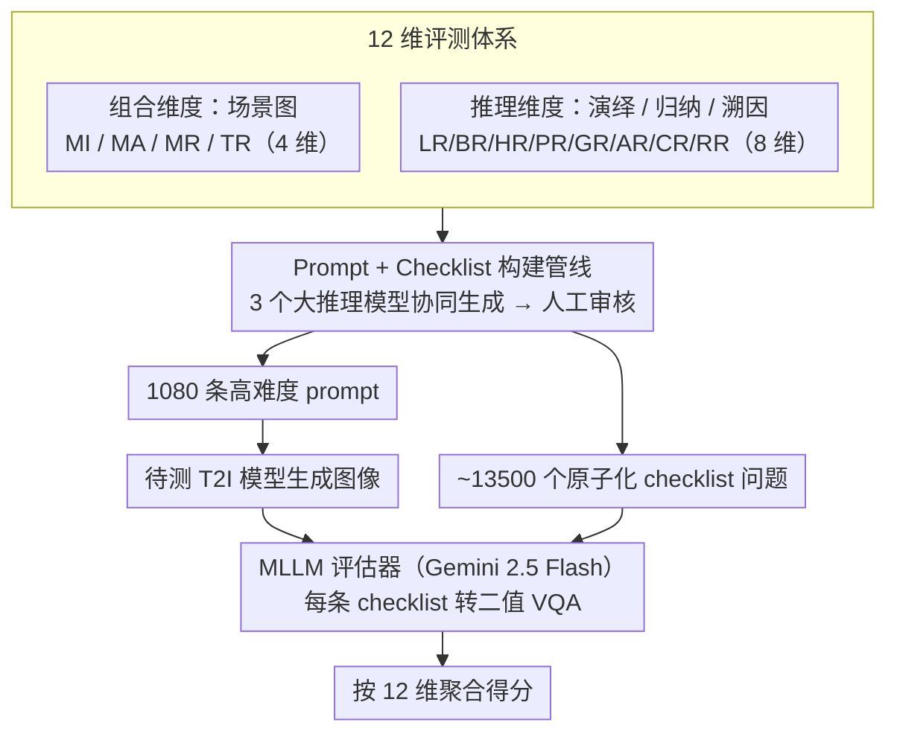

# Easier Painting Than Thinking: Can Text-to-Image Models Set the Stage, but Not Direct the Play?

**会议**: ICLR 2026  
**arXiv**: [2509.03516](https://arxiv.org/abs/2509.03516)  
**代码**: [GitHub](https://github.com/) (有，含Leaderboard和Benchmark)  
**领域**: 文本到图像生成 / 评测基准  
**关键词**: T2I评测, 组合生成, 推理能力, benchmark, 场景图

## 一句话总结

提出 T2I-CoReBench，首个同时系统评估 T2I 模型**组合能力**(Composition)和**推理能力**(Reasoning)的综合性基准，涵盖 12 个评估维度、1080 条高难度 prompt 和约 13500 个 checklist 问题，通过对 38 个模型的大规模评测揭示：推理能力远远落后于组合能力，是当前 T2I 生成的核心瓶颈。

## 研究背景与动机

T2I 生成中，文本 prompt 同时包含**显式描述**（需要组合生成的内容）和**隐式线索**（需要推理才能正确生成的内容）。例如"一个成熟的番茄被紧紧握在拳头里"隐含"番茄汁爆出"。这对应两个核心能力：组合（Composition）和推理（Reasoning）。

**现有评测的两大缺陷**：

**缺乏全面性**：多数 benchmark 只评组合或只评推理，且分类体系是启发式的，无法系统覆盖所有维度

**缺乏复杂性**：组合场景只测少量视觉元素（≤5），推理只测简单的一对一因果，无法反映真实世界的高密度场景

**核心切入角度**：借鉴场景图（Scene Graph）结构化组合能力，借鉴哲学推理三分法（演绎/归纳/溯因）结构化推理能力，构建一个兼具全面性和复杂性的 12 维评测体系。

## 方法详解

### 整体框架

T2I-CoReBench 的核心观察是：一条 T2I prompt 同时含**显式描述**（要画什么，靠组合）和**隐式线索**（背后要想什么，靠推理），而现有基准要么只测其一、要么复杂度太低。它把"评什么"和"怎么评"串成一条流水线：先用一套 12 维分类体系把**组合能力**（场景图拆出 4 维）和**推理能力**（哲学三分法拆出 8 维）结构化，再围绕每个维度让多个大推理模型协同生成高复杂度 prompt、并配套一份原子化 checklist，最后由 MLLM 逐条核验生成图、按维度聚合成分。整套基准含 1080 条 prompt、约 13500 个 checklist 问题。

### 关键设计

**1. 组合维度：用场景图把"画面里有什么"拆成四类并刻意拉高密度**

现有组合基准的通病是视觉元素太稀疏（通常 ≤5 个），测不出真实场景的密度压力。本文借场景图的实例-属性-关系三要素，把组合能力拆成四个维度并把密度拉到 $\sim 20$ 个视觉元素/prompt：MI（Multi-Instance）要求单图生成约 25 个实例（如"繁忙的现代厨房"），MA（Multi-Attribute）要求单主体绑定约 20 个属性，MR（Multi-Relation）要求场景中约 15 种关系正确连接，TR（Text Rendering）要求约 15 处文本的内容和布局精确渲染。平均密度比 DPG-Bench 等基准高出 4-5 倍，逼出模型在高密度场景下的真实组合上限，而不是在三四个物体的简单图上"刷满分"。

**2. 推理维度：用哲学推理三分法覆盖"画面背后要想什么"**

推理评测过去多是零散启发式分类、且只测简单的一对一因果。本文以演绎/归纳/溯因三分法为骨架，把推理能力系统拆成 8 个维度：演绎（前提→结论）下含 LR 逻辑、BR 行为、HR 假设、PR 过程四类，归纳（模式→规律）下含 GR 泛化、AR 类比两类，溯因（观察→解释）下含 CR 常识、RR 重建两类。难度上引入一对多（一个行为推出多个结果）和多对一（多个前提汇成一个结论）的复杂推理链，突破现有基准只测一对一推理的局限——这样"一个成熟番茄被攥在拳头里"这类隐式线索（要推出番茄汁爆出）才真正贴近现实，而不是简单因果。

**3. Prompt + Checklist 构建管线：让评测既难、又可逐点验证**

前两个维度只定义了"要测什么"，这一步把它们落成可跑的样本，并解决两个矛盾：prompt 要够难够多样、又不能掺进单一模型的偏好。构建时用一套统一指令模板（任务目标 + prompt 设计准则 + checklist 拆解规则），让三个 SOTA 大推理模型（Claude Sonnet 4、Gemini 2.5 Pro、OpenAI o3）协同生成候选，再经严格人工审核定稿。每条 prompt 配一份 checklist——一组互相独立、标准答案恒为"Yes"的原子 yes/no 问题，把显式描述和隐式线索逐点拆成可单独核验的条目。这种原子化是自动评估能落地的关键：每题只问一个点，天然适配 MLLM 的二值判断，避免一句话同时塞多个判断带来的歧义。

### 损失函数 / 训练策略

本文是评测基准，没有训练过程。评估阶段把上面构建好的 checklist 喂给 MLLM 评估器（Gemini 2.5 Flash，因其与人类判断对齐度高、规模化成本低）：每个 checklist 问题转成一个二值 VQA 任务（"1"=是 / "0"=否），靠 checklist 的原子性保证判断稳定，最后按 12 个维度聚合得分。作者额外验证换用 Qwen2.5-VL-72B、Qwen3-VL 等评估器结论高度一致，说明排名不依赖某个特定评估器。

## 实验关键数据

### 主实验（38 个模型全面评测）

| 模型 | 参数量 | 组合均分 | 推理均分 | 总均分 |
|------|--------|---------|---------|--------|
| FLUX.2-dev | 32B | **84.7** | **54.2** | **64.4** |
| Qwen-Image-2512 | 20B | 83.7 | 51.7 | 62.4 |
| FLUX.2-klein-9B | 9B | 78.0 | 52.0 | 60.6 |
| LongCat-Image | 6B | 70.8 | 54.1 | 59.6 |
| HunyuanImage-3.0 | 80B | 78.9 | 48.6 | 58.7 |
| BAGEL w/ Think | 14B | 39.6 | 41.9 | 41.1 |
| OmniGen2-7B | 7B | 49.9 | 39.4 | 42.9 |
| PixArt-α | 0.6B | 25.0 | 23.7 | 24.1 |
| Janus-Pro-1B | 1B | 35.5 | 13.0 | 20.5 |

| 各维度细分（FLUX.2-dev） | MI | MA | MR | TR | LR | BR | HR | PR | GR | AR | CR | RR |
|---|---|---|---|---|---|---|---|---|---|---|---|---|
| 分数 | 89.5 | 83.4 | 72.7 | 93.3 | 48.4 | 33.5 | 53.4 | 83.1 | 62.3 | 64.3 | 62.1 | 26.9 |

### 消融实验

- 不同 MLLM 评估器（Qwen2.5-VL-72B, Qwen3-VL 系列）与 Gemini 2.5 Flash 的评估结果高度一致
- 使用 3 个不同 LRM 生成 prompt 避免了单一模型偏差

### 关键发现

1. **组合能力稳步提升**：开源模型逐步缩小与闭源的差距，FLUX.2-dev 组合均分达 84.7
2. **推理能力严重落后**：即使最强模型推理均分也远低于组合，FLUX.2-dev 推理仅 54.2 vs 组合 84.7
3. **统一模型的思考模式有帮助但有限**：BAGEL w/ Think 推理从 34.1→41.9，但仍大幅落后于扩散模型
4. **Text Rendering 差异巨大**：FLUX.2-dev 达 93.3，而多数统一/自回归模型低于 10
5. **模型规模并非决定性因素**：6B 的 LongCat-Image 推理均分 54.1 超过 80B 的 HunyuanImage-3.0（48.6）

## 亮点与洞察

- 首次将哲学推理三分法（演绎/归纳/溯因）系统化引入 T2I 评测，提供了理论有据的分类框架
- 高密度组合（~20 元素/prompt）和高强度推理（一对多/多对一）的设计更贴近真实应用场景
- 揭示了一个重要发现：**T2I 模型更擅长"画"（组合），但不擅长"想"（推理）**——正如标题所说
- Checklist 设计将复杂评测分解为原子问题，提升了评估可靠性

## 局限与展望

- MLLM 评估器本身可能存在偏差，尽管做了人工验证
- 推理维度的 prompt 难度定义（一对多/多对一）较为粗粒度，可进一步细化推理链长度
- 仅评估静态图像生成，未涉及视频或交互式生成
- 基准的 1080 条 prompt 规模适中，但每个维度仅 90 条，统计效力可能有限

## 相关工作与启发

- **DPG-Bench / ConceptMix**：组合评测的先驱，但复杂度不够
- **R2I-Bench / WISE**：推理评测的探索，但只覆盖部分推理类型
- **GenAI-Bench**：通用评测但缺乏系统分类
- 启发：可以用本 benchmark 的推理维度指导 T2I 模型的推理能力训练

## 评分

- 新颖性: ⭐⭐⭐⭐ 首次系统整合组合+推理评测，分类体系有理论基础，但 benchmark 构建方法本身不算全新
- 实验充分度: ⭐⭐⭐⭐⭐ 38 个模型覆盖面广，多种评估器交叉验证，分析深入
- 写作质量: ⭐⭐⭐⭐⭐ 逻辑清晰，图表精美，taxonomy 解释充分
- 价值: ⭐⭐⭐⭐⭐ 填补了 T2I 推理评测的空白，对社区有重要指导意义

<!-- RELATED:START -->

## 相关论文

- [\[NeurIPS 2025\] Aligning Text to Image in Diffusion Models is Easier Than You Think](../../NeurIPS2025/image_generation/aligning_text_to_image_in_diffusion_models_is_easier_than_you_think.md)
- [\[CVPR 2026\] CRAFT: Aligning Diffusion Models with Fine-Tuning Is Easier Than You Think](../../CVPR2026/image_generation/craft_aligning_diffusion_models_with_finetuning_is_easier_than_you_think.md)
- [\[ICLR 2026\] Direct Reward Fine-Tuning on Poses for Single Image to 3D Human in the Wild](direct_reward_fine-tuning_on_poses_for_single_image_to_3d_human_in_the_wild.md)
- [\[ICLR 2026\] RNE: plug-and-play diffusion inference-time control and energy-based training](rne_plug-and-play_diffusion_inference-time_control_and_energy-based_training.md)
- [\[ICLR 2026\] Generate Any Scene: Scene Graph Driven Data Synthesis for Visual Generation Training](generate_any_scene_scene_graph_driven_data_synthesis_for_visual_generation_train.md)

<!-- RELATED:END -->
