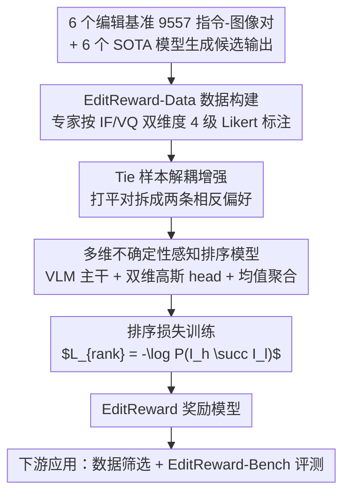

# EditReward: A Human-Aligned Reward Model for Instruction-Guided Image Editing

**会议**: ICLR 2026  
**arXiv**: [2509.26346](https://arxiv.org/abs/2509.26346)  
**代码**: [GitHub](https://tiger-ai-lab.github.io/EditReward)  
**领域**: 图像编辑 / 奖励模型  
**关键词**: 图像编辑, 奖励模型, 人类偏好, 数据筛选, VLM

## 一句话总结

构建了一个包含 200K 人工标注偏好对的高质量数据集 EditReward-Data，训练出 EditReward 奖励模型，在多个图像编辑评估基准上达到 SOTA 的人类对齐度，并验证其作为数据筛选器可显著提升下游编辑模型性能。

## 研究背景与动机

指令引导的图像编辑（Instruction-Guided Image Editing）近年来取得了巨大进展，闭源模型如 GPT-Image-1、Seedream 表现优异，但开源模型仍有明显差距。**核心瓶颈在于缺乏可靠的奖励模型来筛选和扩展高质量训练数据。**

现有的评估/奖励手段存在三大问题：

**感知分数（如 LPIPS）**：无法捕捉与指令的语义对齐

**特征分数（如 CLIP）**：无法理解编辑语义

**VLM-as-judge（如 VIEScore）**：通用 VLM 未针对编辑任务优化

已有的微调 reward model 要么依赖噪声众包标注（低一致性），要么使用闭源模型生成的伪标签（有偏差）。**核心矛盾是：需要高质量人工标注的偏好数据来训练可靠的 reward model，但此前缺乏这样的大规模数据集。**

**切入角度**：构建大规模、高质量、多维度的专家标注偏好数据集，训练专门针对图像编辑任务的 reward model。

## 方法详解

### 整体框架

EditReward 把"造数据"和"建模型"两件事拧成一条线。先从多个编辑基准和多个 SOTA 编辑模型收集待比较的候选输出，由专家按指令遵循与视觉质量两个维度独立打分，产出 200K 高质量偏好对的 EditReward-Data；标注里大量"整体打平"的样本对不被丢弃，而是解耦成两条相反偏好补进训练集；随后一个基于 VLM 的多维不确定性感知排序模型在这批数据上学习人类偏好，训练目标是把更优的编辑结果排在更差的之前；最后配套多路偏好排序基准 EditReward-Bench 检验对齐度，训好的奖励模型又反过来给下游编辑模型筛数据。整套设计的出发点是同一个判断——可靠的奖励信号来自高质量人工标注，而非众包噪声或闭源模型的伪标签。

### 关键设计

**1. EditReward-Data 数据构建：用专家标注换取干净的偏好信号**

数据是整个工作的地基，作者刻意避开众包路线。他们从 GEdit-Bench、ImgEdit-Bench、MagicBrush 等 6 个编辑基准收集 9557 个指令-图像对，再用 Step1X-Edit、Flux-Kontext、Qwen-Image-Edit 等 6 个 SOTA 编辑模型各自生成多组输出，构成待比较的候选池。关键在标注环节：训练有素的标注员按严格协议、用 4 级 Likert 量表沿两个维度独立打分——Instruction Following（IF）看语义准确性、完整性以及有没有多余改动，Visual Quality（VQ）看画面合理性、有无伪影和美学。两维度分开打而非合成一个总分，是为了后续能解耦建模。这套协议的回报是高一致性：Krippendorff's α 在 IF 上达到 0.668、VQ 上达到 0.597，明显高于众包数据的水平，意味着训练信号本身就比已有偏好数据集干净得多。

**2. Tie 样本解耦增强：把"打平"拆成两条相反的偏好**

标注中存在大量整体打平的样本对，直接丢弃会浪费信息。作者的洞察是：整体打平往往意味着两张图在不同维度各有胜负——A 的 IF 更好、B 的 VQ 更好。于是把每个打平对 $(I_A, I_B)_{\text{tie}}$ 拆成两个训练样本，分别标注为 $I_A \succ I_B$ 和 $I_B \succ I_A$ 喂给模型。这样做迫使模型在维度间学会更细粒度的权衡，而不是简单地把两者都判为等价，实践中带来了更平滑的训练曲线。技巧本身很轻，却把原本被浪费的"平局"标注转化成了有效监督，也正好和下一步的分维度建模衔接。

**3. 多维不确定性感知排序模型：把每个维度建成一个有方差的分布**

有了双维度标注，模型就不该只回归一个标量分数。受 HPSv3 启发，作者把第 $i$ 个样本在维度 $d$ 上的分数建模为高斯分布 $s_{i,d} \sim \mathcal{N}(\mu_{i,d}, \sigma_{i,d}^2)$，其中 $d \in \{1,2\}$ 分别对应 IF 和 VQ；方差 $\sigma$ 让模型能表达"这一对我不太确定"，从而对噪声更鲁棒。具体实现上用多任务学习（MTL），reward head 为每个维度独立预测各自的高斯参数，再把两个维度聚合成单一偏好。聚合方式作者比较了悲观最小值、均衡平均和直接求和三种，最终以均值聚合效果最好。偏好概率由两个聚合分布之差的积分给出，训练目标就是让更优样本 $I_h$ 排在 $I_l$ 之前的概率最大化，即排序损失 $\mathcal{L}_{\text{rank}} = -\log P(I_h \succ I_l)$。消融里成对排序相比逐点回归带来 +14.35 的大幅提升，多独立 head 又比共享 head 再涨 3.80，说明"分布化 + 分维度"两个选择都实打实有效。

### 损失函数 / 训练策略

骨干网络取 Qwen2.5-VL-7B 或 MiMo-VL-7B 并全参数解冻，在 8×A800 上训练 2 个 epoch，学习率 2e-6 配 cosine schedule，图像统一预处理到 448×448 并保持宽高比。训练目标即上文的排序损失 $\mathcal{L}_{\text{rank}} = -\log P(I_h \succ I_l)$。

## 实验关键数据

### 主实验

| 方法 | GenAI-Bench | AURORA-Bench | ImagenHub | EditReward-Bench |
|------|-------------|-------------|-----------|------------------|
| GPT-4o | 53.54 | 50.81 | 38.21 | 28.31 |
| GPT-5 | 59.61 | 47.27 | 40.85 | 37.81 |
| Gemini-2.5-Flash | 57.01 | 47.63 | 41.62 | 38.02 |
| Qwen2.5-VL-7B-Inst | 40.48 | 38.62 | 18.59 | 29.75 |
| **EditReward (Qwen)** | **63.97** | **59.50** | 36.18 | 36.78 |
| **EditReward (MiMo)** | **65.72** | **63.62** | 35.20 | **38.42** |

EditReward 全面超越 GPT-5 和 Gemini-2.5-Flash 等闭源模型。

### 数据筛选应用实验

使用 EditReward 从 ShareGPT-4o-Image（46K）中筛选高质量子集微调 Step1X-Edit：

| 训练数据 | GEdit-EN G_O | GEdit-CN G_O |
|---------|-------------|-------------|
| Step1X-Edit 原始 | 6.444 | 6.779 |
| + 全量 ShareGPT-4o | 6.780 | 6.583 |
| + Top 10K（EditReward 筛选） | 6.938 | 7.000 |
| + **Top 20K（EditReward 筛选）** | **7.086** | **7.074** |
| + Top 30K（EditReward 筛选） | 6.962 | 6.938 |
| Doubao-Edit | 6.983 | 6.942 |

Top 20K 为最优平衡点，将开源 Step1X-Edit 提升至接近 Doubao-Edit 水平。

### 消融实验

| 变体 | 损失类型 | Head 类型 | 聚合方式 | GenAI-Bench |
|------|---------|----------|---------|-------------|
| I | 逐点回归 | N/A | N/A | 49.62 |
| II | 成对排序 | 共享 | 均值 | 60.17 |
| V（最终） | 成对排序 | 多独立 | 均值 | **63.97** |

- 成对排序 >> 逐点回归（+14.35）
- 多独立 Head >> 共享 Head（+3.80）
- 均值聚合整体最优

### 关键发现

- 训练后 Qwen2.5-VL-7B 在 GenAI-Bench 上提升超过 23 点（40.48→63.97），证明框架本身的强大提升效果
- EditReward 在 OOD 任务（Text/Style 类别）上与 GPT-4o 表现相当（46.80 vs 41.69）
- 数据质量比数量更重要：Top 20K 优于 Full 46K

## 亮点与洞察

- 200K 规模的专家标注偏好数据集质量极高（Krippendorff's α > 0.59），远优于众包数据
- 多维度（IF + VQ）解耦设计有实证支撑：IF 维度的 IAA 确实高于 VQ，验证了分维度建模的必要性
- Tie 解耦增强是一个简单但有效的技巧，充分利用了标注数据中的信息
- 作为数据筛选器的应用价值直接且可量化，2.61 GPU 小时完成 46K 样本评分

## 局限与展望

- 标注维度仅 2 个（IF 和 VQ），可能无法覆盖编辑质量的所有方面，如空间一致性、风格保持等
- 主要在 7B 规模 VLM 上验证，更大/更小模型的效果未知
- 数据筛选实验仅验证了一个下游模型（Step1X-Edit），泛化性有待验证
- EditReward-Bench 的多路偏好（K=4）准确率仍较低（~11%），说明任务仍很有挑战

## 相关工作与启发

- **HPSv3**：不确定性感知排序的先驱，但只有单维度
- **ImageRewardDB**：早期偏好数据集，但噪声大且维度单一
- **ADIEE**：使用模型标签训练，有偏差
- 启发：高质量人工标注 + 多维度解耦是构建可靠 reward model 的关键路径

## 评分

- 新颖性: ⭐⭐⭐⭐ 多维不确定性感知排序和 Tie 解耦是亮点，但整体框架较标准
- 实验充分度: ⭐⭐⭐⭐⭐ 4 个 benchmark 评测 + 数据筛选应用 + 详尽消融 + OOD 测试
- 写作质量: ⭐⭐⭐⭐ 结构清晰，数据详实，但部分符号较密集
- 价值: ⭐⭐⭐⭐⭐ 数据集和模型都将开源，对图像编辑社区有重要推动作用

<!-- RELATED:START -->

## 相关论文

- [\[ICLR 2026\] Visual Autoregressive Modeling for Instruction-Guided Image Editing](visual_autoregressive_modeling_for_instruction-guided_image_editing.md)
- [\[CVPR 2025\] Towards Scalable Human-Aligned Benchmark for Text-Guided Image Editing](../../CVPR2025/image_generation/towards_scalable_human-aligned_benchmark_for_text-guided_image_editing.md)
- [\[ICLR 2026\] Training-Free Reward-Guided Image Editing via Trajectory Optimal Control](training-free_reward-guided_image_editing_via_trajectory_optimal_control.md)
- [\[ICLR 2026\] Direct Reward Fine-Tuning on Poses for Single Image to 3D Human in the Wild](direct_reward_fine-tuning_on_poses_for_single_image_to_3d_human_in_the_wild.md)
- [\[CVPR 2026\] CompBench: Benchmarking Complex Instruction-guided Image Editing](../../CVPR2026/image_generation/compbench_benchmarking_complex_instruction-guided_image_editing.md)

<!-- RELATED:END -->
