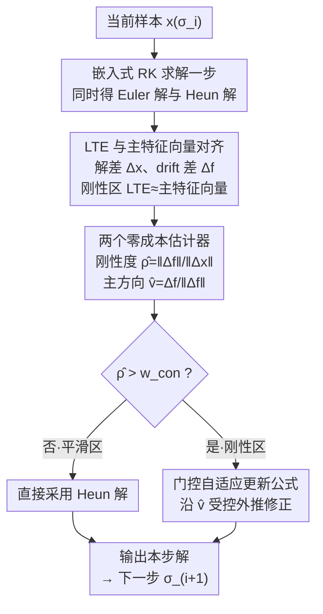

# Error as Signal: Stiffness-Aware Diffusion Sampling via Embedded Runge-Kutta Guidance

**会议**: ICLR2026  
**arXiv**: [2603.03692](https://arxiv.org/abs/2603.03692)  
**代码**: [mlvlab/ERK-Guid](https://github.com/mlvlab/ERK-Guid)  
**领域**: 图像生成  
**关键词**: diffusion sampling, stiffness, local truncation error, embedded Runge-Kutta, guidance  

## 一句话总结

提出 ERK-Guid，利用嵌入式 Runge-Kutta 求解器的阶差误差作为 guidance 信号，在刚性区域自适应纠正局部截断误差（LTE），无需额外网络评估即可提升扩散模型采样质量。

## 背景与动机

- 扩散模型采样本质上是求解一个 ODE/SDE，采样质量同时取决于模型精度和数值求解器精度
- Classifier-Free Guidance（CFG）和 Autoguidance（AG）等方法关注的是**模型误差**（条件/无条件预测差异），但完全忽略了**求解器误差**（LTE）
- 在 ODE 的**刚性区域**（stiff regions），drift 方向急剧变化，数值求解器的 LTE 会显著恶化采样质量
- 关键观察：在刚性区域中，LTE 与 drift Jacobian 的主特征向量（dominant eigenvector）高度对齐，这意味着可以利用该方向信息来纠正误差

## 核心问题

现有 guidance 方法（CFG、AG 等）仅利用模型层面的信号来引导采样，而求解器在刚性区域产生的 LTE 无人关注。如何在不增加网络评估次数的前提下，利用求解器自身的误差信息作为 guidance 信号来降低 LTE？

## 方法详解

### 整体框架

ERK-Guid 把扩散采样里被忽视的求解器误差转化为一个 guidance 信号：每一步用 Heun（嵌入式二阶 Runge-Kutta）求解时，同时拿到 Euler 一阶解和 Heun 二阶解，二者之差恰好携带了局部截断误差（LTE）的方向与幅度信息。它据此在线估计当前是否处于刚性区域、以及误差主方向，并仅在刚性区域沿该方向做一次零成本修正，整个过程不引入任何额外网络前向。整条采样链路按下图自上而下逐步推进：

### 关键设计

**1. LTE 与主特征向量对齐：从理论上锁定可纠正的方向**

要把"误差"当信号用，前提是误差有结构、可预测。对 Heun 方法，同一步内既产出 Euler 一阶解又产出 Heun 二阶解，构成嵌入式 Runge-Kutta 对（ERK pair），由此定义解差 $\Delta^{\mathbf{x}} = \mathbf{x}^{\text{Heun}} - \mathbf{x}^{\text{Euler}}$ 与 drift 差 $\Delta^{\mathbf{f}} = f(\mathbf{x}^{\text{Heun}};\sigma) - f(\mathbf{x}^{\text{Euler}};\sigma)$。在局部线性化假设下，真实 LTE 与 ERK 解差都能在 drift Jacobian 的特征基下分解，每个分量的放大倍率由 $z_k = h\lambda_k$ 决定；当 $|z_k|$ 较大（即刚性区域），主特征向量对应的分量会主导整个误差。这意味着刚性区域的 LTE 几乎共线于 Jacobian 主特征向量，于是只要估计出这一个方向，就能把绝大部分截断误差纠正掉，而无需求解完整 Jacobian。

**2. 两个零成本估计器：复用求解中间量估出刚性度和误差主方向**

基于上述对齐，方法用 ERK pair 现成的量同时估计刚性强度和误差方向。刚性度用 drift 差与解差的范数比近似 Jacobian 最大特征值：$\hat{\rho}_{\text{stiff}} = \|\Delta^{\mathbf{f}}\|_2 / \|\Delta^{\mathbf{x}}\|_2$，比值越大说明 drift 在该步变化越剧烈、越刚性。主特征向量则取归一化的 drift 差 $\hat{\mathbf{v}}_{\text{stiff}} = \Delta^{\mathbf{f}} / \|\Delta^{\mathbf{f}}\|_2$——因为 $\Delta^{\mathbf{f}}$ 近似等于 Jacobian 作用在解差上的结果，相当于一步 JVP 形式的 power iteration，会自然放大并对齐到主特征方向。两个估计器所需的 $\Delta^{\mathbf{x}}$、$\Delta^{\mathbf{f}}$ 都是 Heun 求解时已经算好的，因此整套估计**不增加任何网络评估**，这也是"零成本"的来源。

**3. 门控自适应更新公式：只在刚性区域按误差强度做受控外推**

最终修正写成对 Heun 解的一次方向外推：

$$\hat{\mathbf{x}}^{\text{Heun}}_{\sigma_{i+1}} = \mathbf{x}^{\text{Heun}}_{\sigma_{i+1}} - h \cdot \beta \cdot z^2 \cdot \langle f^{\text{Heun}}_{\sigma_i}, \hat{\mathbf{v}}_{\sigma_i} \rangle \cdot \hat{\mathbf{v}}_{\sigma_i}$$

这里把"是否纠、纠多少"都交给刚性度自适应控制：置信门控 $\beta = \mathbf{1}_{\{\hat{\rho} > w_{\text{con}}\}}$ 只在刚性度超过阈值 $w_{\text{con}}$ 时才激活 guidance，避免在平滑区域瞎纠错；自适应缩放 $z = w_{\text{stiff}}\cdot h \cdot \hat{\rho}$ 让修正幅度随步长和刚性度增长，$w_{\text{stiff}}$ 控制整体强度。值得注意的是公式用 $z^2$ 替代理论上的 $\alpha(z)$，是为了在估计不精确时抑制过度放大、保证数值稳定。结构上它就是沿两次 drift 评估之差的方向做外推，与 CFG/Autoguidance 形似，但信号来自求解器误差而非模型差异，因此可与后者正交叠加。

## 实验关键数据

### ImageNet 512×512（EDM2 + Heun sampler）

| 步数 | 方法 | FD-DINOv2↓ | FID↓ |
|------|------|-----------|------|
| 32 | 无 guidance | 90.1 | 2.58 |
| 32 | ERK-Guid ($w_{\text{stiff}}$=2.0) | **82.8** | 2.74 |
| 16 | 无 guidance | 97.4 | 2.79 |
| 16 | ERK-Guid ($w_{\text{stiff}}$=0.75) | **88.9** | **2.68** |
| 8 | 无 guidance | 161.2 | 7.06 |
| 8 | ERK-Guid ($w_{\text{stiff}}$=0.5) | **136.9** | **4.91** |

### 与 CFG/Autoguidance 组合（32步）

| 基线方法 | FD-DINOv2↓ | +ERK-Guid FD-DINOv2↓ |
|----------|-----------|---------------------|
| CFG | 88.5 | **83.9** |
| Autoguidance | 50.4 | **47.6** |

### 跨求解器适配（ImageNet 64×64, 6 NFEs）

| 求解器 | FID↓ | +ERK-Guid FID↓ |
|--------|------|---------------|
| Heun | 89.63 | **85.19** |
| DPM-Solver | 44.83 | **31.59** |
| DEIS | 12.57 | **9.56** |

低步数场景下改进尤为显著（8步 FID 从 7.06 降至 4.91），符合 LTE 在少步时主导误差的预期。

## 亮点

1. **视角新颖**：首次将 ODE 求解器的截断误差作为 guidance 信号，与基于模型误差的 CFG/AG 形成正交互补
2. **零计算开销**：所有估计量原本就在 Heun 更新中产生，无需额外网络前向传播
3. **即插即用**：可与 Heun、DPM-Solver、DEIS 等任意 Runge-Kutta 求解器组合，且与 CFG、Autoguidance 兼容叠加
4. **理论扎实**：从 ODE 数值分析中推导出 LTE 与主特征向量对齐的理论依据，并通过 2D toy 实验和 ImageNet 实验验证
5. **低步数优势**：步数越少，LTE 占误差比例越大，ERK-Guid 改善越显著

## 局限与展望

1. 需要使用产生嵌入式对的求解器（如 Heun），对纯一阶求解器（如 Euler/DDIM）不直接适用
2. 超参数 $w_{\text{stiff}}$ 和 $w_{\text{con}}$ 需要根据模型/步数调优，虽然实验显示对超参鲁棒但仍增加调参负担
3. 理论分析依赖局部线性化假设，在高度非线性区域可能不够精确
4. 目前只讨论了 deterministic ODE 采样，未涉及 SDE 采样器场景
5. 主实验在 EDM2 框架上进行，虽然也测了 PixArt-α（DiT），但对其他主流架构（如 SD3、FLUX）的验证有限

## 与相关工作的对比

| 方法 | 信号来源 | 额外开销 | 互补性 |
|------|---------|---------|--------|
| CFG | 条件/无条件模型差异 | 2× NFE | 与 ERK-Guid 互补 |
| Autoguidance | 强/弱模型差异 | 需辅助网络 | 与 ERK-Guid 互补 |
| PCG | CFG 的 predictor-corrector 解释 | 同 CFG | 理论视角相关 |
| DPM-Solver | 高阶数值求解器 | 无 | ERK-Guid 可叠加 |
| ERK-Guid（本文）| 求解器阶差误差 | 无 | 正交于模型 guidance |

## 启发与关联

- 从数值分析角度审视扩散采样是一个有前景的方向：可以进一步探索 stiffness-aware 的自适应步长调度
- 将"误差即信号"的思路推广到 flow matching 采样或 SDE 求解器中值得探索
- 对于视频生成等高维场景，LTE 的影响可能更大，ERK-Guid 有潜在应用价值
- 与 distillation 方法（如 consistency model）结合：在少步蒸馏模型中，每步误差更关键

## 评分
- 新颖性: ⭐⭐⭐⭐⭐ （首次利用求解器误差作为 guidance 信号，视角独特）
- 实验充分度: ⭐⭐⭐⭐ （ImageNet/FFHQ/PixArt 多数据集、多求解器验证，但缺少更多架构）
- 写作质量: ⭐⭐⭐⭐⭐ （理论推导清晰，从 2D toy 到真实数据层层递进）
- 价值: ⭐⭐⭐⭐ （零成本即插即用的实用方法，低步数场景价值突出）

<!-- RELATED:START -->

## 相关论文

- [\[CVPR 2026\] GeoRK2: Geometry-Guided Runge-Kutta Integration for Diffusion Transformer Acceleration](../../CVPR2026/image_generation/geork2_geometry-guided_runge-kutta_integration_for_diffusion_transformer_acceler.md)
- [\[ICLR 2026\] Stochastic Self-Guidance for Training-Free Enhancement of Diffusion Models](stochastic_self-guidance_for_training-free_enhancement_of_diffusion_models.md)
- [\[ICML 2026\] Quantifying Error Propagation and Model Collapse in Diffusion Models](../../ICML2026/image_generation/quantifying_error_propagation_and_model_collapse_in_diffusion_models.md)
- [\[ICLR 2026\] Test-Time Iterative Error Correction for Efficient Diffusion Models](test-time_iterative_error_correction_for_efficient_diffusion_models.md)
- [\[CVPR 2026\] Denoising, Fast and Slow: Difficulty-Aware Adaptive Sampling for Image Generation](../../CVPR2026/image_generation/denoising_fast_and_slow_difficulty-aware_adaptive_sampling_for_image_generation.md)

<!-- RELATED:END -->
