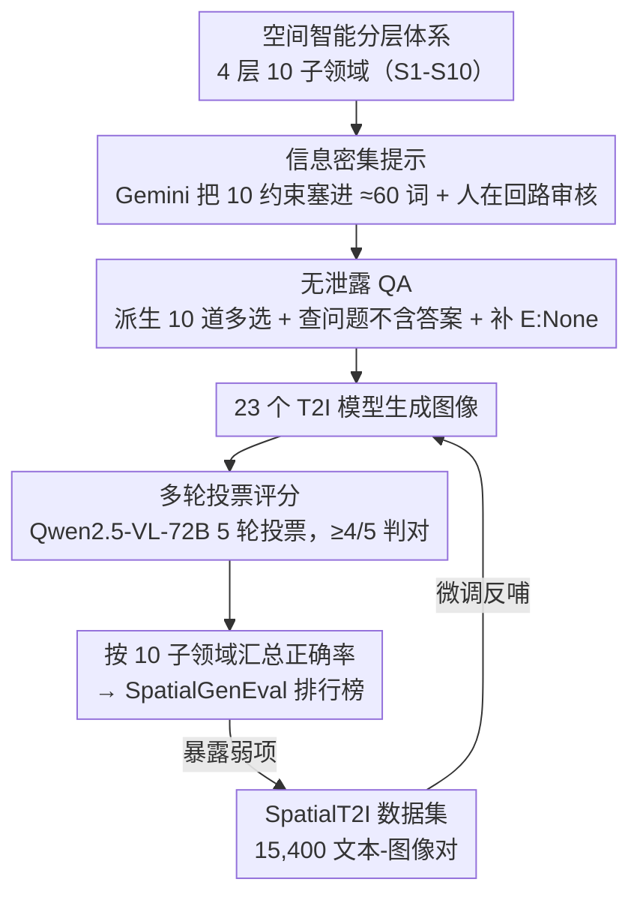

# Everything in Its Place: Benchmarking Spatial Intelligence of Text-to-Image Models

**会议**: ICLR 2026  
**arXiv**: [2601.20354](https://arxiv.org/abs/2601.20354)  
**代码**: 有 ([GitHub](https://github.com/AMAP-ML/SpatialGenEval))  
**领域**: 图像生成  
**关键词**: 空间智能, 文本到图像生成, 基准评测, 信息密集提示, 数据中心范式

## 一句话总结

提出 SpatialGenEval 基准，通过 1,230 条长且信息密集的提示覆盖 10 个空间子领域，系统评估 23 个 SOTA T2I 模型的空间智能，揭示空间推理是主要瓶颈；同时构建 SpatialT2I 数据集实现数据中心的空间智能提升。

## 研究背景与动机

当前 T2I 模型在生成高保真图像方面表现优异，能够准确渲染场景中"是什么"（what），但在精确描绘物体"在哪里"（where）、"如何排列"（how）和"为什么交互"（why）等空间关系方面频繁失败。即使是 GPT-Image-1、Qwen-Image 等 SOTA 模型也会出现物体错位、方向错误、数值比较失败或因果交互渲染失败等问题。

现有基准的不足：

**提示信息稀疏**：T2I-CompBench、GenEval 等使用简短提示，仅能验证物体存在和简单属性

**评估粒度粗糙**：多采用分类或 Yes/No 问答，无法捕捉高阶空间能力

**缺少系统的空间智能分层**：未区分感知、推理和交互等不同层次的空间能力

## 方法详解

### 整体框架

SpatialGenEval 想回答一个被现有 T2I 基准忽略的问题：模型不仅要画对"是什么"，还要画对物体"在哪里、怎么排、为什么交互"。整套基准先用一个分层体系把空间智能拆成 4 层 10 个子领域，再围绕它跑一条评估流水线——给定 25 个真实世界场景之一加上 10 个子领域的定义，让 Gemini 2.5 Pro 把全部 10 个空间约束无缝塞进一条约 60 词的信息密集提示里，经人在回路审核后，每条提示再自动派生 10 道覆盖全部子领域的多选题（生成图像所用的提示绝不透露给评估器，杜绝答案泄露；每题再补一个 "E: None" 拒答项）；23 个 T2I 模型据此生成图像，交给 Qwen2.5-VL-72B 做 5 轮投票打分，最后按 10 个子领域汇总正确率，得到 SpatialGenEval 排行榜。这条流水线产出的高质量文图对又被回收成 SpatialT2I 数据集，反过来微调模型，形成"评估→数据→模型"的闭环。

### 关键设计

**1. 空间智能分层体系：把笼统的"空间能力"拆成可逐项测量的 4 层 10 子领域**

针对现有基准"评估粒度粗糙、缺少系统空间智能分层"的痛点，SpatialGenEval 自下而上把空间智能分成 4 个层级、10 个子领域：从最基础的物体是否齐全、属性是否绑定对，到感知层的位置/方向/布局，再到推理层的比较/邻近/遮挡，最后是交互层的运动与因果。这种递进结构是整套基准的骨架——提示要按它塞约束、QA 要按它出题、最终也按它汇总；它让每个模型的失败能精确定位到某一层，而不是只得到一个笼统总分，后面实验也正是靠它发现"推理层是普遍瓶颈"。

空间基础（S1/S2）：

| 子领域 | 评测内容 |
|--------|----------|
| S1 物体类别 | 组合完整性——是否生成了所有提到的物体 |
| S2 物体属性 | 属性绑定——颜色/形状/材质是否正确关联 |

空间感知（S3/S4/S5）：

| 子领域 | 评测内容 |
|--------|----------|
| S3 空间位置 | 绝对/相对位置定位 |
| S4 空间方向 | 旋转对齐（如面朝左、倒置） |
| S5 空间布局 | 多物体排列（线性序列、圆形等） |

空间推理（S6/S7/S8）：

| 子领域 | 评测内容 |
|--------|----------|
| S6 空间比较 | 相对定量属性（如大三倍） |
| S7 空间邻近 | 精细物理距离（接触、最近、远离） |
| S8 空间遮挡 | 3D 深度和物体层叠 |

空间交互（S9/S10）：

| 子领域 | 评测内容 |
|--------|----------|
| S9 运动交互 | 动态状态或运动中的时刻 |
| S10 因果交互 | 因果物理关系 |

**2. 信息密集提示与人在回路审核：让简单提示测不出的能力差异显现**

现有基准用简短稀疏的提示，只能验证"物体存不存在"，区分不出高阶空间能力。SpatialGenEval 让 Gemini 2.5 Pro 在给定一个真实场景和 10 个子领域定义后，把全部 10 个空间约束无缝融进一条约 60 词的长提示——60 词是刻意拿捏的：既要塞满信息密度，又不超出 CLIP 编码器约 77 token 的有效长度。但纯机器生成的提示往往别扭，于是引入人在回路审核：把割裂的短句合并（如 "There is a robot. It is rusty." 改成 "A rusty robot"）、修掉逻辑自相矛盾的约束（如无法成立的循环布局）、把生僻词换成通俗表述（如 vermilion → bright red），最终得到 1,230 条既密集又自然的提示。

**3. 无泄露 QA 与多轮投票评分：把评估器自身的不可靠压到最低**

有了图像还要可靠地判分。每条提示自动派生 10 道多选题（每题正对一个子领域，共 12,300 题），并做两道把关：人工逐题检查问题文本里不含显式答案，防止评估器"看题就会"；程序化给每题统一补上 "E: None" 拒答项，让评估器在四个选项都不符图像时可以拒绝硬选，而不是被迫贡献一个错误正确率。评分环节主评估器选用开源的 Qwen2.5-VL-72B（保证长期可复现、不依赖闭源 API），且不靠单次判断，而是 5 轮投票——只有 MLLM 在 5 轮里至少 4 轮选中正确答案才算这道题答对，以此压低评估器自身的随机波动；最终每个模型在每个子领域上报一个正确率作为能力分数。

**4. SpatialT2I 数据集：把评估的副产品变成能反过来改进模型的训练数据**

发现弱项后若束手无策，基准的价值就止于"诊断"。本文额外按同样原则构造 1,100 条提示（从初始 1,230 条里滤掉低质量场景后保留），交给 14 个在 SpatialGenEval 上准确率 >50% 的顶尖开源模型各自生成图像，用 Qwen2.5-VL-72B 评分筛选、再用 Gemini 2.5 Pro 重写提示使图文一致，最终得到 15,400 个高质量文本-图像对。用这批数据微调 SDXL、UniWorld-V1、OmniGen2，就把"评估暴露出的弱项"直接喂回训练，形成评估→数据→模型的闭环。

## 实验关键数据

### 主实验

**表2：SpatialGenEval 排行榜（23 个模型）**

| 模型 | 规模 | Overall | 基础 (S1/S2) | 感知 (S3-S5) | 推理 (S6-S8) | 交互 (S9/S10) |
|------|------|---------|------------|------------|------------|-------------|
| SD-1.5 | 0.86B | 28.5 | 8.5/33.7 | 19.5/29.2/38.2 | 12.8/37.7/15.6 | 42.0/47.6 |
| FLUX.1-dev | 12B | 56.5 | 51.7/73.8 | 50.0/55.5/66.7 | 28.2/62.9/28.9 | 73.1/73.8 |
| Qwen-Image | 20B | 60.6 | 61.0/77.2 | 55.6/56.7/69.7 | 28.6/67.7/30.8 | 78.1/80.2 |
| GPT-Image-1 | - | 60.5 | 56.3/74.1 | 53.3/58.9/70.4 | 31.4/66.8/30.2 | 80.9/82.2 |
| **Seed Dream 4.0** | - | **62.7** | 59.9/80.2 | 57.2/58.9/70.1 | 32.1/68.3/33.8 | 83.0/83.8 |

**表6：SpatialT2I 微调效果**

| 模型 | 微调前 Overall | 微调后 Overall | 提升 |
|------|--------------|--------------|------|
| SD-XL | 41.2 | 45.4 | +4.2% |
| UniWorld-V1 | 54.2 | 59.9 | +5.7% |
| OmniGen2 | 56.4 | 60.8 | +4.4% |

### 消融实验

**评估器一致性**：GPT-4o 和 Qwen2.5-VL-72B 的模型排名完全一致，验证评估鲁棒性。

**人类对齐研究**：Gemini-2.5-Pro 达到 84.2% 平衡准确率，Qwen2.5-VL-72B 为 80.4%。

### 关键发现

1. **空间推理是主要瓶颈**：比较（Comparison）和遮挡（Occlusion）子任务得分常低于 30%，接近随机选择的 20%
2. **开源模型正在追赶闭源**：Qwen-Image (60.6%) vs Seed Dream 4.0 (62.7%)
3. **文本编码器是关键**：使用 LLM 编码器的模型（如 Qwen-Image）显著优于仅用 CLIP 的模型
4. **统一架构更参数高效**：7B 的 Bagel (57.0%) 接近 12B 的 FLUX.1-krea (58.5%)
5. **数据中心范式有效**：SpatialT2I 微调一致提升 4-6 个百分点

## 亮点与洞察

1. **信息密集提示设计**：将 10 个空间约束融合到单条 60 词提示中，避免了简单提示无法区分能力的问题
2. **分层式空间智能定义**：从基础→感知→推理→交互的递进结构清晰且可扩展
3. **"E: None" 选项的工程设计**：避免强制选择，提高评估准确性
4. **SpatialT2I 的数据飞轮**：评估基准的副产品可直接用于模型改进，形成闭环

## 局限与展望

1. 最高分仅 ~63%，面向及格线水平——说明任务仍然极具挑战性
2. 提示约 60 词可能超出某些 CLIP 编码器的有效处理长度（77 tokens）
3. 场景覆盖25类，可进一步扩展到更多复杂交互场景
4. 评估依赖 MLLM 判断，可能引入评估模型自身偏差
5. SpatialT2I 数据集质量受限于生成模型的当前能力

## 相关工作与启发

- **T2I-CompBench**：短提示 + Yes/No 评估，覆盖不足
- **DPG-Bench**：长提示但用评分方式，区分度有限
- **TIIF-Bench**：长短混合但 Yes/No 评估
- 启发：信息密集提示 + 全维度评估的范式可推广到视频生成、3D 生成等领域的空间智能评测

## 评分

- 新颖性：⭐⭐⭐⭐ — 首个系统性空间智能 T2I 评测基准
- 技术贡献：⭐⭐⭐⭐⭐ — 基准设计 + 数据集构建 + 大规模评测三位一体
- 实验充分度：⭐⭐⭐⭐⭐ — 23 个模型、多评估器验证、人类对齐
- 写作质量：⭐⭐⭐⭐ — 结构清晰，但表格较多
- 总体推荐：⭐⭐⭐⭐⭐ — 对 T2I 空间能力的全面透视，高影响力工作

<!-- RELATED:START -->

## 相关论文

- [\[ICLR 2026\] Blueprint-Bench: Comparing Spatial Intelligence of LLMs, Agents and Image Models](blueprint-bench_comparing_spatial_intelligence_of_llms_agents_and_image_models.md)
- [\[CVPR 2026\] Exploring Spatial Intelligence from a Generative Perspective](../../CVPR2026/image_generation/exploring_spatial_intelligence_from_a_generative_perspective.md)
- [\[CVPR 2025\] Six-CD: Benchmarking Concept Removals for Text-to-Image Diffusion Models](../../CVPR2025/image_generation/six-cd_benchmarking_concept_removals_for_text-to-image_diffusion_models.md)
- [\[ICCV 2025\] CoMPaSS: Enhancing Spatial Understanding in Text-to-Image Diffusion Models](../../ICCV2025/image_generation/compass_enhancing_spatial_understanding_in_text-to-image_diffusion_models.md)
- [\[ICLR 2026\] Diverse Text-to-Image Generation via Contrastive Noise Optimization](diverse_text-to-image_generation_via_contrastive_noise_optimization.md)

<!-- RELATED:END -->
