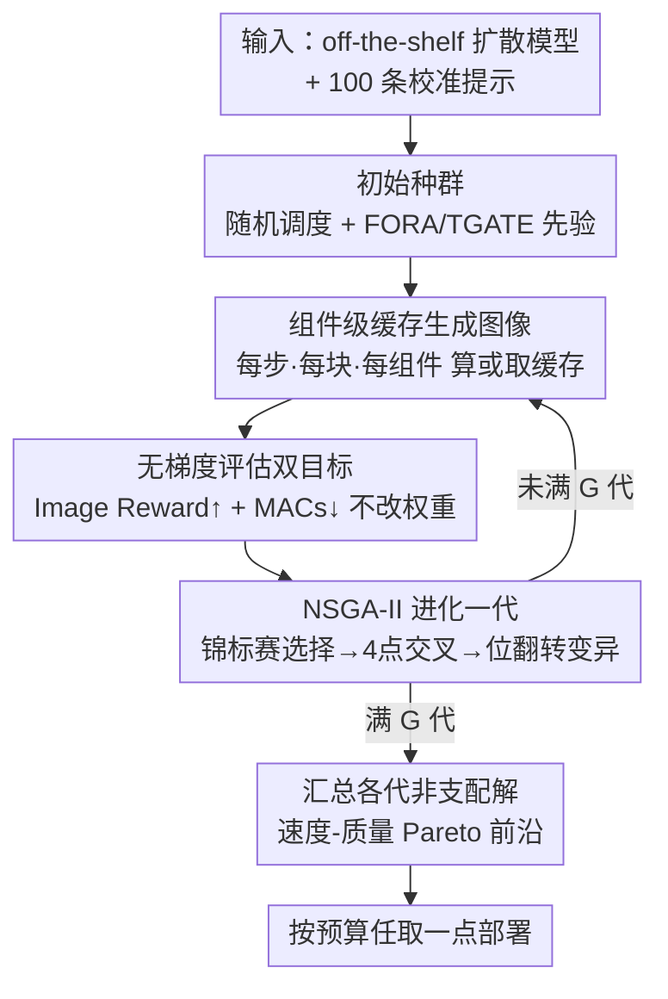

# Evolutionary Caching to Accelerate Your Off-the-Shelf Diffusion Model

**会议**: ICLR 2026  
**arXiv**: [2506.15682](https://arxiv.org/abs/2506.15682)  
**代码**: 有 ([项目页面](https://research.aniaggarwal.com/ecad))  
**领域**: 图像生成  
**关键词**: 扩散模型加速, 缓存调度, 遗传算法, Pareto优化, 训练-free

## 一句话总结

提出 ECAD（Evolutionary Caching to Accelerate Diffusion models），利用遗传算法在速度-质量 Pareto 前沿上自动搜索最优缓存调度策略，无需修改模型参数，仅用 100 条校准提示即可实现扩散模型 2-3 倍推理加速并保持甚至提升生成质量。

## 研究背景与动机

扩散模型在图像生成领域占据主导地位，但推理过程需要 20-50 步迭代去噪，计算开销极大。现有加速方法主要分为两类：

**训练型方法**（蒸馏、剪枝等）：需要高额训练成本，且可能损失质量

**训练-free 缓存方法**：重用中间特征减少计算，但严重依赖手工启发式规则

现有缓存方法的核心问题：
- **FORA**：仅提供离散的加速档位（如 2x、3x），缺乏中间灵活性
- **ToCa**：需要针对每个模型手动调参，在 PixArt-α 上调好的参数不能迁移到 PixArt-Σ
- **TaylorSeer**：内存开销大，batch size 降低 66%
- 所有方法都依赖人工设计的启发式规则和大量超参调优

## 方法详解

### 整体框架

ECAD 的出发点是：扩散模型的缓存调度本质上是在「省多少计算」和「掉多少质量」之间做权衡，而过去的方法都靠人手工拍一个固定规则。ECAD 把它改写成一个**多目标 Pareto 优化问题**——同时最小化计算成本 $C(S)$（用 MACs 衡量）和质量损失 $Q(S)$（用 Image Reward 衡量）：

$$\min_S (C(S), Q(S))$$

这里的调度 $S$ 是一个二进制张量 $S \in \{0,1\}^{N \times B \times C}$，三个维度分别是扩散步数 $N$、transformer 块数 $B$、每块里可缓存的组件数 $C$；每个位置取 1 表示该步该块该组件用缓存、取 0 表示重新计算。整个系统由四个可替换组件拼成：决定搜索粒度的**二进制缓存张量**、用来评估的 **100 条校准提示**（取自 Image Reward Benchmark）、双目标的**质量/速度指标**（Image Reward + MACs），以及**初始种群**——既可以随机起步，也可以拿 FORA / TGATE 等已有调度作为先验注入。整体跑法是一个进化循环：从初始种群出发，每一代用组件级缓存张量生成图像、无梯度地评估双目标，再交给 NSGA-II 选择—交叉—变异得到下一代，循环 $G$ 代后把各代积累的非支配解汇总成一整条 Pareto 前沿，使用者按预算在上面任取一点。

### 关键设计

**1. 组件级缓存：把缓存决策细到每块的每个子模块**

过去的缓存要么整步跳过、要么整块跳过，粒度太粗，导致省得不够或质量掉得太狠。ECAD 把决策下放到 DiT 每个 transformer 块的功能组件级别：在 PixArt-α/Σ（28 块）上可独立选择是否缓存自注意力 $f_{\text{SA}}$、交叉注意力 $f_{\text{CA}}$、前馈网络 $f_{\text{FFN}}$；在 FLUX.1-dev（19 个 full 块 + 38 个 single 块）上则覆盖注意力、前馈、MLP 等组件。对任意组件 $f_{\text{comp}}$，第 $b$ 块在第 $t$ 步是算还是取缓存，完全由调度张量决定：

$$f_{\text{comp}}^b(z'_t, t, c) = \begin{cases} \text{compute}(z'_t, c, t) & \text{重新计算} \\ \text{cache}[f_{\text{comp}}^b, t+1] & \text{使用缓存} \end{cases}$$

粒度越细，搜索空间越大，但 Pareto 前沿上能挑到的折中点也越精细——这正是 ECAD 能压出比离散档位方法更优权衡的基础。

**2. NSGA-II 遗传算法：在巨大的二进制空间里搜 Pareto 前沿**

调度张量是离散二进制、没有梯度可用，而且要同时优化互相打架的质量与速度两个目标，常规优化器无从下手。ECAD 改用成熟的多目标遗传算法 NSGA-II 来搜：每一代里，种群中每个候选调度先生成图像、再算出它的 Image Reward 和 MACs 作为双适应度；随后用锦标赛选择配合非支配排序挑出优势个体，用 4 点交叉重组两个调度策略，用位翻转变异随机翻转某些「缓存/重计算」决策，产生下一代。

| 操作 | 实现方式 |
|------|----------|
| 选择 | 锦标赛选择 + 非支配排序 |
| 交叉 | 4 点交叉：重组两个调度策略 |
| 变异 | 位翻转变异：随机翻转缓存/重计算决策 |
| 适应度 | 双目标：Image Reward↑ + MACs↓ |

完整流程是：先用随机 + 启发式调度初始化种群；每代为每个调度生成图像并评估双目标；经 NSGA-II 选择 → 交叉 → 变异得到下一代；最后把各代积累的非支配解汇总成一整条 Pareto 前沿。和「调好一组超参就固定」的手工方法相比，遗传搜索天然产出的是整条前沿，使用者可按预算在上面任取一点。

**3. 无梯度、无权重修改：把资源门槛压到最低**

因为优化全程只靠「生成图像 → 读指标」驱动，ECAD 不需要反向传播：不计算梯度就没有激活值显存开销，单卡小 GPU 也能跑；不修改任何模型权重，原模型参数完全保留，因此对任意 off-the-shelf 扩散模型即插即用。各候选调度彼此独立，评估可异步并行；也因为没有蒸馏那种训练显存压力，batch size 不受额外限制——这恰好对应了 TaylorSeer 那类方法「内存开销大、batch 砍 66%」的痛点。

### 损失函数 / 训练策略

ECAD 不涉及训练损失。优化目标是 Pareto 前沿发现：

- **质量目标**：Image Reward（单参考指标，100 条提示 × 10 种子）
- **速度目标**：MACs（乘-累加运算数，硬件无关）
- **PixArt-α**：550 代 × 72 候选/代 × 1000 图/候选
- **FLUX.1-dev**：250 代 × 24 候选/代

## 实验关键数据

### 主实验

**表1：PixArt-α 256×256 主要结果**

| 方法 | 加速比 | Image Reward↑ | COCO FID↓ | MJHQ FID↓ |
|------|--------|-------------|-----------|-----------|
| 无缓存 | 1.00x | 0.97 | 24.84 | 9.75 |
| FORA (N=3) | 2.01x | 0.83 | 24.50 | 11.11 |
| ToCa (N=3,R=90%) | 2.35x | 0.68 | 24.01 | 11.80 |
| **ECAD fast** | **1.97x** | **0.99** | **20.58** | **8.02** |
| **ECAD fastest** | **2.58x** | 0.77 | **19.54** | **8.67** |

ECAD 的 "fastest" 在 2.58x 加速下 COCO FID 仅 19.54，比 ToCa 的 2.35x 加速时（24.01）还低 4.47。

**表1：FLUX.1-dev 256×256 主要结果**

| 方法 | 加速比 | Image Reward↑ | COCO FID↓ |
|------|--------|-------------|-----------|
| 无缓存 | 1.00x | 1.04 | 25.76 |
| FORA (N=3) | 2.44x | 0.93 | 23.51 |
| TaylorSeer (N=5,O=2) | 2.55x | 0.54 | 29.66 |
| **ECAD fast** | **2.58x** | **1.04** | **21.61** |
| **ECAD fastest** | **3.37x** | 0.89 | 26.66 |

### 消融实验

**遗传扩展性（表2）**：

| 代数 | 加速比 | Image Reward↑ | MJHQ FID↓ |
|------|--------|-------------|-----------|
| 1 | 1.14x | 1.00 | 9.40 |
| 50 | 1.79x | 0.98 | 7.97 |
| 150 | 1.90x | 1.00 | 8.11 |
| 500 | 2.17x | 0.96 | 8.49 |

仅 50 代即可超越无加速基线，持续优化稳步提升。

**加速策略消融**：
- 减少种群大小（72→24）：与减少代数等效
- 减少每提示图片数（10→3）：影响不大
- 减少提示数（100→33）：显著损害质量

### 关键发现

1. **Pareto 前沿思维**：提供连续可调的速度-质量权衡，而非离散档位
2. **跨模型迁移**：PixArt-α 调度可迁移到 PixArt-Σ，仅需 50 代微调即超越从头优化
3. **跨分辨率迁移**：256×256 优化的调度直接应用于 1024×1024 仍有竞争力
4. **超越基线质量**：ECAD "fast" 在 2x 加速的同时 FID 反而优于无缓存基线

## 亮点与洞察

1. **范式转换**：从"手工设计启发式"到"自动搜索最优缓存"，根本改变了扩散缓存的方法论
2. **极低资源需求**：100 条文本提示 + 单卡 GPU + 无梯度计算 = 可在极端受限环境下运行
3. **框架通用性**：搜索空间（缓存张量形状）和适应度（质量/速度指标）均可定制
4. **违背直觉的发现**：缓存加速后 FID 反而下降——说明某些重计算步骤实际上是"噪声"，跳过反而有益
5. **可扩展到视频**：框架对模态不可知，可自然扩展到文本到视频生成

## 局限与展望

1. 优化依赖自动指标（Image Reward），若替换为人类评估可能结果不同
2. 遗传算法的计算开销（550代 × 72候选 × 1000图）仍然可观
3. 未探索与训练型方法（如蒸馏）的结合
4. 仅在 DiT 架构上验证，未测试 U-Net 架构
5. 校准提示的领域偏差可能影响在特定应用场景的效果

## 相关工作与启发

- **FORA**：首个 DiT 缓存方法，ECAD 可用其调度初始化种群
- **ToCa**：细粒度缓存但需手动调参，ECAD 自动化了这一过程
- **DiCache**：让扩散模型决定缓存策略，但仍依赖启发式
- **TaylorSeer**：Taylor 展开预测特征，但内存开销大
- 启发：遗传算法用于神经架构搜索的思路在推理加速领域同样有效

## 评分

- 新颖性：⭐⭐⭐⭐⭐ — 将缓存问题重新定义为 Pareto 优化，范式级创新
- 技术贡献：⭐⭐⭐⭐ — 方法简洁有效，但核心技术（NSGA-II）本身不新
- 实验充分度：⭐⭐⭐⭐⭐ — 三模型 × 多数据集 × 多指标 × 迁移实验
- 写作质量：⭐⭐⭐⭐ — 论述清晰，大量表格和图示
- 总体推荐：⭐⭐⭐⭐⭐ — 实用性极强的方法，改变了扩散加速的实践方式

<!-- RELATED:START -->

## 相关论文

- [\[CVPR 2026\] SenCache: Accelerating Diffusion Model Inference via Sensitivity-Aware Caching](../../CVPR2026/image_generation/sencache_accelerating_diffusion_model_inference_via_sensitivity-aware_caching.md)
- [\[ICLR 2026\] Image Can Bring Your Memory Back: A Novel Multi-Modal Guided Attack against Image Generation Model Unlearning](image_can_bring_your_memory_back_a_novel_multi-modal_guided_attack_against_image.md)
- [\[CVPR 2026\] ResCa: Residual Caching for Diffusion Transformers Acceleration](../../CVPR2026/image_generation/resca_residual_caching_for_diffusion_transformers_acceleration.md)
- [\[ICLR 2026\] Compose Your Policies! Improving Diffusion-based or Flow-based Robot Policies via Test-time Distribution-level Composition](compose_your_policies_improving_diffusion-based_or_flow-based_robot_policies_via.md)
- [\[ICML 2026\] EvoGM: Learning to Merge LLMs via Evolutionary Generative Optimization](../../ICML2026/image_generation/evogm_learning_to_merge_llms_via_evolutionary_generative_optimization.md)

<!-- RELATED:END -->
