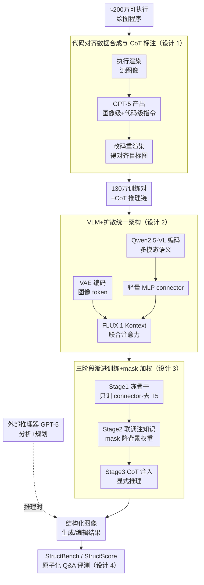

# Factuality Matters: When Image Generation and Editing Meet Structured Visuals

**会议**: ICLR2026  
**arXiv**: [2510.05091](https://arxiv.org/abs/2510.05091)  
**代码**: [structvisuals.github.io](https://structvisuals.github.io)  
**领域**: 图像生成  
**关键词**: structured image generation, image editing, chain-of-thought reasoning, benchmark, diffusion transformer

## 一句话总结
首个系统性研究结构化图像（图表、数学公式、示意图等）生成与编辑的工作，构建了130万对代码对齐的训练数据集（含 CoT 推理标注）、统一的 VLM+扩散模型架构以及包含1700+样本的 StructBench 基准评测，揭示了推理能力是当前模型处理结构化视觉内容的关键瓶颈。

## 背景与动机
- 现有视觉生成模型（如 GPT-Image、FLUX、Bagel 等）在自然图像生成上已非常出色，但在**结构化视觉内容**（图表 chart、数学图形 math figure、图解 diagram、表格 table 等）的生成和编辑上表现远不理想
- 结构化图像与自然图像有本质区别：要求**构图规划**（composition planning）、**精确文本渲染**（text rendering）和**多模态推理**（multimodal reasoning）以保证事实一致性（factual fidelity）
- 现有数据集主要面向自然图像的美学或指令跟随，缺乏面向结构化视觉的大规模高质量训练数据
- 现有评估指标（如 CLIP score、aesthetic score、朴素 VLM-as-a-judge）不适用于结构化图像的细粒度事实性评估

## 核心问题
如何系统性地提升模型对结构化图像的生成与编辑能力？具体包含三个子问题：
1. **数据**：如何构建大规模、高质量、标注精确的结构化图像数据集？
2. **模型**：如何训练一个同时适用于自然图像和结构化图像的统一生成/编辑模型？
3. **评估**：如何可靠地评估结构化图像的细粒度事实性？

## 方法详解

### 整体框架

本文把"结构化图像难题"拆成数据、模型、评估三块统一攻克。第一块用约 200 万个可执行绘图程序合成 130 万对代码对齐、带 CoT 推理标注的训练样本；第二块在 FLUX.1 Kontext 扩散骨干前接一个 Qwen2.5-VL 多模态编码器，用一个轻量 MLP connector 把高层语义传进扩散过程；第三块用三阶段渐进训练逐层注入对齐、结构化领域知识与显式推理，并允许推理时再接一个外部推理器做规划；最后用原子化 Q&A 协议的 StructBench/StructScore 做细粒度事实性评测。整条链路的核心是让"代码"既当训练监督的精确锚点，又当推理时的语义桥梁。

### 关键设计

**1. 代码对齐的数据合成与 CoT 标注：把"可执行性"变成可验证的监督信号**

传统合成编辑对靠模型生成、只能"近似对齐"，监督信号里混着噪声。本文抓住结构化图像"能由代码精确渲染"这一特点，收集约 200 万个 Python+LaTeX 绘图程序，覆盖数学、图表、谜题、科学图示、图结构、表格六大类。流程是先执行源代码渲染源图像，再让 GPT-5 在分析源图像显著视觉特征（salient features）后同时产出"图像级编辑指令"和"代码级编辑指令"——前者只引用可见元素、后者指定精确的程序级修改；改完代码重新渲染就得到与源图像严格对齐、可逐像素验证的目标图像，从根本上消除了"近似对齐"的噪声。经渲染失败、无视觉差异、低信息量三道过滤后，每个 T2I 样本再配上密集属性描述（dense caption），每个编辑样本配上"输入分析→指令解释→目标预测"的三步推理链，使监督信号的语义密度远高于"add tree right"这类简短指令。

**2. VLM + 扩散模型的统一架构与轻量 connector：用高层语义补齐 VAE 缺失的理解力**

结构化编辑往往要求高层语义推理（如把柱状图转成饼图需理解数量比例关系），而扩散模型的 VAE 只提供低层特征，单靠它认不出这种抽象关系。本文保留 FLUX.1 Kontext 作为支持统一生成/编辑的扩散骨干：输入与目标图像都经 VAE 编码成 token、拼成统一序列做联合注意力（joint attention）；同时用 Qwen2.5-VL 编码多模态特征、经一个轻量 MLP connector 对齐后注入扩散过程，把 VAE 缺的"理解力"补上。相比 MetaQuery 那类带可学习 query 的 transformer projector，MLP connector 训练开销更低、优化更稳定，且实验上不损性能，让 VLM 的语义能稳妥地传导进生成。

**3. 三阶段渐进式训练与 mask-based 损失加权：分步注入对齐、领域知识与推理**

直接端到端训练既难对齐又会冲掉通用能力，本文把难度逐层抬高分三步走。Stage 1（统一对齐）冻结扩散骨干只训 MLP connector，并刻意移除 T5 特征、只喂 Qwen-VL 特征，防止已对齐好的 T5 成为捷径而架空 connector 的对齐；Stage 2（混合视觉学习）联合微调骨干与 connector 注入结构化领域知识，同时混入高质量自然图像保留通用能力，并针对结构化图像"大面积均匀背景、编辑区域小"的像素统计引入 mask-based 策略，自适应降低背景和未变化区域的损失权重，让梯度集中在真正要改的小区域；Stage 3（推理增强）把 CoT 标注作为 Qwen-VL 的长上下文输入注入显式推理。训练后模型还能在推理时接受外部推理器（GPT-5）先分析图文对、预测理想目标内容，再把扩展分析喂给生成器引导合成，实现 inference-time compute scaling。

**4. StructBench 与 StructScore：用原子化 Q&A 把"事实性"评成可信分数**

CLIP/aesthetic/朴素 VLM-judge 这类指标对结构化图像的细粒度事实性既不敏感又易幻觉。本文构建 StructBench（1714 个样本，编辑侧 32031 个 Q&A 对、生成侧 37941 个 Q&A 对，覆盖 Math、Graph、Chart、Puzzle、Science、Table 六类），并配套 StructScore：先用 VLM 多轮流程从真值图像生成细粒度的原子化问答对、覆盖所有显著视觉元素，再让模型对生成图像开放式作答，形成 [问题, 预测答案, 真值答案] 三元组逐一比对算分。编辑任务进一步把视觉一致性与指令跟随两个维度解耦加权（$0.1\times$ 一致性 $+\ 0.9\times$ 指令跟随）；并以"真值图像上的得分"当可靠性代理——初版只有约 80%，用 GPT-5 重写失败 Q&A 做 refinement 后提升到 95% 以上，把评判的幻觉与噪声压到很低，最终 StructScore 与人类 Elo 排名的相关性 $r>0.9$。

## 实验关键数据
- **编辑基准（StructEditBench）**：本文模型以 55.98% 总体准确率**排名第一**（开源+闭源），超越 Nano Banana（51.57%）、GPT-Image（52.20%）、Seedream 4.0（52.85%）；Nano Banana 2.0 以 67.05% 最高
- **生成基准（StructT2IBench）**：GPT-Image 以 49.58% 领先闭源模型，本文模型 28.80%（T2I 更难，需从零合成细粒度属性）；Nano Banana 2.0 以 92.00% 大幅领先所有模型
- **图表编辑细分**：模型在颜色修改（相对简单）上接近 50%，但图表类型转换（需推理数量关系）准确率大幅下降，揭示推理能力是核心瓶颈
- **推理增强效果**：为 Bagel 添加显式推理轨迹后，准确率从 28.87% 提升至 38.44%，超过其原生 thinking 变体 Bagel-Think（33.34%），说明推理质量比形式更关键
- **人类对齐**：StructScore 与人类 Elo 排名的 Pearson 相关系数 r > 0.9，远超 PSNR 等传统指标
- **评估覆盖**：15 个模型的全面对比，包括 3 个闭源 + 12 个开源系统

## 亮点
- **系统性贡献**：数据、模型、评估三位一体，是结构化图像生成/编辑领域的首个完整工作
- **代码对齐数据**：利用可执行代码构建精确可验证的编辑对，比传统合成方法更可靠
- **StructScore 设计精巧**：原子化 Q&A + 编辑维度解耦 + refinement 流程，有效降低 VLM 幻觉
- **推理重要性的验证**：实验清楚表明 inference-time reasoning 对结构化图像任务带来一致性提升，且与模型架构无关
- **Mask-based 训练策略**：针对结构化图像的像素统计特点（大面积均匀背景、编辑区域小）进行自适应损失加权

## 局限与展望
- T2I 生成性能仍远低于闭源模型（28.80% vs 49.58%），编辑虽领先但差距不大
- 外部推理器依赖 GPT-5，推理成本高，未探索轻量级替代方案
- 数据构建高度依赖 GPT-5 标注和过滤，成本较高且可复现性存疑
- 当前仅覆盖六类结构化图像，未涉及分子式、乐谱、教育视频等更多领域
- 训练数据130万虽多但主要来源于已有代码库，多样性可能受限
- StructScore 仍依赖 VLM（GPT-5）作为评估器，存在循环依赖风险
- 动态分辨率采样仅限于 512×512 附近，对高分辨率结构化图像的细节渲染可能不足

## 与相关工作的对比

| 维度 | 本文 | 传统 T2I/编辑工作 |
|------|------|-------------------|
| 目标域 | 结构化视觉（图表、公式、图解） | 自然图像 |
| 数据构建 | 代码对齐 + 代码级编辑 → 精确可验证 | 合成指令 + 模型生成 → 近似对齐 |
| 推理标注 | CoT 三步推理链 + dense caption | 简短指令（如"add tree right"） |
| 评估 | 原子化 Q&A + 维度解耦加权 | CLIP/DINO score 或朴素 VLM judge |
| 模型设计 | VLM(Qwen-VL) + 扩散模型（FLUX Kontext） + MLP connector | 单一扩散模型或统一自回归模型 |

与 Bagel-Think 的对比尤为关键：本文的外部推理器方案（38.44%）优于 Bagel 的内置 thinking（33.34%），说明推理轨迹的质量和设计比简单集成 thinking 模式更重要。

与 MetaQuery 等重型 transformer projector 方案相比，本文采用轻量 MLP connector 连接 VLM 和扩散模型，降低了训练开销；与 Step1X-Edit（34.11%）和 Qwen-Edit（38.12%）等专用编辑模型相比，本文统一模型在结构化编辑上取得更好效果（55.98%），验证了多模态推理增强 + 领域数据的组合优势。

## 启发与关联
- **结构化视觉 = 推理密集型任务**：这一发现对所有需要精确事实性的生成场景（如科学图表自动化、数据可视化编辑）有重要启示
- **代码作为中间表示**：利用可执行代码构建精确训练数据的范式可推广到其他需要精确控制的生成任务（如 CAD 图纸、电路图、流程图）
- **Inference-time scaling 在视觉生成中的价值**：类似于 LLM 中的 test-time compute scaling，视觉生成同样可通过增加推理时间计算获得显著收益，这是统一多模态模型的重要发展方向
- **评估方法论创新**：原子化 Q&A 评估协议可推广到其他需要细粒度事实性评估的视觉任务
- **数据驱动 > 架构驱动**：实验表明在结构化视觉领域，数据规模和质量比模型架构选择更重要，这与当前社区过于关注架构创新的趋势形成对比
- **统一模型的优势**：统一的视觉理解+生成架构（VLM + diffusion）比单一范式模型在结构化任务上更有优势，暗示未来多模态基础模型的发展方向

## 评分
- 新颖性: 8/10 — 首个系统性研究结构化图像生成/编辑的工作，问题定义准确，数据构建思路新颖
- 实验充分度: 9/10 — 15个模型全面对比，人类对齐研究，消融实验完善
- 写作质量: 8/10 — 结构清晰，图表丰富，动机阐述充分
- 价值: 8/10 — 开源数据集+模型+基准评测，对社区推动作用大

<!-- RELATED:START -->

## 相关论文

- [\[CVPR 2025\] AutoPresent: Designing Structured Visuals from Scratch](../../CVPR2025/image_generation/autopresent_designing_structured_visuals_from_scratch.md)
- [\[CVPR 2025\] From Words to Structured Visuals: A Benchmark and Framework for Text-to-Diagram Generation and Editing](../../CVPR2025/image_generation/from_words_to_structured_visuals_a_benchmark_and_framework_for_text-to-diagram_g.md)
- [\[ICLR 2026\] Condition Matters in Full-head 3D GANs](condition_matters_in_full-head_3d_gans.md)
- [\[CVPR 2026\] Re-Align: Structured Reasoning-guided Alignment for In-Context Image Generation and Editing](../../CVPR2026/image_generation/re-align_structured_reasoning-guided_alignment_for_in-context_image_generation_a.md)
- [\[ICLR 2026\] EditScore: Unlocking Online RL for Image Editing via High-Fidelity Reward Modeling](editscore_unlocking_online_rl_for_image_editing_via_high-fidelity_reward_modelin.md)

<!-- RELATED:END -->
