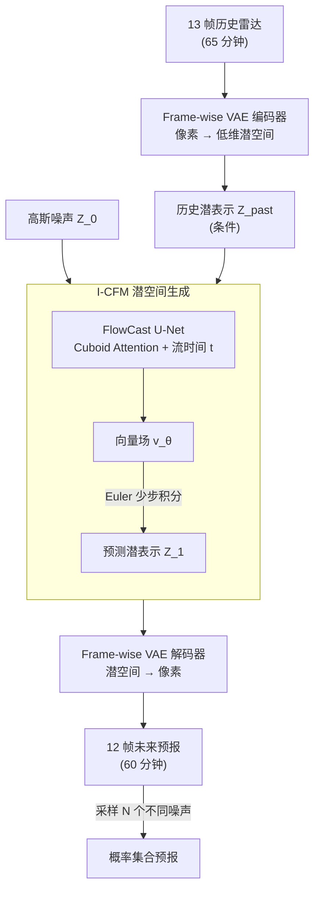

# FlowCast: Advancing Precipitation Nowcasting with Conditional Flow Matching

**会议**: ICLR 2026  
**arXiv**: [2511.09731](https://arxiv.org/abs/2511.09731)  
**代码**: [GitHub](https://github.com/b-rbmp/FlowCast)  
**领域**: 扩散模型/气象预测  
**关键词**: Conditional Flow Matching, 降水临近预报, 概率预测, 潜空间生成, 时空预测

## 一句话总结
首次将条件流匹配(CFM)作为端到端概率生成模型应用于降水临近预报，在压缩潜空间中学习噪声到数据的直接映射，以更少的采样步数超越扩散模型的预测精度和概率性能。

## 研究背景与动机

**领域现状**：降水临近预报（nowcasting）对防洪和决策至关重要。深度学习方法已从RNN/Transformer的确定性预测发展到扩散模型的概率预测。PreDiff、LDCast等潜空间扩散模型是当前SOTA，CasCast用确定性+扩散混合方法表现最好。

**现有痛点**：确定性模型用MSE优化导致预测模糊，无法表达不确定性；扩散模型需要数百步迭代去噪，计算开销大，不满足时间敏感场景（如洪水预警）对快速集合预测的需求。

**核心矛盾**：预测精度与计算效率的矛盾——扩散模型精度高但推理慢，确定性模型快但模糊。需要一种既快又准的概率预测方法。

**本文目标**：能否用CFM替代扩散模型，在保持甚至超越预测精度的同时，大幅减少采样步数？

**切入角度**：CFM的直线ODE先验比扩散模型的弯曲概率流路径更适合时空预测——雷达反射率分布虽然多模态，但时间一致性强，线性插值提供了更稳定的先验。

**核心 idea**：CFM在潜空间中学到的直线传输路径天然契合时空数据的连续性，实现少步高质量概率预报。

## 方法详解

### 整体框架
FlowCast 要解决的是"又快又准的概率降水临近预报"：给定一段历史雷达观测，预测出未来若干帧、并能采样多个成员表达不确定性，同时把推理步数压到扩散模型的零头。整条流水线分两阶段。**离线先训一个逐帧 VAE**，把高维雷达像素压进低维潜空间，让后面昂贵的生成建模负担得起；**在潜空间里训一个条件流匹配（CFM）模型**，学习一个由 Cuboid Attention U-Net 参数化的向量场，直接把高斯噪声沿近乎直线的轨迹"运"到雷达潜表示上。推理时，把 13 帧历史观测（65 分钟）编码成条件，从随机噪声出发用很少的 Euler 步积分得到未来潜表示，再由 VAE 解码回 12 帧像素预报（60 分钟）；多次采样不同噪声就得到一个 $N$ 成员的概率集合。

### 关键设计

**1. Frame-wise VAE：先把雷达帧压到低维潜空间，让生成模型负担得起**

直接在原始像素空间上训练概率生成模型代价过高，所以 FlowCast 沿用潜空间扩散模型的思路，先用一个逐帧的 VAE 把每一帧雷达图从高维像素压缩到低维潜表示。编码器-解码器是层次结构，内部带残差块和自注意力，训练时联合三项损失：L1 重建保证像素保真、KL 散度（权重 1e-4）约束潜空间分布、PatchGAN 对抗损失逼出清晰的高频细节。压缩之后，后续的 CFM 只需在小得多的潜空间里学动力学，采样和训练成本都大幅降低。

**2. Independent CFM (I-CFM) 训练：用直线传输路径替代扩散的弯曲概率流，换取少步高质量采样**

扩散模型推理慢的根源在于它的概率流路径是弯曲的，必须用很多小步去逼近。FlowCast 改用条件流匹配，在潜空间里训练一个向量场 $v_\theta$，直接学习从高斯噪声到雷达潜表示的传输。它采用独立耦合的概率路径

$$p_t(x_t \mid x_0, x_1) = \mathcal{N}\big((1-t)x_0 + t x_1,\ \sigma^2 I\big),$$

对应的目标向量场就是两端之差 $u_t = x_1 - x_0$，训练目标是让网络回归这个向量场：

$$\mathcal{L} = \big\| v_\theta(Z_t, t, Z_{\text{past}}) - u_t \big\|^2.$$

这里 $Z_{\text{past}}$ 是历史观测的潜表示，作为条件注入。关键在于 $\sigma > 0$：相比令 $\sigma \to 0$ 的 rectified flows，非零的 $\sigma$ 把训练轨迹"加厚"成一条带宽度的管道，对高维潜数据更稳定。由于学到的是近乎直线的 ODE 轨迹，推理时用很少的 Euler 步就能从噪声积分到数据，这正是它能在 20 步下仍逼近 50 步精度的原因。

**3. FlowCast U-Net：用 Cuboid Attention 高效建模时空动态，并以流时间为条件**

向量场 $v_\theta$ 的骨架是一个时空 U-Net，核心构建块取自 Earthformer 的 Cuboid Attention——把特征切成 3D 立方体、在立方体内部做局部自注意力，从而高效捕捉雷达回波的局部时空演变，而 U-Net 的层次编码-解码结构则在不同尺度间共享全局信息。流时间 $t$ 的嵌入被注入每一层，让同一个网络在积分轨迹的不同位置都能给出正确的速度方向。

### 损失函数 / 训练策略
- VAE: L1重建 + KL散度(权重1e-4) + PatchGAN对抗损失
- CFM: 均方误差回归向量场，AdamW lr=1e-4
- 采样: Euler求解器，可变步数（5/10/20/50/100）

## 实验关键数据

### 主实验
SEVIR数据集（美国雷达），8成员集合预测：

| 模型 | 类型 | CSI-M↑ | FSS-M↑ | CRPS↓ | NFE |
|------|------|--------|--------|-------|-----|
| Earthformer | 确定性 | 基线 | 基线 | 较高 | 1 |
| PreDiff | 扩散 | 次优 | 次优 | 次优 | 250 |
| CasCast | 混合 | 优 | 优 | 优 | 250 |
| FlowCast(50步) | CFM | **最优** | **最优** | **最优** | 50 |
| FlowCast(20步) | CFM | 接近最优 | 接近最优 | 接近最优 | 20 |

### 消融实验：CFM vs 扩散目标（相同架构）

| 配置 | CSI-M↑ | CRPS↓ | 说明 |
|------|--------|-------|------|
| CFM 50步 | 最优 | 最优 | 完整方案 |
| 扩散 50步 | 下降 | 下降 | 相同架构换扩散目标 |
| CFM 20步 | 仍优 | 仍优 | 少步仍保持高性能 |
| 扩散 20步 | 显著下降 | 显著下降 | 步数减少性能急剧衰退 |

### 关键发现
- FlowCast用50步就超越了需要250步的PreDiff和CasCast，计算效率提升5倍
- 关键消融证明：在完全相同架构下，CFM目标比扩散目标更准确且对步数更鲁棒
- 在ARSO本地数据集上同样验证了结论，说明方法不依赖特定数据集
- CFM在少步(20步)时仍保持高性能，扩散模型则急剧退化

## 亮点与洞察
- **CFM vs 扩散的直接对比**：在相同架构下消融CFM和扩散目标，是该领域首个严格公平对比，证明CFM在时空预测中的优势不仅来自架构而是来自训练目标本身。
- **直线轨迹的归纳偏置**：对气象时空数据的独到洞察——雷达反射率虽多模态但时间连续性强，CFM的线性插值路径比扩散的弯曲路径更匹配这种特性。
- **端到端概率模型**：与CasCast需要确定性基底+扩散细化不同，FlowCast直接做噪声到数据的完整概率建模，更简洁。

## 局限与展望
- 仅验证了5分钟/1km分辨率，未探索更高分辨率或更长预报时效
- VAE单独训练后冻结，联合训练可能提升上界
- 集合成员数固定为8，未分析最优集合大小
- 仅对比了Euler求解器，更高阶求解器（如RK45）可能进一步减少步数

## 相关工作与启发
- **vs PreDiff/LDCast**: 都是潜空间生成模型，但FlowCast用CFM替代扩散，步数从250降到50
- **vs CasCast**: CasCast需要两个模型（确定性+扩散），FlowCast单个模型端到端更简洁
- **vs Feng等人的rectified flow方法**: 他们仅用RF做确定性预测的细化，FlowCast是完整的概率生成模型

## 评分
- 新颖性: ⭐⭐⭐⭐ 首次将CFM作为端到端概率模型用于降水预报，消融设计严谨
- 实验充分度: ⭐⭐⭐⭐ 两个数据集、多个指标、CFM vs 扩散消融、步数敏感性分析
- 写作质量: ⭐⭐⭐⭐⭐ 动机阐述清晰，实验设计科学，代码开源
- 价值: ⭐⭐⭐⭐ 对气象预测领域有直接影响，证明CFM是扩散的强替代方案

<!-- RELATED:START -->

## 相关论文

- [\[CVPR 2026\] Probabilistic Precipitation Nowcasting with Rectified Flow Transformers](../../CVPR2026/image_generation/probabilistic_precipitation_nowcasting_with_rectified_flow_transformers.md)
- [\[ICLR 2026\] FlowCast: Trajectory Forecasting for Scalable Zero-Cost Speculative Flow Matching](flowcast_trajectory_forecasting_for_scalable_zero-cost_speculative_flow_matching.md)
- [\[ICLR 2026\] Purrception: Variational Flow Matching for Vector-Quantized Image Generation](purrception_variational_flow_matching_for_vector-quantized_image_generation.md)
- [\[ICLR 2026\] Laplacian Multi-scale Flow Matching for Generative Modeling](laplacian_multi-scale_flow_matching_for_generative_modeling.md)
- [\[ICLR 2026\] DenseGRPO: From Sparse to Dense Reward for Flow Matching Model Alignment](densegrpo_from_sparse_to_dense_reward_for_flow_matching_model_alignment.md)

<!-- RELATED:END -->
