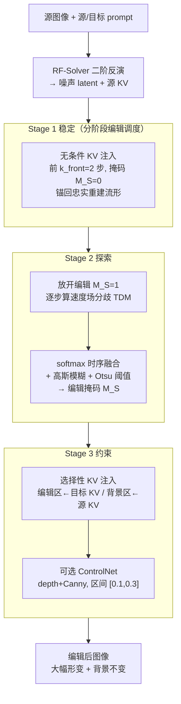

# Follow-Your-Shape: Shape-Aware Image Editing via Trajectory-Guided Region Control

**会议**: ICLR 2026  
**arXiv**: [2508.08134](https://arxiv.org/abs/2508.08134)  
**代码**: [项目页](https://follow-your-shape.github.io/)  
**领域**: 扩散模型 / 图像编辑  
**关键词**: Shape Editing, Trajectory Divergence Map, training-free, Flow Matching, KV Injection

## 一句话总结
提出 Follow-Your-Shape，一个无需训练和掩码的形状感知编辑框架，通过计算反演与编辑轨迹间的 token 级速度差异构建 Trajectory Divergence Map (TDM) 来精确定位编辑区域，配合分阶段 KV 注入实现大幅形状变换且严格保持背景。

## 研究背景与动机
**领域现状**：基于扩散/Flow 模型的图像编辑在通用任务上表现良好，但在涉及大尺度形状变换的结构性编辑中常常失败——要么无法实现目标形状变化，要么破坏非编辑区域。

**现有痛点**：现有区域控制策略存在根本缺陷——
   - 外部二值掩码：过于刚性，难以处理精细边界
   - 交叉注意力图推断：噪声大且不稳定，对大形变不可靠
   - 无条件 KV 注入：全局保持结构但抑制目标编辑

**核心矛盾**：编辑可控性与内容保持之间的冲突——要让 Flow 模型精确修改目标区域形状，同时不影响其他区域。

**本文目标** 如何在无需训练、无需掩码的情况下实现精确的大尺度形状编辑？

**切入角度**：从动力系统视角——编辑区域可由源条件和目标条件下去噪轨迹的分歧程度来定位。

**核心 idea**：通过比较源和目标 prompt 下的 velocity field 差异自动定位编辑区域，用分阶段 KV 注入实现稳定的形状感知编辑。

## 方法详解

### 整体框架
Follow-Your-Shape 要解决的是「大尺度形状编辑」这一被忽视的子任务：把一个对象改成截然不同的形状（如把直立的猫改成蜷缩），同时严格保住背景不动。它建立在 FLUX.1-dev 之上，是一个推理时框架，既不训练也不需要外部掩码。整条流水线是：给定源图像与源/目标 prompt，先用 RF-Solver 二阶反演把图像映射回噪声 latent 并记录下源 KV；随后把去噪过程切成三段——Stage 1 先用无条件 KV 注入把轨迹锚回忠实重建的流形，Stage 2 一边放开编辑、一边从源/目标速度场的分歧中实时算出编辑掩码，Stage 3 再据这张掩码对编辑区与背景区分别注入目标/源的 KV 特征（并辅以可选的 ControlNet 结构约束），最终输出「形变大、背景稳」的编辑结果。

### 关键设计

**1. 分阶段编辑调度：稳定→探索→约束，避开高噪声阶段不可靠的 TDM**

后面要用速度场分歧（TDM）来圈编辑区，但 TDM 在去噪早期噪声占主导时并不可靠，全程用它会把背景也误判成编辑区。本文据此把去噪切成三段、各司其职。Stage 1 取前 $k_{\text{front}}=2$ 步做无条件 KV 注入（编辑掩码 $M_S=\mathbf{0}$），先把轨迹稳定到忠实重建的流形上、不急于编辑；Stage 2 在预定窗口 $N$ 内放开编辑（$M_S=1$）并同步收集各步 TDM、聚合成掩码；Stage 3 才据掩码做选择性注入。这样既绕开了早期 TDM 的不可靠，又给中后段留足了编辑的余地。消融显示 $k_{\text{front}}$ 存在最优点：太小则轨迹还没稳就开编、太大又会压制编辑，$k_{\text{front}}=2$ 时 PSNR 与 CLIP Sim 同时取得最高。

**2. Trajectory Divergence Map：用速度场分歧自动圈出编辑区**

形状编辑的核心难题是"哪里该改、哪里该保"，而 Stage 2 要在没有任何外部标注的前提下回答它——外部二值掩码太刚性、交叉注意力图又噪声太大。本文从动力系统视角换了个思路：同一个 latent，在源 prompt 与目标 prompt 条件下去噪时，速度场会出现差异，差异大的 token 正是语义被要求改变、因而需要编辑的区域。具体地，在每个去噪步 $t$ 对每个 token $i$ 计算源/目标速度的 $L_2$ 距离

$$\delta_t^{(i)} = \| v_\theta(\mathbf{z}_t^{(i)}, t, \mathbf{c}_{\text{tgt}}) - v_\theta(\mathbf{x}_t^{(i)}, t, \mathbf{c}_{\text{src}}) \|_2$$

再做 min-max 归一化得到 $\tilde{\delta}_t^{(i)} \in [0,1]$。窗口结束后把各步 TDM 聚合：用 softmax 加权做时序融合 $\hat{\delta}^{(i)} = \sum_{t \in N} \alpha_t^{(i)} \tilde{\delta}_t^{(i)}$，其中 $\alpha_t^{(i)} = \exp(\tilde{\delta}_t^{(i)}) / \sum_{t'} \exp(\tilde{\delta}_{t'}^{(i)})$——相比简单平均，它能突出那些只在个别时间步才显著变化的 token；融合结果再经高斯模糊 $\tilde{M}_S = \mathcal{G}_\sigma * \hat{\delta}$ 抑制噪声边缘，最后用 Otsu 阈值自适应二值化为掩码 $M_S$（$\tilde{M}_S$ 的分布是「背景主峰 + 前景长尾」的偏斜单峰，天然适合 Otsu 按类间方差最大选阈），整条链路无需任何人工调阈值。这样编辑区域完全来自模型自身的去噪行为。

**3. 基于掩码的选择性 KV 注入：编辑区放目标、背景区锁源**

拿到 $M_S$ 后，Stage 3 要兼顾「可控性」与「内容保持」这对天生冲突的目标。做法是在注意力层按区域混合 KV 特征

$$\{K^*, V^*\} \leftarrow M_S \odot \{K^{\text{tgt}}, V^{\text{tgt}}\} + (1 - M_S) \odot \{K^{\text{inv}}, V^{\text{inv}}\}$$

编辑区域采用目标 prompt 的 KV 以驱动大幅形状变换，背景区域则回灌反演得到的源 KV 以严格保持不变，于是同一次去噪里两个区域各走各的、互不干扰。在此之上还可选地引入 ControlNet（depth + Canny）作为辅助结构约束，只在归一化去噪区间 $[0.1, 0.3]$ 内生效，进一步稳定剧烈形变下的几何一致性。

**4. ReShapeBench：填补大尺度形状编辑的评测空白**

现有 benchmark 多针对通用或局部编辑，缺乏对大尺度形状变换的系统评测，导致这类方法一直没有公允的比较场。本文构建 ReShapeBench，含 120 张新图像，覆盖单目标（70）、多目标（50）场景并附通用集（50），共 290 个形状编辑用例；源/目标 prompt 仅在前景对象描述上不同且经人工验证，使评测聚焦于形状变化本身、而非背景或风格的附带差异。

### 损失函数 / 训练策略
本方法是纯推理时框架，不涉及任何训练或微调。默认配置为 14 步去噪、guidance scale 2.0、$k_{\text{front}}=2$，反演采用 RF-Solver 二阶方案；ControlNet 仅在归一化去噪区间 $[0.1, 0.3]$ 内生效，depth 强度 2.5、Canny 强度 3.5。

## 实验关键数据

### 主实验（ReShapeBench + PIE-Bench）

| 方法 | AS↑ | PSNR↑ | LPIPS↓(×10³) | CLIP Sim↑ |
|------|-----|-------|-------------|-----------|
| MasaCtrl | 5.83 | 23.54 | 125.36 | 20.84 |
| RF-Edit | 6.52 | 33.28 | 17.53 | 30.41 |
| KV-Edit | 6.51 | 34.73 | 16.42 | 26.97 |
| FLUX.1 Kontext | 6.53 | 32.91 | 18.35 | 28.53 |
| Ours (w/o ControlNet) | 6.52 | 34.85 | **9.04** | 32.97 |
| **Ours (Full)** | **6.57** | **35.79** | **8.23** | **33.71** |

*ReShapeBench 上 Follow-Your-Shape 全面领先，LPIPS 仅 8.23（次优 16.42），CLIP Sim 33.71（次优 30.41）。*

### 消融实验（$k_{\text{front}}$ 的影响）

| $k_{\text{front}}$ | AS↑ | PSNR↑ | LPIPS↓(×10³) | CLIP Sim↑ |
|------|-----|-------|-------------|-----------|
| 0 | 6.51 | 32.79 | 10.04 | 31.05 |
| 1 | 6.55 | 34.38 | 9.88 | 32.56 |
| **2** | **6.57** | **35.79** | **8.23** | **33.71** |
| 3 | 6.52 | 31.25 | 10.52 | 29.41 |
| 4 | 6.48 | 30.41 | 12.37 | 27.66 |

*$k_{\text{front}}$ 存在最优点：太小则轨迹不稳定，太大则抑制编辑——$k_{\text{front}}=2$ 最佳平衡。*

### 关键发现
- 即使不用 ControlNet，TDM 引导的 KV 注入已显著优于所有 baseline
- 扩散模型方法（MasaCtrl、PnPInversion、Dit4Edit）在大形变下严重退化
- Flow 模型方法虽图像质量更高，但在剧烈形状变换中仍有鬼影/不完全变换
- Otsu 阈值法自适应且无需人工调参，TDM 分布天然适合二分割
- ControlNet 时机（$[0.1, 0.3]$）和强度（depth 2.5, Canny 3.5）的合理选择很关键

## 亮点与洞察
- **动力系统视角**：将编辑区域定位问题转化为轨迹分歧度量，理论直觉优雅
- **完全避免外部掩码和注意力图**：TDM 从模型自身行为中动态提取编辑区域
- **三阶段调度设计精妙**：稳定→探索→约束的流程符合去噪动态特性
- **softmax 加权时序融合**：比简单平均更好地捕捉时间动态（某 token 可能在某些时间步不变但在后续时间步变化）
- **ReShapeBench 填补了形状编辑评估的空白**：现有 benchmark 未针对大尺度形状变换设计

## 局限与展望
- 仅支持基于 prompt 的形状编辑，无法处理无法用文字精确描述的复杂几何变换
- 需要求解二阶反演（RF-Solver），计算量翻倍
- TDM 在高噪声阶段不可靠，需要分阶段策略规避——但这增加了超参数（$k_{\text{front}}$, 窗口大小 $N$）
- 对 ControlNet 的依赖是可选的但在某些场景下仍需要，偏离了"完全无外部工具"的理想
- 未探索在视频编辑中的扩展

## 相关工作与启发
- **RF-Edit / RF-Solver**：本文构建在 RF-Solver 反演之上，用 TDM 替代其全局 KV 注入策略
- **DiffEdit**：同样计算源-目标预测差异生成掩码，但 DiffEdit 基于扩散模型且不考虑轨迹时序动态
- **Stable Flow**：提出 vital layers 的选择性注入，Follow-Your-Shape 在空间维度做选择性注入
- 启发：Flow Matching 的确定性 ODE 轨迹天然适合计算分歧度量，这种"轨迹-based"范式可能推广到视频编辑或 3D 内容编辑

## 评分
- 新颖性: ⭐⭐⭐⭐ — TDM 的轨迹分歧视角新颖，但分阶段注入是渐进式创新
- 实验充分度: ⭐⭐⭐⭐ — 双 benchmark + 详细消融，但缺少用户研究
- 写作质量: ⭐⭐⭐⭐⭐ — 动机图示清晰，方法推导流畅
- 价值: ⭐⭐⭐⭐ — 为形状编辑这一被忽视的子任务提供了系统解决方案

<!-- RELATED:START -->

## 相关论文

- [\[ICLR 2026\] Training-Free Reward-Guided Image Editing via Trajectory Optimal Control](training-free_reward-guided_image_editing_via_trajectory_optimal_control.md)
- [\[CVPR 2026\] ShapeAR: Generating Editable Shape Layers via Autoregressive Diffusion](../../CVPR2026/image_generation/shapear_generating_editable_shape_layers_via_autoregressive_diffusion.md)
- [\[CVPR 2026\] PhysGen: Physically Grounded 3D Shape Generation for Industrial Design](../../CVPR2026/image_generation/physgen_physically_grounded_3d_shape_generation_for_industrial_design.md)
- [\[ICLR 2026\] DragFlow: Unleashing DiT Priors with Region Based Supervision for Drag Editing](dragflow_unleashing_dit_priors_with_region_based_supervision_for_drag_editing.md)
- [\[ICLR 2026\] Visual Autoregressive Modeling for Instruction-Guided Image Editing](visual_autoregressive_modeling_for_instruction-guided_image_editing.md)

<!-- RELATED:END -->
