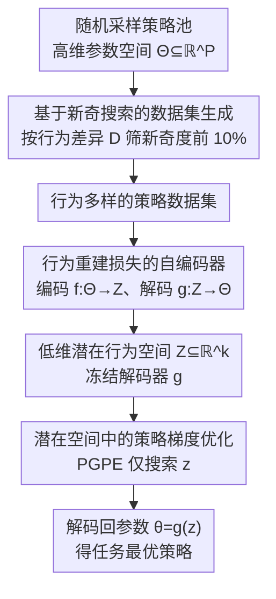

# From Parameters to Behaviors: Unsupervised Compression of the Policy Space

**会议**: ICLR 2026  
**arXiv**: [2509.22566](https://arxiv.org/abs/2509.22566)  
**代码**: [GitHub](https://github.com/DavideTenediniPoliMi/from-parameters-to-behaviors-unsupervised-compression-of-the-policy-space)  
**领域**: 图像生成  
**关键词**: 策略空间压缩, 行为流形, 自编码器, 潜在空间优化, 无监督预训练

## 一句话总结

基于流形假设提出策略空间的无监督压缩——用行为重建损失（而非参数重建损失）训练自编码器将高维策略参数空间 $\Theta \subseteq \mathbb{R}^P$ 压缩到低维潜在行为空间 $\mathcal{Z} \subseteq \mathbb{R}^k$（最高 121801:1 压缩比），在 Mountain Car、Reacher、Hopper、HalfCheetah 等环境上验证了行为流形的内在维度取决于环境复杂度而非网络大小，且在潜在空间中做 PGPE 优化可在 7/8 个任务上比 PPO、SAC 等 SOTA 收敛更快。

## 研究背景与动机

**领域现状**：深度强化学习的成功很大程度上依赖于深度神经网络对策略的高维参数化。然而这种高维参数化带来了严重的样本低效问题——策略网络的参数空间可能有数万甚至数百万维，但其中大量不同的参数配置实际上产生的行为（状态-动作分布）是相同或极其相似的。

**现有痛点**：(1) 参数空间的高度冗余导致搜索效率极低——agent 在偌大的参数空间中艰难搜索，但很多参数方向对行为没有任何影响；(2) 在多任务场景下问题更加严重，每个新任务通常需要从头学习（tabula rasa），无法利用环境的共享结构；(3) 现有方法（如多样化行为发现 DIAYN、不对称 actor-critic）只是间接缓解这些问题，没有从根本上解决参数空间冗余。

**核心矛盾**：策略网络的参数维度 $P$ 可能非常大（如 $10^5$），但有效行为的内在维度可能极小（如 $1 \sim 16$）。在高维空间中搜索low-dimensional manifold 上的解是极不高效的。

**本文目标** 学习一个从低维潜在空间到高维参数空间的生成映射 $g: \mathcal{Z} \to \Theta$，使得：(1) 潜在空间按行为相似性组织（而非参数相似性），(2) 压缩是任务无关的（无监督），(3) 压缩后的空间支持高效的任务特定优化。

**切入角度**：作者从流形假设（Manifold Hypothesis）出发——这个在机器学习中被广泛接受的假设认为高维数据实际上分布在低维流形上。将此假设应用到 RL：有效策略的行为分布在参数空间的一个低维流形上，该流形的维度由环境复杂度而非网络大小决定。

**核心 idea**：用行为重建损失（而非参数重建损失）训练自编码器压缩策略参数空间，然后在学到的低维潜在空间中做策略优化。

## 方法详解

### 整体框架

这篇论文要解决的是深度 RL 里"参数空间太大、搜索太低效"的问题：策略网络动辄上万到上百万维，但真正决定行为的有效自由度可能只有几维。作者沿用无监督 RL（URL）的两阶段思路——先做**任务无关的预训练**，学出策略参数空间的低维表示；再在这个低维空间里做**任务特定的微调**。预训练本身又拆成三步顺着走：先采集一批行为各异的策略当训练数据，再用自编码器把这些策略参数压到低维潜在空间，最后冻住解码器、在低维空间里用策略梯度去优化。三步分别对应下面三个关键设计，串起来就是"从参数到行为"的完整转换链路。

### 关键设计

**1. 基于新奇搜索的数据集生成：让训练数据覆盖行为流形的不同区域**

要学出一个有意义的压缩表示，前提是喂给自编码器的策略集合在**行为上**足够多样。但如果直接在参数空间随机采样，会出现严重的覆盖不均——大量不同的参数配置其实对应着相似甚至完全相同的行为，采来采去都是同一类行为。作者的做法是把多样性的衡量直接搬到行为空间：定义基于动作空间 L2 距离的行为差异度量

$$D(\pi_\theta \| \pi_{\theta'}) = \sqrt{\sum_{i=1}^{M}(\pi_\theta(\cdot|s_i) - \pi_{\theta'}(\cdot|s_i))^2}$$

在一个采样得到的状态子集上评估两个策略的动作差异。然后跑新奇搜索（Novelty Search）：给每个策略按它相对于 $k_n$ 个近邻的平均行为差异打分，只保留新奇度最高的前 10%。这样筛出来的训练集是在行为层面铺开的，覆盖了流形上的不同区域，而不是在参数层面扎堆。

**2. 行为重建损失的自编码器：用"功能相似"而非"参数相似"组织潜在空间**

压缩本身用一个对称自编码器完成，编码器 $f_\xi: \Theta \to \mathcal{Z}$ 把参数压到低维潜在空间，解码器 $g_\zeta: \mathcal{Z} \to \Theta$ 再还原回参数。真正的关键不在结构而在损失：传统做法是最小化参数重建误差 $\|\theta - (g \circ f)(\theta)\|^2$，这等于逼着解码器一字不差地还原原始参数值——可策略参数高度冗余，精确还原既没必要、在高压缩比下也根本做不到。作者改成最小化**行为重建损失**

$$\mathcal{L}_B = \mathbb{E}_{\theta \sim \mathcal{D}_\Theta}\big[D(\pi_\theta \| \pi_{(g \circ f)(\theta)})\big]$$

实践中在采样状态上用 MSE 近似：

$$\hat{\mathcal{L}}_B = \frac{1}{NM}\sum_{i=1}^N \sum_{j=1}^M \|\pi_{\theta_i}(s_j) - \pi_{(g \circ f)(\theta_i)}(s_j)\|_2^2$$

这一改动等于松开了解码器的手脚：它不必复刻精确的参数值，只要解出**任何一组能产生相同行为的参数**即可。于是潜在空间不再按参数的数值接近性排布，而是纯粹按功能相似性组织——这正是"从参数到行为"范式转变的技术核心。

**3. 潜在空间中的策略梯度优化：把 $10^5$ 维的搜索压成几维的搜索**

预训练完成后，冻结解码器参数 $\zeta^*$，$g_{\zeta^*}$ 就成了一个确定性可微函数，微调时只在低维潜在空间里搜索。借助链式法则，标准策略梯度可以穿过解码器反传到潜在变量上：

$$\nabla_z J^R(z) = \nabla_z g_{\zeta^*}(z)^\top \nabla_\theta J^R(\theta)$$

这套低维优化对参数探索型策略梯度方法（如 PGPE）格外友好——这类方法在高维参数空间里本来就因维度灾难而低效，挪到 $1 \sim 16$ 维的潜在空间后重新变得有效；而且 PGPE 在潜在空间运行时甚至不必显式计算解码器的雅可比矩阵。本质上，流形结构把"在 $10^5$ 维参数空间里找解"简化成了"在几维潜在空间里找解"，效率提升正源于此。

### 损失函数 / 训练策略

自编码器用行为重建损失 $\hat{\mathcal{L}}_B$ 训练，在每个梯度步随机采样一批状态来计算动作空间 MSE。训练超参数（网络架构、学习率等）在所有环境和配置上保持一致，体现了方法的通用性。

## 实验关键数据

### 主实验：Mountain Car 上的潜在行为压缩质量（性能恢复率）

性能恢复率 = 潜在空间解码策略的性能 / 训练数据集中策略的性能。值 $\geq 1$ 表示恢复甚至超过了原始性能。

| 策略大小 | 数据集规模 | 1D | 2D | 3D |
|---------|-----------|------|------|------|
| Small (~$10^1$参数) | 50k | 0.64 | 0.93 | **0.94** |
| Medium (~$10^3$参数) | 50k | 0.66 | 1.01 | **1.02** |
| Large (~$10^5$参数) | 50k | **1.02** | 1.01 | 1.01 |
| Medium | 100k | 0.51 | **1.02** | **1.02** |
| Large | 100k | **1.01** | **1.01** | **1.01** |

Large 策略即使在 1D 潜在空间中也能达到 1.01 的恢复率（$10^5:1$ 压缩比 → 几乎完美保留行为）；Medium 策略从 2D 开始即可超过 1.0；Small 策略在 1D 时部分配置出现崩溃（恢复率 0.50-0.64）。

### 消融实验：HalfCheetah 和 Hopper 上的泛化性能

| 环境 | 任务 | 5D恢复率 | 8D恢复率 | 16D恢复率 |
|------|------|---------|---------|----------|
| Hopper | forward | 1.33 | **1.59** | 1.48 |
| Hopper | backward | **2.66** | 1.29 | 1.20 |
| Hopper | jump | **3.83** | 1.54 | 2.42 |
| HalfCheetah | forward | 1.63 | 1.80 | **1.84** |
| HalfCheetah | backward | 1.27 | 1.52 | **1.72** |
| HalfCheetah | frontflip | 0.54 | 0.74 | **1.20** |
| HalfCheetah | backflip | 0.55 | 0.75 | **1.23** |

HalfCheetah 上增大潜在维度一致性地提升性能恢复率（5D→16D），说明该环境的行为流形内在维度较高；困难任务（frontflip/backflip）在低维时恢复率不足 1.0，但 16D 时超过 1.0。Hopper 上趋势被高方差掩盖。

### 关键发现

- **压缩比极高**：最高达 121801:1（Large 策略 → 1D 潜在空间），且几乎完美保留行为，有力验证了行为流形的低维性
- **行为流形维度 vs 环境复杂度**：Mountain Car 在 1-2D 即可达到高恢复率，Reacher 需要 3-5D，HalfCheetah 需要 8-16D，验证了"内在维度由环境决定而非网络大小"的假说
- **收敛速度优势**：Latent PGPE 在 8 个任务中的 7 个比 PPO、SAC、TD3、DDPG 收敛更快，虽然不总是收敛到最优解
- **数据集覆盖影响微调上限**：height 任务上 Latent PGPE 失败，因为训练数据集中高性能的 height 策略过少，导致该区域的行为流形学习不充分

## 亮点与洞察

- **行为重建损失是核心创新**：标准自编码器最小化参数重建误差，但策略参数的高度冗余意味着精确还原参数既不必要也不可能在高度压缩下实现。行为重建损失释放了解码器的自由度，允许它找到任何能产生相同行为的参数化，这使得潜在空间自然地按功能组织
- **环境复杂度决定内在维度的实证证据**：Mountain Car（简单环境）→ 1D 足够，HalfCheetah（复杂环境）→ 需要 16D。这不仅验证了流形假设，还提供了一种"测量环境复杂度"的新视角
- **模块化设计的范式意义**：三个阶段（数据收集、压缩、优化）的每一个都可以独立替换，构成了一个新的RL算法设计范式蓝图

## 局限与展望

- **预训练数据集的覆盖性瓶颈**：微调性能受限于预训练数据集对行为空间的覆盖程度——如果某种行为在训练集中缺失，潜在空间中就不会编码它（height 任务的失败案例）
- **策略数据集生成的计算成本**：需要生成大量（10k-100k）策略并评估其行为差异度，对 MuJoCo 等环境来说计算成本不低
- **自编码器架构未优化**：论文使用统一的对称自编码器架构且超参不调，更先进的生成模型（如 VAE、Diffusion Model）可能进一步提升压缩质量
- **仅验证了确定性策略**：当前方法聚焦于确定性策略 $\pi: \mathcal{S} \to \mathcal{A}$，随机策略的行为流形学习是开放问题

## 相关工作与启发

- **vs DIAYN 等多样化行为发现方法**：DIAYN 等方法目标是发现多样化的技能/选项，但不显式压缩策略空间。本文直接学习策略空间的低维流形结构，两类方法互补——可以用 DIAYN 发现的技能来改善策略数据集的行为覆盖
- **vs 策略蒸馏/网络剪枝**：这些方法以任务特定方式压缩单个策略网络。本文是任务无关的压缩——学习整个策略空间的低维结构，一次压缩可服务多个下游任务
- **vs 策略空间缩减** (Mutti et al., 2022)：目标是减少策略空间的基数（离散化），本文减少的是维度（连续表示）。本文的约束更宽松，避免了 NP-hard 优化

## 评分

- 新颖性: ⭐⭐⭐⭐⭐ 行为重建损失 + 流形假设在 RL 中的实证验证 + 模块化两阶段范式，思路新颖且有深度
- 实验充分度: ⭐⭐⭐⭐ 4 个环境、多种策略大小和潜在维度、与 4 种 SOTA 比较，10 次随机种子；但缺少更复杂环境（如 Atari）的验证
- 写作质量: ⭐⭐⭐⭐ 问题定义清晰、图示直观、数学符号规范；但部分内容重复
- 价值: ⭐⭐⭐⭐⭐ 提供了一种全新的 RL 效率提升范式，行为流形的概念有广泛的研究延伸空间

<!-- RELATED:START -->

## 相关论文

- [\[ICLR 2026\] Generalization of Diffusion Models Arises with a Balanced Representation Space](generalization_of_diffusion_models_arises_with_a_balanced_representation_space.md)
- [\[ICLR 2026\] Unsupervised Conformal Inference: Bootstrapping and Alignment to Control LLM Uncertainty](unsupervised_conformal_inference_bootstrapping_and_alignment_to_control_llm_unce.md)
- [\[ICML 2026\] SURF: Separation via Unsupervised Remixing Flow](../../ICML2026/image_generation/surf_separation_via_unsupervised_remixing_flow.md)
- [\[ICLR 2026\] Diffusion Fine-Tuning via Reparameterized Policy Gradient of the Soft Q-Function](diffusion_fine-tuning_via_reparameterized_policy_gradient_of_the_soft_q-function.md)
- [\[ECCV 2024\] WebRPG: Automatic Web Rendering Parameters Generation for Visual Presentation](../../ECCV2024/image_generation/webrpg_automatic_web_rendering_parameters_generation_for_visual_presentation.md)

<!-- RELATED:END -->
