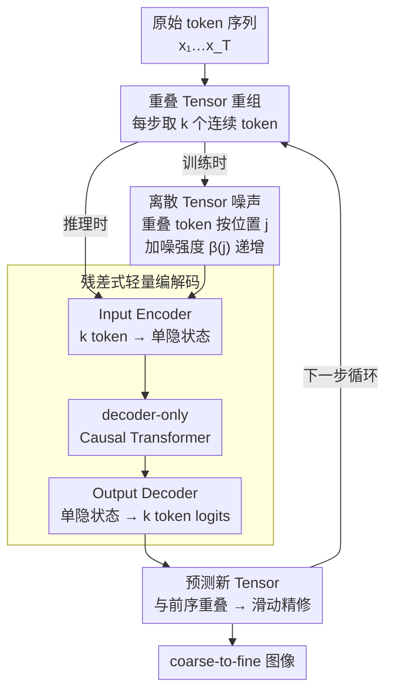

# From Prediction to Perfection: Introducing Refinement to Autoregressive Image Generation

**会议**: ICLR 2026  
**arXiv**: [2505.16324](https://arxiv.org/abs/2505.16324)  
**代码**: 无  
**领域**: 图像生成 / 自回归模型  
**关键词**: 自回归图像生成, next-tensor prediction, 离散扩散噪声, 迭代精修, 即插即用

## 一句话总结

提出 TensorAR，将标准 AR 图像生成从 next-token prediction 升级为 next-tensor prediction：每步预测重叠 tensor（一组连续 token），后续 tensor 与前序重叠实现迭代精修；引入离散扩散噪声机制解决训练信息泄漏问题，作为即插即用模块兼容 LlamaGen / Open-MAGVIT2 / Janus-Pro 等 AR 模型，在 class-to-image 和 text-to-image 任务上持续提升生成质量。

## 研究背景与动机

**领域现状**：自回归（AR）模型（LlamaGen、VAR、MAR、Open-MAGVIT2）已成为图像生成的主流范式之一，具备可扩展性、可控性和与多模态 LLM 统一的潜力。

**现有痛点**：标准 AR 的 next-token prediction 采用严格的左到右序列生成，一旦 token 被预测便无法修正，早期 token 的错误不断累积并降低最终图像质量。现有改进方案均需要修改核心范式：DART 将分类目标改为回归、MaskGIT/MAR 需要双向注意力且不兼容 KV cache、MAR 需额外 VQ-VAE 训练——这些都阻碍了与标准 GPT-style LLM 的多模态统一。

**核心矛盾**：AR 模型迫切需要精修能力来纠正早期预测错误，但扩散、掩码等精修机制与 AR 的因果结构和分类训练范式存在本质冲突。

**本文目标**：在不修改基础 Transformer 架构、不改变分类训练目标的前提下，赋予标准 decoder-only AR 模型迭代精修已生成 token 的能力。

**切入角度**：如果每步预测的不是单个 token 而是一组重叠的连续 token（tensor），相邻 tensor 的重叠区域自然提供修正前序预测的机会——这种"滑动窗口式精修"在保持因果结构的同时实现了类扩散的渐进改善。

**核心 idea**：通过将 next-token 扩展为 next-tensor（重叠 token 组）预测，在保持因果注意力和分类 loss 的同时实现滑动窗口式迭代精修。

## 方法详解

### 整体框架

TensorAR 把标准 AR 的 next-token prediction 改写成 next-tensor prediction：原始 token 序列 $[x_1, x_2, ..., x_T]$ 被重组为重叠 tensor 序列，每个 tensor $\mathbf{x}_{i,k} = [x_i, x_{i+1}, ..., x_{i+k-1}]$ 装着 $k$ 个连续 token，推理时第 $t$ 步基于所有前序 tensor 一次性吐出新 tensor，而相邻 tensor 共享 $k-1$ 个重叠 token，于是同一个空间位置会被反复预测、逐步修正。模型主干仍是原封不动的 decoder-only causal Transformer，只在输入端和输出端各加一个轻量残差模块来完成「$k$ 个 token ↔ 单个隐状态」的转换，因此既不动因果注意力也不动分类训练目标。训练时还要往重叠 token 上注入离散扩散噪声，逼模型学会去噪而非偷看真值。

### 关键设计

**1. 重叠 Tensor 的滑动精修：让 AR 在因果结构里实现 coarse-to-fine**

标准 AR 一旦写下一个 token 就再无回头路，早期错误会沿序列不断放大。TensorAR 的破局点在于让每个空间位置被多个 tensor 覆盖：tensor $\mathbf{x}_{i,k}$ 里第一个 token $x_i$ 会先后出现在 $k$ 个 tensor 中，等于被精修了 $k$ 次，最为精细；而末尾 token $x_{i+k-1}$ 只被预测一次，仍是粗稿。生成时上一步吐出的新 tensor 又与下一步的窗口重叠，于是过程天然从粗到精、循环精修，却完全不破坏左到右的因果顺序，KV cache 照常可用。窗口 $k$ 还串起了一条统一谱系——$k=1$ 退化为普通 AR，$k=T$ 等价于按左到右顺序展开的离散扩散，中间取值则在效率和质量之间连续滑动，把"扩散式全局精修"压缩成了"AR 内部的局部滑动窗口精修"。

**2. 离散 Tensor 噪声：堵住重叠带来的信息泄漏**

重叠设计带来一个隐患：训练时模型能同时看到某个 token 在前序 tensor 里的真值，于是会偷懒直接复制而非真正学因果依赖，推理时精修能力随之失效。TensorAR 借离散扩散的思路，对输入 tensor 中的重叠 token 注入分类噪声 $q(x^*_{t+j}\mid x_{t+j}, j) = \text{Cat}\big(x^*_{t+j} \mid (1-\beta(j))x_{t+j} + \beta(j)/V\big)$，其中噪声强度 $\beta(j)$ 在 tensor 内部随位置 $j$ 从 0 单调升到 1——越靠后的（即尚未充分精修的）token 被加得越脏。模型被迫从含噪 token 去噪重构，训练时扮演去噪器、推理时就变成精修器。作者给了线性 / 正弦 / 平方根 / 指数四种 $\beta(j)$ 调度，消融显示四者都远胜无噪基线、彼此差距很小，最终默认指数调度。注意这里离散扩散只是训练工具，图像生成本身仍走 AR 解码。

**3. 残差式轻量编解码：适配 tensor 又不伤预训练权重**

把序列粒度从 token 抬到 tensor，需要在两端做尺寸转换：Input Encoder 用一个 Query Transformer 把 $k$ 个 token embedding 压成单个隐状态喂给主干，Output Decoder 再从单个隐状态重构出 $k$ 个 token 的 logits。两个模块都以残差形式包住原始 embedding / linear 层，保证预训练信息流不被截断、可以直接复用基座权重。代价极小——新增参数只占 1.5%~4.6%，且模型越大占比越低（XXL 仅 +1.5%）；消融还显示 Query Transformer 单层最优，加深反而抬高 FID。

### 损失函数 / 训练策略

训练目标把 AR 交叉熵和离散扩散去噪合到一起，对每个 tensor 内的 $k$ 个位置加权求和：

$$\mathcal{L}(\theta) = \sum_{i=1}^{T}\sum_{j=1}^{k} \mathbb{E}\big[w_j \log p_\theta(x_{i+j}\mid \mathbf{x}_{<i,k}; c)\big]$$

序列尾部因 tensor 越界产生的 padding 位置直接忽略其 loss。默认配置为窗口 $k=4$、单层 Query Transformer、指数噪声调度。

## 实验关键数据

### 主实验：ImageNet 256×256 / 384×384 类别条件生成

| 模型 | 参数量 | FID↓ | IS↑ | Precision↑ | Recall↑ |
|------|--------|------|-----|-----------|---------|
| LlamaGen-B (256) | 111M | 5.46 | 193.6 | 0.83 | 0.45 |
| **+TensorAR** | **116M (+4.6%)** | **4.71** | **225.8** | **0.85** | **0.45** |
| LlamaGen-L (256) | 343M | 3.80 | 248.3 | 0.83 | 0.52 |
| **+TensorAR** | **352M (+2.7%)** | **2.78** | **254.8** | **0.82** | **0.56** |
| LlamaGen-XL (384) | 775M | 2.62 | 244.1 | 0.80 | 0.57 |
| **+TensorAR** | **789M (+1.9%)** | **2.29** | **260.4** | **0.81** | **0.59** |
| LlamaGen-XXL (384) | 1411M | 2.34 | 253.9 | 0.81 | 0.60 |
| **+TensorAR** | **1432M (+1.5%)** | **2.03** | **267.7** | **0.82** | **0.61** |
| Open-MAGVIT2-B (256) | 343M | 3.08 | 258.3 | 0.85 | 0.51 |
| **+TensorAR** | **352M (+2.7%)** | **2.91** | **260.2** | **0.86** | **0.50** |
| Open-MAGVIT2-L (256) | 804M | 2.51 | 271.7 | 0.84 | 0.54 |
| **+TensorAR** | **820M (+2.0%)** | **2.35** | **273.4** | **0.84** | **0.53** |

对比 SOTA：MAGVIT-v2 FID=1.78, MaskBit FID=1.52, VAR-2.0B FID=1.73（均为掩码 AR 或专用架构）。TensorAR-XXL 的 FID=2.03 在 casual AR 中表现最优，接近掩码 AR 的水平。

### 消融实验：噪声调度函数与窗口大小（LlamaGen-B）

| 配置 | FID↓ | IS↑ | Precision↑ | Recall↑ |
|------|------|-----|-----------|---------|
| Baseline（无精修） | 5.46 | 193.6 | 0.83 | 0.45 |
| **噪声调度** | | | | |
| Linear | 4.79 | 218.8 | 0.85 | 0.44 |
| Sine | 4.75 | 221.3 | 0.84 | 0.45 |
| Square root | 4.84 | 214.9 | 0.83 | 0.43 |
| **Exponential（默认）** | **4.71** | **225.8** | **0.85** | **0.45** |
| **窗口大小 $k$** | | | | |
| $k=2$ | 4.78 | 221.3 | 0.84 | 0.45 |
| $k=4$（默认） | 4.71 | 225.8 | 0.85 | 0.45 |
| $k=8$ | 4.68 | 226.7 | 0.85 | 0.46 |
| **Query Transformer 深度** | | | | |
| $d=1$（默认） | 4.71 | - | 0.85 | 0.45 |
| $d=2$ | 4.79 | - | 0.85 | 0.46 |
| $d=4$ | 4.90 | - | 0.82 | 0.43 |

### 文本到图像：GenEval 指令跟随评测

| 模型 | Single Obj. | Two Obj. | Counting | Colors | Position | Color Attri. | Overall↑ |
|------|------------|----------|----------|--------|----------|-------------|---------|
| LlamaGen | 0.71 | 0.34 | 0.21 | 0.58 | 0.07 | 0.04 | 0.32 |
| **+TensorAR** | **0.99** | **0.70** | **0.57** | **0.89** | **0.28** | **0.19** | **0.61** |
| Janus-Pro-7B | 0.99 | 0.89 | 0.59 | 0.90 | 0.79 | 0.66 | 0.80 |
| **+TensorAR** | **0.99** | **0.93** | **0.53** | **0.92** | **0.85** | **0.79** | **0.83** |
| DALL-E 3 | 0.96 | 0.87 | 0.47 | 0.83 | 0.43 | 0.45 | 0.67 |
| SD3-Medium | 0.99 | 0.94 | 0.72 | 0.89 | 0.33 | 0.60 | 0.74 |

### 关键发现

- **跨模型跨规模一致提升**：TensorAR 在 LlamaGen（111M→1.4B）和 Open-MAGVIT2 上均稳定降低 FID，LlamaGen-B 降幅最大（5.46→4.71，-13.7%），1.4B 模型上也有 0.31 点降幅（2.34→2.03）
- **参数开销极小**：新增参数 ≤4.6%，且随模型规模增大比例递减（XXL 仅 +1.5%）
- **文本到图像大幅提升**：LlamaGen 上 GenEval Overall 从 0.32→0.61（+91%），Janus-Pro 上 0.80→0.83
- **$k$ 增大单调降低 FID**：$k=2$ 即显著优于基线（5.46→4.78），$k=8$ 最低（4.68），但 $k=4$ 是效率-质量的较优平衡
- **四种噪声调度均大幅优于无噪声基线**：指数调度最优（4.71），模型对调度选择鲁棒
- **Query Transformer $d=1$ 最优**：增加深度不降 FID 反增延迟（$d=4$ 时 FID 回升至 4.90）
- **非简单 fine-tuning 效果**：用相同步数直接 fine-tune 基础模型 FID 无改善，确认增益来自精修机制

## 亮点与洞察

- **"精修而非重新生成"**：AR 模型首次具备修正前序预测的能力，类似人类"草稿→修改"的创作流程——不需要推翻已有生成，只改善局部
- **离散扩散作为训练工具而非生成工具**：巧妙地将离散扩散噪声用于解决信息泄漏训练问题，而非用于图像生成本身——将扩散的"去噪"思想嫁接到 AR 的"精修"需求
- **即插即用的工程价值**：不改 Transformer 架构（仍是 decoder-only causal attention）、不改训练目标（仍是分类 cross-entropy）、不改 VQ tokenizer → 任何 GPT-style AR 模型直接加上轻量模块即可受益
- **统一视角**：$k=1$ 为标准 AR，$k=T$ 为离散扩散，TensorAR 是两者之间的连续谱——提供了 AR 和扩散的理论桥梁
- **GenEval LlamaGen 提升 91%**：令人惊讶——精修不仅改善图像质量，还大幅提升指令跟随能力

## 局限与展望

- 窗口大小 $k$ 增大会线性增加推理步数和延迟，$k$ 的选择需在质量和速度间权衡
- 目前仅在 VQ tokenizer 的离散空间验证，连续 token 方法（如 MAR 的扩散头）的兼容性未探索
- DPG-Bench 上 Janus-Pro+TensorAR 在 "Other" 子指标从 89.48 降至 84.52，提示精修可能偶尔引入副作用
- 与 AR 推理加速/蒸馏方法（如 speculative decoding）的结合尚未探索——论文本身也指出这是有前景的方向
- 精修主要改善早期 token，对长序列后半段的边际收益可能递减

## 相关工作与启发

- **vs DART**：DART 统一 AR 和扩散但改变训练目标为回归，需非马尔可夫框架；TensorAR 保持分类目标和标准 Markov 过程
- **vs MaskGIT/MAR**：掩码 AR 需双向注意力，不兼容 KV cache 和标准 LLM；TensorAR 保持因果注意力和 KV cache
- **vs VAR**：VAR 用 next-scale prediction（多分辨率粗到精）；TensorAR 用 next-tensor prediction（同分辨率滑动精修），两者互补
- **启发**：精修思想可能推广到文本 AR 模型——如果 LLM 也能在生成过程中滑动修正前几个 token，可能提升长文本的连贯性

## 评分

- 新颖性: ⭐⭐⭐⭐⭐ next-tensor prediction + 离散噪声的组合优雅而有效，提供 AR-扩散统一视角
- 实验充分度: ⭐⭐⭐⭐ 两类任务 + 两个基础模型 + 六种规模 + 充分消融（噪声/窗口/深度），仅缺大规模 text-to-image 基准
- 写作质量: ⭐⭐⭐⭐⭐ 核心思想解释极为清晰，$k=1$ 到 $k=T$ 的连续谱视角有深刻洞察
- 价值: ⭐⭐⭐⭐⭐ 对 AR 图像生成范式有实质性推进，即插即用设计具有很高实际应用价值

<!-- RELATED:START -->

## 相关论文

- [\[ICLR 2026\] Condition Errors Refinement in Autoregressive Image Generation with Diffusion Loss](condition_errors_refinement_in_autoregressive_image_generation_with_diffusion_lo.md)
- [\[ICLR 2026\] Autoregressive Image Generation with Randomized Parallel Decoding](autoregressive_image_generation_with_randomized_parallel_decoding.md)
- [\[CVPR 2026\] Markovian Scale Prediction: A New Era of Visual Autoregressive Generation](../../CVPR2026/image_generation/markovian_scale_prediction_a_new_era_of_visual_autoregressive_generation.md)
- [\[CVPR 2026\] FVAR: Next-Focus Prediction for Visual Autoregressive Modeling](../../CVPR2026/image_generation/fvar_next-focus_prediction_for_visual_autoregressive_modeling.md)
- [\[ICLR 2026\] Visual Autoregressive Modeling for Instruction-Guided Image Editing](visual_autoregressive_modeling_for_instruction-guided_image_editing.md)

<!-- RELATED:END -->
