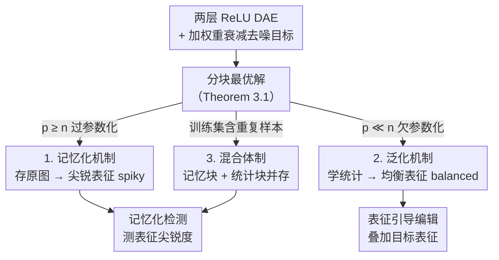

# Generalization of Diffusion Models Arises with a Balanced Representation Space

**会议**: ICLR 2026  
**arXiv**: [2512.20963](https://arxiv.org/abs/2512.20963)  
**领域**: 图像生成 / 扩散模型理论  

## 一句话总结
本文是扩散模型泛化理论领域的重要突破。通过分析两层非线性 ReLU DAE 的最优解，统一刻画了记忆化和泛化两种行为模式，并创造性地从表征空间的角度提供了一个以表征为中心的泛化理解。理论结论在 EDM、DiT 和 Stable Diffusion v1.4 上获得了一致的实验验证，且催生了两个实用应用：记忆化检测和可控编辑。理论的深度与实用性兼备。

## 评分

⭐⭐⭐⭐⭐

本文是扩散模型泛化理论领域的重要突破。通过分析两层非线性 ReLU DAE 的最优解，统一刻画了记忆化和泛化两种行为模式，并创造性地从表征空间的角度提供了一个以表征为中心的泛化理解。理论结论在 EDM、DiT 和 Stable Diffusion v1.4 上获得了一致的实验验证，且催生了两个实用应用：记忆化检测和可控编辑。理论的深度与实用性兼备。

---

## 研究背景与动机

**领域现状**：扩散模型已成为主流生成模型，代表系统如 Stable Diffusion、Flux、Veo，通过迭代去噪实现了前所未有的可扩展性、可控性与保真度。近期研究还发现扩散模型不只是学分布，也学到了有意义的表征——分布学习与表征学习之间存在深层对偶关系。

**现有痛点**：标准训练目标（去噪分数匹配）的解析解在理论上**只是训练样本的记忆化**；可实践中模型却能稳定生成新颖多样的输出。这种"理论预期记住、实际却泛化"的巨大鸿沟，是扩散模型理解中的核心开放问题，直接牵动隐私、可解释性与可信部署。

**核心矛盾**：现有理论各有硬伤——随机特征模型过度简化架构；线性模型分析能刻画泛化却抓不住记忆化；手工构造的闭式解只能模拟特定行为，结论碎片化、停在现象学层面。始终缺一个能**同时**解释记忆化与泛化的统一数学框架。

**核心 idea**：分析两层非线性 ReLU 去噪自编码器（DAE）的最优解，建立统一框架——数据局部稀疏时权重存下单个样本（记忆化），数据局部丰富时权重捕获数据统计（泛化）；并从**表征视角**给出判据：记忆化样本的表征是尖锐的（spiky），泛化样本的表征是均衡的（balanced）。

---

## 方法详解

### 整体框架

全文围绕一个可解析的极简对象展开：两层非线性 ReLU 去噪自编码器 $\boldsymbol{f}_{\boldsymbol{W}_2, \boldsymbol{W}_1}(\boldsymbol{x}) = \boldsymbol{W}_2 [\boldsymbol{W}_1^\top \boldsymbol{x}]_+$，在加权重衰减的去噪目标 $\min_{\boldsymbol{W}_2, \boldsymbol{W}_1} \frac{1}{n} \sum_{i=1}^{n} \mathbb{E}_{\boldsymbol{\epsilon}} [\| \boldsymbol{f}(\boldsymbol{x}_i + \sigma \boldsymbol{\epsilon}) - \boldsymbol{x}_i \|_2^2] + \lambda \sum_{l=1}^{2} \| \boldsymbol{W}_l \|_F^2$ 下求解。作者先证明一个统一结论（Theorem 3.1）：在 $(\alpha, \beta)$-可分性条件下，损失的每个局部极小值都是"分块"的——每个数据聚类占据一块权重，块内结构由该聚类 Gram 矩阵的特征分解决定。这块统一的分块最优解就是后面一切的骨架：隐藏单元数 $p$ 与样本数 $n$ 的相对大小这**一个旋钮**，连续地把模型从"逐样本记忆"切换到"按统计泛化"，并在表征空间留下可观测的指纹（尖锐 vs 均衡）；这两种指纹再各自支撑起一个落地工具——记忆化检测与表征引导编辑。

### 关键设计

**1. 记忆化机制：过参数化下权重直接存下每张图**

当隐藏单元充足（$p \geq n$）时，分块结构退化到极致——每个训练样本自成一块，于是权重矩阵的列就是缩放后的原始数据点本身：$\boldsymbol{W}_\text{mem} = (r_1 \boldsymbol{x}_1 \cdots r_n \boldsymbol{x}_n \boldsymbol{0} \cdots \boldsymbol{0})$，缩放系数 $r_i = \sqrt{(\| \boldsymbol{x}_i \|_2^2 - n\lambda) / (\| \boldsymbol{x}_i \|_4^4 + \sigma^2 \| \boldsymbol{x}_i \|_2^2)}$（Corollary 3.2）。这正是标准理论所预言的"解析解只是训练样本"的精确形态。关键在于它在表征空间留下的痕迹：输入 $\boldsymbol{x}_i + \sigma\boldsymbol{\epsilon}$ 的隐藏激活近似 one-hot，$\boldsymbol{h}_\text{mem}(\boldsymbol{x}_i + \sigma \boldsymbol{\epsilon}) \approx (0, \ldots, r_i \boldsymbol{x}_i^\top(\boldsymbol{x}_i + \sigma \boldsymbol{\epsilon}), \ldots, 0)$。因为存储下来的样本彼此近似负相关，只有对应那一个神经元被强烈点亮，能量高度集中——这就是作者所谓的**尖锐表征（spiky）**。

**2. 泛化机制：欠参数化逼模型只能学统计而非个体**

当隐藏单元远少于样本（$p \ll n$）时，一块权重再也装不下单张图，只能去拟合整团数据的低维主结构。此时每个权重块收敛到对应高斯模式的主成分子空间，$\boldsymbol{W}_{\boldsymbol{X}_k} \boldsymbol{W}_{\boldsymbol{X}_k}^\top \to [(\boldsymbol{S}_k - \frac{\lambda}{\rho_k} \boldsymbol{I})(\boldsymbol{S}_k + \sigma^2 \boldsymbol{I})^{-1}]_{\text{rank-}p_k}$，其中 $\boldsymbol{S}_k = \boldsymbol{\mu}_k \boldsymbol{\mu}_k^\top + \boldsymbol{\Sigma}_k$ 是该模式的均值-协方差二阶统计量（Corollary 3.3）。模型存的不再是哪张脸，而是"脸的统计"，因而能合成训练集里没出现过的新样本。对应的表征也变了样：能量摊开在活跃块的 $p_k$ 个坐标上，多个神经元同时被激活、共同编码分布信息，形成与尖锐表征截然相反的**均衡表征（balanced）**。记忆与泛化由此被同一个分块解统一刻画，区别只是表征是集中还是摊平。

**3. 混合体制与两个落地工具：把表征指纹变成可用的检测与编辑**

真实数据往往掺有重复样本，模型会同时记住退化的重复子集、泛化非退化子集，权重呈记忆块与统计块并存的混合结构（Corollary 3.4）。既然记忆化对应尖锐、泛化对应均衡，作者顺势把"表征能量是否集中"做成可量化的探针：用隐藏表征的标准差当尖锐度代理，方差高判为记忆化、方差低判为泛化，从而得到一个无需 prompt、仅看表征的记忆化检测器。同一视角还支持**表征引导编辑（steering）**——在表征空间叠加目标风格或概念的平均表征，均衡表征因为能量分散、对扰动平滑，可被连续渐进地编辑；尖锐表征则因能量锁死在单个神经元，只会表现出脆性的阈值式跳变。检测与编辑因此成了同一套表征理论的两个直接推论。

---

## 实验关键数据

### 主实验：记忆化检测

在三个数据集-模型对上评估记忆化检测性能：

| 方法 | 无需Prompt | LAION AUC↑ | LAION TPR↑ | ImageNet AUC↑ | CIFAR10 AUC↑ | 平均时间↓ |
|------|----------|-----------|-----------|-------------|-------------|---------|
| Carlini et al. | ✗ | 0.498 | 0.020 | N/A | N/A | 3.724%s |
| Wen et al. | ✗ | 0.986% | 0.961% | N/A | N/A | 0.134s |
| Hintersdorf et al. | ✗ | 0.957% | 0.500 | N/A | N/A | 0.009s |
| Ross et al. | ✓ | 0.956% | 0.915% | 0.971% | 0.713% | 0.545%s |
| **Ours** | **✓** | **0.987%** | **0.961%** | **0.995%** | **0.998%** | **0.067s** |

本方法是首个同时无需 prompt 且基于表征的检测方法，在三个数据集上均取得最高 AUC，且效率远超基于几何的方法。

### 消融实验：理论验证

| 验证维度 | 条件 | 结论 |
|---------|------|------|
| 记忆化权重结构 | 5 张 CelebA 训练 | 权重列存储缩放后的原始图像，与 Corollary 3.2 一致 |
| 泛化权重结构 | 10000 张 CelebA 训练 | 权重捕获数据主成分，与 Corollary 3.3 一致 |
| 噪声鲁棒性 | $\sigma = 0.2, 1, 5$ | 分块结构在大噪声下仍然成立 |
| 优化器鲁棒性 | Adam, AdamW, RMSProp | 不同优化器收敛到相同稀疏结构 |
| 实际模型 Jacobian | EDM, SD1.4, DiT | 记忆化样本 Jacobian 极低秩；泛化样本 Jacobian 反映数据统计 |
| 表征引导编辑 | SD1.4 | 泛化样本平滑渐进编辑；记忆化样本脆性阈值响应 |

---

## 亮点与洞察
- **一个旋钮统一记忆与泛化**：把"记住"和"泛化"这对看似对立的行为，归结为隐藏单元数 $p$ 与样本数 $n$ 的相对大小在同一个分块解上的连续过渡，而非两套独立机制——这是本文最漂亮的概念整合。
- **表征视角首创**：从"权重存了什么"进一步推到"激活长什么样"，把记忆/泛化翻译成可观测的 spiky/balanced 指纹，建立起表征结构 ↔ 生成行为的严格对应，这层洞察是后续两个工具的源头。
- **理论→工具的直接落地**：尖锐度探针无需 prompt、仅看表征就能检测记忆化（AUC > 0.98 且更快）；同一指纹还解释了为什么泛化样本好编辑、记忆样本难编辑——理论不止解释现象，还能直接指导隐私检测与可控生成。
- **可迁移的判据**："表征能量是否集中"作为记忆化代理，原则上可推广到其它生成模型的隐私审计与内容溯源。

## 局限与展望
- 理论分析限于两层 ReLU DAE，与实际深层架构（U-Net、DiT）仍有不小差距，靠 Jacobian SVD 的局部近似来搭桥。
- 可分性假设（$\beta < 0$）与混合高斯假设是对真实高维数据流形的粗略近似，未必处处成立。
- 表征引导编辑方法较为基础，未与现有图像编辑方法做系统对比。
- 展望：把分块解分析推广到多层 / 带 attention 的架构，或用尖锐度指标构建更强的隐私审计与去记忆化训练。

## 相关工作与启发
- **vs 随机特征模型**：随机特征分析虽有洞察但过度简化架构；本文直接分析非线性 ReLU DAE 的最优解，能落到权重与激活的具体结构上。
- **vs 线性模型 / 高斯混合分析**：线性分析能解释泛化却无法刻画记忆化；本文在同一框架里用 $p$ 与 $n$ 的相对大小把两者统一起来。
- **vs 手工闭式解（locality/equivariance）**：此前用手工构造闭式解逼近 U-Net 的工作结论碎片化、停在现象学层面；本文给出可证明的统一分块解，并补上表征视角。
- **启发**："分布学习 ↔ 表征学习"的对偶，提示可以用内部表征的几何（集中 vs 摊开）来诊断和控制生成模型的行为。

<!-- RELATED:START -->

## 相关论文

- [\[ICLR 2026\] Bridging Generalization Gap of Heterogeneous Federated Clients Using Generative Models](bridging_generalization_gap_of_heterogeneous_federated_clients_using_generative_.md)
- [\[ICLR 2026\] Localized Concept Erasure in Text-to-Image Diffusion Models via High-Level Representation Misdirection](localized_concept_erasure_in_text-to-image_diffusion_models_via_high-level_repre.md)
- [\[ICLR 2026\] Intention-Conditioned Flow Occupancy Models](intention-conditioned_flow_occupancy_models.md)
- [\[ICCV 2025\] MotionStreamer: Streaming Motion Generation via Diffusion-based Autoregressive Model in Causal Latent Space](../../ICCV2025/image_generation/motionstreamer_streaming_motion_generation_via_diffusion-based_autoregressive_mo.md)
- [\[ICCV 2025\] What's in a Latent? Leveraging Diffusion Latent Space for Domain Generalization](../../ICCV2025/image_generation/whats_in_a_latent_leveraging_diffusion_latent_space_for_domain_generalization.md)

<!-- RELATED:END -->
