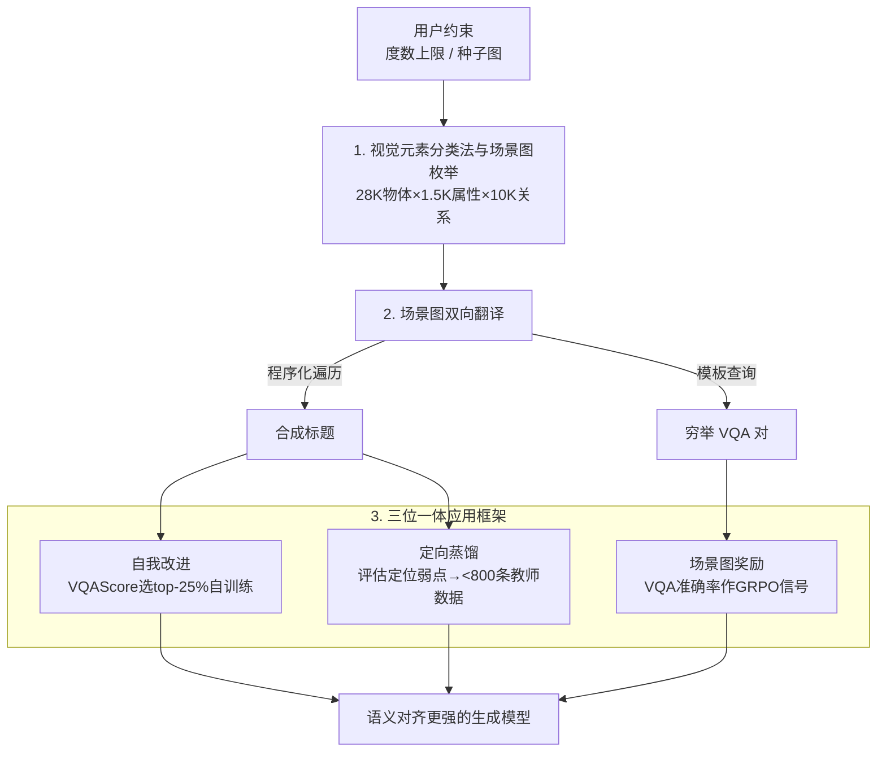

# Generate Any Scene: Scene Graph Driven Data Synthesis for Visual Generation Training

**会议**: ICLR 2026  
**arXiv**: [2412.08221](https://arxiv.org/abs/2412.08221)  
**代码**: [GitHub](https://github.com/RAIVNLab/GenerateAnyScene)  
**领域**: 图像生成 / 数据合成  
**关键词**: 场景图, 组合生成, 数据引擎, 自我改进, 定向蒸馏, 奖励模型

## 一句话总结
提出 Generate Any Scene 数据引擎，基于 28K 物体×1.5K 属性×10K 关系的视觉元素分类法系统枚举场景图并转化为标题+VQA 对，支持四种应用：自我改进（SD1.5 +4%）、定向蒸馏（<800 条数据 TIFA +10%）、场景图奖励模型（DPG-Bench +5% vs CLIP）和内容审核增强。

## 研究背景与动机

**领域现状**：文本到图像生成模型（如 DALL-E 3、SD、Flux）在视觉保真度上已达高水平，但在组合泛化和语义对齐方面仍然严重不足。典型失败案例：输入"a black dog chasing a rabbit in Van Gogh style"时，模型可能生成了狗但遗漏兔子或搞错风格。

**现有痛点**：问题的根源在于训练数据。LAION、CC3M 等主流数据集是网络爬取的图像-描述对，天然存在噪声大、组合性弱、偏向单物体粗粒度描述的问题。这些数据缺乏物体-属性关系和多物体交互的显式标注，限制了模型对复杂场景的泛化能力。人工标注密集组合标注不可扩展，VLM 自动标注又有幻觉和语义噪声问题。

**核心矛盾**：需要大规模、高质量、组合丰富的训练数据，但目前没有系统性覆盖视觉组合空间的数据生产方法。现有评估工具（DSG、DPG）已使用场景图评测生成质量，但场景图从未被系统用于训练数据的生产端。

**本文目标** 如何构建一个可扩展的数据引擎，系统性生成组合丰富的训练数据（标题+评估+奖励信号），以改善生成模型的组合泛化和语义对齐？

**切入角度**：以认知科学为基础的场景图作为视觉空间的结构化表示——物体为节点、属性为节点属性、关系为边——通过系统枚举场景图拓扑结构并填充元数据，可以产生近乎无限的组合场景描述，同时自动衍生出用于评估和奖励建模的 VQA 对。

**核心 idea**：用场景图作为中间表示系统枚举视觉组合空间，构建数据引擎同时产出训练标题和细粒度评估信号，驱动生成模型的自我改进、蒸馏和 RLHF 训练。

## 方法详解

### 整体框架
这篇论文要解决的是 T2I 模型组合泛化差的根因——训练数据本身缺乏多物体、物体-属性-关系的密集组合标注。它的思路是不改模型、只造数据：把"视觉场景"抽象成场景图（物体为节点、属性为节点属性、关系为边），用一个引擎系统枚举场景图、再把每张图同时翻译成训练用的标题和评估用的 VQA 对，从而批量产出自然数据里几乎采不到的罕见组合。

整体只有两个引擎组件 + 一层应用：先是**视觉元素分类法与场景图枚举**，在用户约束下枚举场景图拓扑、从 28K 物体 / 1.5K 属性 / 10K 关系的分类法采样填充；再是**场景图双向翻译**，把同一张图程序化翻成自然语言标题、并模板化反查出穷举 VQA 对；最后把"标题 + VQA"这套输出接到**三位一体应用框架**（自我改进 / 定向蒸馏 / 场景图奖励），分别用同一份数据驱动三种互补的训练。

### 关键设计

**1. 视觉元素分类法与场景图枚举：把组合空间变成可系统遍历的离散结构**

自然数据集的组合多样性受限于真实世界的分布，必然偏向常见场景，长尾组合几乎采不到。要主动填补这块空白，先得有一个能穷举视觉概念的知识库。论文从 WordNet、Wikipedia、Visual Genome、Places365 等多源收集了 28,787 种物体、1,494 种属性、10,492 种关系和 2,193 种场景属性，组织成层次化分类法（如 flower→daisy→white daisy），让生成粒度可从粗到细按需控制。枚举场景图时先采样物体节点数，再系统枚举满足"度-序列约束"的边集与属性附着方案，从而能造出训练数据里几乎不出现的罕见组合。为了让产物可控且合理，引擎提供三类约束：度数上限约束、种子图保持（把用户给定的子图嵌进枚举出的大图）、以及常识合理性过滤。所有枚举结果按参数元组预计算并缓存，避免重复采样。

**2. 场景图到标题 + VQA 的双向翻译：一个结构同时喂训练和评估两端**

场景图本身是图结构，既要变成生成模型能消费的文本标题，又要变成能精细打分的评估信号。标题翻译走确定性程序化算法：按拓扑序遍历场景图，把物体 / 属性 / 关系逐一转成描述性文本，并用语法规则消歧（用 "the first / second" 区分同类物体）。相比 LLM 改写，这条程序化路线速度快、且没有幻觉风险（实测与 LLM 改写无显著差异）。同一张场景图还能反向枚举出穷举的 VQA 对——用模板查询物体属性（"What color is the sphere?"）、空间关系（"What is to the left of the cube?"）等，每个答案都直接映射回场景图的某个节点或边，从而保证覆盖图中所有元素。这就让评估变成"零额外成本"：VQA 对天然细粒度，能定位到具体哪个物体 / 属性 / 关系出错，比 CLIPScore 这类整体匹配分数精准得多。

**3. 自我改进 - 蒸馏 - RLHF 三位一体的应用框架：用同一套标题 + 评估能力驱动三种互补训练**

有了能批量产标题、又能自带评估的引擎，论文把它接到三种各自解决不同瓶颈的改进策略上。**自我改进**为每个合成标题生成 8 张图像，按 VQAScore 取 top-25% 作为下一轮微调数据，迭代 3 个 epoch——它不需要任何外部数据，但天花板受模型自身能力限制。**定向蒸馏**先用 Generate Any Scene 的标题系统评估开源 vs 闭源模型，定位开源模型的具体弱点（如 SD1.5 多物体组合差），再只用对应能力的 <800 条 DALL-E 3 图像-标题对做 LoRA 微调——它需要一个更强的教师模型，但数据需求被压到极低。**场景图奖励模型**把 VQA 对的回答准确率（由 Qwen2.5-VL-3B 作答）当作奖励信号，用 GRPO 训练 SimpleAR-0.5B，提供三者中最精细的语义对齐信号。三条路线各有取舍，但共同依赖的都是引擎产出的结构化标题与完备评估。

### 损失函数 / 训练策略
自我改进和蒸馏均使用 LoRA 实现参数高效微调。自我改进每轮 10K 标题×8 生成→选 top-25% 即 2.5K 对。蒸馏仅用 778 条标题。RLHF 使用 GRPO 算法，10K 标题训练 1 epoch，奖励为 VQA 准确率。

## 实验关键数据

### 主实验

自我改进（SDv1.5 基线，GenAI-Bench + 1K Generate Any Scene 评估集）：

| 方法 | CLIPScore | ImageReward | LPIPS | VQAScore |
|------|-----------|-------------|-------|----------|
| SDv1.5 原始 | 0.3167 | 0.2056 | 0.7297 | 0.5823 |
| CC3M 真实数据微调 | 0.3196 | 0.3842 | 0.7356 | 0.6044 |
| **GAS 自我改进** | **0.3206** | **0.3927** | **0.7329** | **0.6109** |

RLHF 奖励模型对比（SimpleAR-0.5B）：

| 方法 | DPG-Bench Global | DPG Relation | GenEval Overall | GenAI All |
|------|-----------------|-------------|-----------------|-----------|
| SFT 基线 | 85.02 | 86.59 | 0.53 | 0.66 |
| CLIP-RL | 86.64 | 88.51 | 0.59 | 0.67 |
| **GAS 奖励 (ours)** | **88.46** | **90.13** | **0.61** | **0.68** |

### 消融实验

定向蒸馏（SDv1.5，TIFA Score vs 标题复杂度）：

| 配置 | TIFA (多物体标题) | 提升 | 说明 |
|------|-----------------|------|------|
| SDv1.5 原始 | ~0.50 | - | 组合能力差 |
| 随机标题蒸馏 | ~0.55 | +5% | 非定向数据 |
| **定向多物体蒸馏** | **~0.60** | **+10%** | 仅 778 条标题 |

组合泛化测试（400 条未见组合的标题）：

| 方法 | VQAScore | CLIPScore |
|------|----------|-----------|
| SDv1.5 | 0.5823 | 0.2876 |
| CC3M-FT | 0.6044 | 0.2927 |
| **GAS-FT** | **0.6109** | **0.2938** |

### 关键发现
- 合成数据微调全面超越同等规模的真实数据 CC3M 微调，证明结构化组合数据比自然数据更有价值
- 定向蒸馏仅需 778 条标题即达 TIFA +10%，远优于随机蒸馏的 +5%——"找准弱点"比"海量数据"更重要
- GRPO + 场景图奖励在 DPG-Bench 上超 CLIP 奖励 +1.8%（88.46 vs 86.64），在 GenEval 两物体任务上尤为显著
- 生成多样性（LPIPS）在微调后保持不变，说明改善语义对齐无需牺牲多样性

## 亮点与洞察
- "数据引擎而非模型改进"的范式——不改模型架构，通过更好的训练数据系统性提升能力，符合 data-centric AI 的趋势
- 场景图的双重角色非常巧妙：既是数据生成的结构化模板（输入端），又是评估和奖励的完备性保证（输出端）。这种"生成-评估闭环"使整个流程自洽
- 778 条定向蒸馏数据的效率令人印象深刻——通过 Generate Any Scene 的系统评估精确定位弱点，再针对性地用强模型数据补足，是一种可推广的"精准补短板"策略
- VQA 对作为奖励信号：比 CLIP 的整体图文匹配分数更细粒度，能区分"哪个物体/属性/关系出错了"

## 局限与展望
- 自我改进依赖 VQAScore 作为选择信号，但 VQAScore 本身可能对某些组合有盲区
- 定向蒸馏依赖闭源教师模型（DALL-E 3），在教师模型也弱的领域无法补足
- 场景图的组合虽然系统但仍受限于分类法的覆盖范围——28K 物体无法涵盖所有视觉概念
- 内容审核实验规模较小（5K 图像），更大规模的验证仍需进一步展开
- 未探索将场景图引擎应用于视频生成的训练数据增强

## 相关工作与启发
- **vs DreamSync**：DreamSync 也做自我改进但不使用结构化场景图，Generate Any Scene 的系统枚举提供更多样的组合覆盖
- **vs DSG/DPG**：它们用场景图做评测，Generate Any Scene 将场景图从评测端扩展到数据生产端，实现了闭环
- **vs DALL-E 3 的 recaptioning**：DALL-E 3 用 VLM 重标注提升标题质量，Generate Any Scene 用程序化生成避免了 VLM 幻觉问题
- 场景图数据引擎的思路可推广到任何需要结构化覆盖组合空间的任务（如视频生成、3D 生成、机器人指令跟随）

## 评分
- 新颖性: ⭐⭐⭐⭐ 场景图从评测到数据生成的闭环设计新颖，四种应用统一框架
- 实验充分度: ⭐⭐⭐⭐ 四种应用场景均有量化验证，含组合泛化测试
- 写作质量: ⭐⭐⭐⭐ 系统结构清晰，pipeline描述详尽
- 价值: ⭐⭐⭐⭐⭐ data-centric范式对T2I训练有重要启示，定向蒸馏策略实用性强

<!-- RELATED:START -->

## 相关论文

- [\[ICLR 2026\] Consistent Text-to-Image Generation via Scene De-Contextualization](consistent_text-to-image_generation_via_scene_de-contextualization.md)
- [\[ECCV 2024\] EchoScene: Indoor Scene Generation via Information Echo over Scene Graph Diffusion](../../ECCV2024/image_generation/echoscene_indoor_scene_generation_via_information_echo_over_scene_graph_diffusio.md)
- [\[ECCV 2024\] Mutual Learning for Acoustic Matching and Dereverberation via Visual Scene-driven Diffusion](../../ECCV2024/image_generation/mutual_learning_for_acoustic_matching_and_dereverberation_via_visual_scene-drive.md)
- [\[NeurIPS 2025\] SceneDecorator: Towards Scene-Oriented Story Generation with Scene Planning and Scene Consistency](../../NeurIPS2025/image_generation/scenedecorator_towards_scene-oriented_story_generation_with_scene_planning_and_s.md)
- [\[CVPR 2026\] Dynamic-eDiTor: Training-Free Text-Driven 4D Scene Editing with Multimodal Diffusion Transformer](../../CVPR2026/image_generation/dynamic-editor_training-free_text-driven_4d_scene_editing_with_multimodal_diffus.md)

<!-- RELATED:END -->
