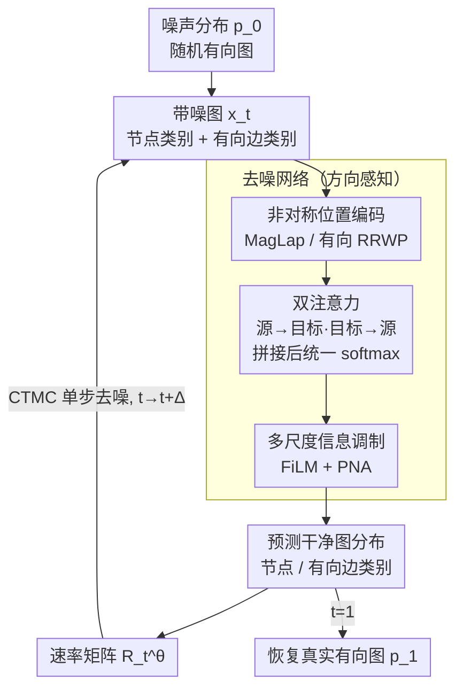

# Generating Directed Graphs with Dual Attention and Asymmetric Encoding

**会议**: ICLR 2026  
**arXiv**: [2506.16404](https://arxiv.org/abs/2506.16404)  
**代码**: [GitHub](https://github.com/acarballocastro/DIRECTO)  
**领域**: 图生成  
**关键词**: 有向图生成, 离散流匹配, 双注意力机制, 非对称位置编码, 图生成基准  

## 一句话总结

提出 Directo，首个基于离散流匹配（Discrete Flow Matching）的有向图生成模型，通过方向感知的双注意力机制和非对称位置编码捕获有向边的方向依赖，同时建立了有向图生成的标准化评测体系。

## 研究背景与动机

- **领域现状**：图生成模型在药物发现、社交网络建模等领域取得显著进展，但绝大多数方法专注于无向图生成，有向图生成研究严重不足
- **现有痛点**：有向图（digraph）存在两大瓶颈——(1) 建模层面，边方向性使得可学习空间急剧增长（$n=4$ 时有向图 218 种 vs 无向图仅 11 种），简单扩展无向图架构无法处理这种组合爆炸；(2) 评估层面，缺乏标准化的有向图生成基准和评测指标
- **核心矛盾**：已有少量 DAG 生成方法（D-VAE、LayerDAG）需要拓扑排序预处理，且仅限于无环图；而一般有向图的生成方法几乎空白
- **本文目标**：构建一个通用的有向图生成框架，同时覆盖 DAG 和一般有向图
- **切入角度**：从架构（方向感知注意力）、生成框架（离散流匹配）、输入特征（非对称位置编码）三个维度协同增强有向图建模能力
- **核心 idea**：通过双注意力区分入边/出边的信息流，结合有向位置编码和离散流匹配框架，实现对有向图结构的精确生成

## 方法详解

### 整体框架

Directo 要解决的是「怎么生成一张有向图」，难点在于有向图里边 $(i,j)$ 和 $(j,i)$ 是两条独立的边，可以属于完全不同的类别，朴素照搬无向图模型会因为强行对称化而丢掉方向信息。它把生成过程建在离散流匹配（DFM）之上：训练时给真实图加噪得到中间状态 $\bm{p}_t$，采样时反过来从噪声分布 $\bm{p}_0$ 出发，沿连续时间马尔可夫链（CTMC）逐步去噪、最终恢复真实图分布 $\bm{p}_1$。整条链由去噪网络驱动——它读入带噪图，预测干净图的节点类别和有向边类别，预测分布再换算成速率矩阵 $\bm{R}_t^\theta$ 控制每一步的转移。这个去噪网络正是 Directo 三处针对「方向」的改造所在：方向感知的双注意力、非对称的位置编码、以及把它们串起来的多尺度调制。

### 关键设计

**1. 有向图的离散流匹配：让加噪/去噪在每条有向边上独立进行**

无向图的 DFM 把一条边当成一个对称变量，但有向图里 $(i,j)$ 和 $(j,i)$ 必须当成两个独立的分类变量分别建模。Directo 因此让噪声过程在每个节点 $x^{(n)}$ 和每条有向边 $e^{(i,j)}$ 上各自做线性插值，把「真实类别」和「噪声类别」按时间 $t$ 混合：

$$p_{t|1}^X(x_t^{(n)} | x_1^{(n)}) = t \cdot \delta(x_t^{(n)}, x_1^{(n)}) + (1-t) \cdot p_{\text{noise}}^X(x_t^{(n)})$$

训练目标是预测干净图的交叉熵损失，节点项和边项分开统计、用 $\lambda$ 平衡边的权重：

$$\mathcal{L} = \mathbb{E}\Big[-\sum_n \log p_{1|t}^{\theta,(n)} - \lambda \sum_{i \neq j} \log p_{1|t}^{\theta,(i,j)}\Big]$$

选 DFM 而不是扩散的好处在于它训练和采样是解耦的：训练完之后还能在采样阶段做后训练优化（比如自适应时间调度），而有向图本身比无向图复杂得多，这种采样端的可调空间正好用来吸收额外难度。

**2. 非对称位置编码：给节点注入能区分入/出角色的全局结构信号**

标准拉普拉斯位置编码建立在对称邻接矩阵上，天生分不清一个节点是「被指向」还是「指向别人」，等于把方向信息抹平。Directo 改用方向感知的编码注入超越局部邻域的结构信息，并对比了三种方案：磁拉普拉斯（MagLap）用复值相位偏移把边方向编进特征；Multi-$q$ MagLap 再堆叠多个不同势函数的 MagLap，给出更丰富的多视角表示；有向 RRWP 则组合正向和反向的随机游走转移概率，直接刻画入边、出边两个方向上的非对称信息流。这几种都让后续注意力在一开始就拿到「方向已知」的节点特征。

**3. 双注意力（Dual Attention）：把源→目标和目标→源拆成两路再统一竞争**

普通注意力对称地处理 $i$、$j$ 之间的关系，无法表达「$i$ 作为源」和「$i$ 作为目标」是两种不同语义。双注意力为此显式算两组方向特定的注意力图——一路看源到目标，一路看目标到源：

$$\bm{Y}_{\text{ST}}[i,j] = \frac{\bm{Q}_S[i] \cdot \bm{K}_T[j]}{\sqrt{d_q}}, \qquad \bm{Y}_{\text{TS}}[i,j] = \frac{\bm{Q}_T[i] \cdot \bm{K}_S[j]}{\sqrt{d_q}}$$

两路分别经 FiLM 层用边特征调制后，并不各自独立归一化，而是拼接到一起做一次统一 softmax，再聚合更新节点特征：

$$\bm{A}_{\text{aggr}} = \text{softmax}(\text{concat}(\bm{Y}'_{\text{ST}}, \bm{Y}'_{\text{TS}})), \qquad \bm{X}' = \bm{A}_{\text{aggr}} \bm{V}_{\text{aggr}}$$

把两个方向放进同一个 softmax 竞争，是这里的关键——模型可以按每条边的具体情况，自适应地决定该多看入方向还是出方向，比两路各自 softmax 再相加更灵活。消融也显示，正是这一块（而非单纯加深网络）撑起了模型的有向图建模能力。

**4. 多尺度信息调制：让节点、边、图三级特征互相影响**

光有方向感知的注意力还不够，节点表示和边表示需要持续交换信息。FiLM 层负责用边特征 $\bm{E}$ 去调制注意力输出 $\bm{E}_{\text{attn}}$，做节点-边-图三级特征融合：

$$\text{FiLM}(\bm{E}, \bm{E}_{\text{attn}}) = \bm{E} \bm{W}_1 + (\bm{E} \bm{W}_2) \odot \bm{E}_{\text{attn}} + \bm{E}_{\text{attn}}$$

PNA 层则用 max/min/mean/std 四种池化把局部邻域信息聚合成全局图特征，再回灌给每个节点。这两层把前面三处方向改造产出的局部信号汇成全局视角，让去噪网络在每一步都同时看到细粒度方向和整体结构。

### 损失函数

训练目标即上面的节点-边交叉熵损失，节点项和边项独立计算，超参数 $\lambda$ 控制边重建损失相对节点的权重。

## 实验关键数据

### 主实验

| 模型 | ER-DAG Ratio↓ | ER-DAG V.U.N.↑ | SBM Ratio↓ | SBM V.U.N.↑ | TPU V.U.N.↑ | VG RBF↓ |
|---|---|---|---|---|---|---|
| MLE | 15.1 | 0.0 | 11.6 | 0.0 | 24.7 | 0.618 |
| LayerDAG | 4.2 | 21.5 | - | - | 98.5 | - |
| DeFoG | 1.6 | 75.0 | 4.3 | 37.0 | 72.0 | 0.085 |
| Directo RRWP | **1.7** | **94.0** | 1.8 | **99.5** | 77.0 | **0.038** |
| Directo MagLap | **1.3** | 92.0 | **2.0** | 96.5 | **80.5** | 0.051 |

### 消融实验

| 配置 | ER-DAG V.U.N.↑ | SBM V.U.N.↑ |
|---|---|---|
| RRWP + Double depth（加参数不加双注意力）| 72.0 | 0.0 |
| RRWP + Dual attention | **94.0** | **99.5** |
| MagLap + Double depth | 80.0 | 8.0 |
| MagLap + Dual attention | **91.0** | **77.0** |

### 关键发现

1. **双注意力是核心**：即使不加位置编码（No PE），双注意力仍能实现非零 V.U.N.，而单纯增加网络深度完全无法替代
2. **方向感知 PE 优于通用 PE**：有向 RRWP 和 MagLap 显著优于对称拉普拉斯编码
3. **隐式学习结构约束**：Directo 在 DAG 数据上无需显式无环约束就能生成高质量 DAG
4. LayerDAG 虽然强制 acyclicity，但在分布匹配指标（Ratio）上远不如 Directo

## 亮点与洞察

1. **系统性方案**：同时解决了有向图生成的建模难题和评测空白，是该方向的奠基性工作
2. **架构设计精巧**：双注意力通过拼接两个方向后统一 softmax，允许模型自适应分配入/出方向的注意力权重，比独立处理更有效
3. **可扩展性好**：通过 classifier-free guidance 可直接扩展到条件生成
4. **消融实验说服力强**：Table 2 清楚展示双注意力 vs 简单加深网络的巨大差距

## 局限与展望

1. **可扩展性有限**：目前仅测试到 ~200 节点的中等规模图，大规模图需要稀疏注意力等加速策略
2. **无显式结构约束**：对 acyclicity 等性质仅隐式学习，强约束场景可能需要结合 PRODIGY 等方法
3. **位置编码计算成本**：多 $q$ MagLap 在大图上计算开销显著
4. **仅验证生成任务**：双注意力架构可推广到判别任务（链接预测、节点分类），但尚未验证

## 相关工作与启发

- **无向图生成**：DiGress（Vignac et al., 2023）和 DeFoG（Qin et al., 2025）是最强基线，而朴素扩展移除对称化操作后效果大幅下降
- **DAG 生成**：D-VAE、LayerDAG 需拓扑排序，限制了通用性
- **有向 GNN**：MagNet（Zhang et al., 2021）和 Dir-GNN 的位置编码思路被本文借鉴到生成任务
- **启发**：流匹配在离散空间的成功应用值得关注，其训练-采样解耦特性在复杂结构生成中优势明显

## 评分

⭐⭐⭐⭐（4/5）

- **创新性**：⭐⭐⭐⭐ 首个基于 flow matching 的有向图生成模型，问题定义清晰
- **实验**：⭐⭐⭐⭐⭐ 合成+真实数据集全面评测，消融充分
- **写作**：⭐⭐⭐⭐ 结构清晰，benchmark 设计合理
- **实用性**：⭐⭐⭐⭐ 提供了完整评测框架和代码

<!-- RELATED:START -->

## 相关论文

- [\[ICLR 2026\] Dual-Solver: A Generalized ODE Solver for Diffusion Models with Dual Prediction](dual-solver_a_generalized_ode_solver_for_diffusion_models_with_dual_prediction.md)
- [\[ICCV 2025\] Video Motion Graphs](../../ICCV2025/image_generation/video_motion_graphs.md)
- [\[ICML 2025\] Directed Graph Grammars for Sequence-based Learning](../../ICML2025/image_generation/directed_graph_grammars_for_sequence-based_learning.md)
- [\[ICML 2026\] Semantic-Aware Motion Encoding for Topology-Agnostic Character Animation](../../ICML2026/image_generation/semantic-aware_motion_encoding_for_topology-agnostic_character_animation.md)
- [\[CVPR 2026\] Gated Condition Injection without Multimodal Attention: Towards Controllable Linear-Attention Transformers](../../CVPR2026/image_generation/gated_condition_injection_without_multimodal_attention_towards_controllable_line.md)

<!-- RELATED:END -->
