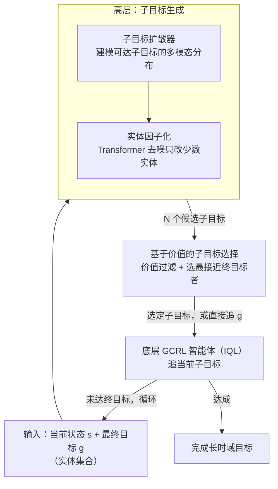

# Hierarchical Entity-centric Reinforcement Learning with Factored Subgoal Diffusion

**会议**: ICLR 2026  
**arXiv**: [2602.02722](https://arxiv.org/abs/2602.02722)  
**代码**: [GitHub](https://github.com/DanHrmti/HECRL)  
**领域**: 扩散模型  
**关键词**: 层次强化学习, 目标条件RL, 扩散模型, 实体中心, 子目标生成

## 一句话总结
提出HECRL，一个层次化实体中心离线目标条件RL框架，结合基于价值的GCRL智能体和因子化子目标扩散模型，在多实体长时域任务中实现150%+的成功率提升。

## 研究背景与动机
在多实体环境中实现长时域目标是RL的核心挑战。目标条件RL(GCRL)促进了目标间的泛化，但在高维观测和组合状态空间中（尤其是稀疏奖励下）效果有限。现有方法如HIQL从单一价值函数提取层次策略，但在OGBench基准上仍难以处理组合状态空间和图像观测。核心矛盾是：时序差分(TD)学习的近似误差在长时域中累积，距离目标越远，价值信号的信噪比越低，定义了一个"策略能力半径" $R_\pi^V$。HECRL的切入点是：利用实体因子化结构生成稀疏修改子目标，将长时域任务分解为多个在策略能力半径内的短时域子任务。

## 方法详解

### 整体框架
HECRL 想解决的是：在多实体、长时域、稀疏奖励的离线环境里，TD 学习的近似误差会随距离累积，越远的目标价值信号信噪比越低，于是每个策略只在一个有限的"能力半径" $R_\pi^V$ 内可靠。它的办法是用一个高层模块把远目标拆成一串落在这个半径内的近子目标。整体是两层架构：高层是一个条件扩散模型，把状态/目标当成实体集合逐步去噪，生成一批候选中间子目标；底层是一个基于价值的实体中心 GCRL 智能体，提供策略和价值函数 $V$，既负责执行又被借去给候选子目标打分。两层用同一份离线数据但各自独立训练，测试时靠价值函数从高层候选里筛出一个交给底层去追，因此高层可以搭配任意基于价值的 GCRL 算法，不需要联合优化。

### 关键设计

**1. 子目标扩散器：用扩散模型捕捉"下一个可达子目标"的多模态分布**

底层策略只在能力半径内靠谱，所以需要一个模块不断喂给它"最多 $K$ 步可达"的近子目标。难点在于：给定当前状态 $s$ 和最终目标 $g$，合理的中间子目标往往不止一个——分布 $p(\tilde{g}\mid s, g)$ 高度多模态，确定性回归会把这些模式平均成一个模糊目标。HECRL 用一个条件扩散去噪器直接建模 $p(\tilde{g}\mid s, g)$，从离线数据里均匀采样训练样本，不假设数据本身包含目标导向行为，因此能把数据中并存的多种子目标模式都保留下来。

**2. 实体因子化子目标：让结构归纳偏置自然产出"只动少数实体"的稀疏子目标**

当状态由多个可独立控制的因子组成时，只修改其中少数实体的子目标显然更容易达到。HECRL 把状态和目标都写成实体集合 $s=\{s_m\}_{m=1}^M$、$g=\{g_m\}_{m=1}^M$，扩散模型在实体集合上逐步去噪。关键在去噪器用的是 Transformer：注意力机制天然可以把输入 token 直接复制到输出，于是对那些本就不需要改动的实体，模型会倾向于原样保留，实体级稀疏性是结构本身带来的，而不是靠额外的显式约束。这正是它和确定性方法（如 AWR）拉开差距的地方——后者会把多个实体加权平均成一个谁也不像的模糊目标。

**3. 基于价值的子目标选择：用价值函数给只拟合行为分布的扩散器补上"最优性"**

扩散器只学了行为数据长什么样，并不知道哪个子目标更接近最终目标，所以测试时需要价值函数来挑。具体做法（Algorithm 1）是：采样 $N$ 个候选子目标，先用价值阈值 $\hat{R}$ 过滤掉不可达的，只保留满足 $V(s,\tilde{g}) > \hat{R}$ 的候选，再在可达候选里选距最终目标最近的那个（即 $V(\tilde{g}, g)$ 最高）。如果最终目标本身比所有候选子目标都更近，就跳过子目标直接追 $g$。这样扩散器负责"提供多样的可达选项"，价值函数负责"在选项里挑最优"，分工互补。

### 损失函数 / 训练策略
- 底层 GCRL 智能体用 IQL 训练。
- 高层扩散模型用标准扩散去噪目标训练，去噪只需 10 步。
- 两层共用同一份离线数据集，但分别训练、无需联合优化。

## 实验关键数据

### 主实验（长时域操控成功率）

| 环境 | EC-SGIQL(本文) | EC-IQL | EC-Diffuser | HIQL | IQL |
|------|---------------|--------|-------------|------|-----|
| PPP-Cube (State) | **82.5±3.1** | 51.5±4.4 | 44.8±6.7 | 48.3±7.3 | 34.3±4.9 |
| PPP-Cube (Image) | **64.3±4.9** | 25.0±5.7 | 0.3±0.5 | 0.0±0.0 | 0.0±0.0 |
| Scene (Image) | **61.5±5.9** | 53.0±5.5 | 3.3±2.5 | 8.3±1.3 | 17.5±2.7 |
| Push-Tetris (Image) | **61.4±3.3** | 31.6±1.3 | 7.9±0.5 | 5.2±0.8 | 3.4±0.8 |

### 消融实验（子目标质量——平均修改实体数）

| 方法 | PPP-Cube | Stack-Cube | 说明 |
|------|----------|------------|------|
| EC-Diffusion(本文) | **1.36** | **1.04** | 接近只修改1个实体 |
| EC-AWR | 2.96 | 2.82 | 几乎修改全部3个 |
| AWR | 2.98 | 2.98 | 全部修改 |

### 关键发现
- 在最难的PPP-Cube(Image)任务上实现150%+的成功率提升（25.0→64.3）
- 扩散模型子目标比AWR确定性模型的稀疏性好得多（1.36 vs 2.96修改实体）
- AWR产生的子目标包含多个实体的加权平均，提供给底层策略模糊目标
- 零样本组合泛化：从3个物体训练可部分泛化到4-5个物体

## 亮点与洞察
- 模块化设计非常优雅：两层独立训练，通过价值函数在测试时灵活组合
- 实体中心扩散的归纳偏置自然产生稀疏子目标，无需显式约束
- Transformer选择性复制输入实体到输出的机理洞察深刻

## 局限与展望
- 价值阈值 $\hat{R}$ 需要手动设置，自适应方案有待探索
- DLP表示偶尔在子目标中重复同一实体
- 物体数量增多时泛化性能下降，可能通过课程学习或在线微调改善

## 相关工作与启发
- **vs HIQL**: HIQL从价值函数提取确定性子目标，无法产生有效的稀疏子目标；本文用扩散模型捕捉多模态分布
- **vs EC-Diffuser**: 行为克隆扩散在目标条件下直接预测动作，但缺乏子目标层次推理

## 评分
- 新颖性: ⭐⭐⭐⭐ 层次+实体中心+扩散的创新组合
- 实验充分度: ⭐⭐⭐⭐⭐ 多环境、消融、泛化、可视化全面
- 写作质量: ⭐⭐⭐⭐ 动机和方法阐述清晰
- 价值: ⭐⭐⭐⭐ 对多实体离线RL具有重要参考价值

<!-- RELATED:START -->

## 相关论文

- [\[ICLR 2026\] HierLoc: Hyperbolic Entity Embeddings for Hierarchical Visual Geolocation](hierloc_hyperbolic_entity_embeddings_for_hierarchical_visual_geolocation.md)
- [\[ICML 2025\] Hierarchical Reinforcement Learning with Uncertainty-Guided Diffusional Subgoals](../../ICML2025/image_generation/hierarchical_reinforcement_learning_with_uncertainty-guided_diffusional_subgoals.md)
- [\[ICLR 2026\] RIDER: 3D RNA Inverse Design with Reinforcement Learning-Guided Diffusion](rider_3d_rna_inverse_design_with_reinforcement_learning-guided_diffusion.md)
- [\[ICLR 2026\] Improved Object-Centric Diffusion Learning with Registers and Contrastive Alignment (CODA)](improved_object-centric_diffusion_learning_with_registers_and_contrastive_alignm.md)
- [\[CVPR 2026\] HiCoGen: Hierarchical Compositional Text-to-Image Generation in Diffusion Models via Reinforcement Learning](../../CVPR2026/image_generation/hicogen_hierarchical_compositional_text-to-image_generation_in_diffusion_models_.md)

<!-- RELATED:END -->
