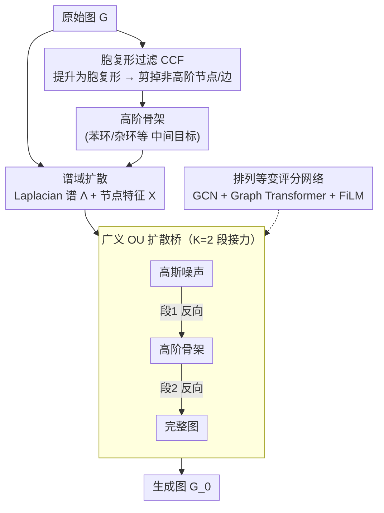

# HOG-Diff: Higher-Order Guided Diffusion for Graph Generation

**会议**: ICLR 2026  
**arXiv**: [2502.04308](https://arxiv.org/abs/2502.04308)  
**代码**: 无  
**领域**: 图像生成  
**关键词**: 图生成, 扩散模型, 高阶拓扑, 胞复形, 扩散桥  

## 一句话总结

本文提出 HOG-Diff，一个利用高阶拓扑结构（如环、三角形、motif）作为生成引导的图扩散框架，通过胞复形过滤（CCF）提取高阶骨架并结合广义 OU 扩散桥实现"由粗到细"的渐进式图生成，在分子和通用图生成的 8 个基准上取得了 SOTA 性能。

## 背景与动机

1. **现有图扩散模型忽略高阶拓扑**：当前主流图生成方法（如 GDSS、DiGress、DeFoG）直接在邻接矩阵或边级别操作，将图视为成对边的集合，完全忽略了三角形、环、团等高阶结构。然而这些结构在化学分子（如苯环、杂环）和生物网络中至关重要。

2. **中间状态退化为无结构噪声**：经典扩散模型的前向过程将数据逐步加噪至高斯分布，中间状态是无意义的噪声邻接矩阵，既不保留图的拓扑性质也无法提供有用的结构引导。

3. **分子生成中环系统的重要性**：已批准药物分子仅包含约几百种不同的环系统，远少于天文数字级的化学空间（$10^{23}$–$10^{60}$），这说明高阶拓扑结构是真实分子分布的核心约束。

4. **拓扑深度学习的成功启示**：TDL 研究已证明显式建模复杂拓扑结构（simplicial complex、cell complex）可提升图表示学习的表达力和稳定性，但尚未被引入生成模型。

5. **邻接矩阵域扩散的缺陷**：直接在邻接矩阵上注入高斯噪声面临排列歧义、稀疏性导致信号退化、以及可扩展性差等问题。谱域扩散提供了更稳健的替代方案。

6. **缺乏拓扑感知的质量评估**：现有评价指标（如 Validity、FCD）主要关注化学有效性和分布距离，很少评估生成图的拓扑保持能力。需要基于曲率过滤等 TDA 方法的评估。

## 方法详解

### 整体框架

HOG-Diff 要解决的是：现有图扩散把图当成一堆成对的边来加噪，中间状态退化成无意义的噪声邻接矩阵，环、三角形这类对分子至关重要的高阶结构既不被保留也无法引导生成。它的破局思路是把"一步生成整张图"改成"先勾勒高阶骨架、再补全细节"的由粗到细接力：先用胞复形过滤从原图里抠出由环、面构成的骨架，让它充当扩散过程的中间目标状态；再用一串扩散桥把"高斯噪声 → 高阶骨架 → 完整图"串成层次化生成。形式上，生成分布被分解为依次穿过 $K-1$ 个中间状态的条件概率链 $p(\bm{G}_0) = p(\bm{G}_0|\bm{G}_{\tau_1}) \cdot p(\bm{G}_{\tau_1}|\bm{G}_{\tau_2}) \cdots p(\bm{G}_{\tau_{K-1}}|\bm{G}_T)$，每段由一个独立的桥过程负责；论文默认 $K=2$，即"噪声→骨架→完整图"两段（coarse + fine）。整条流水线跑在 Laplacian 谱域上，由一个排列等变的评分网络驱动各段的反向去噪。

### 关键设计

**1. 胞复形过滤（CCF）：把高阶骨架显式抠出来当中间目标**

经典扩散的中间状态是无意义的噪声邻接矩阵，既不保留拓扑也无法引导生成。HOG-Diff 先把原始图 $\bm{G}$ 提升（lifting）为胞复形 $\mathcal{S}$——在图里的简单环上粘贴 2 维闭盘构造 2-cell，从而显式编码环、面这类高阶结构；随后定义 $p$-cell 过滤操作，只保留属于高阶 cell 的节点和边，得到高阶骨架 $\bm{G}_{[p]}$。这个骨架剥掉了零散的外围连边，只留下分子里苯环、杂环这类真正决定结构的核心，正好充当扩散过程的中间目标状态，让模型先把骨架画对、再填外围细节。CCF 直接做过滤而非枚举完整 lifting，避开了昂贵的组合爆炸；论文实际用 2-cell 过滤来抽取中间骨架。

**2. 广义 OU 扩散桥：每段接力都有闭式、免模拟的过渡**

把生成拆成 $K$ 段后，相邻中间状态之间需要一条"确定终点"的扩散路径。HOG-Diff 在每个时间窗口 $[\tau_{k-1}, \tau_k]$ 内用广义 Ornstein-Uhlenbeck（GOU）桥连接，过程由 SDE $\mathrm{d}\bm{G}_t = \theta_t(\bm{\mu} - \bm{G}_t)\mathrm{d}t + g_t\mathrm{d}\bm{W}_t$ 控制，再通过 Doob's $h$-transform 把漂移项的均值钉死在终端 $\bm{\mu} = \bm{G}_{\tau_k}$ 上。这样得到的桥有闭式转移概率 $p(\bm{G}_t|\bm{G}_{\tau_{k-1}}, \bm{G}_{\tau_k})$，训练时可以一步采样任意时刻状态、无需逐步模拟轨迹（simulation-free training）；终端方差为零保证每段都平滑落到预定义的中间骨架上。常见的布朗桥只是 $\theta_t \to 0$ 的特例，GOU 桥多出的均值回复项让过渡更可控。

**3. 谱域扩散：在 Laplacian 谱上加噪，绕开邻接矩阵的稀疏与排列歧义**

直接在邻接矩阵上注入高斯噪声会遇到排列歧义、稀疏信号退化、可扩展性差等问题。HOG-Diff 改在图 Laplacian $\bm{L} = \bm{D} - \bm{A}$ 的谱域上扩散：对 $\bm{L} = \bm{U}\bm{\Lambda}\bm{U}^\top$ 分解后，对特征值 $\bm{\Lambda}$ 和节点特征 $\bm{X}$ 分别建立扩散过程。Laplacian 谱本身排列不变，天然消解了节点重排带来的歧义；特征值扩散负责捕获全局拓扑，节点特征扩散负责局部属性，两路分工让全局结构和细节都得到建模。

**4. 排列等变的评分网络：局部聚合与全局交互双管齐下**

谱域扩散的每一段反向去噪都要预测节点与谱的 score function，这需要一个既排列等变又能兼顾局部与全局的网络。HOG-Diff 用 GCN 做局部邻域特征聚合、Graph Transformer 做全局信息交互，再通过 FiLM 层把扩散时间 $t$ 注入两路特征，最后分别用 MLP 输出节点与谱的分数。整个网络保持排列等变，与谱域扩散的排列不变性一致，避免了对节点顺序的依赖。

## 实验结果

### 分子生成（QM9、ZINC250k、MOSES、GuacaMol）

| 方法 | QM9 FCD↓ | QM9 NSPDK↓ | ZINC FCD↓ | ZINC NSPDK↓ | MOSES Val.↑ | GuacaMol FCD↑ |
|------|----------|------------|-----------|-------------|-------------|--------------|
| GDSS | 2.900 | 0.003 | 14.656 | 0.019 | — | — |
| DiGress | 0.360 | 0.0005 | 23.060 | 0.082 | 85.7 | 68.0 |
| Cometh | 0.248 | 0.0005 | — | — | 90.5 | 72.7 |
| DeFoG | 0.268 | 0.0005 | 2.030 | 0.002 | 92.8 | 73.8 |
| **HOG-Diff** | **0.172** | **0.0003** | **1.633** | **0.001** | **99.7** | **78.5** |

HOG-Diff 在 FCD 和 NSPDK 上大幅领先，表明生成分子的分布与真实分子在化学空间和图空间中都更接近。在大规模 MOSES 数据集上 Validity 达 99.7%，远超其他方法。

### 通用图生成 + 拓扑保持分析

| 方法 | Community-small Avg.↓ | Enzymes Avg.↓ | QM9 $\kappa_{FR}$↓ | ZINC $\kappa_{FR}$↓ |
|------|-----------------------|---------------|---------------------|---------------------|
| GDSS | 0.046 | 0.032 | 0.925 | 1.781 |
| DiGress | 0.038 | 0.030 | 0.251 | — |
| DeFoG | — | — | 0.177 | 0.728 |
| **HOG-Diff** | **0.010** | **0.027** | **0.077** | **0.190** |

在基于 Curvature Filtration 的拓扑评估中，HOG-Diff 在所有数据集上均取得最低距离分数，尤其在复杂分子数据集上优势显著（QM9 上 $\kappa_{FR}$ 比次优方法低 56%）。

### 消融实验：拓扑引导的重要性

| 引导类型 | QM9 Val.↑ | QM9 FCD↓ | QM9 NSPDK↓ |
|---------|-----------|----------|------------|
| Noise（经典扩散） | 91.52 | 0.829 | 0.0015 |
| Peripheral（外围结构） | 97.58 | 0.305 | 0.0009 |
| **Cell（高阶骨架）** | **98.74** | **0.172** | **0.0003** |

高阶骨架引导远优于噪声引导（经典扩散）和外围结构引导，验证了高阶拓扑作为生成信号的有效性。训练曲线也证实了 HOG-Diff 的收敛速度快于经典方法（与 Theorem 3 一致）。

## 亮点

- **首次将高阶拓扑作为图生成的显式引导信号**：不同于以往将拓扑视为后验评估指标，HOG-Diff 将其嵌入生成过程的核心
- **胞复形过滤的优雅设计**：CCF 操作避免了昂贵的完整 lifting 枚举，高效提取高阶骨架作为中间目标
- **理论与实践的统一**：证明了 HOG-Diff 在 score matching 收敛速度和重建误差界上严格优于经典扩散模型（Theorem 3 & 4），并通过实验验证
- **全面的评估体系**：覆盖 8 个基准、4 种分子数据集、引入 Curvature Filtration 作为拓扑保持指标

## 局限性

- CCF 依赖于 lifting 操作的质量，不同的 lifting 策略（2-cell vs simplicial complex）可能对不同数据集有不同效果，需要手动选择
- 在高阶结构较少的数据集（如 Ego-small）上优势不显著，说明方法的收益与数据本身的拓扑丰富度强相关
- 谱域扩散需要选择固定的特征向量基 $\hat{\bm{U}}_0$（从训练集中采样），这引入了额外的采样偏差
- 两阶段方法（$K=2$）增加了超参数（时间窗口划分 $\tau_k$、系数 $c_1, c_2$），调参负担较经典方法更重
- 尚未探索更高维（3-cell 及以上）拓扑引导的效果

## 相关工作对比

| 维度 | HOG-Diff | DiGress (Vignac et al. 2023) | DeFoG (Qin et al. 2025) |
|------|----------|------------------------------|------------------------|
| 扩散域 | 谱域（Laplacian 特征值） | 离散空间（categorical） | 流匹配 |
| 高阶拓扑 | 显式引导（CCF） | 无 | 无 |
| 中间状态 | 有意义的拓扑骨架 | 噪声 | 最优传输路径 |
| 桥过程 | GOU 桥（闭式） | 无 | 无 |
| 理论保证 | 收敛速度 + 误差界 | 无 | 无 |
| MOSES Val. | 99.7% | 85.7% | 92.8% |

| 维度 | HOG-Diff | GDSS (Jo et al. 2022) | MiCaM (Geng et al. 2023) |
|------|----------|----------------------|--------------------------|
| 生成范式 | 一次性（谱扩散） | 一次性（邻接矩阵扩散） | 自回归（motif 合并） |
| 高阶信息 | 生成引导 | 无 | 隐式（motif 词表） |
| 拓扑保持 | 优秀（$\kappa_{FR}$ 最低） | 差（$\kappa_{FR}$ 高） | 中等 |
| 可扩展性 | 大规模（MOSES/GuacaMol） | 中等 | 受限于 motif 词表 |
| 可解释性 | 可分析不同引导的影响 | 无 | 有限 |

## 评分

- ⭐⭐⭐⭐⭐ 创新性：首次系统化地将高阶拓扑引入图扩散框架，CCF + GOU 桥的组合设计优雅且有理论支撑
- ⭐⭐⭐⭐⭐ 实验充分度：8 个基准、全面的 baseline 对比、拓扑评估、消融实验和理论验证，覆盖全面
- ⭐⭐⭐⭐ 写作质量：整体结构清晰，数学推导严谨，但符号较多且 preliminaries 偏长
- ⭐⭐⭐⭐ 实用价值：对分子生成和药物发现有直接应用价值，拓扑引导思想可推广到更多场景

<!-- RELATED:START -->

## 相关论文

- [\[ICLR 2026\] PolyGraph Discrepancy: a classifier-based metric for graph generation](polygraph_discrepancy_a_classifier-based_metric_for_graph_generation.md)
- [\[CVPR 2026\] GrOCE: Graph-Guided Online Concept Erasure for Text-to-Image Diffusion Models](../../CVPR2026/image_generation/groce_graph-guided_online_concept_erasure_for_text-to-image_diffusion_models.md)
- [\[ICLR 2026\] GGBall: Graph Generative Model on Poincaré Ball](ggball_graph_generative_model_on_poincaré_ball.md)
- [\[CVPR 2026\] Semantic Derivative Flow: Graph-Guided Diffusion for Controllable Instance Interactions](../../CVPR2026/image_generation/semantic_derivative_flow_graph-guided_diffusion_for_controllable_instance_intera.md)
- [\[ICML 2026\] Esoteric Language Models: A Family of Any-Order Diffusion LLMs](../../ICML2026/image_generation/esoteric_language_models_a_family_of_any-order_diffusion_llms.md)

<!-- RELATED:END -->
