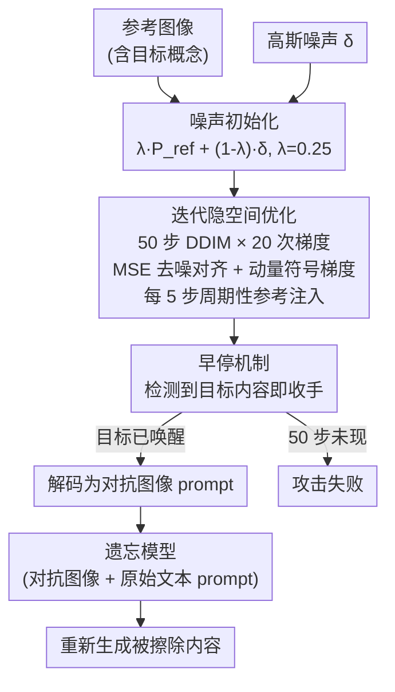

# Image Can Bring Your Memory Back: A Novel Multi-Modal Guided Attack against Image Generation Model Unlearning

**会议**: ICLR 2026  
**arXiv**: [2507.07139](https://arxiv.org/abs/2507.07139)  
**代码**: [GitHub](https://github.com/ryliu68/RECALL)  
**领域**: 扩散模型 / 遗忘 / 安全  
**关键词**: 机器遗忘攻击, 多模态对抗, 图像prompt, 扩散模型安全, 鲁棒性审计  

## 一句话总结

Recall 提出首个多模态引导的攻击框架，通过在隐空间中优化对抗图像 prompt（仅需一张参考图像），配合原始文本 prompt 利用扩散模型的 image-conditioning 通道，在 10 种 SOTA 遗忘方法上平均 ASR 达 65%~97%，显著超越纯文本攻击方法，揭示当前遗忘机制对图像模态攻击的脆弱性。

## 研究背景与动机

**领域现状**：扩散模型的机器遗忘（Machine Unlearning）已成为缓解有害/侵权内容生成的关键技术，ESD、UCE、AdvUnlearn 等十余种方法被提出。

**现有痛点**：现有攻击方法（P4D、UnlearnDiffAtk、CCE）仅扰动文本 prompt，存在四大问题：① 文本扰动破坏语义对齐；② 依赖外部分类器/原始模型增加开销；③ 对抗增强的遗忘方法（AdvUnlearn）效果急剧下降；④ 完全忽略扩散模型原生的多模态条件能力。

**核心矛盾**：遗忘方法主要针对文本模态设防，但 Stable Diffusion 天然支持 image+text 的多模态条件输入（如 img2img），这条通道几乎未被探索为攻击向量。

**本文目标** 利用图像模态攻击通道绕过遗忘防护，同时保持文本语义不变。

**切入角度**：不改动文本 prompt（保持语义），仅优化一个对抗图像 prompt 使遗忘模型重新生成被擦除内容。优化过程直接在遗忘模型内部隐空间进行，无需外部模型。

**核心 idea**：用参考图像引导的隐空间对抗优化生成对抗图像 prompt，通过多模态通道"唤醒"遗忘模型中残留的概念记忆。

## 方法详解

### 整体框架

Recall 想解决的问题是：遗忘后的扩散模型把"裸体""梵高画风"这类概念从文本通道里擦掉了，但它原生还留着 image-conditioning（img2img）通道，这条路几乎没人当成攻击面。Recall 的思路是不碰文本 prompt（保住语义），转而专门优化一张对抗**图像** prompt，让它沿着图像通道把残留的概念记忆"唤醒"回来。

整条 pipeline 分三步走：先把一张含目标概念的参考图像和一份噪声初始化图像一起编码进遗忘模型的隐空间；然后在隐空间里迭代优化对抗隐变量 $z_{adv}$，让它在去噪预测上向参考图像对齐；最后把优化好的隐变量解码成对抗图像，连同原始文本 prompt 一起喂回遗忘模型生成。整个优化全程在遗忘模型**内部**进行，不借助任何外部分类器或原始未遗忘模型。

### 关键设计

**1. 噪声初始化：先把采样空间撑开，再埋一颗概念种子**

如果直接拿参考图像当图像 prompt 去优化，生成结果往往只是参考图像的简单变换，既不多样、也不跟随文本 prompt。Recall 的做法是把初始图像 prompt 构造成参考信号和高斯噪声的线性混合：$P_{img}^{init} = \lambda \cdot P_{ref} + (1-\lambda) \cdot \delta$，其中 $\delta \sim \mathcal{N}(0, I)$，$\lambda = 0.25$。也就是只保留 25% 的参考信号、掺入 75% 的噪声——大量噪声把采样空间撑开、保证输出多样，少量参考信号则充当"概念种子"，给后续优化一个朝目标概念收敛的起点。

**2. 迭代隐空间优化：用参考图像的去噪预测当对齐目标，把残留记忆牵引出来**

这是攻击的核心。Recall 沿 50 步 DDIM 时间步推进，每一步对 $z_{adv}$ 做 20 次梯度迭代。优化目标是：在相同文本条件下，让对抗隐变量和参考隐变量经过 U-Net 的噪声预测尽量一致，即最小化二者的 MSE

$$\mathcal{L}_{adv} = \|\hat{\epsilon}_{ref,t} - \hat{\epsilon}_{adv,t}\|_2^2$$

这一步等于强迫遗忘模型在隐空间里"复现"出参考图像所代表的那个被擦除概念。梯度更新用带动量的符号梯度：$v_i = \beta \cdot v_{i-1} + \frac{\nabla_{z_{adv}} \mathcal{L}_{adv}}{\|\nabla_{z_{adv}} \mathcal{L}_{adv}\|_1 + \omega}$，再以 $z_{adv} \leftarrow z_{adv} + \eta \cdot \text{sign}(v_i)$ 更新，动量能稳定方向、跳出局部极小。为防止优化跑偏丢掉语义，每 5 步还会做一次周期性参考注入，把少量 $z_{ref}$（混合系数 $\gamma=0.05$）掺回 $z_{adv}$，持续把对抗隐变量拽回目标概念附近。

**3. 早停机制：目标内容一冒头就收手**

攻击不必非跑满 50 步。Recall 在优化过程中持续检测目标内容是否重新出现，一旦检测到就立即停止，省掉后续无谓的迭代——这也是它平均只需 ~64s 的原因之一。反过来，若 50 步全部走完仍未唤醒目标概念，则判定本次攻击失败。

### 损失函数 / 训练策略

唯一的优化目标就是上面的隐空间去噪对齐损失：

$$\mathcal{L}_{adv} = \|\hat{\epsilon}_{ref,t} - \hat{\epsilon}_{adv,t}\|_2^2$$

这套设计的三个开销优势直接来自它的结构：因为全程不修改文本 prompt，CLIP Score 天然最高、语义对齐最好；因为优化只在遗忘模型内部进行、不调用外部分类器，单次攻击只要 ~64s（对比 P4D 的 ~238s）；又因为只依赖单张参考图像（可直接从网络获取），无需批量参考数据或原始模型。

## 实验关键数据

### 主实验（Average ASR across 10 unlearning methods）

| 任务 | P4D-N | CCE | UnlearnDiffAtk | WACE-C | **Recall** |
|------|-------|-----|----------------|--------|------------|
| Nudity-I2P | 57.61 | 50.42 | 63.87 | 57.04 | **80.77** |
| Nudity-MMA | 69.51 | 55.70 | 76.52 | 66.25 | **88.20** |
| Van Gogh | 92.00 | 77.20 | 97.20 | 48.00 | **97.40** |
| Object-Church | 49.80 | 55.80 | 62.40 | 41.40 | **73.40** |
| Object-Parachute | 38.20 | 60.40 | 59.80 | 38.80 | **97.00** |

### 语义对齐（CLIP Score，I2P 任务）

| 方法 | ESD | MACE | RECE | UCE | Receler | DoCo |
|------|-----|------|------|-----|---------|------|
| P4D | 24.09 | 23.20 | 24.99 | 24.90 | 25.64 | 23.70 |
| UnlearnDiffAtk | 29.61 | 23.11 | 29.25 | 29.17 | 29.00 | 31.18 |
| **Recall** | **32.13** | **24.79** | **30.66** | **31.31** | **31.12** | **31.95** |

### 关键发现

- 对最强防御 AdvUnlearn 的攻击：Recall ASR 达 60.56%（I2P）、82.81%（MMA）、92%（Van Gogh），远超其他方法的个位数~25%
- 攻击效率：平均 ~64s，比 P4D-N（~238s）、UnlearnDiffAtk（~232s）快 3.5×
- 参考图像独立性：换用不同参考图像 ASR 和多样性指标稳定
- 跨模型泛化：SD 2.0、SD 2.1 上同样有效
- 多样性：生成图像的 LPIPS/IS 与纯文本方法相当，远优于仅图像方法

## 亮点与洞察

- **首次系统利用图像模态攻击遗忘**：揭示了当前遗忘方法的"模态盲区"——仅防文本不防图像
- **单参考图像 + 隐空间优化 = 轻量高效**：不需要原始模型、不需要外部分类器、不需要批量参考数据
- **攻击即审计**：Recall 同时是模型拥有者的鲁棒性审计工具，可在部署前系统评估遗忘质量
- **语义保持的对抗设计**：通过不修改文本 + 噪声初始化 + 参考注入三重机制，生成内容既恢复目标概念又与 prompt 语义高度一致

## 局限与展望

- 白盒攻击设定（需要模型权重），黑盒场景适用性待验证
- 对 MACE 在某些任务上 ASR 较低（如 Church 50%），可能与 MACE 的 LoRA 机制有关
- 仅评估了 SD 架构系列，未测试 Flux/DiT 等新架构
- 参考图像仍需包含目标概念（虽然要求宽松），完全零参考的场景不可用

## 相关工作与启发

- **vs P4D**：文本优化式攻击，语义对齐差（CLIP Score 低 6+ 分），对 AdvUnlearn 的 ASR 仅 2~8%
- **vs UnlearnDiffAtk**：同为白盒但仅优化文本，在 I2P 上 Avg. ASR 63.87% vs Recall 的 80.77%
- **vs CCE**：通过 textual inversion 学习 placeholder 恢复概念，但 CLIP Score 最低（~19），语义严重偏离
- **vs WACE**：基于噪声探测的方法，对强防御效果有限
- 启发：多模态攻击的思路可扩展到视频模型/大型多模态模型的安全审计

## 评分

- 新颖性: ⭐⭐⭐⭐⭐ 首个多模态遗忘攻击框架，开辟全新攻击面
- 实验充分度: ⭐⭐⭐⭐⭐ 10 种遗忘方法 × 4 类任务 × 6 数据集 × 多种基线，极其全面
- 写作质量: ⭐⭐⭐⭐ 问题阐述清晰，方法pipeline易懂
- 价值: ⭐⭐⭐⭐⭐ 对遗忘安全领域有重要警示意义，同时提供实用审计工具

<!-- RELATED:START -->

## 相关论文

- [\[ICLR 2026\] Follow-Your-Shape: Shape-Aware Image Editing via Trajectory-Guided Region Control](follow-your-shape_shape-aware_image_editing_via_trajectory-guided_region_control.md)
- [\[ICCV 2025\] PLA: Prompt Learning Attack against Text-to-Image Generative Models](../../ICCV2025/image_generation/pla_prompt_learning_attack_against_text-to-image_generative_models.md)
- [\[ICLR 2026\] There and Back Again: On the Relation between Noise and Image Inversions in Diffusion Models](there_and_back_again_on_the_relation_between_noise_and_image_inversions_in_diffu.md)
- [\[ICLR 2026\] Unified Multi-Modal Interactive & Reactive 3D Motion Generation via Rectified Flow](unified_multi-modal_interactive_reactive_3d_motion_generation_via_rectified_flow.md)
- [\[ICCV 2025\] Holistic Unlearning Benchmark: A Multi-Faceted Evaluation for Text-to-Image Diffusion Model Unlearning](../../ICCV2025/image_generation/holistic_unlearning_benchmark_a_multi-faceted_evaluation_for_text-to-image_diffu.md)

<!-- RELATED:END -->
