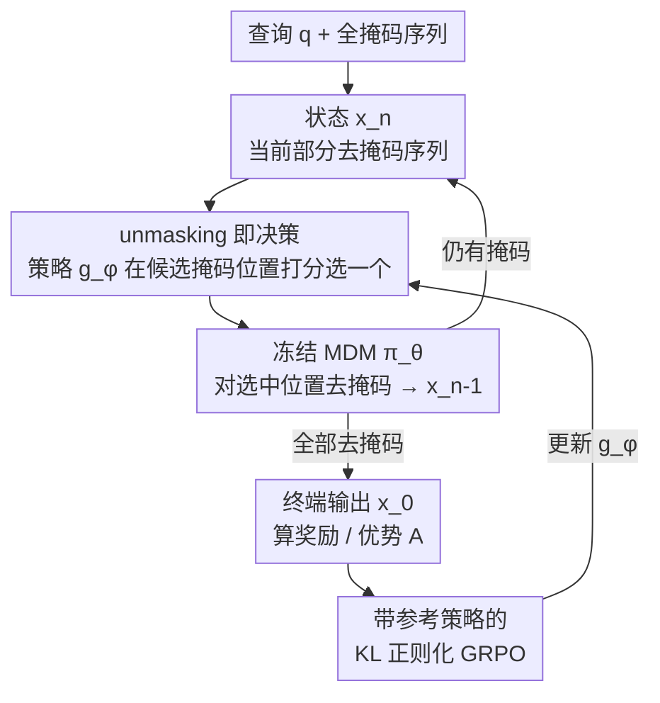

# Improving Discrete Diffusion Unmasking Policies Beyond Explicit Reference Policies (UPO)

**会议**: ICLR 2026  
**arXiv**: [2510.05725](https://arxiv.org/abs/2510.05725)  
**代码**: [GitHub](https://github.com/chunsanHong/UPO)  
**领域**: 离散扩散模型 / 语言建模  
**关键词**: Masked Diffusion Models, Unmasking Policy, reinforcement-learning, KL-正则化MDP, GRPO

## 一句话总结

提出 Unmasking Policy Optimization（UPO），将 Masked Diffusion Model 的去噪过程建模为 KL 正则化 MDP，通过强化学习训练轻量级的 unmasking 策略模型来替代 max-confidence 等启发式调度器，在理论和实验上均证明学习到的策略能生成更接近真实数据分布的样本。

## 研究背景与动机

Masked Diffusion Models（MDMs）通过迭代去掩码实现离散空间的生成，已在语言建模中展现与自回归模型竞争的能力（如 LLaDA、Dream-7B）。在推理阶段，选择**哪个位置先去掩码**对生成质量至关重要：

**理论动机**：Kim et al. (2025) 证明了多项式时间算法无法在所有掩码句子上精确恢复数据分布，存在"困难子问题"。但经验表明，max-confidence 策略可以绕过这些困难实例。

**现有方法的局限**：当前大规模 MDM（LLaDA、Dream-7B）依赖规则式调度器（max-confidence、max-margin、entropy），这些只是启发式的，没有理论最优性保证。通过 Pass@N 实验发现，当采样 N 条轨迹时，随机和 Top-5 策略都能超过 max-confidence 的单路径准确率，说明存在比 max-confidence 更好的 unmasking 路径。

**核心问题**：如何学习一个比启发式更优的 unmasking 策略，同时保持训练稳定性和理论保证？

## 方法详解

### 整体框架

UPO 要解决的是 MDM 推理时"先去掉哪个掩码位置"这件事——以往靠 max-confidence 等手写规则，没有最优性保证。它的思路是把整段去噪过程看成一个有限步的马尔可夫决策过程（MDP）：基础 MDM $\pi_\theta$ 全程冻结不动，旁边挂一个轻量级 unmasking 策略 $g_\phi$ 专门"选位置"。推理时两者交替循环——策略在当前序列的所有掩码位置里打分选一个，冻结的 MDM 负责把这个位置去掩码、转移到下一状态，直到序列全部生成；得到终端输出后用奖励算优势，再用带参考锚点的 KL 正则化 GRPO 反过来更新策略。策略网络仅约 134M 参数（不到 8B 基础模型的 2%），复用 MDM 中间特征，几乎不增加推理开销又不动原模型的语言能力。此外 UPO 还配了两条定理，从理论上保证这样学出来的顺序确实更优。

### 关键设计

**1. unmasking 即决策：把去噪顺序建成可学习的 MDP**

要让"先去哪个位置"可学习，先得把它形式化成一个可优化的对象。UPO 令状态为当前部分去掩码的序列 $\mathbf{x}_n$，动作空间是所有还被掩盖位置的索引集 $\mathcal{A}_{\mathbf{x}_n}$，策略 $g_\phi(a^i | \mathbf{x}_n)$ 用 softmax 在这些候选位置上打分选一个去掩码。选定位置后，环境如何转移完全交给冻结的 MDM 决定，于是单步动态可写成策略与 MDM 的乘积：

$$p_{g_\phi}(\mathbf{x}_{n-1} | \mathbf{x}_n) = g_\phi(a_n | \mathbf{x}_n) \cdot \pi_\theta(\mathbf{x}_{n-1} | \mathbf{x}_n, a_n)$$

策略网络本身只是一层 Transformer 加 3 层 MLP，挂在 MDM 特征之上，几乎不增加推理开销，却把"选位置"从规则启发式变成了端到端可训练的决策——这也是后面能用 RL 去超越 max-confidence 的前提。

**2. 带参考策略的 KL 正则化 GRPO：在超越启发式的同时不崩**

纯 RL 优化 unmasking 策略很容易在早期就坍塌到某条路径，于是 UPO 不从零学，而是引入一个本就很强的参考策略 $g_{\mathrm{ref}}$（如 max-confidence）作为锚点，优化带 KL 正则的输出级 GRPO 目标：

$$\max_\phi \mathbb{E}\left[\frac{p_{g_\phi}(\mathbf{x}_0|\mathbf{q})}{p_{g_{\phi_{\mathrm{old}}}}(\mathbf{x}_0|\mathbf{q})} A(\mathbf{q}, \mathbf{x}_0) - \beta D_{\mathrm{KL}}(p_{g_\phi} \| p_{g_{\mathrm{ref}}})\right]$$

其中 $A$ 是终端输出的优势，$\beta D_{\mathrm{KL}}$ 把 $g_\phi$ 约束在 $g_{\mathrm{ref}}$ 附近，相当于一个信任域：既给了优化一个好的起点和稳定边界，又留出空间让策略往比启发式更优的方向走。消融里去掉这一项就会"早期路径坍塌"、掉 2-3 个点，印证了锚点的必要性。

**3. 双重理论保证：学到的策略不只是"不更差"，而是更接近真实分布**

UPO 的两条定理回答了"为什么这样优化值得做"。Theorem 1 给出收敛性：在迭代优化下策略的期望奖励收敛到一个严格高于参考策略的不动点 $r_{g^*} > r_{g_{\mathrm{ref}}}$；Theorem 2 给出分布层面更强的结论：优化后策略生成的终端分布与真实数据分布的 KL 散度严格小于参考策略，即

$$D_{\mathrm{KL}}(p_{\mathrm{data}} \| p_{g_{\phi^*}}) < D_{\mathrm{KL}}(p_{\mathrm{data}} \| p_{g_{\mathrm{ref}}})$$

也就是说，学到的 unmasking 顺序不仅奖励更高，采出的样本本身也更贴近数据分布，这正是 UPO 区别于纯靠奖励刷分方法的关键。

### 损失函数 / 训练策略

输出级目标里的 $p_{g_\phi}(\mathbf{x}_0|\mathbf{q})$ 需要边缘化所有可能轨迹，实际无法直接计算。UPO 通过 Proposition 1 证明 token 级代理损失与输出级损失的梯度近似相等，从而把训练落到可操作的、带 clipping 的 token 级 GRPO 上：

$$\mathcal{L}_{\mathrm{UPO}} = \frac{1}{G}\sum_g \left(\frac{1}{L}\sum_n \min\left(\frac{g_\phi(a_n^{(g)}|\mathbf{x}_n^{(g)})}{g_{\phi_{\mathrm{old}}}(a_n^{(g)}|\mathbf{x}_n^{(g)})} A_g, \mathrm{clip}(\cdot, 1-\epsilon, 1+\epsilon) A_g\right) - \beta D(p_{g_\phi} \| p_{g_{\mathrm{ref}}})\right)$$

实现上提供三种参考策略：max-confidence（配 CE 正则）、softmax-confidence（配 KL 正则）、Top-K（配 KL 正则），其中 Top-K 变体甚至支持随机初始化、无需预训练即可启动。

## 实验关键数据

### 主实验

| 数据集 | 指标 | UPO | Max-Confidence | Random | 提升(vs conf) |
|--------|------|-----|----------------|--------|------|
| Sudoku | Accuracy | **0.817** | 0.705 | 0.616 | +11.2% |
| Zebra | Accuracy | **0.362** | 0.337 | 0.339 | +2.5% |
| GSM8K | Accuracy | **0.703** | 0.684 | 0.612 | +1.9% |
| Math500 | Accuracy | **0.284** | 0.272 | 0.196 | +1.2% |

### 消融实验

| 配置 | GSM8K Acc | 说明 |
|------|-----------|------|
| diffu-GRPO + Random | 0.638 | 基线 MDM 后训练 |
| diffu-GRPO + Max-Confidence | 0.751 | 启发式调度 |
| diffu-GRPO + **UPO** | **0.764** | 在后训练 MDM 上再加 UPO，+1.3% |
| KL 正则（Top-K, GSM8K） | 0.703 | 有 KL 散度项 |
| 无 KL 正则（GSM8K） | ~0.68 | 性能下降，早期路径坍塌 |
| 随机初始化无正则（≈DColT） | ~0.67 | 比有参考策略差 2-3% |

### 关键发现

- Sudoku 等结构化任务中 unmasking 顺序极为关键，UPO 增益最大（+20.1% vs random）
- 正则化项防止早期路径坍塌，保持更大的 group reward 方差
- UPO 与 diffu-GRPO 是互补的——前者优化调度策略，后者优化 MDM 本身
- 最优参考策略因任务而异：Sudoku 用 max-confidence，GSM8K 用 Top-K

## 亮点与洞察

- 将 unmasking 策略学习与 MDM 训练解耦，策略模型仅 134M 参数（MDM 8B 的 1.7%），训练成本极低
- 提供了从理论到实践的完整链路：理论保证（Theorem 1&2）→ 代理损失（Proposition 1）→ 可操作训练目标
- Pass@N 实验直观展示了启发式策略的次优性，为学习策略提供了强动机
- KL 正则化的信任域设计既保证了训练稳定性又允许超越参考策略

## 局限与展望

- 在 GSM8K/Math500 等数学推理任务上增益相对有限，可能因为长文本中的顺序信号不如 Sudoku 明显
- 策略模型需要复用 MDM 的中间特征，对 MDM 架构有一定耦合
- 目前每步仅去掩码一个位置，扩展到多位置并行去掩码是重要方向
- 泛化性实验不足——训练集与测试集来自同一任务分布

## 相关工作与启发

- 与 DColT（Huang et al., 2025）对比：UPO 引入显式参考策略和 KL 正则化，更稳定且效果更好
- diffu-GRPO 通过 RL 后训练 MDM 本身，UPO 训练调度策略，两者互补
- 这一思路可推广到连续扩散模型的采样调度策略学习（如 ODE 求解器步长选择）

## 评分

- 新颖性: ⭐⭐⭐⭐⭐ 首次将 MDM 的 unmasking 建模为 KL 正则化 MDP 并提供完整理论保证
- 实验充分度: ⭐⭐⭐⭐ 4 个 benchmark 覆盖逻辑与数学推理，消融充分，但缺少开放文本生成评测
- 写作质量: ⭐⭐⭐⭐⭐ 理论推导严谨，实验设计清晰，动机阐述有力
- 价值: ⭐⭐⭐⭐ 为离散扩散模型推理提供了新范式，实际改进在结构化任务上显著

<!-- RELATED:START -->

## 相关论文

- [\[ICLR 2026\] Compose Your Policies! Improving Diffusion-based or Flow-based Robot Policies via Test-time Distribution-level Composition](compose_your_policies_improving_diffusion-based_or_flow-based_robot_policies_via.md)
- [\[ICML 2026\] Recovering Hidden Reward in Diffusion-Based Policies](../../ICML2026/image_generation/recovering_hidden_reward_in_diffusion-based_policies.md)
- [\[AAAI 2026\] PADiff: Predictive and Adaptive Diffusion Policies for Ad Hoc Teamwork](../../AAAI2026/image_generation/padiff_predictive_and_adaptive_diffusion_policies_for_ad_hoc_teamwork.md)
- [\[ICLR 2026\] Routing Matters in MoE: Scaling Diffusion Transformers with Explicit Routing Guidance](routing_matters_in_moe_scaling_diffusion_transformers_with_explicit_routing_guid.md)
- [\[ICLR 2026\] Discrete Adjoint Matching](discrete_adjoint_matching.md)

<!-- RELATED:END -->
