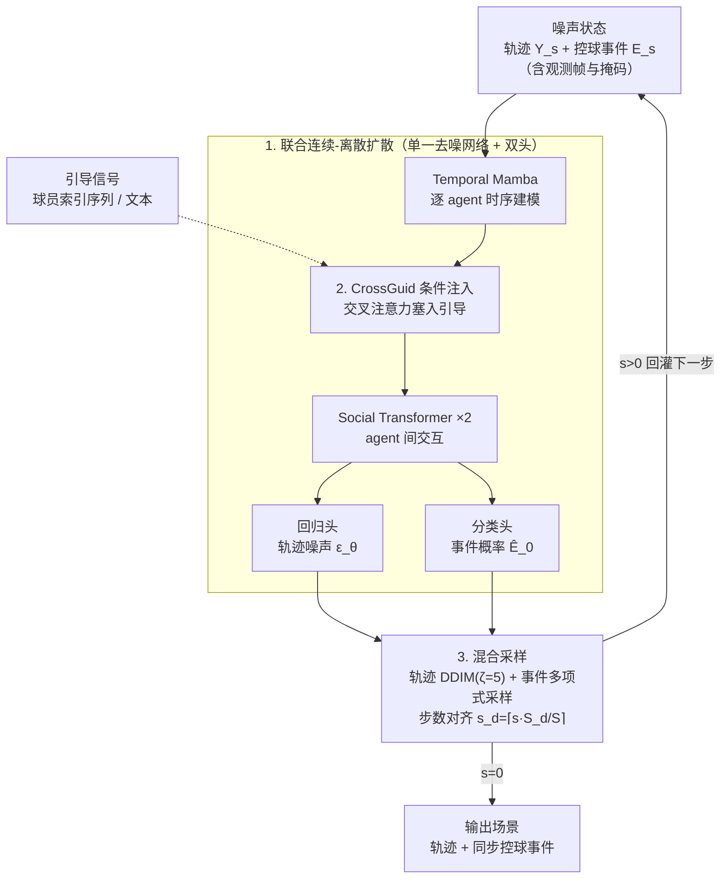

# JointDiff: Bridging Continuous and Discrete in Multi-Agent Trajectory Generation

**会议**: ICLR 2026  
**arXiv**: [2509.22522](https://arxiv.org/abs/2509.22522)  
**代码**: [GitHub](https://github.com/kognia/JointDiff)（项目页面提及）  
**领域**: 扩散模型 / 多智能体轨迹生成  
**关键词**: 联合扩散, 连续-离散统一, 多智能体, 轨迹生成, 可控生成

## 一句话总结

提出 JointDiff，一个联合连续-离散扩散框架，首次将高斯扩散（用于轨迹）和多项式扩散（用于控球事件）统一建模，同时引入 CrossGuid 模块支持弱控球引导和文本引导的语义可控生成，在体育多智能体轨迹生成上达到 SOTA。

## 研究背景与动机

多智能体系统（如团队运动）中，连续的运动轨迹与离散的状态改变事件（如传球、控球）紧密耦合且同步发生。现有生成模型面临以下问题：

**连续与离散割裂**：大多数方法仅建模连续轨迹，忽略离散事件（如控球），导致生成不现实的行为（如不合理的传球路径、球员-球交互失真）。

**缺乏语义可控性**：现有轨迹扩散模型主要控制个体级别属性（路径点、速度），缺乏对场景级别语义（如"谁控球""比赛走势"）的控制能力。

**评估指标不完善**：从行人轨迹预测继承的个体级 ADE/FDE 指标无法捕捉场景级的一致性，对体育场景评估不充分。

核心洞察：只有联合建模连续轨迹和离散事件，才能生成真实、一致且可控的多智能体场景。

## 方法详解

### 整体框架

JointDiff 要解决的是体育多智能体场景的生成：球员的连续运动轨迹和离散的控球事件本应同步发生、互相牵制，但现有扩散模型只生成轨迹、把事件丢在一边。它的做法是把场景状态打包成一个元组 $\mathbf{X} = (\mathbf{Y}, \mathbf{E})$ 一起去噪——$\mathbf{Y} \in \mathbb{R}^{T \times N \times 2}$ 是连续轨迹坐标，$\mathbf{E} \in \{0,1\}^{T \times N}$ 是离散控球事件（one-hot）。正向过程两模态独立加噪：轨迹走高斯扩散，事件走多项式扩散（逐渐融向均匀分布）。反向过程是关键——同一个去噪网络（沿用 U2Diff 的两层 Social-Temporal Block，每层内是 Temporal Mamba 建模单 agent 时序、Social Transformer 建模 agent 间交互）吃进完整噪声状态，末端分出回归头和分类头，分别吐出轨迹噪声和事件概率，从而在共享表征里学到跨模态依赖。要做可控生成时，再往 Block 内部插一个 CrossGuid 模块注入引导信号；推理时两模态用各自的采样器、再把时间步对齐。

### 关键设计

**1. 联合连续-离散扩散：让轨迹和控球事件在同一个反向网络里互相校正**

正向过程把两个模态独立加噪，但共享同一套方差调度 $\{\beta_s\}$：轨迹走标准高斯扩散 $q(\mathbf{Y}_s | \mathbf{Y}_0) = \mathcal{N}(\mathbf{Y}_s; \sqrt{\bar{\alpha}_s} \mathbf{Y}_0, (1-\bar{\alpha}_s)\mathbf{I})$，离散事件走多项式扩散逐渐融向均匀分布 $q(\mathbf{E}_s | \mathbf{E}_0) = \mathrm{Cat}(\mathbf{E}_s; \bar{\alpha}_s \mathbf{E}_0 + (1-\bar{\alpha}_s)/N)$。关键在反向：单一网络 $p_\theta$ 以完整状态 $(\mathbf{Y}_s, \mathbf{E}_s)$ 为条件，分出两个头——回归头预测轨迹噪声 $\epsilon_\theta$，分类头预测原始事件概率 $\hat{\mathbf{E}}_0$。即使正向加噪是解耦的，反向去噪也被迫从对方模态里读信息，从而学到"谁控球决定了谁该往哪跑"这类跨模态依赖。这里特意选多项式扩散而非吸收态扩散（absorbing state）：多项式允许离散变量在整个去噪过程中反复修正，而吸收态一旦解掩码就冻结、无法回头纠错，对时序场景里事件随轨迹演化的情况明显吃亏。

**2. CrossGuid 条件注入：用一个轻量交叉注意力把语义引导塞进时空骨干**

该模块嵌在 Social-Temporal Block 内部、Temporal Mamba 与 Social Transformer 之间注入外部信号，提供两种粒度。弱控球引导（WPG）只需输入一个球员索引序列 $[n_1, n_2, ..., n_L]$，经可学习 agent embedding 编码后充当 K/V，球的中间表示作为 Q 做多头注意力，仅更新球的轨迹表示，并给每个球员叠加 agent embedding 以保留社交推理能力——门槛极低却能直接左右比赛走势。文本引导则用冻结的 T5-Base 编码自然语言描述，投影后对所有 agent 做 MHA，每个 agent 在 Query 端加 agent embedding 以彼此区分，从而响应"谁控球""比赛走势"这类场景级语义。

**3. 混合采样：连续模态加速、离散模态稳采，再对齐步数**

推理时两模态用不同采样器：连续轨迹走 DDIM 加速（跳步间隔 $\zeta=5$），离散事件用标准随机采样器保证类别一致性。两者步数不同（连续 $S=50$、离散 $S^d=10$），通过 $s^d = \lceil s \cdot S^d / S \rceil$ 把离散时间步对齐到连续时间轴上，确保去噪全程两模态状态同步。

### 损失函数 / 训练策略

联合训练目标为简化连续损失与精确变分离散损失的加权和：

$$\mathcal{L}_{\mathrm{joint}} = \mathcal{L}_{\mathrm{simple}}^{\mathbf{Y}} + \lambda \mathcal{L}_{\mathrm{vb}}^{\mathbf{E}}$$

其中 $\lambda = 0.1$ 以平衡两模态贡献。使用 importance sampling 而非均匀采样时间步。对于可控生成，训练时以 25% 概率丢弃条件信号进行 Classifier-Free Guidance 训练。

## 实验关键数据

### 主实验：未来轨迹生成（min / avg, 20 modes）

| 数据集 | 指标 | JointDiff | U2Diff (之前SOTA) | 提升 |
|--------|------|-----------|----------|------|
| NFL | SADE↓ | **2.36/3.40** | 2.59/3.74 | -0.23/-0.34 |
| NFL | SFDE↓ | **5.53/8.40** | 5.97/9.02 | -0.44/-0.62 |
| Bundesliga | SADE↓ | **2.47/3.66** | 2.69/4.21 | -0.22/-0.55 |
| NBA | SADE↓ | **1.39/2.01** | 1.48/2.12 | -0.09/-0.11 |
| NBA | SFDE↓ | **2.53/3.95** | 2.68/4.14 | -0.15/-0.19 |

### 消融实验：联合建模的效果（可控生成任务）

| 配置 | NFL SADE↓ | NFL Acc↑ | Bundesliga SADE↓ | Bundesliga Acc↑ |
|------|-----------|----------|------------------|-----------------|
| w/o joint + w/o $\mathcal{G}$ | 2.42/3.57 | .76/.52 | 2.60/3.99 | .67/.44 |
| w/o joint + w $\mathcal{G}_{\text{WPG}}$ | 2.37/3.49 | .80/.59 | 2.20/3.07 | .73/.50 |
| JointDiff + w/o $\mathcal{G}$ | 2.36/3.40 | .78/.54 | 2.47/3.66 | .68/.39 |
| **JointDiff + w $\mathcal{G}_{\text{text}}$** | **2.19/3.09** | **.86/.74** | **2.08/2.72** | **.80/.59** |

### 关键发现

- 联合建模（JointDiff）在可控和非可控任务上均优于仅建模连续轨迹的变体
- 文本引导 > 弱控球引导 > 无引导，精细化引导带来更大提升
- 多项式扩散的一致性（事件与轨迹的匹配度）显著优于吸收态扩散（如 Bundesliga avg Acc: 0.80 vs 0.70）
- 人类评价中 JointDiff 以 80% 胜率优于 MoFlow，且 24% 的用例与真实轨迹平手
- 即使在 IID 采样条件下，JointDiff 在 min 指标上也能与 non-IID 方法竞争

## 亮点与洞察

- 首次将联合连续-离散扩散应用于时序动态系统，填补了此前仅限于静态任务（布局设计、CAD）的空白
- CrossGuid 的 WPG 模式设计精巧——只需提供一个球员列表即可控制比赛走势，低门槛高语义
- 多项式扩散 vs 吸收态扩散的对比分析具有广泛参考价值，表明持续修正机制在时序建模中优于一次性决定
- 提供了统一的体育 benchmark（包含文本描述的 NFL + Bundesliga），有利于社区后续工作

## 局限与展望

- 假设每个时间步都存在控球事件（稠密事件模式），扩展到稀疏事件（如犯规、射门）是未来方向
- 当前仅在体育场景验证，更广泛的多智能体系统（自动驾驶、机器人协作）需进一步适配
- 离散事件类别仅限于控球（N 类），扩展到多种事件类型的层次化离散空间还需探索
- 文本引导依赖 T5 编码器，对非英语描述或复杂战术语言的理解能力受限

## 相关工作与启发

- U2Diff 是主要的连续轨迹基线，JointDiff 在其 Social-Temporal Block 架构上扩展了联合建模能力
- Levi et al. (2023) 和 Li et al. (2025) 在静态布局/视觉-语言中使用联合扩散，JointDiff 将其推广到动态时序场景
- CrossGuid 的设计可借鉴到其他需要在结构化多智能体 embedding 中注入条件的任务

## 评分

- 新颖性: ⭐⭐⭐⭐⭐ 首次联合连续-离散扩散用于动态多智能体系统，WPG 任务定义新颖
- 实验充分度: ⭐⭐⭐⭐ 三个数据集 + 多任务 + 人类评价 + 一致性分析，全面充分
- 写作质量: ⭐⭐⭐⭐ 方法表述清晰，数学推导完整，图表直观
- 价值: ⭐⭐⭐⭐ 对多智能体生成和体育分析领域有重要贡献，联合扩散思路可推广

<!-- RELATED:START -->

## 相关论文

- [\[CVPR 2025\] Unified Uncertainty-Aware Diffusion for Multi-Agent Trajectory Modeling](../../CVPR2025/image_generation/unified_uncertainty-aware_diffusion_for_multi-agent_trajectory_modeling.md)
- [\[ICLR 2026\] Bridging Degradation Discrimination and Generation for Universal Image Restoration](bridging_degradation_discrimination_and_generation_for_universal_image_restorati.md)
- [\[ICLR 2026\] Discrete Adjoint Matching](discrete_adjoint_matching.md)
- [\[CVPR 2025\] coDrawAgents: A Multi-Agent Dialogue Framework for Compositional Image Generation](../../CVPR2025/image_generation/codrawagents_a_multi-agent_dialogue_framework_for_compositional_image_generation.md)
- [\[ICLR 2026\] Loopholing Discrete Diffusion: Deterministic Bypass of the Sampling Wall](loopholing_discrete_diffusion_deterministic_bypass_of_the_sampling_wall.md)

<!-- RELATED:END -->
