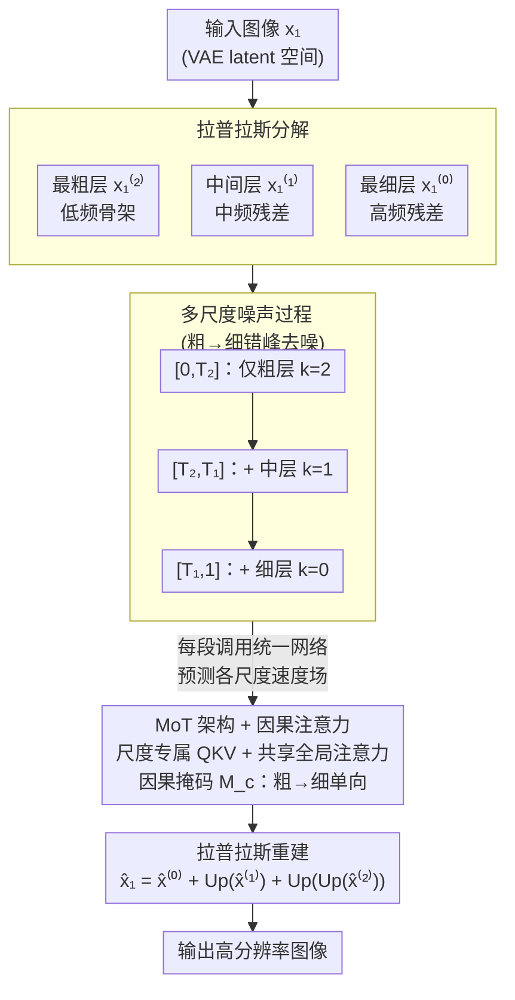

# Laplacian Multi-scale Flow Matching for Generative Modeling

**会议**: ICLR 2026  
**arXiv**: [2602.19461](https://arxiv.org/abs/2602.19461)  
**代码**: [GitHub](https://github.com/sjtuytc/gen)  
**领域**: 扩散模型 / Flow Matching  
**关键词**: 多尺度生成, Laplacian金字塔, Flow Matching, Mixture-of-Transformers, 因果注意力

## 一句话总结
提出 LapFlow，将图像分解为拉普拉斯金字塔残差，通过混合 Transformer（MoT）架构和因果注意力并行建模不同尺度，在减少计算量的同时提升生成质量。

## 研究背景与动机
- 扩散模型和 Flow Matching 在图像合成中取得SOTA，但随着分辨率增加，可扩展性成为关键挑战
- 现有多尺度方法（Cascaded Diffusion、EdifyImage、Pyramidal Flow）各有局限：需要训练多个独立网络，或在像素空间操作导致推理慢，或从零训练效果不佳
- 需要一种既能提升生成质量又能加速采样、可扩展到高分辨率的多尺度框架

## 方法详解

### 整体框架
LapFlow 要解决的是高分辨率生成太贵的问题：传统 Flow Matching 在整张高分辨率画布上同时建模所有频率，算力随分辨率暴涨。它的做法是先把一张图像拆成拉普拉斯金字塔的三层残差（低频骨架 / 中频 / 高频），让一个统一的混合 Transformer（MoT）同时建模这三层；生成时按从粗到细的顺序渐进去噪，最粗层先成形，再以它为条件补出更细的高频细节，最后用拉普拉斯重建把三层残差合回原图。整套流程都在 VAE 的 latent 空间里完成，所有尺度共用一个网络，从而既省算力又能扩展到 1024×1024。

### 关键设计

**1. 拉普拉斯分解：把不同频率成分拆到不同尺度上分别建模**

高分辨率生成之所以贵，是因为模型要在同一张高分辨率画布上同时管低频结构和高频细节。LapFlow 借鉴拉普拉斯金字塔，把图像 $\mathbf{x}_1$ 拆成三层互补残差：最粗层 $\mathbf{x}_1^{(2)} = \text{Down}(\text{Down}(\mathbf{x}_1))$ 是两次下采样后的低频骨架，中间层 $\mathbf{x}_1^{(1)} = \text{Down}(\mathbf{x}_1) - \text{Up}(\mathbf{x}_1^{(2)})$ 和最细层 $\mathbf{x}_1^{(0)} = \mathbf{x}_1 - \text{Up}(\text{Down}(\mathbf{x}_1))$ 则分别承载中频和高频的残差信号。三层可无损重建出原图 $\mathbf{x}_1 = \mathbf{x}_1^{(0)} + \text{Up}(\mathbf{x}_1^{(1)}) + \text{Up}(\text{Up}(\mathbf{x}_1^{(2)}))$。这样每层只负责一个频段，粗层分辨率低、token 少、算得快，高频细节则被隔离到更小的残差上，整体把计算压力按频率分摊开。

**2. 多尺度噪声过程：让粗层先收敛、细层后跟进**

如果三层都在完整时间区间训练，等于回到了单尺度的高成本。LapFlow 给每层错开去噪的时间窗：用两个关键时间点 $T_1, T_2$（$0 < T_2 < T_1 < 1$），最小尺度 $k=2$ 在整个 $[0,1]$ 上训练，中间尺度 $k=1$ 只在 $[T_2,1]$ 训练，最大尺度 $k=0$ 只在 $[T_1,1]$ 训练。每层各自做噪声插值 $\mathbf{x}_t^{(k)} = \alpha_t^{(k)} \mathbf{x}_1^{(k)} + \sigma_t^{(k)} \mathbf{x}_0^{(k)}$，且系数设计成在起始时刻 $t=T_{k+1}$ 时 $\alpha=0$、该层恰好是纯噪声，到 $t=1$ 时收敛为干净残差。这意味着采样早期只有最粗层在被去噪、最便宜，等结构稳定后中层、细层才依次加入（对应图中三段时间窗），把昂贵的高频计算推迟到必要的后段，天然实现了从结构到细节的渐进生成。

**3. MoT 架构与因果注意力：一个网络兼顾尺度差异与跨尺度单向协同**

既要每层有各自的处理能力，又不想为每层单养一个网络。LapFlow 用混合 Transformer：把各尺度的 latent patchify 成 token 后送入 $N$ 个 MoT block，块内 QKV 投影和前后的调制（PreAttnMod / PostAttnMod）都是尺度特定的（每层一套权重 $W_Q^{(k)}, W_K^{(k)}, W_V^{(k)}$，相当于专家），但把所有尺度的 QKV 拼起来做一次**共享的全局自注意力**，让三层在同一注意力里交换信息。关键是给这次全局注意力加了块因果掩码 $M_c$：

$$\text{MaskedGlobalAttn}(Q,K,V) = \text{Softmax}\left(\frac{QK^\top}{\sqrt{d}} + M_c\right)V$$

约束尺度 $k$ 只能关注 $k' \geq k$ 的更粗尺度，于是信息只能从低分辨率单向流向高分辨率——细层能看到粗层已定的结构，粗层却不被尚未确定的细节干扰。消融显示去掉掩码或退化为纯自注意力都会掉点，说明这条单向信息流是质量的关键。

### 损失函数 / 训练策略
训练目标是多尺度条件 Flow Matching 损失，把各层的速度场回归误差按权重 $w_k$ 加起来：
$$\mathcal{L}_{mv} = \sum_{k=2}^{s} w_k \mathbb{E}_{t,q,p_t} \|\mathbf{v}_t^{(k)} - \mathbf{u}_t^{(k)}(\mathbf{x}_t^{(k)}|\mathbf{x}_1^{(k)})\|^2$$
配合渐进式训练：在采样阶段 $s$ 只训练所有 $k \geq s$ 的尺度，与上面的错峰时间窗对齐，保证每个阶段只优化当前该负责的频段。

## 实验关键数据

### 主实验

| 方法 | 数据集 | 分辨率 | FID↓ | GFLOPs | 推理时间(s) |
|------|--------|--------|------|--------|-------------|
| LFM | CelebA-HQ | 256 | 5.26 | 22.1 | 1.70 |
| Pyramidal Flow | CelebA-HQ | 256 | 11.20 | 14.2 | 1.85 |
| **LapFlow (Ours)** | CelebA-HQ | **256** | **3.53** | **16.5** | **1.51** |
| LFM | CelebA-HQ | 512 | 6.35 | 43.5 | 2.90 |
| **LapFlow (Ours)** | CelebA-HQ | **512** | **4.04** | **41.7** | **2.60** |
| LFM | CelebA-HQ | 1024 | 8.12 | 154.8 | 4.20 |
| **LapFlow (Ours)** | CelebA-HQ | **1024** | **5.51** | **148.2** | **3.30** |

### 消融实验

| 配置 | FID (256×256) | GFLOPs | 说明 |
|------|--------------|--------|------|
| Separate Model | 3.60 | 38.9 | 各尺度独立模型 |
| **MoT (默认)** | **3.53** | **16.5** | 共享参数+专家 |
| SDVAE | 4.37 | - | 标准 VAE |
| **EQVAE (默认)** | **3.53** | - | 等变 VAE |

### 关键发现
- LapFlow 在 CelebA-HQ 256 上 FID=3.53，远优于 LFM 的 5.26
- MoT 设计将 GFLOPs 从 38.9 降至 16.5，同时 FID 还略有提升
- 因果掩码至关重要：无掩码或仅自注意力均导致性能下降
- 有效扩展到 1024×1024 高分辨率，保持较低计算开销

## 亮点与洞察
- 利用拉普拉斯金字塔天然的多尺度特性，将不同频率成分分开建模
- MoT 架构巧妙结合尺度特定处理和全局共享注意力，实现参数高效计算
- 因果注意力强制了自然的信息流：从结构到细节的层次化生成
- 时间加权复杂度分析证明了渐进式多尺度设计的注意力成本理论上低于 DiT

## 局限与展望
- 目前仅在 CelebA-HQ 和 ImageNet 上验证，缺少文本引导生成的评估
- 拉普拉斯分解在 latent space 中的适用性可能不如像素空间直观
- 关键时间点 $T_1, T_2$ 需手动设定
- 未与最新的 text-to-image 大模型比较

## 相关工作与启发
- 多尺度思想从 LapGAN 开始，经 Cascaded Diffusion、Pyramidal Flow 发展，LapFlow 通过消除显式桥接机制实现并行
- MoT 思想源自 Mixture-of-Experts，首次应用于多尺度视觉生成
- 为高分辨率视觉生成提供了更高效的替代方案

## 技术细节补充
- 3 个尺度的拉普拉斯分解在 latent space 中操作（VAE 下采样因子 8），最大潜在尺寸 32×32
- 训练：CelebA-HQ 使用 DiT-L/2，ImageNet 支持 DiT-B/2 和 DiT-XL/2
- 采样使用 Dormand-Prince 方法（dopri5）ODE solver
- GVP 路径通常优于线性路径（消融中验证）
- 支持 classifier-free guidance，ImageNet 上使用 CFG
- 时间加权复杂度分析证明有效注意力成本低于 DiT
- EQVAE 对 LapFlow 有益但对 LFM 无益（Table 2a），说明多尺度框架更能利用高质量 VAE
- ImageNet 256 上 LapFlow 超越单尺度和多尺度基线，同时 GFLOPs 更低
- 支持 ImageNet 类条件生成和 CelebA-HQ 无条件生成

## 评分
- 新颖性: ⭐⭐⭐⭐ 拉普拉斯金字塔+MoT+因果注意力的组合有创意
- 实验充分度: ⭐⭐⭐⭐ 在两个数据集上全面评估和消融，但缺少 T2I 实验
- 写作质量: ⭐⭐⭐⭐ 结构清晰，算法描述完善
- 价值: ⭐⭐⭐⭐ 在效率和质量之间取得良好平衡，对多尺度生成有指导意义

<!-- RELATED:START -->

## 相关论文

- [\[ICLR 2026\] GenCP: Towards Generative Modeling Paradigm of Coupled Physics](gencp_towards_generative_modeling_paradigm_of_coupled_physics.md)
- [\[ICLR 2026\] SenseFlow: Scaling Distribution Matching for Flow-based Text-to-Image Distillation](senseflow_scaling_distribution_matching_for_flow-based_text-to-image_distillatio.md)
- [\[ICLR 2026\] DenseGRPO: From Sparse to Dense Reward for Flow Matching Model Alignment](densegrpo_from_sparse_to_dense_reward_for_flow_matching_model_alignment.md)
- [\[ICLR 2026\] Flow Matching with Injected Noise for Offline-to-Online Reinforcement Learning](flow_matching_with_injected_noise_for_offline-to-online_reinforcement_learning.md)
- [\[ICLR 2026\] MVAR: Visual Autoregressive Modeling with Scale and Spatial Markovian Conditioning](mvar_visual_autoregressive_modeling_with_scale_and_spatial_markovian_conditionin.md)

<!-- RELATED:END -->
