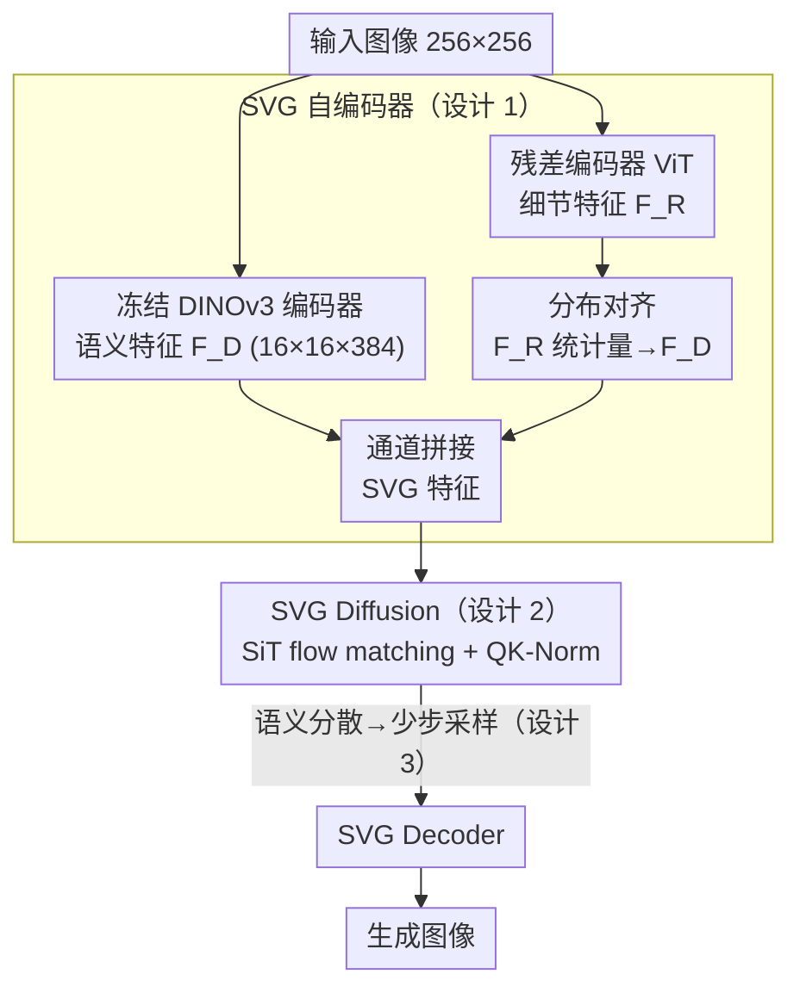

# Latent Diffusion Model without Variational Autoencoder

**会议**: ICLR 2026  
**arXiv**: [2510.15301](https://arxiv.org/abs/2510.15301)  
**代码**: [GitHub](https://github.com/shiml20/SVG)  
**领域**: 扩散模型 / 视觉表征  
**关键词**: 自监督表征, DINOv3, 无VAE潜在扩散, 统一特征空间, 少步生成

## 一句话总结
提出 SVG，用冻结的 DINOv3 自监督特征替代 VAE 潜在空间构建扩散模型，通过轻量残差编码器补充细粒度细节，实现更快训练、更高效推理和跨任务通用的视觉表征。

## 研究背景与动机
- VAE+Diffusion 范式存在三大局限：训练/推理低效、少步采样质量差、VAE 特征缺乏语义判别性
- VAE 潜在空间语义纠缠严重（t-SNE 可视化显示不同类别高度混合），导致速度场方向矛盾，需要更多采样步骤
- 现有加速方法（REPA、VA-VAE）通过对齐 VFM 特征改善，但仅是治标，未根本改变潜在空间结构
- 假设：具有清晰语义判别性的潜在空间可大幅加速扩散训练

## 方法详解

### 整体框架
SVG 想解决的是 VAE+Diffusion 范式训练慢、少步采样质量差的老问题，做法是把扩散模型从 VAE 潜在空间整体搬到自监督特征空间。一张图先送进冻结的 DINOv3 编码器，得到语义判别性很强但偏高层、缺细节的主干特征；同一张图再走一个轻量残差编码器，补回 DINO 丢掉的色彩与高频纹理，两路特征沿通道拼成 SVG 特征。扩散模型直接在这个语义清晰的 SVG 特征空间上学习速度场，采样时生成的特征再由 SVG Decoder 解码回像素图像。整套设计赌的是：语义被天然分散开的潜在空间能让速度场更平滑，从而换来更快的训练收敛和更少的采样步数。

### 关键设计

**1. SVG 自编码器：用残差补回 DINO 丢失的细节**

直接拿 DINOv3 特征做生成会卡在重建上——它语义强但偏高层判别，丢掉了色彩和高频纹理，解码出来的图像细节糊。SVG 的办法是在冻结的 DINOv3-ViT-S/16+ 主干（对 256×256 图像产生 $16 \times 16 \times 384$ 特征图）之外并联一个 ViT 残差编码器，专门捕获主干缺失的细粒度信息，再把两路特征沿通道拼接成完整的 SVG 特征，交给沿用 VA-VAE 设计的 SVG Decoder 还原图像。这里有个关键陷阱：残差特征若直接拼上去，数值范围和 DINO 主干差太多会让拼接后的分布失衡、破坏 DINO 原有的语义分散性（消融里 gFID 从 6.12 恶化到 9.03）。SVG 因此对残差特征 $F_R$ 做分布对齐，把它的批统计量归一到主干特征 $F_D$ 上：

$$\hat{F}_R = \frac{F_R - \mu(F_R)}{\sigma(F_R)} \cdot \sigma(F_D) + \mu(F_D)$$

这样拼接后的特征空间统计一致，既保住了 DINO 的语义结构，又补齐了重建所需的细节，是后续扩散能稳的前提。

**2. 高维语义特征上的扩散：让语义分散性扛住高维**

VAE 潜在空间只有 $16 \times 16 \times 4$ 维，SVG 却要在 $16 \times 16 \times 384$ 的高维特征上直接训扩散——按常理这么高维很容易发散。SVG 敢这么做，是因为 DINO 特征天然具备良好的语义分散性：不同类别在特征空间里彼此分开，速度场方向不再互相矛盾，高维反而成了语义优势而非负担。训练沿用 SiT 的 flow matching 目标，并配合 QK-Norm 与 per-channel 归一化进一步稳住高维优化。值得一提的是，扩散主干的隐状态通道数本就远大于 384（如 DiT 中为 1152），只需把 patch embedding 换成一层线性投影即可接入，所以高维特征并不带来额外推理开销。

**3. 语义分散性：解释为什么能少步采样**

这一点回答"语义清晰的潜在空间为何能加速"，是全文的核心论断。通过 t-SNE 可视化与 toy example 可以看到：在语义被清晰分离的特征空间里，同一语义成分内部、不同空间位置上的速度方向高度一致，不同类别的平均速度方向又泾渭分明。速度场更平滑，采样时的离散化误差就更小，于是用更少步数也能走到目标——这正是 SVG 仅 5 步就能出图、而 SiT 需 250 步才能达到类似水平的根本原因。相比 REPA、VA-VAE 只是把 VFM 特征对齐进来"治标"，SVG 直接把潜在空间换成语义分散的特征，是从结构上解决问题。

### 损失函数 / 训练策略
训练分两阶段且解耦，避免特征空间与扩散目标互相干扰。阶段一冻结 DINOv3，只用重建损失联合训练残差编码器和 SVG 解码器，并施加上面的分布对齐，先把一个高质量且统计一致的 SVG 特征空间建好；阶段二再在这个固定的特征空间上训练 SVG Diffusion，采用 SiT 设置并启用 QK-Norm 和 per-channel 归一化。先定特征、后学生成的顺序，是保证语义分散性不被生成目标带偏的关键。

## 实验关键数据

### 主实验（ImageNet 256×256）

| 方法 | Tokenizer | 训练Epoch | Steps | gFID w/o CFG | gFID w/ CFG |
|------|-----------|-----------|-------|-------------|-------------|
| DiT-XL | SD-VAE | 1400 | 250 | 9.62 | 2.27 |
| SiT-XL | SD-VAE | 1400 | 250 | 9.35 | 2.15 |
| REPA-XL | SD-VAE | 800 | 250 | 5.90 | 1.42 |
| SiT-XL (SD-VAE) | SD-VAE | 80 | **25** | 22.58 | 6.06 |
| SiT-XL (VA-VAE) | VA-VAE | 80 | **25** | 7.29 | 4.13 |
| **SVG-XL** | **SVGTok** | **80** | **25** | **6.57** | **3.54** |
| **SVG-XL** | **SVGTok** | **500** | **25** | **3.94** | **2.10** |

### 少步生成比较

| 方法 | Steps | FID w/o CFG | FID w/ CFG |
|------|-------|-------------|------------|
| SiT-XL (SD-VAE) | 5 | 69.38 | 29.48 |
| SiT-XL (VA-VAE) | 5 | 74.46 | 35.94 |
| **SVG-XL** | **5** | **12.26** | **9.03** |
| SiT-XL (SD-VAE) | 10 | 32.81 | 10.26 |
| **SVG-XL** | **10** | **9.39** | **6.49** |

### 关键发现
- 25 步 SVG-XL（80 epoch）FID=6.57，远优于同步数 SiT-XL 的 22.58
- 仅需 5 步即可达到 FID=12.26（SiT 需 250 步才能达到类似水平）
- SVG 特征空间保留了 DINOv3 的语义判别能力（线性探测准确率接近原始 DINO）
- 残差编码器对色彩和高频细节的重建至关重要
- DINOv3 在所有 VFM 中最适合作为统一特征空间

## 亮点与洞察
- 首次证明自监督特征可直接用于生成建模，打破 VAE 是潜在扩散唯一选择的定式
- 语义分散性→训练效率的因果关系分析很有洞察力（toy example 直观展示）
- 实现了生成、感知、理解任务通用的统一特征空间
- 5 步生成的超强性能展示了语义结构化潜在空间的降维效应

## 局限与展望
- 目前仅在 ImageNet 256×256 上验证，未扩展到文本引导生成或高分辨率
- SVG 特征维度高（384 vs VAE 的 4），内存开销更大
- 依赖特定的 DINOv3 模型，其他自监督方法（如 MAE、SigLIP）效果较差
- 重建质量（rFID=0.65）略逊于最优 VAE

## 相关工作与启发
- REPA、VA-VAE 等对齐方法启发了本工作，但 SVG 更根本地替换了特征空间
- 与 MAR 等自回归方法形成互补：SVG 为连续扩散提供了更优潜在空间
- 启发：未来视觉生成可能不再需要专门训练 VAE

## 技术细节补充
- DINOv3-ViT-S/16+ 编码器产生 $16 \times 16 \times 384$ 特征（vs SD-VAE 的 $16 \times 16 \times 4$）
- 残差编码器使用 ViT 架构（timm 库实现），与 DINOv3 特征通道拼接
- SVG Decoder 沿用 VA-VAE 的解码器架构设计
- SVG 特征空间做 per-channel 归一化以稳定高维扩散训练
- DiT 中 patch embedding 层替换为简单线性投影（384→模型维度）
- 隐状态通道数通常>384（如 DiT 中为 1152），因此 SVG 不导致推理低效
- 线性探测准确率：DINOv3 原始 86.4%，SVG（冻结 DINO 部分）85.2%，语义能力基本保留
- MAE 和 SigLIP 编码器的重建能力不足以支撑高质量生成
- SVG-XL 1400 epoch 25 步 FID=3.36 (w/o CFG) / 1.92 (w/ CFG)，接近 SOTA
- 支持模型尺度缩放：SVG-B(130M) 到 SVG-XL(675M) 均有效
- 通过分分析分辨检查任务证明 SVG 特征可用于感知和理解

## 评分
- 新颖性: ⭐⭐⭐⭐⭐ 首次去除 VAE 直接用自监督特征做扩散，思路新颖有说服力
- 实验充分度: ⭐⭐⭐⭐ 消融充分但缺少大尺度/文本引导实验
- 写作质量: ⭐⭐⭐⭐⭐ 动机分析透彻，可视化有力
- 价值: ⭐⭐⭐⭐⭐ 可能改变潜在扩散模型的设计范式

<!-- RELATED:START -->

## 相关论文

- [\[CVPR 2026\] SRA 2: Variational Autoencoder Self-Representation Alignment for Efficient Diffusion Training](../../CVPR2026/image_generation/sra_2_variational_autoencoder_self-representation_alignment_for_efficient_diffus.md)
- [\[ICLR 2026\] Purrception: Variational Flow Matching for Vector-Quantized Image Generation](purrception_variational_flow_matching_for_vector-quantized_image_generation.md)
- [\[AAAI 2026\] T-LoRA: Single Image Diffusion Model Customization Without Overfitting](../../AAAI2026/image_generation/t-lora_single_image_diffusion_model_customization_without_overfitting.md)
- [\[ICLR 2026\] MVCustom: Multi-View Customized Diffusion via Geometric Latent Rendering and Completion](mvcustom_multi-view_customized_diffusion_via_geometric_latent_rendering_and_comp.md)
- [\[ICLR 2026\] DiffInk: Glyph- and Style-Aware Latent Diffusion Transformer for Text to Online Handwriting Generation](diffink_glyph-_and_style-aware_latent_diffusion_transformer_for_text_to_online_h.md)

<!-- RELATED:END -->
