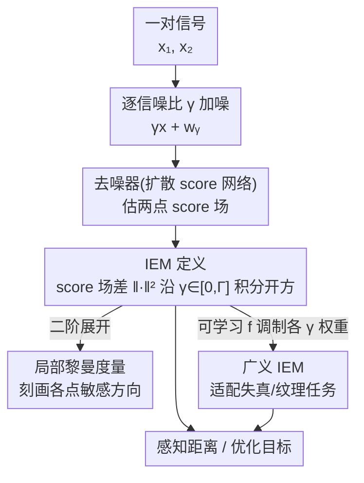

# Learning a Distance Measure from the Information-Estimation Geometry of Data

**会议**: ICLR 2026  
**arXiv**: [2510.02514](https://arxiv.org/abs/2510.02514)  
**代码**: [GitHub](https://github.com/ohayonguy/information-estimation-metric)  
**领域**: 度量学习 / 感知质量评估  
**关键词**: 信息估计度量, 去噪误差, 概率密度几何, 感知距离, 扩散模型

## 一句话总结
提出 Information-Estimation Metric (IEM)，一种由数据概率密度几何诱导的新型距离函数，通过比较不同噪声水平下的 score 向量场来度量信号间距离，无监督训练的 IEM 在预测人类感知判断上可媲美有监督方法。

## 研究背景与动机
- 距离函数是科学和工程的核心工具，但自然信号（如图像）的感知距离缺乏精确数学定义
- 现有最佳感知度量（LPIPS、DISTS）依赖人类标注数据训练，成本高且可解释性差
- 信息论量（如互信息）对密度的全局几何不敏感，而估计论量（如去噪误差）直接与密度几何相关
- 去噪误差与 score 函数的关系（Tweedie-Miyasawa 公式）是扩散模型的基础——能否利用这一关系构建感知度量？

## 方法详解

### 整体框架
论文要解决的是一个看似无解的难题：自然信号（如图像）的感知距离一直缺乏精确的数学定义，而现有最好的感知度量（LPIPS、DISTS）都得靠大量人类标注硬学出来。IEM 的核心思路是绕开信号本身，转而比较两个信号各自"被噪声模糊后所处的概率密度长什么样"。整条计算链是：给一对信号 $\boldsymbol{x}_1, \boldsymbol{x}_2$ 在一系列信噪比 $\gamma$ 上加噪，用一个训练好的去噪器（即扩散模型里的 score 网络）估出两点的 score 向量场（对数密度的梯度），取两者的差并沿 $\gamma$ 从 0 积分到上限 $\Gamma$，开方即得距离。它的理论基石是 pointwise I-MMSE 公式——一个信号的对数概率可以拆成最优去噪器在不同 SNR 上的去噪误差，因此 score 网络天然就能算出这个距离，整个过程不碰任何人类标注。

### 关键设计

**1. IEM 定义：把距离建立在密度几何而非像素差上**

感知距离难以定义的根源在于，像素层面接近的两张图人眼看起来可能差很远，反之亦然。IEM 的做法是绕开信号本身，转而比较两点 $\boldsymbol{x}_1, \boldsymbol{x}_2$ 在各噪声水平下所处密度的 score 场差异，并对信噪比 $\gamma$ 积分到上限 $\Gamma$：

$$\text{IEM}(\boldsymbol{x}_1, \boldsymbol{x}_2, \Gamma) = \left(\int_0^\Gamma \mathbb{E}\left[\|\nabla \log p_{\mathbf{y}_\gamma}(\gamma \boldsymbol{x}_1 + \mathbf{w}_\gamma) - \nabla \log p_{\mathbf{y}_\gamma}(\gamma \boldsymbol{x}_2 + \mathbf{w}_\gamma)\|^2\right] d\gamma\right)^{1/2}$$

其中 $\gamma$ 为信噪比、$\mathbf{w}_\gamma$ 为维纳过程噪声。因为 score 函数恰好可由去噪误差表出（Tweedie–Miyasawa 关系），把训练好的去噪器插进去、再对一维的 $\gamma$ 做数值积分就能算出这个距离，于是距离的语义完全由数据分布的几何、而非人为设计的特征决定。

**2. 度量性质：证明它是一个数学上合法的距离**

一个能用作优化目标的度量必须满足对称性、非负性、正定性和三角不等式，否则会出现"A 像 B、B 像 C，但 A 与 C 距离突然爆炸"之类的病态。论文证明对任意 $\Gamma>0$，IEM 恰好满足全部四条。更重要的是当先验密度为高斯、$\Gamma\to\infty$ 时它退化为经典的 Mahalanobis 距离 $\text{IEM} = \sqrt{(\boldsymbol{x}_1 - \boldsymbol{x}_2)^\top \Sigma^{-1} (\boldsymbol{x}_1 - \boldsymbol{x}_2)}$，这个闭式解既是理论自洽的验证，也说明 IEM 会沿协方差大的方向"放松"、沿协方差小的方向"收紧"，与人对自然信号的敏感模式一致。

**3. 局部黎曼度量：刻画距离在每个点附近的敏感方向**

把平方 IEM 在某点做二阶展开，可以得到一个局部黎曼度量张量 $\boldsymbol{G}(\boldsymbol{x}, \Gamma)$：

$$\boldsymbol{G}(\boldsymbol{x}, \Gamma) = \int_0^\Gamma \gamma^2 \mathbb{E}\left[(\nabla^2 \log p_{\mathbf{y}_\gamma}(\gamma \boldsymbol{x} + \mathbf{w}_\gamma))^2\right] d\gamma$$

它的直觉是：在对数密度曲率最高的区域、以及那些会让信号概率剧烈变化的扰动方向上，度量更敏感。这解释了为什么 IEM 对"偏离数据流形"的扰动（如非结构化噪声）反应强烈，而对沿流形的细微变化相对宽容——正是这种各向异性让它贴近人类感知。要注意这是单向关系：IEM 由全局距离导出 $\boldsymbol{G}$，但 IEM 本身并不等于 $\boldsymbol{G}$ 诱导的测地线距离。

**4. 广义 IEM：用可学习权重适配不同感知任务**

单一固定的 IEM 难以同时擅长失真评估和纹理相似性这两类相反需求，前者要对局部偏差敏感、后者要对全局统计敏感。为此引入一个二阶可微的标量函数 $f$ 来调制不同 SNR 上 score 差异的权重，得到广义 $\text{IEM}_f$。代价是 $\text{IEM}_f$ 一般不再是严格度量（可能违反对称性或三角不等式），但这对许多应用并非缺点。$f$ 既可手工选取（如平方型 $\text{IEM}_{sq}$ 偏向纹理统计），也可在少量标注上拟合成 $f_\omega$，从而让同一框架在所有数据集上都取得强结果。

### 损失函数 / 训练策略
去噪器采用 Hourglass Diffusion Transformer (HDiT)，在 ImageNet-1k 256×256 上以标准 MSE 去噪损失训练，噪声水平按 log-uniform 调度采样以覆盖宽 SNR 范围。注意训练阶段只学去噪、不见任何感知标注；计算 IEM 时把这个去噪器代入定义式，再对一维的 $\gamma$ 积分做数值求解即可。

## 实验关键数据

### 主实验（SRCC 与人类 MOS 的相关性）

| 方法 | 是否监督 | TID2013 | LIVE | CSIQ | TQD(纹理) |
|------|---------|---------|------|------|-----------|
| PSNR | 否 | 0.69 | 0.87 | 0.81 | 0.34 |
| SSIM | 否 | 0.64 | 0.91 | 0.82 | 0.51 |
| LPIPS | 是 | 0.71 | 0.94 | 0.88 | 0.48 |
| DISTS | 是 | 0.83 | 0.95 | 0.93 | **0.83** |
| TOPIQ | 是 | **0.86** | **0.97** | **0.95** | 0.67 |
| **IEM (无监督)** | **否** | **0.83** | **0.96** | **0.94** | 0.51 |
| **IEM_sq (无监督)** | **否** | 0.66 | 0.82 | 0.79 | **0.79** |
| **IEM_fω (有监督f)** | **部分** | **0.84** | **0.96** | **0.94** | **0.77** |

### 消融实验（Max Differentiation Competition）

| 操作 | IEM 结果 | DISTS 结果 | 说明 |
|------|---------|-----------|------|
| 最小化度量(PSNR=10dB) | 无伪影高质量 | 明显伪影 | IEM作为优化目标更鲁棒 |
| 最大化度量(PSNR=10dB) | 非结构化噪声 | 模式化伪影 | IEM对偏离数据支撑的扰动最敏感 |

### 关键发现
- 无监督 IEM 在 TID2013/LIVE/CSIQ 上与最佳有监督方法竞争（SRCC 0.83-0.96）
- $\text{IEM}_{sq}$ 在纹理相似性（TQD）上表现优异，$f$ 的选择控制全局 vs 局部失真敏感度
- 学习 $f_\omega$ 后可同时在所有数据集上取得强结果
- IEM 最小化生成的图像无伪影，说明可作为独立优化目标

## 亮点与洞察
- 信息论与估计论的深刻联系为构建感知度量提供了原理性基础
- 高斯情况下退化为 Mahalanobis 距离提供了优美的理论锚点
- 等距线可以不连通（高斯混合情况），反映了度量对密度全局几何的适应性
- 为从无标注数据推导感知度量这一基本问题提供了突破性方案

## 局限与展望
- 计算成本高：需在多个 SNR 水平上运行去噪器并求积分，比 LPIPS 慢得多
- 超参 $\Gamma$ 的选择缺乏系统性原则
- 目前仅在 256×256 图像上验证
- 作为优化目标的应用（如图像恢复、压缩）有待探索

## 相关工作与启发
- 建立在 I-MMSE 公式（Guo et al. 2005）和 Tweedie-Miyasawa 公式之上
- 与扩散模型共享理论基础（score function = 去噪误差），但目的不同
- 为无监督特征学习和度量学习提供了新视角
- 可扩展到音频等其他连续信号域

## 技术细节补充
- 去噪器使用 Hourglass Diffusion Transformer (HDiT)，对图像分辨率线性缩放
- 在 ImageNet-1k 256×256 上训练，使用 log-uniform 噪声级别调度
- 高斯分布先验下 IEM = Mahalanobis 距离，有闭形解
- 拉普拉斯先验的例子展示 IEM 沿概率密度山脊分布差异化的局部敏感度
- $\Gamma=1/4$ 在标准 IQA 基准上效果最佳，$\Gamma=10^6$ 在纹理数据集上效果最佳
- IEM 最小化作为优化目标时无伪影，超越 DISTS 等有监督方法
- Mismatched IEM 可用于评估不同生成模型的差异
- 代码已开源，包含去噪器训练、IEM 计算和实验复现的全部细节

## 评分
- 新颖性: ⭐⭐⭐⭐⭐ 从信息估计理论推导感知度量，理论贡献突出
- 实验充分度: ⭐⭐⭐⭐ 全面的基准比较和可视化分析，但缺少大尺度应用
- 写作质量: ⭐⭐⭐⭐⭐ 理论推导严谨优美，插图直观有力
- 价值: ⭐⭐⭐⭐⭐ 为感知度量学习提供了全新的理论框架

<!-- RELATED:START -->

## 相关论文

- [\[ICLR 2026\] The Spacetime of Diffusion Models: An Information Geometry Perspective](the_spacetime_of_diffusion_models_an_information_geometry_perspective.md)
- [\[NeurIPS 2025\] MMG: Mutual Information Estimation via the MMSE Gap in Diffusion](../../NeurIPS2025/image_generation/mmg_mutual_information_estimation_via_the_mmse_gap_in_diffusion.md)
- [\[AAAI 2026\] Diffusion Reconstruction-Based Data Likelihood Estimation for Core-Set Selection](../../AAAI2026/image_generation/diffusion_reconstruction-based_data_likelihood_estimation_for_core-set_selection.md)
- [\[ICLR 2026\] Monocular Normal Estimation via Shading Sequence Estimation](monocular_normal_estimation_via_shading_sequence_estimation.md)
- [\[NeurIPS 2025\] Information Theoretic Learning for Diffusion Models with Warm Start](../../NeurIPS2025/image_generation/information_theoretic_learning_for_diffusion_models_with_warm_start.md)

<!-- RELATED:END -->
