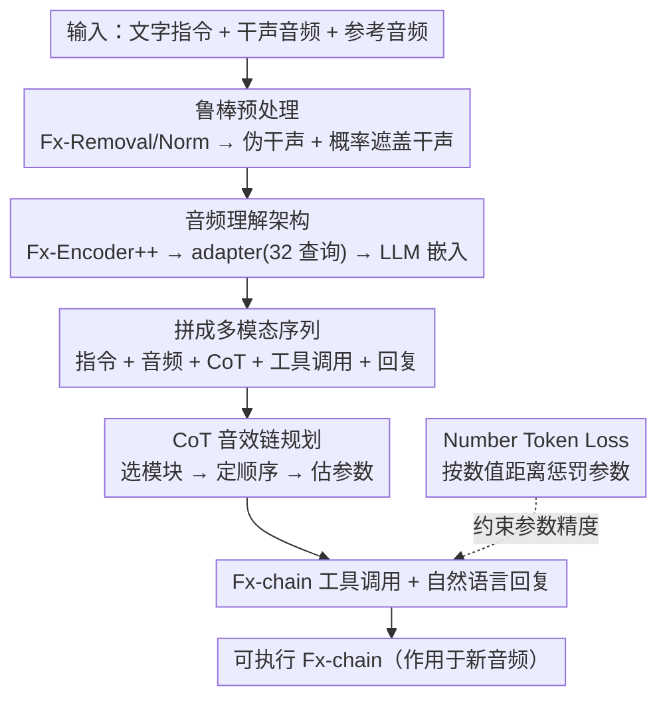

# LLM2Fx-Tools: Tool Calling for Music Post-Production

**会议**: ICLR 2026  
**arXiv**: [2512.01559](https://arxiv.org/abs/2512.01559)  
**代码**: [Demo](https://seungheondoh.github.io/llm2fx-tools-demo/)  
**领域**: 图像生成  
**关键词**: 音效链估计, 工具调用, 思维链推理, 音乐后期制作, 多模态LLM

## 一句话总结
提出 LLM2Fx-Tools，首个将 LLM 工具调用应用于音效模块的框架，通过多模态 LLM 理解音频输入，利用 CoT 推理选择音效类型、确定顺序并估计参数，实现可解释和可控的音乐后期制作。

## 研究背景与动机
- 音效（Fx）处理是音乐后期制作的核心，但需要大量专业知识
- 现有 Fx-chain 自动估计方法面临三大局限：梯度法要求可微模块、回归法固定配置无法动态选择效果、缺乏用户可解释性
- LLM 的指令遵循、CoT 推理和工具调用能力为解决灵活性和可解释性问题提供了新机会
- 此前 LLM2Fx 仅支持单效果（EQ 和混响），无显式工具调用或 CoT

## 方法详解

### 整体框架
LLM2Fx-Tools 以 Qwen3-4B 为骨干，把音效链（Fx-chain）估计重写成一个"听音频、想步骤、调工具"的工具调用问题：给定文字指令、干声音频和参考音频，模型先对录音做鲁棒预处理消除环境差异，再把波形接进语言模型的嵌入空间，然后吐出一段 CoT 推理把"该配哪条效果链"想清楚，最后据此生成一串可直接执行的 Fx-chain 工具调用与自然语言回复。整条流水线串起来是：输入音频经预处理与编码进入 LLM，LLM 在一条自回归序列里依次产出 CoT、工具调用、回复，让后期处理既能落地执行又能解释"为什么这么处理"。

### 关键设计

**1. 鲁棒预处理：抹平录音差异，兼容有无干声两种场景**

真实录音的电平、混响环境千差万别，直接拿来训练会让模型把"录音棚的差异"误当成"音效本身"，且推理时往往拿不到干声。本文在训练与推理两端都用 Fx-Removal 和 Fx-Normalization 把输入对齐到统一基准、得到伪干声 $\hat{x}_{\text{dry}}$，先把环境分布对齐掉。同时训练时以概率 $p_{\text{masking}}$ 随机遮盖干声音频，强制模型在没有干声时也能只靠参考音频推断——于是同一个模型既能在有干声时做反向工程（reverse engineering，推断已施加的效果），也能在无干声时做盲估计（blind estimation，直接预测应施加的效果），覆盖后期制作里两种常见工作流。

**2. 音频理解架构：把波形接进 LLM 的嵌入空间**

LLM 本身只懂离散 token，无法直接读波形，所以需要一座把音频接进语言模型的桥。本文用对比学习预训练的 Fx-Encoder++ 提取音频特征 $f_{\text{encoder}}$，再经一个 Transformer adapter 投影到 LLM 嵌入空间 $e_{\text{audio}} = f_{\text{adapter}}(f_{\text{encoder}}(x_{\text{audio}}))$。与以往只用线性层对齐不同，这里 adapter 带 32 个可学习查询嵌入 $e_{\text{query}}\in\mathbb{R}^{32\times d_{\text{LLM}}}$，用交叉注意力把变长音频聚合成固定 32 个 token。处理后的音频嵌入与文字 token 拼成统一的多模态序列 $[x_{\text{instruction}}, x_{\text{dry}}, x_{\text{ref}}, x_{\text{cot}}, \mathcal{C}, x_{\text{response}}]$，让模型在一条自回归流里同时看懂"想要什么音色"（指令 + 参考音频）和"现在是什么音色"（干声）。

**3. CoT 音效链规划：把"配什么效果链"拆成可推理的三步**

直接让模型一口气吐出整条 Fx-chain，容易在效果种类、先后顺序上拍脑袋出错。本文设计了针对 Fx-chain 生成的 CoT 机制，把决策显式拆成三个可解释子任务：先选择需要用到的音效模块（effect selection），再确定模块的处理顺序（order determination），最后估计每个模块的参数（parameter estimation）。这段 CoT 生成在工具调用之前，充当后续工具调用的条件上下文，相当于先把"为什么这么处理"写清楚再据此填具体工具与参数；消融显示它带来的提升最大——效果选择准确率从 67% 升到 80%、排序相关从 0.49 升到 0.56。

**4. Number Token Loss：让参数数值"算准"而非"猜对 token"**

音效参数本质是连续数值，但标准交叉熵把所有数字 token 当作无序类别，预测 3 和预测 30 受到的惩罚一样大，对数值精度极不友好。本文引入基于 Wasserstein-1 距离的 Number Token Loss，让数字预测的惩罚正比于预测分布与真值之间的距离：$\mathcal{L}_{\text{NTL-WAS}} = \frac{1}{|\mathcal{I}_{\text{num}}|} \sum_{i \in \mathcal{I}_{\text{num}}} \sum_{v \in \mathcal{V}_{\text{num}}} \hat{P}_i(v) |y_i - \text{val}(v)|$，只对数值 token 位置 $\mathcal{I}_{\text{num}}$ 累加、按预测分布 $\hat{P}_i(v)$ 加权各数值 token 与真值 $y_i$ 的绝对偏差。它与交叉熵以系数 $\lambda$ 线性组合成总损失 $\mathcal{L}_{\text{total}} = \mathcal{L}_{\text{CE}} + \lambda \mathcal{L}_{\text{NTL}}$，把参数 MAE 从 0.32 压到 0.23。

> ⚠️ 上式为按 Wasserstein-1 距离重构的形式，具体记号以原文为准。

### 损失函数 / 训练策略
训练分两阶段，先对齐模态再微调语言能力。阶段 1 只训练 adapter、冻结 LLM 做模态对齐，学习率 1e-4，跑 100K 步，让音频特征先稳定地接进嵌入空间；阶段 2 用 LoRA（rank=128，alpha=256）以学习率 5e-5 微调 LLM 共 400K 步，在完整对话数据上学会 CoT 推理与工具调用。

## 实验关键数据

### 主实验（反向工程 Fx-chain 估计）

| 方法 | Acc↑ | 排序相关↑ | MAE↓ | MRS L/R↓ | AFx-Rep↑ | FxEnc↑ |
|------|------|----------|------|---------|---------|--------|
| Regression | 55% | -0.03 | 0.20 | 3.81 | 0.62 | 0.64 |
| MultiTask | 61% | 0.00 | 0.23 | 3.17 | 0.63 | 0.66 |
| DeepAFx-ST | - | - | - | 1.75* | 0.62 | 0.66 |
| Gemini 2.5 Flash | 78% | 0.54 | 0.32 | 3.42 | 0.56 | 0.50 |
| **LLM2Fx-Tools** | **80%** | **0.56** | **0.23** | **3.13** | **0.68** | **0.67** |

### 消融实验

| 配置 | Acc↑ | 排序相关↑ | MAE↓ | MRS L/R↓ |
|------|------|----------|------|---------|
| LLM2Fx-Tools (完整) | 80% | 0.56 | 0.23 | 3.13 |
| w/o CoT | 67% | 0.49 | 0.24 | 3.34 |
| w/o NTL | 73% | 0.51 | 0.32 | 3.69 |
| w/o MST | 76% | 0.55 | 0.25 | 3.21 |

### 关键发现
- CoT 显著提升效果选择（67→80%）和排序（0.49→0.56），是最重要的组件
- NTL 将参数 MAE 从 0.32 降至 0.23，对数值精度贡献最大
- 回归方法 MAE 最低（0.20）但无法选择效果，导致感知距离反而更差
- MUSHRA 听测：LLM2Fx-Tools 62.8 分显著优于 Gemini 56.5 和 DeepAFx-ST 54.8
- 风格迁移任务中 LLM2Fx-Tools 泛化能力最佳（AF=7.41 vs 次优 7.62）

## 亮点与洞察
- 首次将 LLM 工具调用范式引入音频效果处理，将非可微模块纳入生成框架
- CoT 不仅提升性能，还提供可解释的推理过程（为什么选择这个效果）
- Fx-chain 排序对最终音频质量至关重要（即使参数精度高，错误排序也导致质量下降）
- LP-Fx 数据集（101K 对话）为音频效果 LLM 研究提供了基础设施

## 局限与展望
- 工具集限于 9 个模块 26 个参数，实际后期制作更复杂
- 数据生成依赖 LLM 合成对话，可能存在分布偏差
- 4B 参数模型在复杂场景下可能力有不逮
- 未探索迭代优化（多轮对话逐步调整效果）

## 相关工作与启发
- LLM2Fx 的单效果预测启发了本工作向 Fx-chain 的扩展
- 工具调用范式（Toolformer、Gorilla）在视觉和NLP中已广泛应用，首次迁移到音频
- 为 AI 辅助音乐制作的可解释自动化提供了新范式

## 技术细节补充
- 音频源：MedleyDB 数据集（196 多轨录音中筛选 2119 个无串扰音频文件）
- 工具环境：Pedalboard 的 6 个模块 + 3 个自定义模块（共 9 模块 26 参数）
- 包含：compressor, distortion, reverb, delay, limiter, gain, three-band EQ, stereo widener, panner
- LP-Fx 数据集：99900 训练 + 900 测试，按 Fx-chain 长度 1-9 分层采样
- 数据生成使用 LLM 合成对话 + LLM-as-a-judge 过滤低质量样本
- NLG 评估使用 GPT-5 作为 judge，评估工具调用成功率、指令遵循和 CoT 质量
- LLM2Fx-Tools 工具调用成功率 99.8%（vs Gemini 2.5 Flash 100%）
- Qwen 2.5 Omni 的零样本工具调用能力极差（仅 0.2%），验证了微调的必要性
- 未正确应用效果的回归模型 MUSHRA 得分低于无效果基线，说明错误应用比不应用更糟糕
- 模型同时支持反向工程（有干声）和盲估计（无干声）两种任务形式
- 风格迁移实验使用 MoisesDB 和 MedleyDB 跨数据集评估泛化能力

## 评分
- 新颖性: ⭐⭐⭐⭐ 首个音频效果工具调用框架，CoT+工具调用的结合巧妙
- 实验充分度: ⭐⭐⭐⭐⭐ MUSHRA听测+多维度指标+消融+风格迁移+NLG评估
- 写作质量: ⭐⭐⭐⭐ 任务定义清晰，方法描述完整
- 价值: ⭐⭐⭐⭐ 开辟了 LLM 在音频后期制作中的新应用方向

<!-- RELATED:START -->

## 相关论文

- [\[CVPR 2025\] FilmComposer: LLM-Driven Music Production for Silent Film Clips](../../CVPR2025/image_generation/filmcomposer_llm-driven_music_production_for_silent_film_clips.md)
- [\[ICLR 2026\] Generalization of Diffusion Models Arises with a Balanced Representation Space](generalization_of_diffusion_models_arises_with_a_balanced_representation_space.md)
- [\[CVPR 2026\] HP-Edit: A Human-Preference Post-Training Framework for Image Editing](../../CVPR2026/image_generation/hp-edit_a_human-preference_post-training_framework_for_image_editing.md)
- [\[CVPR 2026\] GDRO: Group-level Reward Post-training Suitable for Diffusion Models](../../CVPR2026/image_generation/gdro_group-level_reward_post-training_suitable_for_diffusion_models.md)
- [\[AAAI 2026\] Melodia: Training-Free Music Editing Guided by Attention Probing in Diffusion Models](../../AAAI2026/image_generation/melodia_training-free_music_editing_guided_by_attention_probing_in_diffusion_mod.md)

<!-- RELATED:END -->
