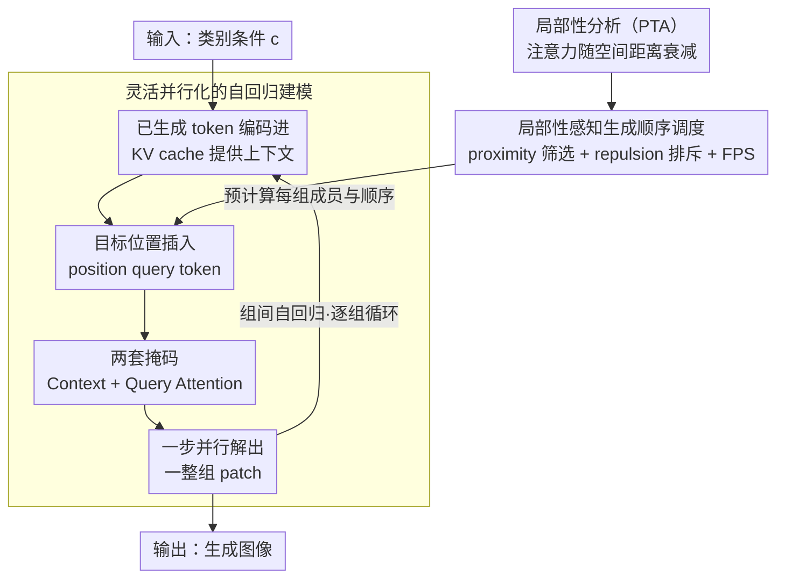

# Locality-aware Parallel Decoding for Efficient Autoregressive Image Generation

**会议**: ICLR 2026 Oral  
**arXiv**: [2507.01957](https://arxiv.org/abs/2507.01957)  
**代码**: [GitHub](https://github.com/mit-han-lab/lpd)  
**领域**: 自回归图像生成  
**关键词**: 并行解码, 自回归建模, 空间局部性, 位置查询, 高效推理

## 一句话总结
提出 Locality-aware Parallel Decoding (LPD)，通过灵活并行化自回归建模架构和局部性感知的生成顺序调度，将 256×256 图像的生成步数从 256 降至 20，实现至少 3.4× 的延迟降低。

## 研究背景与动机
- 自回归图像生成的 next-patch prediction 是内存瓶颈操作，延迟随步数线性增长
- next-scale prediction（如 VAR）步数少但使用多尺度token表示，与平坦视觉感知模型（CLIP、DINO）不兼容
- 现有并行化方法（PAR、RandAR）仅实现有限并行化，PAR 固定并行顺序，RandAR 并行token之间互不可见
- 需要：高效推理 + 保持平坦token表示的通用性和兼容性

## 方法详解

### 整体框架
LPD 把一张图的生成拆成若干"组"，每组内的多个 patch 同步并行生成，组与组之间仍保持自回归条件依赖。它由两块拼成：一个能支持任意生成顺序、任意并行度的自回归架构，以及一个根据空间局部性来排生成顺序的调度器，让每组并行的 token 既能拿到足够多的上下文、组内彼此又尽量不互相依赖。推理时调度器先离线算好每组该生成哪些位置、按什么顺序，架构则逐组循环——把已生成的 token 编码进 KV cache 作上下文、用 position query token 一步并行解出该组的所有 patch，循环到整图填满。

### 关键设计

**1. 灵活并行化的自回归建模：让 decoder-only 模型能一次解出一整组任意位置的 patch**

标准自回归模型一步只能预测序列里的下一个 token，位置和顺序都被固定死了，没法一次并行解出多个任意位置。LPD 的做法是把"提供上下文"和"生成目标"这两件事解耦开：已经生成的 token 只负责贡献上下文，缓存进 KV cache；要预测的目标位置则各自插入一个可学习的位置查询 token（共享的可学习嵌入加上该目标位置的位置编码），由这些查询 token 来驱动并行生成。配合这一拆分，模型用两套注意力掩码分别约束信息流向——Context Attention 让后续 token 因果地关注前面的上下文 token，Query Attention 让同一步里的若干查询 token 彼此可见（这样并行生成的 patch 互相协调、避免独立采样带来的不一致），同时禁止后续 token 反过来关注这些查询 token。由于查询 token 的 KV 不必保留，推理时一组的编码与解码可以融合成单步操作，只需为真正生成出来的 token 存 KV cache，开销很小。

**2. 局部性分析与 PTA 指标：用注意力的空间衰减规律为"哪些 patch 适合放进同一组"提供依据**

要并行就得知道哪些位置可以同时生成而互不冲突。作者在 LlamaGen-1.4B 上分析注意力分布，发现解码 token 的注意力高度集中在空间上邻近的 token 上，呈现强空间局部性。为量化这一点，定义 Per-Token Attention（PTA）——对所有 token 取空间距离为 $s$ 的那些注意力权重的平均值：

$$PTA_s = \frac{1}{N}\sum_{i=1}^N \frac{\sum_j \text{Attention}(T_i,T_j) \cdot \mathbb{I}[d(T_i,T_j)=s]}{\sum_j \mathbb{I}[d(T_i,T_j)=s]}$$

实测 PTA 随距离 $s$ 急剧下降。这条曲线直接推出两条排序原则：并行生成的 token 应当靠近已生成的 token（这样能拿到强条件化的上下文），同时组内的 token 之间应当彼此远离（这样它们的相互依赖弱，并行才不掉质量）。

**3. 局部性感知的生成顺序调度：按上面两条原则贪心地为每一步挑出一组互相独立又上下文充分的 patch**

调度器在每一步 $k$ 把这两条原则落地。它先算未选 token 到已选 token 的欧氏距离作为 proximity，按 proximity 排序后用阈值 $\tau$ 截出一批"离已生成区域足够近"的高 proximity 候选集 $c_1$；接着从 $c_1$ 里依次取 token，每取一个就用排斥阈值 $\rho$ 把它附近的候选过滤掉，保证同组成员彼此拉开距离、依赖最小；如果这样选出来的数量不够本组所需，再用最远点采样从剩余集 $c_2$ 里补足。每组该放多少个 token 通常按余弦调度递增——早期已知上下文少，就少生成几个稳一点，后期上下文充足再加速放量。整条生成顺序与每个位置只取决于网格几何，可以在推理前一次性预计算好。

### 损失函数 / 训练策略
训练用分组自回归目标，把 $N$ 个 token 划成 $G$ 组后按组分解联合概率：$p(x_1,\dots,x_N;c) = \prod_{g=1}^G p(X_g \mid X_{<g};c)$，组内并行、组间自回归。优化用标准交叉熵损失，训练时套用上面的两套注意力掩码，从而在一次前向里同时实现 teacher-forcing 的因果约束和组内的并行预测。

## 实验关键数据

### 主实验（ImageNet 256×256）

| 类型 | 模型 | 参数 | FID↓ | IS↑ | #Steps | Latency(s) | Throughput |
|------|------|------|------|-----|--------|-----------|-----------|
| AR | LlamaGen-XXL | 1.4B | 2.34 | 253.9 | 576 | 24.40 | 0.72 |
| AR | RAR-XXL | 1.5B | 1.48 | 326.0 | 256 | 6.59 | 6.72 |
| Par.AR | PAR-XXL-4× | 1.4B | 2.35 | 263.2 | 147 | 6.26 | 2.33 |
| Par.AR | RandAR-L | 343M | 2.55 | 288.8 | 88 | 1.97 | 28.59 |
| **Par.AR** | **LPD-L** | **343M** | **2.31** | **284.9** | **20** | **0.40** | **92.42** |
| **Par.AR** | **LPD-XL** | **775M** | **1.97** | **304.0** | **20** | **0.57** | **60.27** |

### ImageNet 512×512

| 模型 | 参数 | FID↓ | #Steps | Latency(s) | Throughput |
|------|------|------|--------|-----------|-----------|
| LlamaGen-XXL | 1.4B | 2.59 | 1024 | - | - |
| **LPD-XXL** | **1.4B** | **2.25** | **48** | **2.78** | **6.56** |

### 关键发现
- LPD-L 仅 20 步生成 256×256 图像，FID=2.31 优于 576 步的 LlamaGen-XXL (2.34)
- 吞吐量 92.42 img/s 远超 RandAR 的 28.59 和 PAR 的 6.83
- 512×512 仅需 48 步（vs 1024），FID 从 2.59 降至 2.25
- 局部性感知调度远优于光栅序、随机序和 Halton 序
- 零样本图像编辑（类条件编辑、修复、扩展）自然支持

## 亮点与洞察
- 位置查询token实现的"解耦"设计优雅地解决了标准decoder-only模型的灵活性限制
- Query Attention 确保同步生成token之间互相可见，避免独立采样导致的不一致
- 局部性分析提供了并行化策略设计的经验基础——PTA 分析可迁移到其他视觉自回归模型
- 与 VAR 相比保持了平坦token表示，兼容 CLIP/DINO 等视觉骨干

## 局限与展望
- 当前仅在 ImageNet 类条件生成上验证，未扩展到文本引导生成
- 位置查询token引入的额外参数和注意力计算的开销
- 生成顺序调度的超参（$\tau$、$\rho$、组大小调度）需要调优
- 与最佳 MAR/VAR 方法在 FID 上仍有差距（但吞吐量远优）

## 相关工作与启发
- PAR、RandAR、SAR 等并行自回归方法的局限驱动了本工作
- MaskGIT 的掩码预测启发了渐增组大小的设计
- 空间局部性观察对理解视觉自回归模型的注意力机制有启发
- 为统一多模态生成（文本+图像）中的图像部分提供了高效解决方案

## 技术细节补充
- 组大小通过余弦调度递增：早期上下文少时生成少量 token，后期增多
- 位置查询 token = 共享可学习嵌入 + 目标位置的位置编码
- 推理时查询 token 的 KV 不存储，仅存储生成 token 的 KV
- 256×256 生成 20 步，512×512 生成 48 步
- 支持零样本图像编辑（类条件编辑、修复、扩展）
- LPD-L 343M 参数即可达到 FID=2.31，超越 1.4B 的 LlamaGen-XXL

## 评分
- 新颖性: ⭐⭐⭐⭐⭐ 位置查询解耦+局部性感知调度的组合设计新颖有效
- 实验充分度: ⭐⭐⭐⭐ 系统对比充分，但缺少T2I和多模态实验
- 写作质量: ⭐⭐⭐⭐⭐ 动机清晰，方法与其他方法的对比分析透彻
- 价值: ⭐⭐⭐⭐⭐ 大幅降低自回归图像生成延迟，对统一多模态系统有重要意义

<!-- RELATED:START -->

## 相关论文

- [\[ICLR 2026\] Autoregressive Image Generation with Randomized Parallel Decoding](autoregressive_image_generation_with_randomized_parallel_decoding.md)
- [\[CVPR 2026\] Parallel Jacobi Decoding for Fast Autoregressive Image Generation](../../CVPR2026/image_generation/parallel_jacobi_decoding_for_fast_autoregressive_image_generation.md)
- [\[CVPR 2026\] Multi-Scale Local Speculative Decoding for Image Generation](../../CVPR2026/image_generation/multi-scale_local_speculative_decoding_for_image_generation.md)
- [\[ICLR 2026\] ToProVAR: Efficient Visual Autoregressive Modeling via Tri-Dimensional Entropy-Aware Semantic Analysis and Sparsity Optimization](toprovar_efficient_visual_autoregressive_modeling_via_tri-dimensional_entropy-aw.md)
- [\[AAAI 2026\] Annealed Relaxation of Speculative Decoding for Faster Autoregressive Image Generation](../../AAAI2026/image_generation/annealed_relaxation_of_speculative_decoding_for_faster_autor.md)

<!-- RELATED:END -->
