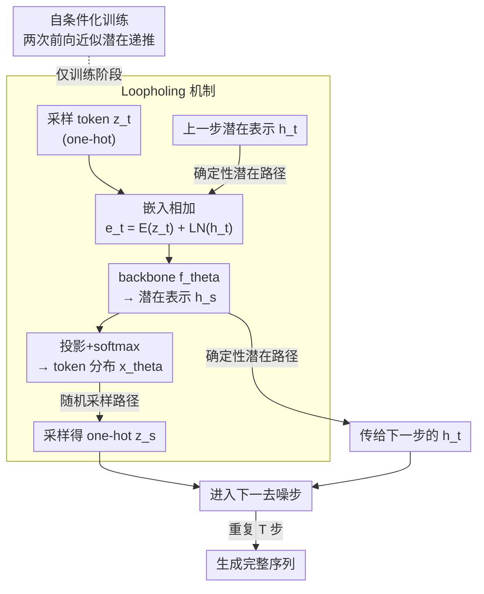

# Loopholing Discrete Diffusion: Deterministic Bypass of the Sampling Wall

**会议**: ICLR 2026  
**arXiv**: [2510.19304](https://arxiv.org/abs/2510.19304)  
**代码**: [GitHub](https://github.com/ahn-ml/lddm)  
**领域**: 离散扩散模型 / 文本生成  
**关键词**: 离散扩散, 采样壁, 确定性旁路, 自条件化, 非自回归文本生成

## 一句话总结
识别离散扩散模型中的"采样壁"问题（分类分布信息在采样后坍塌为 one-hot 向量），提出 Loopholing 机制引入确定性潜在路径传播丰富的分布信息，将生成困惑度降低最多 61%，大幅缩小与自回归模型的差距。

## 研究背景与动机
- 离散扩散模型通过并行解码具有速度优势，但生成质量仍落后于自回归模型
- 已知问题：空闲步（idle steps）——多步去噪产生相同结果；时间振荡（oscillation）——token 在候选间反复切换
- **采样壁（sampling wall）**：核心问题——分类分布 $\mathbf{x}_{\theta,t}$ 包含丰富的token候选信息（如 $[0.49, 0.51]$ vs $[0.20, 0.80]$），但采样后坍塌为相同的 one-hot 向量，信息不可逆丢失
- 这种信息坍塌迫使后续步从有限的 one-hot 表示重建上下文，导致低效和不稳定

## 方法详解

### 整体框架
LDDM 要解决的是离散扩散的"采样壁"：每个去噪步把 backbone 算出的分类分布坍塌成 one-hot token 后，候选概率里的细微差异（$[0.49, 0.51]$ 与 $[0.20, 0.80]$）被一并抹平，下一步只能从贫瘠的 one-hot 重建上下文。它的整体思路是在标准的**随机采样路径**之外，额外开一条**确定性潜在路径**：每个去噪步除了照常采样出 one-hot token，还把 backbone 内部的连续潜在表示 $\mathbf{h}_s$ 直接传给下一步，让未经采样压缩的分布信息跨步累积，从而绕过采样壁。这条潜在路径让相邻去噪步产生了递归依赖，按理训练要沿整条轨迹反传；LDDM 用**自条件化训练**把它简化成每步只展开两次前向。

### 关键设计

**1. Loopholing 机制：在采样路径旁加一条确定性潜在路径，绕过 one-hot 坍塌**

采样壁的根源在于每步把分类分布坍塌成 one-hot 后，候选概率的细微差异被全部丢弃，后续步只能从贫瘠的 one-hot 重建上下文。Loopholing 的做法是让每个去噪步同时吐出两个东西——采样路径上的随机 one-hot 向量，和潜在路径上的确定性连续向量，记为 $(\mathbf{x}_\theta(\mathbf{z}_t, \mathbf{h}_t, t), \mathbf{h}_s) = f_{\text{Loopholing}}(\mathbf{z}_t, \mathbf{h}_t, t)$。具体计算时，当前 token 的嵌入 $E_\theta(\mathbf{z}_t)$ 与上一步潜在表示经 Layer Norm 后相加得 $\mathbf{e}_t = E_\theta(\mathbf{z}_t) + \text{LN}(\mathbf{h}_t)$，送入 backbone 得到新的潜在表示 $\mathbf{h}_s = f_\theta(\mathbf{e}_t, t)$，再由 $\mathbf{x}_\theta = \text{softmax}(g_\theta(\mathbf{h}_s))$ 读出 token 分布。这条确定性通道相当于在离散扩散里嵌入了一个 RNN 式的隐状态：未经采样压缩的连续上下文跨步累积传播，分布信息不再因 one-hot 化而丢失。它顺带压住了离散扩散此前的两大低效——即便某步采样结果与上一步相同（空闲步），潜在表示 $\mathbf{h}_t$ 仍在更新、每步都在积累进展；确定性路径维持着对目标的上下文记忆，token 也不再在候选间反复横跳（过度振荡）。机制分析印证了这点：LDDM 早期 Temporal KL 更高（探索更快）、后期更低（更稳定），且 Token-Prediction Entropy 全程低于基线。

**2. 自条件化训练：用两次前向模拟推理时的潜在递推，避免展开整条轨迹**

潜在路径在推理时是逐步递推的（这一步的 $\mathbf{h}_t$ 来自上一步），若训练时照搬就得展开整条去噪轨迹、付出沿轨迹反传的高昂代价。LDDM 改为在每个随机采样的时间步只跑两次前向：第一次令 $\mathbf{h}_t = \mathbf{0}$ 生成一份伪上下文 $\mathbf{h}^0$，第二次把它截断梯度后作为条件 $\mathbf{h}_t = \text{sg}[\mathbf{h}^0]$ 再预测一次。第二次前向就近似了推理时"拿着上一步潜在表示做预测"的情形，却无需跨步反传。训练中以概率 $p$ 采用这种自条件化损失、以 $1-p$ 退回标准损失，实测 $p \in [0.5, 0.9]$ 区间最优；代价是两次前向使训练时间增加约 30%。

### 损失函数 / 训练策略
训练目标在原 NELBO 上做自条件化改写，对处于 mask 状态 $\mathbf{m}$ 的位置施加对数似然约束：
$$\mathcal{L}_{\text{Loopholing}} = \mathbb{E}_{t,\mathbf{z}_t}\left[\mathbb{I}[\mathbf{z}_t = \mathbf{m}] \frac{\alpha'_t}{1-\alpha_t} \log\langle \mathbf{x}^1_\theta(\mathbf{z}_t, \text{sg}[\mathbf{h}^0], t), \mathbf{x}\rangle\right]$$
其中 $\mathbf{x}^1_\theta$ 即第二次前向、以截断梯度的 $\mathbf{h}^0$ 为条件的预测，自条件化概率取 $p \in [0.5, 0.9]$ 最优。

## 实验关键数据

### 主实验（测试困惑度 ↓）

| 模型 | LM1B | OWT |
|------|------|-----|
| SEDD Absorb | ≤28.39 | ≤24.01 |
| MDLM | ≤27.60 | ≤23.05 |
| UDLM | ≤31.11 | ≤25.51 |
| **LDDM-M (ours)** | **≤25.95** | **≤21.90** |
| **LDDM-U (ours)** | **≤29.21** | **≤23.82** |

### 生成质量 (Gen PPL, GPT-2 Large 评估)

| 模型 | Gen PPL @1024步 | 与AR的比 | 句子熵 |
|------|---------------|---------|--------|
| MDLM | 108.94 | 3.17× | 4.39 |
| UDLM | 73.95 | 2.15× | 4.01 |
| AR (GPT-2) | 34.33 | 1.00× | 4.27 |
| **LDDM-M** | **49.13** | **1.43×** | **4.43** |
| **LDDM-U** | **28.76** | **0.84×** | **4.16** |

### 推理任务（成功率 %）

| 模型 | 参数 | Countdown 4 | Game of 24 | Countdown 5 |
|------|------|------------|-----------|------------|
| MGDM | 6M | 45.0 | 12.0 | 5.9 |
| **LDDM-G** | **6M** | **56.3** | **28.0** | **10.3** |
| MGDM | 85M | 86.5 | 47.0 | 35.7 |
| **LDDM-G** | **85M** | **94.4** | **63.0** | **41.3** |

### 关键发现
- Gen PPL：LDDM-M 将 MDLM 的 108.94 降至 49.13（-55%），LDDM-U 将 UDLM 的 73.95 降至 28.76（-61%）
- LDDM-U 甚至超越自回归基线（28.76 vs 34.33），同时保持句子熵（多样性不下降）
- Countdown 4 准确率从 45% 提升至 56.3%（6M 模型），Game of 24 从 47% 提升至 63%（85M）
- 潜在传播长度越长性能越好（Figure 5a），说明累积效应
- G-eval（GPT-4.1）评估的连贯性和自然度均显著提升

## 亮点与洞察
- "采样壁"概念精准概括了离散扩散模型的核心瓶颈，比空闲步/振荡更底层
- Loopholing = 离散扩散 + RNN 式隐状态更新，但保持了无展开训练的优势
- 自条件化训练巧妙地模拟了推理时的上下文传播，无需昂贵的反向传播
- 对 mask 和 uniform 两种离散扩散框架均有效，通用性强

## 局限与展望
- 训练时间增加约 30%（两次前向传播），嵌入维度翻倍增加内存
- 当前仅考虑单步自条件化，多步训练策略可能进一步提升
- 缺乏严格的数学框架将 loopholing 整合到标准扩散理论
- 实验限于中等规模模型（学术环境），大规模扩展待验证

## 相关工作与启发
- Analog Bits 和 RIN 的自条件化思想被适配到离散扩散
- 与 RNN 的连接：确定性路径≈隐状态更新，采样路径≈输出反馈
- 为离散扩散模型在推理任务中的应用开辟了道路

## 评分
- 新颖性: ⭐⭐⭐⭐⭐ 采样壁概念和 Loopholing 机制原创性强
- 实验充分度: ⭐⭐⭐⭐⭐ 语言建模+生成质量+推理任务+消融+机制分析全面
- 写作质量: ⭐⭐⭐⭐⭐ 问题定义清晰，因果分析透彻
- 价值: ⭐⭐⭐⭐⭐ 大幅缩小离散扩散与自回归的差距，影响力可期

<!-- RELATED:START -->

## 相关论文

- [\[ICLR 2026\] Discrete Adjoint Matching](discrete_adjoint_matching.md)
- [\[ICLR 2026\] Improving Discrete Diffusion Unmasking Policies Beyond Explicit Reference Policies (UPO)](improving_discrete_diffusion_unmasking_policies_beyond_explicit_reference_polici.md)
- [\[CVPR 2026\] IncreFA: Breaking the Static Wall of Generative Model Attribution](../../CVPR2026/image_generation/increfa_breaking_the_static_wall_of_generative_model_attribution.md)
- [\[ICLR 2026\] JointDiff: Bridging Continuous and Discrete in Multi-Agent Trajectory Generation](jointdiff_bridging_continuous_and_discrete_in_multi-agent_trajectory_generation.md)
- [\[ICLR 2026\] Embracing Discrete Search: A Reasonable Approach to Causal Structure Learning](embracing_discrete_search_a_reasonable_approach_to_causal_structure_learning.md)

<!-- RELATED:END -->
