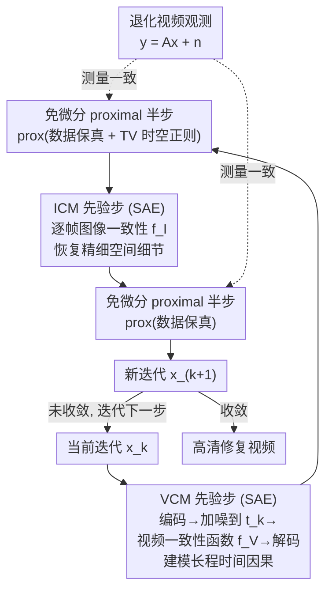

# LVTINO: LAtent Video consisTency INverse sOlver for High Definition Video Restoration

**会议**: ICLR 2026  
**arXiv**: [2510.01339](https://arxiv.org/abs/2510.01339)  
**代码**: [GitHub](https://github.com/aspagnoletti/LVTINO)  
**领域**: 视频修复 / 扩散模型  
**关键词**: 视频修复, 一致性模型, 逆问题求解, 零样本, 扩散模型

## 一句话总结

提出 LVTINO，首个基于视频一致性模型（VCM）先验的零样本视频逆问题求解器，通过在 VCM 采样过程中注入无需自动微分的测量一致性约束，在超分辨率、去模糊、修复等多种视频逆问题上以极少的神经网络函数评估（NFE）实现了超越逐帧图像方法的感知质量和时间一致性。

## 研究背景与动机

**领域现状**：计算成像领域越来越多地利用生成扩散模型来解决具有挑战性的图像逆问题（如超分辨率、去模糊、修复等）。当前最先进的零样本图像逆问题求解器利用蒸馏后的 text-to-image 潜在扩散模型（LDM）作为先验，在准确性和感知质量上取得了前所未有的表现，同时保持了较高的计算效率。

**现有痛点**：将这些图像级别的进展扩展到高清视频修复时面临重大挑战。视频修复不仅需要恢复精细的空间细节，还需要捕捉帧间微妙的时间依赖关系。朴素地将基于图像 LDM 的逆问题求解器逐帧应用，会导致帧间时间不一致的重建结果——每一帧独立生成，不同帧之间的随机性导致闪烁和不连贯。此外，基于扩散模型的逆问题求解器通常需要大量的 NFE 和自动微分计算，效率低下。

**核心矛盾**：视频修复需要同时优化两个相互竞争的目标——空间细节保真度和时间一致性。图像先验虽然空间质量高但没有时间建模能力；视频扩散模型虽然有时间建模但 NFE 开销巨大且难以做逆问题条件化。

**本文目标**：设计一种高效的、即插即用的视频逆问题求解器，能够：(1) 利用视频生成先验（而非图像先验）来保证时间一致性，(2) 在保持测量一致性的同时以极少的 NFE 完成重建，(3) 无需对退化算子做自动微分。

**切入角度**：视频一致性模型（Video Consistency Models, VCM）将视频潜在扩散模型蒸馏为快速生成器，天然捕获时间因果性，且只需极少的采样步骤。将 VCM 作为视频逆问题的先验，可以同时解决时间一致性和计算效率两个问题。

**核心 idea**：在 VCM 的少步采样过程中注入无需自动微分的测量一致性约束，实现首个基于视频先验的零样本视频逆问题求解器。

## 方法详解

### 整体框架

LVTINO 要解决的是高清视频逆问题：从退化观测 $\mathbf{y} = \mathbf{A}\mathbf{x} + \mathbf{n}$（$\mathbf{A}$ 是作用在整段视频上的线性退化算子，如下采样、模糊、缺帧掩码）反推出干净视频 $\mathbf{x}$。它没有把这件事当成"扩散模型从噪声逐步去噪"，而是当成**从后验 $p(\mathbf{x}\mid\mathbf{y},\mathbf{c},\lambda)$ 采样**，并用一个朗之万（Langevin）采样器去逼近——朗之万是时间齐次过程，迭代 $\mathbf{x}_k$ 直接朝后验收敛，不需要像扩散那样反向穿越一条时间轴。

后验由"先验 × 似然"构成。先验是本文的核心创新——一个**乘积专家（product-of-experts）视频先验** $p(\mathbf{x}\mid\mathbf{c},\lambda) \propto p_V^{\eta}(\mathbf{x}\mid\mathbf{c})\, p_I^{1-\eta}(\mathbf{x}\mid\mathbf{c})\, p_\phi(\mathbf{x}\mid\lambda)$，把视频一致性模型（VCM）、逐帧图像一致性模型（ICM）和一个时空正则项乘在一起，分别负责时间因果、空间细节和稳定性。似然 $p(\mathbf{y}\mid\mathbf{x})\propto\exp\{-\|\mathbf{y}-\mathbf{A}\mathbf{x}\|^2/2\sigma_n^2\}$ 把观测拉回来。每一步朗之万迭代被拆成四个子步顺序执行：VCM 先验步 → 含正则的免微分条件化半步 → ICM 先验步 → 免微分条件化半步，循环若干轮即得修复视频。整个过程只需个位数 NFE、且全程不做自动微分。

### 关键设计

**1. 乘积专家视频先验：VCM 管时间、ICM 管空间、TV 管稳定**

逐帧套用图像 LDM 的根本病灶是每帧各自生成、随机性不同，于是闪烁；但只用视频先验又恢复不出足够精细的空间细节。LVTINO 的破法是把三个专家乘起来当先验：$p_V$ 由一个文生视频 VCM 给出，建模帧间长程时间因果，保证时间一致；$p_I$ 由一个高分辨率文生图 ICM 给出、**逐帧**作用，专门补回精细空间纹理和感知质量；$p_\phi(\mathbf{x}\mid\lambda)\propto\exp\{-\phi_\lambda(\mathbf{x})\}$ 是一个凸正则（实现里用三维（空间 + 时间）总变差 $\mathrm{TV}^3_\lambda$），抑制背景抖动、促进帧间平滑过渡，$\lambda\in\mathbb{R}^3_+$ 分别调水平/垂直/时间方向的强度。温度参数 $\eta\in(0,1)$ 在"视频先验"和"图像先验"之间分权重。三者分工互补——这正是框架图里 VCM 步、ICM 步、以及 prox 里那个 TV 项各自的来源，也是论文相对纯视频或纯图像先验的最大区别。

**2. SAE 步：把先验的难解积分压成几次一致性前向**

朗之万每一步要算先验项的积分 $\int \nabla\log p_V\,\mathrm{d}s$、$\int \nabla\log p_I\,\mathrm{d}s$，直接算不可行。LVTINO 沿用 LATINO 框架，用一个**随机自编码（Stochastic Auto-Encoder, SAE）步**来逼近这段先验积分：把当前估计编码进潜在空间 $\mathbf{z}=\sqrt{\alpha_{t_k}}E(\mathbf{x}_k)+\sqrt{1-\alpha_{t_k}}\,\boldsymbol{\epsilon}$，加噪到时间 $t_k$，再用一致性函数一步映回干净潜在 $f_\vartheta(\mathbf{z},t_k)$，解码得到结果。一致性函数是从视频/图像 LDM 蒸馏来的快速生成器，**单次前向**就能把含噪潜在拉回干净潜在（不用几十上百步迭代去噪）；噪声水平 $t_k$ 控制每步向先验收缩的幅度，作用类似朗之万的步长。VCM 步和 ICM 步各是一次这样的 SAE，多步一致性模型只需 4–8 步，所以整段视频的 NFE 总量是个位数，而非"逐帧 × 帧数"。

**3. 免自动微分的 proximal 条件化：用闭式近端算子把观测贴回去**

光有好先验还不够，结果必须和观测 $\mathbf{y}$ 对得上。LVTINO 把似然通过**隐式（后向欧拉）半步**注入——这等价于对数据保真项做**近端算子（proximal operator）** $\operatorname{prox}_{\delta g_y}$。关键在于：似然 $\|\mathbf{y}-\mathbf{A}\mathbf{x}\|^2$ 在 $\mathbf{A}$ 为线性算子时，其近端算子有**闭式解**，于是整个条件化**不需要穿过 VCM/ICM 网络做自动微分**。这正是和 DPS、$\Pi$GDM 那类逆求解器的分水岭：后者要对似然项反向传播、穿过整个去噪网络求梯度，在大型视频模型上显存开销不可承受；换成免微分的 prox，方法才跑得动高清视频、也能扩展到长序列。不光滑的 TV 正则项则用 Moreau–Yosida（$\gamma$）近似变得可微后并入第一个 prox 半步（图中 `prox(数据保真 + TV 时空正则)`），第二个 prox 半步只做纯数据保真。

### 损失函数 / 训练策略

LVTINO 是零样本（zero-shot / 即插即用）方法，**不做任何针对特定退化的训练**：VCM 与 ICM 先验都是预训练好的，推理时按上面的四子步朗之万递推直接使用。需要调的只是若干采样超参——温度 $\eta$、步长 $\delta$、TV 正则强度 $\lambda$ 以及 Moreau–Yosida 参数 $\gamma$。

## 实验关键数据

### 主实验：视频逆问题重建质量

在多种视频退化任务上与逐帧图像方法和视频方法对比：

| 任务 | 方法 | PSNR↑ | LPIPS↓ | FVD↓ | NFE |
|------|------|-------|--------|------|-----|
| 4× 超分辨率 | 逐帧 LDM (TINO) | 较高 | 中等 | 高（时间不一致） | 4-8/帧 |
| 4× 超分辨率 | LVTINO | 略低 | **最优** | **最优** | 4-8 |
| 去模糊 | 逐帧 LDM | 中等 | 中等 | 高 | 4-8/帧 |
| 去模糊 | LVTINO | 中等 | **最优** | **最优** | 4-8 |
| 修复 (Inpainting) | 逐帧 LDM | 中等 | 中等 | 高 | 4-8/帧 |
| 修复 (Inpainting) | LVTINO | 中等 | **最优** | **最优** | 4-8 |

LVTINO 在感知指标（LPIPS、FVD）上显著优于逐帧方法，特别是 FVD（Fréchet Video Distance）的改善说明时间一致性大幅提升。PSNR 略有牺牲是因为生成式先验倾向于感知优化而非像素级精度。

### 消融实验：VCM 先验 vs 图像 LDM 先验

| 先验类型 | LPIPS↓ | FVD↓ | 时间一致性 | NFE 总量 |
|---------|--------|------|-----------|---------|
| 逐帧图像 LDM | 中等 | 高 | 差（帧间闪烁） | 4-8 × 帧数 |
| VCM（本文） | **低** | **低** | **好** | 4-8（总量） |
| 逐帧 + 后处理时间滤波 | 中等 | 中等 | 中等 | 4-8 × 帧数 + 后处理 |

### 关键发现

- **时间一致性的质变**：从逐帧图像先验切换到视频先验带来的不仅是 FVD 数值的改善，更是主观感知上从"闪烁不可用"到"平滑自然"的质变。简单的后处理时间滤波无法完全弥补逐帧方法的时间不一致
- **计算效率的大幅提升**：VCM 的少步特性使得 LVTINO 的 NFE 总量仅为 4-8（对整个视频片段），而逐帧方法需要 4-8 × 帧数，效率提升一到两个数量级
- **零样本泛化性**：LVTINO 对多种退化类型（超分辨率、去模糊、修复）均有效，无需针对特定退化重新训练
- **感知质量 vs PSNR 的 trade-off**：LVTINO 在 PSNR 上略逊于某些确定性方法，但在感知质量（LPIPS、FVD）上显著更优，这符合生成式先验的特性

## 亮点与洞察

- **VCM 作为视频逆问题先验的首次应用**：将最新的视频一致性模型引入逆问题求解领域，是一个自然但重要的连接。VCM 同时解决了时间一致性和计算效率两个核心挑战
- **无自动微分条件化的实用价值**：绕过自动微分使得方法可以处理高清视频（自动微分在大型视频模型上的内存需求是不可行的），这是从"纸面方法"到"实用工具"的关键跨越
- **即插即用的零样本架构**：不需要知道退化类型来重新训练，只要退化可以表示为一个已知算子，这种设计思路具有广泛的迁移价值

## 局限与展望

- **依赖预训练 VCM 的质量**：方法的上限受限于 VCM 先验的生成质量。如果 VCM 在某类视频内容上生成能力弱（如罕见场景），修复质量会受影响
- **仅验证了线性退化算子**：超分辨率、模糊、修复都可以建模为线性退化。对于非线性退化（如 JPEG 压缩伪影、复杂噪声模型），方法的适用性需要进一步验证
- **长视频的处理**：当前方法在固定长度的视频片段上操作，超长视频需要分段处理，段间的一致性是潜在问题
- **PSNR 牺牲**：感知优化导致 PSNR 略有牺牲，对于需要高 PSNR 的应用（如医学成像、遥感）可能需要权衡

## 相关工作与启发

- **vs DPS / $\Pi$GDM / DDRM 等图像逆求解器**：这些方法在图像上效果很好，但逐帧应用到视频时缺乏时间一致性。LVTINO 通过换用视频先验（VCM）从根本上解决了此问题
- **vs 视频扩散模型直接做条件生成**：直接用视频扩散模型做条件生成需要大量的 NFE（数十到数百步），且条件化方式通常需要微调。LVTINO 利用 VCM 的蒸馏特性将 NFE 压缩到个位数
- **vs 光流/运动估计后处理**：一些方法在逐帧修复后用光流做时间平滑，但这是事后补救而非从根本解决。VCM 先验在生成过程中就建模了时间动态

## 评分

- 新颖性: ⭐⭐⭐⭐ 首个将 VCM 用于视频逆问题的工作，概念创新清晰；但整体框架遵循"交替去噪-投影"的标准范式
- 实验充分度: ⭐⭐⭐ 覆盖了多种退化类型，但缓存只有摘要信息，具体数值对比有限；缺少与最新视频修复方法（非扩散基）的全面对比
- 写作质量: ⭐⭐⭐⭐ 动机清晰、方法描述流畅；30 页 16 图的篇幅信息量充足
- 价值: ⭐⭐⭐⭐ 对视频修复领域有直接的实用价值，VCM+逆求解的组合开辟了新的研究方向

<!-- RELATED:START -->

## 相关论文

- [\[ICCV 2025\] LATINO-PRO: LAtent consisTency INverse sOlver with PRompt Optimization](../../ICCV2025/image_generation/latino-pro_latent_consistency_inverse_solver_with_prompt_optimization.md)
- [\[ICLR 2026\] Dual-Solver: A Generalized ODE Solver for Diffusion Models with Dual Prediction](dual-solver_a_generalized_ode_solver_for_diffusion_models_with_dual_prediction.md)
- [\[ICLR 2026\] Eliminating VAE for Fast and High-Resolution Generative Detail Restoration](eliminating_vae_for_fast_and_high-resolution_generative_detail_restoration.md)
- [\[ICLR 2026\] QVGen: Pushing the Limit of Quantized Video Generative Models](qvgen_pushing_the_limit_of_quantized_video_generative_models.md)
- [\[ICLR 2026\] Bridging Degradation Discrimination and Generation for Universal Image Restoration](bridging_degradation_discrimination_and_generation_for_universal_image_restorati.md)

<!-- RELATED:END -->
