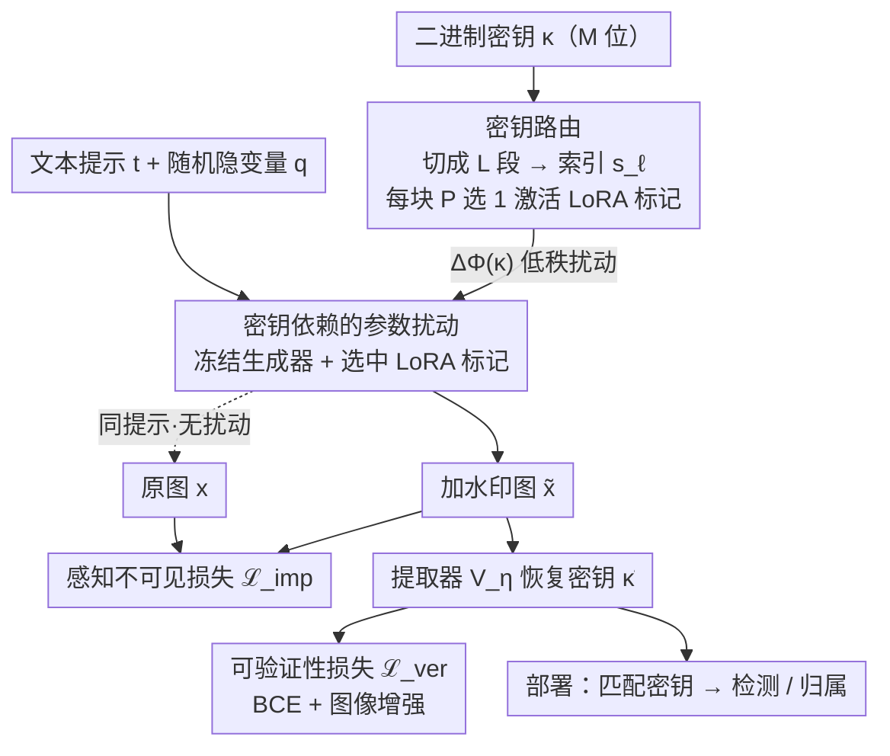

# MOLM: Mixture of LoRA Markers

**会议**: ICLR 2026  
**arXiv**: [2510.00293](https://arxiv.org/abs/2510.00293)  
**代码**: 未公开  
**领域**: 图像生成  
**关键词**: 水印, LoRA, 扩散模型, 路由机制, 鲁棒性

## 一句话总结

提出 MOLM 水印框架，将 LoRA 适配器重新解释为水印载体，通过二进制密钥驱动的路由机制在冻结生成模型中嵌入可验证、鲁棒的水印，无需逐密钥重训练。

## 研究背景与动机

- 扩散模型生成的高质量图像引发真实性和归属权担忧
- 现有水印方法面临三大挑战：
  1. **脆弱性**：对抗攻击（再生攻击、平均攻击）易破解水印
  2. **质量冲突**：提升鲁棒性通常引入可见退化
  3. **高成本**：更换水印密钥需要昂贵的重训练（如 Stable Signature 需逐密钥训练）

## 方法详解

### 整体框架

MOLM 要解决的是：怎么给冻结的扩散模型嵌入水印，既不掉画质、又抗攻击，还能在**不重训练**的前提下随时换密钥。它的做法是把水印统一看成对生成器参数施加一个由密钥决定的扰动，写成 $\tilde{\mathbf{x}} = \mathcal{G}_{\Phi + \Delta\Phi(\kappa)}(\mathbf{q}, \mathbf{t})$——主干 $\Phi$ 始终冻结，水印信息全压进扰动 $\Delta\Phi(\kappa)$ 里。整条流水线这样转：拿到一个 $M$ 位二进制密钥 $\kappa$，先把它切成若干段、每段索引到一组预置 LoRA 适配器里的某一个，被选中的这批适配器并联进生成器的若干块，就实例化出了 $\Delta\Phi(\kappa)$；冻结生成器带着这批适配器跑一遍采样，输出加水印图 $\tilde{\mathbf{x}}$；验证时再用一个提取器从图里把密钥读回来做检测/归属。训练只动这批适配器和提取器，用感知损失保画质、用密钥恢复损失保可读出。

### 关键设计

**1. 密钥依赖的参数扰动：把形态各异的水印统一成一个可学习的权重偏移**

现有水印方法编码-解码、后门、采样三大类各做各的，互不通用、也难比较。MOLM 先把它们归约成同一个形式：在冻结主干 $\Phi$ 上叠加一个由密钥决定的扰动，生成过程改写为 $\tilde{\mathbf{x}} = \mathcal{G}_{\Phi + \Delta\Phi(\kappa)}(\mathbf{q}, \mathbf{t})$，其中 $\Delta\Phi(\kappa)$ 就是水印的全部载体。这个视角的好处是把"水印强度、容量、能不能换密钥"这些性质全部转化成对 $\Delta\Phi$ 的**结构设计**问题——只要扰动是参数化、可路由的，换密钥就不必再碰主干。它为后面用 LoRA 来实例化扰动、用路由来切换密钥铺好了路，也是论文区别于把扰动绑死到单一密钥的做法的根基。

**2. LoRA 标记 + 密钥路由：用密钥分段索引适配器，换密钥免重训练**

这是 MOLM 的核心机制，专门兑现"换密钥不重训练"。它在生成器里预选 $L$ 个块，每块并联放 $P$ 个低秩 LoRA 适配器当"标记"，全模型共 $L\times P$ 个适配器一次性训好。生成时一个 $M$ 位密钥被切成 $L$ 个互不重叠的段，每段 $\log_2 P$ 位，转成十进制索引 $s_\ell \in [P]$，就选中第 $\ell$ 块里的第 $s_\ell$ 个适配器；被选中的块前向变成 $\boldsymbol{h}_\ell = \mathcal{F}_\ell(\boldsymbol{h}_{\ell-1}) + \alpha\,\mathcal{A}_\ell^{(s_\ell)}(\boldsymbol{h}_{\ell-1})$，即在原输出上加一条选中适配器的低秩支路（$\alpha$ 为固定缩放，未选块保持 $\boldsymbol{h}_\ell=\mathcal{F}_\ell(\boldsymbol{h}_{\ell-1})$），整条路由 $\{s_\ell\}_{\ell\in[L]}$ 就是这个密钥的"指纹"。默认在 VAE 解码器取 $L=14$ 个 ResNet 块、每块 $P=4$，于是单块编码 $2$ 位、总密钥 $M=14\times 2=28$ 位。因为密钥只决定"激活哪条已训好的支路"、不改任何权重，换密钥零重训练，这正是相对 Stable Signature 等逐密钥训练方法的根本优势；密钥被摊到多个块上分布式编码，也让单点被攻击破坏不至于整体失效，带来天然的鲁棒冗余。

> ⚠️ 路由掩码在整条去噪轨迹上保持不变（同一密钥总走同一执行路径），以原文为准。

**3. 提取器 + 联合训练目标：不掉画质的同时保证密钥可读回**

光能嵌还不够，得保证嵌进去的水印既看不出来、又读得回来，这正对应论文反复强调的"鲁棒性常与画质冲突"。MOLM 用一个深度网络提取器 $\mathcal{V}_\eta$ 把图映成 $M$ 个 logit，过 sigmoid 后逐位四舍五入就得到恢复密钥 $\tilde{\kappa}$。训练只优化适配器参数 $\Psi$ 和提取器参数 $\eta$，由两项损失约束并显式权衡这对冲突。感知不可见损失比对加水印图与同提示原图在多层特征上的差异，把视觉退化压到最低：

$$\mathcal{L}_{\text{imp}} = \mathbb{E}_{\kappa} \frac{1}{N} \sum_{n=1}^N \sum_{k=1}^K w_k \big\|\varphi_k(\mathcal{G}_{\Phi+\Psi(\kappa)}(\mathbf{q}, \mathbf{t}_n)) - \varphi_k(\mathcal{G}_\Phi(\mathbf{q}, \mathbf{t}_n))\big\|_2^2$$

其中 $\{\varphi_k\}$ 是固定的感知特征提取器（如 LPIPS）、$w_k$ 是各层权重。可验证性损失用二元交叉熵逼着提取器从图里逐位恢复密钥：

$$\mathcal{L}_{\text{ver}} = \mathbb{E}_{T \sim \Pi}\,\frac{1}{NM} \sum_{n,m} \big[-\kappa_m \log \sigma(u_m) - (1-\kappa_m)\log(1-\sigma(u_m))\big]$$

关键在 $T\sim\Pi$ 这一步：训练时对水印图随机施加裁剪、旋转、压缩等图像增强再喂给提取器，使解码在这些扰动下仍成立——鲁棒性是这样被训进去的，而不是事后硬撑。总目标 $\min_{\Psi, \eta} [\mathcal{L}_{\text{ver}} + \lambda \mathcal{L}_{\text{imp}}]$ 用权重 $\lambda$ 把可恢复性和画质这对冲突摆上台面显式平衡。

## 实验关键数据

### 检测与鲁棒性对比（Stable Diffusion v1.5, MS-COCO）

| 方法 | FID(↓) | SSIM(↑) | Clean | Crop | Rot | Resize | Bright | JPEG | 密钥大小 |
|------|--------|---------|-------|------|-----|--------|--------|------|---------|
| Stable Signature | 29.5 | 0.85 | 0.99 | 0.97 | 0.56 | 0.72 | 0.95 | 0.89 | 48 |
| AquaLoRA | 30.5 | 0.63 | 0.95 | 0.91 | 0.45 | 0.91 | 0.72 | 0.94 | 48 |
| WOUAF | 27.8 | 0.73 | 0.98 | 0.96 | 0.85 | 0.71 | 0.98 | 0.98 | 32 |
| **MOLM** | **27.7** | 0.77 | 0.98 | 0.91 | **0.84** | **0.90** | 0.95 | 0.89 | 28 |

### 对抗攻击鲁棒性（增强训练后）

| 攻击类型 | 参数 | Bit Acc. | FID |
|---------|------|----------|-----|
| Cheng2020 压缩 | q=1/3/6 | 0.94/0.95/0.97 | 30.1/28.9/28.7 |
| 扩散再生 | steps=30/60/100 | 0.85/0.85/0.82 | 30.2/29.9/31.2 |
| PGD 对抗 | ε=10⁻³/10⁻²/10⁻¹ | 1.00/0.99/0.96 | 28.4/28.6/29.0 |
| 平均攻击(5000 图) | k=5000 | ≥0.96 | - |

### 关键发现

1. MOLM 在更小密钥（28 位 vs 48 位）下实现了综合最优鲁棒性
2. 平均攻击下 MOLM 维持 ≥0.96 精度（5000 图），WOUAF 降至 <0.90
3. 伪造攻击下 MOLM 保持随机猜测水平（≈0.5），有效防伪
4. 训练仅需约 1 天（单 A100），推理无额外开销

## 亮点与洞察

1. **概念创新**：将 LoRA 从模型适配工具重新定义为水印载体，思路新颖
2. **无需逐密钥训练**：容量通过路由层数和适配器数量自然扩展
3. **分布式冗余编码**：映射分析表明密钥在多个块之间冗余编码，增强鲁棒性
4. **采样无关性**：不依赖特定采样器（不同于 Tree-Ring 等需要确定性采样的方法）

## 局限性

- UNet 路由实验导致生成质量下降，密钥大小和保真度需权衡
- 仅在 SD v1.5 和 FLUX 上验证，更多架构需要进一步测试
- 28 位密钥容量可能不足以支撑大规模用户归属
- 攻击者独立重训练模型时水印不可迁移（设计预期）

## 相关工作

- **编码-解码方法**：Hidden, Stable Signature
- **后门方法**：DreamBooth 微调, SleeperMark
- **生成过程方法**：Tree-Ring, Gaussian Shading, ROBIN
- **LoRA 混合专家**：MoLE

## 评分

- 新颖性：⭐⭐⭐⭐⭐ — LoRA-as-watermark 的概念转换非常巧妙
- 技术深度：⭐⭐⭐⭐ — 框架设计完整，攻击评估全面
- 实验完整性：⭐⭐⭐⭐ — 多种攻击、多数据集、多架构验证
- 实用价值：⭐⭐⭐⭐ — 高效可部署的水印方案

<!-- RELATED:START -->

## 相关论文

- [\[ECCV 2024\] Implicit Style-Content Separation using B-LoRA](../../ECCV2024/image_generation/implicit_style-content_separation_using_b-lora.md)
- [\[AAAI 2026\] T-LoRA: Single Image Diffusion Model Customization Without Overfitting](../../AAAI2026/image_generation/t-lora_single_image_diffusion_model_customization_without_overfitting.md)
- [\[ICCV 2025\] MoFRR: Mixture of Diffusion Models for Face Retouching Restoration](../../ICCV2025/image_generation/mofrr_mixture_of_diffusion_models_for_face_retouching_restoration.md)
- [\[ICML 2025\] Gaussian Mixture Flow Matching Models](../../ICML2025/image_generation/gaussian_mixture_flow_matching_models.md)
- [\[CVPR 2026\] ChimeraLoRA: Multi-Head LoRA-Guided Synthetic Datasets](../../CVPR2026/image_generation/chimeralora_multi-head_lora-guided_synthetic_datasets.md)

<!-- RELATED:END -->
