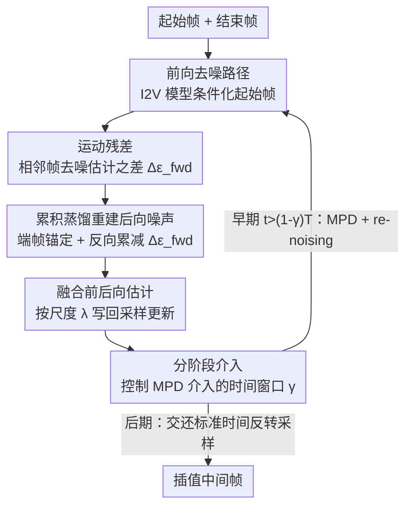

# Motion Prior Distillation in Time Reversal Sampling for Generative Inbetweening

**会议**: ICLR 2026  
**arXiv**: [2602.12679](https://arxiv.org/abs/2602.12679)  
**代码**: [https://vvsjeon.github.io/MPD/](https://vvsjeon.github.io/MPD/)  
**领域**: 扩散模型 / 视频生成  
**关键词**: 生成式帧插值, 运动先验, 时间反转采样, 推理时蒸馏, SVD  

## 一句话总结

提出 Motion Prior Distillation (MPD)，一种推理时蒸馏方法，将前向路径的运动残差蒸馏到后向路径中，从根本上解决了时间反转采样中双向运动先验冲突的问题，无需额外训练即可实现更连贯的生成式帧插值。

## 研究背景与动机

**生成式帧插值的兴起**：I2V 扩散模型的进步使得帧插值从传统光流方法扩展到语义级"生成式 inbetweening"

**时间反转采样的核心思路**：使用起始帧和结束帧分别条件化前向/后向去噪路径，然后融合中间帧

**运动先验冲突问题**：I2V 模型被训练为从单帧向前生成连续帧；当以结束帧为条件反向生成时，模型同样倾向于"向前看"而非回溯历史帧，产生前向生成偏差

**并行方法的离流形问题**：线性插值两条路径（如 TRF）使样本偏离学习到的数据流形，导致振荡和伪影

**顺序方法仍有冲突**：交替去噪前向/后向路径（如 ViBiDSampler）虽保持流形一致，但两条路径的运动先验依然冲突

**现象表现**：冲突导致幽灵伪影、反向播放、物体消失等问题，严重影响生成质量

## 方法详解

### 整体框架

MPD 把时间反转采样从"前向、后向两条独立去噪路径再融合"改造成"只跑一条前向路径、后向路径靠蒸馏重建"。其关键观察是：后向路径之所以制造冲突，是因为它自己也带了一套从结束帧出发的运动先验；既然这套先验本就该和前向运动互逆，那就不必让模型重新去噪它，而是从前向路径已经算出的运动里反推出后向噪声。具体到一步去噪：先跑前向路径，从相邻帧去噪估计之差里取出**运动残差**，再用它**累积蒸馏重建出后向噪声**（端帧锚定保证落点正确），两条路径估计融合后写回采样更新；这套蒸馏由**分阶段介入**控制，只在决定全局运动轨迹的早期步骤开启、后期交还标准采样器精修端点与细节。

### 关键设计

**1. 运动残差：把前向去噪估计的帧间差当作运动载体**

MPD 不直接操作整帧，而是看相邻帧去噪估计之间的残差。在第 $i$ 帧上定义图像残差 $\Delta \hat{x}_{0,c_{\text{start}}}^{(i)} := \hat{x}_{0,c_{\text{start}}}^{(i)} - \hat{x}_{0,c_{\text{start}}}^{(i-1)}$，再由它折算出前向噪声残差 $\Delta \epsilon_{\text{fwd}} = (\Delta x_t - \Delta \hat{x}_{0,c_{\text{start}}})/\sigma_t$。这个残差刻画了"从前一帧到后一帧画面如何变化"，本质上就是模型对运动的估计——这正是要蒸馏给后向路径的东西，从而避免后向路径自己再生出一套相互矛盾的运动。

**2. 累积蒸馏重建后向噪声：用前向运动倒推后向路径，而非独立去噪**

后向路径不再喂结束帧条件 $c_{\text{end}}$ 去跑模型，而是从端点出发逐帧累减前向残差重建出来。先用结束帧 $z_{\text{end}}$ 锚定后向噪声的第一帧 $\epsilon_{\text{bwd}}^{(1)} = ((x_t')^{(1)} - z_{\text{end}})/\sigma_t$，再沿时间反向累积扣除前向噪声残差得到每一帧的后向噪声 $\epsilon_{\text{bwd}}^{(i)} = \epsilon_{\text{bwd}}^{(1)} - \sum_{k=2}^{i} \Delta \epsilon_{\text{fwd}}^{(k)}$。由此反解出不带 $c_{\text{end}}$ 条件的后向去噪估计 $\hat{x}_{0,c_{\text{start}}^*}' = x_t - \sigma_t \epsilon_{\text{bwd}}$，最后与前向估计按尺度 $\lambda$ 融合 $\tilde{x}_{0,c_{\text{start}}} = (1-\lambda)\hat{x}_{0,c_{\text{start}}} + \lambda(\hat{x}_{0,c_{\text{start}}^*}')'$，并写回采样更新 $x_{t-1} = \tilde{x}_{0,c_{\text{start}}} + \frac{\sigma_{t-1}}{\sigma_t}(x_t - \hat{x}_{0,\varnothing})$。因为后向噪声完全由前向运动推出，两条路径共享同一套运动先验，冲突从源头被消除，同时端点仍由 $z_{\text{end}}$ 锚住保证落点正确。

**3. 分阶段介入：早期蒸馏定轨迹，后期标准采样补端点与细节**

蒸馏并非全程开启。在早期步骤（$t > (1-\gamma)T$）施加 MPD 并配合 re-noising，因为这一阶段决定全局运动轨迹的走向，正是冲突最致命的地方；进入后期则切回标准时间反转采样（TRF 的并行融合或 ViBiD 的顺序去噪），让端点一致性和高频细节由原采样器精修。蒸馏比例 $\gamma$ 控制介入的时间窗口，这也是 MPD 能即插即用叠加在 TRF 与 ViBiD 之上的原因——它只接管最易出错的前期，不改动后期管线。

### 损失函数 / 训练策略

MPD 是纯推理时方法、不需训练，其作用从优化目标的角度看尤为清晰。标准时间反转采样隐含的是一个双路径目标 $\mathcal{L} = \frac{1}{\sigma_t^2}\|\hat{x}_{0,c_{\text{start}}} - (\hat{x}_{0,c_{\text{end}}}')\|_2^2$，要让前向估计去对齐一个独立条件 $c_{\text{end}}$ 产生的后向估计，两端运动先验天然打架。MPD 把它替换为单路径目标 $\mathcal{L} = \frac{1}{\sigma_t^2}\|\hat{x}_{0,c_{\text{start}}} - (\hat{x}_{0,c_{\text{start}}^*}')\|_2^2$，对齐对象换成由前向运动重建、不引入端帧先验的 $\hat{x}_{0,c_{\text{start}}^*}'$，从而在不增加任何训练的前提下让两条路径的运动语义一致。

## 实验关键数据

### DAVIS 数据集

| 方法 | LPIPS ↓ | FID ↓ | FVD ↓ | VBench ↑ | VBench++ ↑ |
|------|---------|-------|-------|----------|-----------|
| TRF | 0.3127 | 56.894 | 674.31 | 0.7618 | 0.9352 |
| GI | 0.2432 | 48.427 | 654.91 | 0.7747 | 0.9320 |
| FCVG | 0.2347 | 38.997 | 621.82 | 0.7904 | 0.9353 |
| ViBiD | 0.2492 | 39.883 | 559.49 | 0.7733 | 0.9387 |
| **Ours + TRF** | **0.2212** | **34.910** | 612.17 | **0.7992** | 0.9330 |
| **Ours + ViBiD** | 0.2220 | 37.241 | **527.05** | 0.7845 | **0.9474** |

### Pexels 数据集

| 方法 | LPIPS ↓ | FID ↓ | FVD ↓ | VBench++ ↑ |
|------|---------|-------|-------|-----------|
| FCVG | 0.1160 | 35.269 | 525.08 | 0.9701 |
| **Ours + TRF** | 0.1149 | **34.470** | **460.99** | **0.9862** |
| **Ours + ViBiD** | **0.1028** | 34.775 | 412.66 | 0.9605 |

### 用户研究（30 名参与者）

| 方法 | 对齐得分 ↑ | 伪影率 ↓ | 不真实运动 ↓ |
|------|-----------|---------|------------|
| TRF | -0.3119 | 28.09% | 25.24% |
| ViBiD | -0.0678 | 28.10% | 25.24% |
| **Ours + TRF** | **0.3060** | 20.36% | 22.62% |
| **Ours + ViBiD** | 0.2440 | **8.93%** | **9.88%** |

## 亮点与洞察

1. **问题定位精准**：将运动先验冲突识别为时间反转采样的根本问题，而非简单的路径融合方式
2. **单路径设计**：刻意不去噪后向路径，而是通过运动残差蒸馏重建，彻底消除第二条运动先验
3. **即插即用**：可直接叠加到 TRF（并行）或 ViBiD（顺序）等现有方法之上
4. **无需训练**：纯推理时方法，在单张 RTX 4090 上运行
5. **用户研究的说服力**：伪影检出率降至 8.93%，不真实运动仅 9.88%，远优于基线

## 局限与展望

1. 仅在 SVD 上验证，未扩展到 Wan、CogVideoX 等更新的视频模型
2. 蒸馏比例 $\gamma$、re-noising 步数 $k$、插值尺度 $\lambda$ 需要手动调参
3. 运动残差假设可能在极大运动（如场景切换）或非刚体运动下失效
4. 生成帧数受 SVD 限制（14-25 帧），长视频场景未探索
5. 计算开销：MPD 在早期步骤中需要额外的前向计算残差

## 相关工作与启发

- **TRF (Feng et al.)**：首个时间反转采样方法（并行融合），MPD 可直接叠加改进
- **ViBiDSampler (Yang et al.)**：顺序式时间反转采样 + CFG++，MPD 同样兼容
- **GI (Wang et al.)**：通过旋转 temporal SA 微调反向运动，需训练；MPD 无需训练
- **FCVG (Zhu et al.)**：注入线对应关系作为帧级条件，但根本的运动先验冲突仍未解决
- 启发：扩散模型的去噪估计残差本身携带丰富的运动语义，可用于其他时序一致性任务（如视频编辑、视频修复）

## 评分

- 新颖性: ⭐⭐⭐⭐ — 运动残差蒸馏的思路新颖且分析深入
- 实验充分度: ⭐⭐⭐⭐⭐ — 定量+用户研究+消融，说服力强
- 写作质量: ⭐⭐⭐⭐ — 公式推导完整，图示清晰，问题动机阐述好
- 价值: ⭐⭐⭐⭐ — 对生成式帧插值领域有直接推进，且无训练的实用性高

<!-- RELATED:START -->

## 相关论文

- [\[ICLR 2026\] Large Scale Diffusion Distillation via Score-Regularized Continuous-Time Consistency](large_scale_diffusion_distillation_via_score-regularized_continuous-time_consist.md)
- [\[ICCV 2025\] Inference-Time Diffusion Model Distillation](../../ICCV2025/image_generation/inference-time_diffusion_model_distillation.md)
- [\[CVPR 2026\] Anchoring and Rescaling Attention for Semantically Coherent Inbetweening](../../CVPR2026/image_generation/anchoring_and_rescaling_attention_for_semantically_coherent_inbetweening.md)
- [\[ICLR 2026\] Conditionally Whitened Generative Models for Probabilistic Time Series Forecasting](conditionally_whitened_generative_models_for_probabilistic_time_series_forecasti.md)
- [\[CVPR 2026\] Efficient Weighted Sampling via Score-based Generative Models](../../CVPR2026/image_generation/efficient_weighted_sampling_via_score-based_generative_models.md)

<!-- RELATED:END -->
