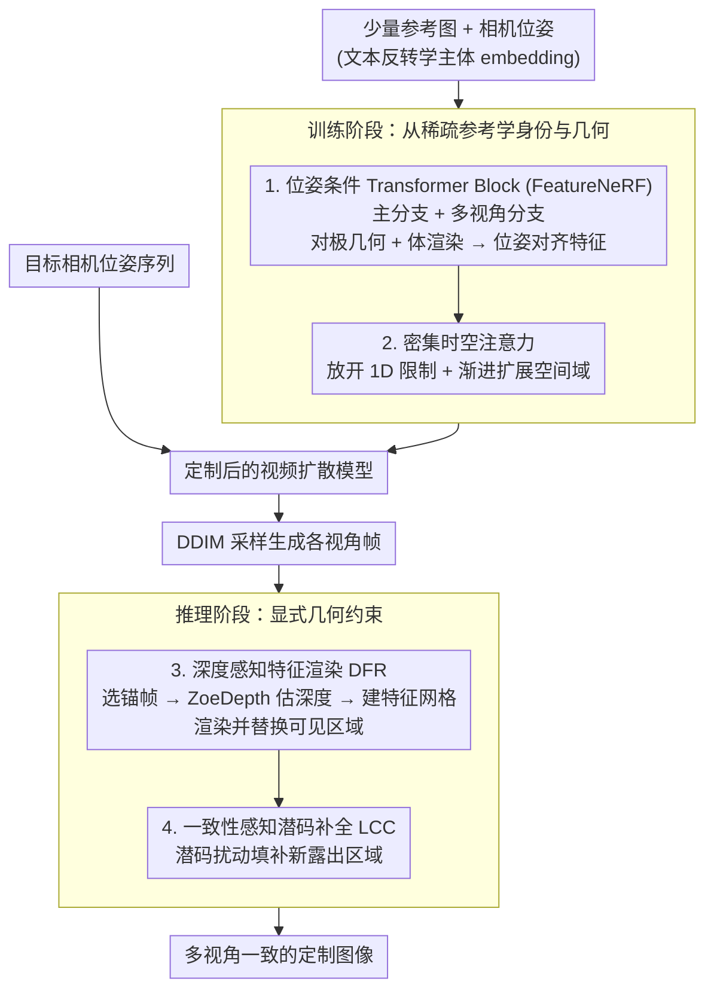

# MVCustom: Multi-View Customized Diffusion via Geometric Latent Rendering and Completion

**会议**: ICLR 2026  
**arXiv**: [2510.13702](https://arxiv.org/abs/2510.13702)  
**代码**: [项目页](https://minjung-s.github.io/mvcustom/)  
**领域**: 扩散模型 / 个性化生成  
**关键词**: 多视角定制生成, 相机位姿控制, 特征场渲染, 视频扩散, 几何一致性  

## 一句话总结

提出多视角定制（multi-view customization）新任务并设计 MVCustom 框架，通过视频扩散骨干网络结合密集时空注意力实现整体帧一致性，在推理阶段引入深度感知特征渲染和一致性感知潜码补全两项技术，首次同时实现相机位姿控制、主体身份保持和跨视角几何一致性。

## 研究背景与动机

**领域现状**：可控图像生成有两大关键维度——相机控制（多视角生成）和定制化（根据参考图像保持主体身份）。两者各自都有大量工作，但**联合**实现的方法几乎空白。

**现有痛点**：
   - 传统定制方法（DreamBooth, Custom Diffusion）不支持相机位姿控制
   - 多视角生成方法（CameraCtrl, SEVA）不支持个性化定制
   - 结合视角控制的定制方法（CustomDiffusion360, CustomNet）只关注主体，忽略背景跨视角的一致性
   - 直接将定制方法（如 DreamBooth-LoRA）应用到多视角生成骨干上，会丢失主体身份和减弱相机控制能力

**核心矛盾**：多视角生成依赖大规模数据学习 3D 几何，而定制场景只有少量参考图像——数据稀缺与几何一致性需求之间存在根本性矛盾。

**本文目标** 定义并解决"多视角定制"任务：(i) 生成图像匹配指定相机位姿；(ii) 保持参考图像的主体身份；(iii) 主体和背景在跨视角下都保持一致性。

**切入角度**：将训练和推理阶段分离——训练阶段用有限数据学习主体身份和几何，推理阶段用显式几何约束（深度渲染）确保一致性。

**核心 idea**：用视频扩散骨干学时序一致性 + 特征场建模几何 + 推理时深度引导渲染确保跨视角几何一致。

## 方法详解

### 整体框架

MVCustom 要解决的是"多视角定制"：给定少量参考图像和一串目标相机位姿，生成一组既保持主体身份、又在不同视角下几何一致的图像。它把这件事拆成训练和推理两段来做。训练阶段以 AnimateDiff 的视频扩散模型为骨干，把原来只在时间维度交互的 1D 注意力换成密集时空注意力，再插入带 FeatureNeRF 的位姿条件 Transformer block 注入相机几何，并用文本反转（textual inversion）学一个主体 embedding，从有限的参考图里抠出身份和粗略几何。推理阶段则不再依赖网络隐式记忆几何，而是显式地约束：先用深度感知特征渲染把锚帧的内容按几何投影到其他视角，再用一致性感知潜码补全去填那些因视角移动而新冒出来的区域。

### 关键设计

**1. 位姿条件 Transformer Block（FeatureNeRF）：让扩散模型从几张参考图里学到 3D 几何**

定制场景只有少量参考图，模型必须从中既学到主体身份又学到它的三维结构。这里设计了双分支结构：主分支负责生成目标视角的特征图，多视角分支则通过 FeatureNeRF 把参考视图的特征聚合过来。FeatureNeRF 的做法是利用对极几何和体渲染，从一组带位姿的参考特征 $\{(\bm{X}_i, \pi_i)\}$ 合成出与目标位姿对齐的特征图 $\bm{X}_y$。这样相机位姿信息就以几何渲染的方式注入扩散过程，模型得以从稀疏参考中恢复出位姿对齐的主体表示。

**2. 密集时空注意力（Dense Spatio-Temporal Attention）：让特征替换时空间流能正确传播**

AnimateDiff 原始的 1D 时间注意力只在相同空间位置的帧之间交互，可一旦视角变化、画面发生空间位移，同一物体会落到不同的像素位置，这种注意力就建模不了。密集 3D 时空注意力放开这个限制，允许任意空间位置跨帧交互；为了不破坏预训练知识、保持训练稳定，空间注意力域是渐进式扩展的。消融实验显示这一步是关键：做特征替换（feature replacement）时，1D 时间注意力无法把空间流正确传出去，只有密集时空注意力才能正确传播跨帧的空间一致性。

**3. 深度感知特征渲染（Depth-Aware Feature Rendering, DFR）：推理时用显式几何约束补上训练数据的不足**

训练数据太少，没法像大规模多视角方法那样靠海量数据隐式学会几何一致，于是推理阶段直接上显式约束。具体是先选一个锚帧，用深度估计器（ZoeDepth）估出深度，构建锚帧的特征网格 $\mathcal{M}_a = (\bm{P}_a, \bm{F}_a, \mathcal{T}_a)$，再用可微网格渲染器把锚帧特征渲染到其余相机位姿下。在 DDIM 采样的前 35 步里，把目标帧的可见区域直接替换成渲染来的特征：

$$\hat{\bm{F}}_n = \bm{M}_n^a \odot \bm{F}_n^a + (1-\bm{M}_n^a) \odot \bm{F}_n$$

其中 $\bm{M}_n^a$ 标记锚帧在第 $n$ 个视角下的可见区域。这样锚帧能看到的内容在所有视角下都按几何严格对齐，背景会随相机运动正确平移，而不是像纯微调那样在不同视角里静止不动。

**4. 一致性感知潜码补全（Consistent-Aware Latent Completion, LCC）：把视角移动后新露出来的区域填合理**

特征渲染只能搬运锚帧看得见的部分，视角一变总会有新区域（disoccluded regions）冒出来，这些地方渲染给不了内容，得靠生成先验来补。做法是在去噪过程中对中间潜码 $x_t$ 先预测出 $x_0$，再重新加噪回 $t$ 得到一个扰动潜码 $x_t'$，然后把原始潜码里那些新可见区域替换成扰动版本，并从时间步 $T$ 一路迭代到接近 $T$ 的早期时间步 $\tau$。这相当于让模型在保持已有几何的同时，用自身先验重新"想象"出新区域的合理内容，避免直接复制锚帧造成的重复纹理。

### 损失函数 / 训练策略

标准去噪损失 + FeatureNeRF 损失。训练数据使用 WebVid10M 子集（430K 样本）训练视频骨干，CO3Dv2 数据集用于定制实验（车、椅子、摩托车各 3 个概念）。

## 实验关键数据

### 主实验

| 方法 | 相机位姿精度↑ | 多视角一致性↓ | 身份保持↓ | 文本对齐↑ |
|------|-------------|-------------|----------|----------|
| Custom Img + Img-MV gen | 0.675 | 0.214 | 0.504 | 0.676 |
| Txt-MV gen with DB | 0.283 | **0.116** | 0.557 | 0.723 |
| CustomDiffusion360 | 0.000 | 0.190 | **0.417** | **0.806** |
| **MVCustom (ours)** | **0.735** | 0.121 | 0.448 | 0.744 |

MVCustom 是唯一在相机位姿精度和多视角一致性上同时取得高分的方法。

### 消融实验

| 配置 | 效果 |
|------|------|
| 仅定制微调（无 DFR/LCC） | 背景在不同视角下静态不变 |
| + 深度感知特征渲染 (DFR) | 背景按相机运动正确平移，但新可见区域重复内容 |
| + 一致性感知潜码补全 (LCC) | 新可见区域自然补全，完整几何一致 |
| 1D 时间注意力 + 特征替换 | 空间流传播失败 |
| 密集时空注意力 + 特征替换 | 正确传播空间一致性 |

### 关键发现

- CustomDiffusion360 的 COLMAP 重建完全失败（位姿精度=0），说明仅关注主体而忽略背景一致性是不可行的
- 深度感知特征渲染和潜码补全是互补的：前者保证可见区域的几何一致，后者处理不可见区域的生成
- 密集时空注意力是特征替换策略生效的必要条件
- MVCustom 计算开销较大（130.92s, 19.29GB），主要来自深度估计器和特征替换

## 亮点与洞察

- **任务定义清晰且系统化**：通过 Table 1 系统性地分析了现有方法在多视角定制各维度的能力缺失，定义了一个重要且未被满足的任务
- **训练-推理分离的巧妙设计**：训练阶段用有限数据学习主体表示，推理阶段用显式几何约束弥补数据不足——这种分离策略可推广到其他数据稀缺的生成任务
- **视频扩散 → 多视角的转化**：利用视频模型的时序一致性来获得多视角一致性，是一个有效的跨任务迁移

## 局限与展望

- 无法通过文本改变物体的内在姿态（如从"坐着"变为"站着"），因为 FeatureNeRF 学到的是固定的 canonical pose
- 计算开销显著高于竞争方法（130.92s vs 27-97s，19.29GB vs 5-7GB）
- 评估仅在 CO3Dv2 的 3 个类别上进行，泛化性未充分验证
- 深度估计质量直接影响渲染结果，对复杂场景可能不鲁棒

## 相关工作与启发

- **vs CustomDiffusion360**: 同样做视角可控定制，但 CD360 忽略背景一致性导致 COLMAP 失败，MVCustom 通过视频骨干+推理时几何约束解决
- **vs SEVA (Img-MV gen)**: 单张图像输入的多视角生成，但缺乏主体身份信息，远离输入视角时严重退化
- **vs CameraCtrl + DB**: 直接对多视角模型做 DreamBooth 微调，相机控制能力反而退化
- 深度感知特征渲染的思路可迁移到其他需要几何一致性的生成任务（如视频编辑、3D 感知的 inpainting）

## 评分

- 新颖性: ⭐⭐⭐⭐ 任务定义新颖，推理阶段的几何约束策略巧妙
- 实验充分度: ⭐⭐⭐ 类别较少（3类），缺少大规模验证
- 写作质量: ⭐⭐⭐⭐ 问题定义清晰，方法描述详尽
- 价值: ⭐⭐⭐⭐ 开辟了多视角定制生成的新方向，有 3D 内容创作的应用前景

<!-- RELATED:START -->

## 相关论文

- [\[CVPR 2026\] LaRP: Efficient Multi-View Inpainting with Latent Reprojection Priors](../../CVPR2026/image_generation/larp_efficient_multi-view_inpainting_with_latent_reprojection_priors.md)
- [\[CVPR 2025\] LaTexBlend: Scaling Multi-concept Customized Generation with Latent Textual Blending](../../CVPR2025/image_generation/latexblend_scaling_multi-concept_customized_generation_with_latent_textual_blend.md)
- [\[CVPR 2026\] Correspondence-Attention Alignment for Multi-View Diffusion Models](../../CVPR2026/image_generation/correspondence-attention_alignment_for_multi-view_diffusion_models.md)
- [\[CVPR 2026\] InstructMix2Mix: Consistent Sparse-View Editing Through Multi-View Model Personalization](../../CVPR2026/image_generation/instructmix2mix_consistent_sparse-view_editing_through_multi-view_model_personal.md)
- [\[ICLR 2026\] SSCP: Flow-Based Single-Step Completion for Efficient and Expressive Policy Learning](flow-based_single-step_completion_for_efficient_and_expressive_policy_learning.md)

<!-- RELATED:END -->
