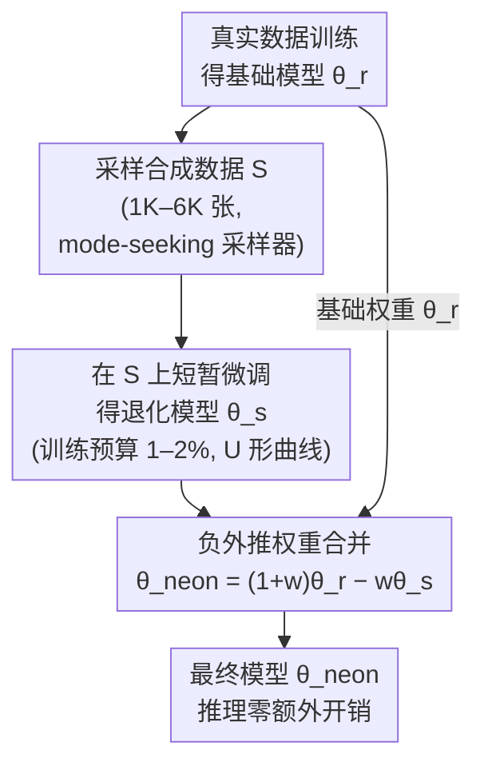

# Neon: Negative Extrapolation From Self-Training Improves Image Generation

**会议**: ICLR 2026 Oral  
**arXiv**: [2510.03597](https://arxiv.org/abs/2510.03597)  
**代码**: [github.com/VITA-Group/Neon](https://github.com/VITA-Group/Neon)  
**领域**: 图像生成 / 自训练  
**关键词**: self-training, model collapse, weight merging, negative extrapolation, FID

## 一句话总结
提出 Neon，一种仅需 <1% 额外训练计算的后处理方法：先用模型自身生成的合成数据微调导致退化，再反向外推远离退化权重，证明 mode-seeking 采样器导致合成/真实数据梯度反对齐，因此负外推等价于向真实数据分布优化，在 ImageNet 256×256 上将 xAR-L 提升至 SOTA FID 1.02。

## 研究背景与动机

**领域现状**：生成模型的规模化受到高质量训练数据稀缺的制约。用模型自身合成数据做自训练（self-training）是直觉方案，但会导致 **模型自吞噬障碍（MAD / Model Collapse）**——样本质量和多样性快速退化。

**现有痛点**：(a) SIMS 等自改进方法需要 2× 推理 NFE 和大量合成样本（100K）及额外训练计算（20%）；(b) DDO 需要多轮迭代（16 轮×50K 样本）；(c) 现有方法没有统一的理论解释为什么自训练会退化以及如何利用退化。

**核心矛盾**：自训练退化看似浪费，但退化方向本身包含信息——如果能理解退化的方向，就能反向利用它。

**本文目标** 能否将自训练的退化信号转化为自改进信号？提供理论保证？

**切入角度**：作者观察到 mode-seeking 采样器（temperature <1、top-k、有限步 ODE solver）会使合成数据偏向模型分布的高概率区域，导致合成数据和真实数据的群体梯度 **反对齐**（$\cos\varphi < 0$）。因此，反向利用自训练梯度等价于向真实数据分布优化。

**核心 idea**：自训练会让模型变差，但"变差的方向"恰好是"变好的反方向"，所以反向外推就能改进模型。

## 方法详解

### 整体框架
Neon 想解决的问题是：自训练（拿模型自己生成的数据再喂回去微调）几乎必然让生成模型退化，那能不能反过来把这个退化方向变成改进信号。它的做法极简，整条流水线只在训练结束后追加三步：先用基础模型 $\theta_r$ 采样出一小批合成数据 $S$（只需约 1K-6K 张），在 $S$ 上短暂微调得到一个"故意变差"的退化模型 $\theta_s$，最后在参数空间做一次负外推 $\theta_{\text{neon}} = (1+w)\theta_r - w\theta_s$（$w>0$）得到最终模型。整个过程不碰推理流程、不需要新的真实数据，额外计算不到原始训练量的 1%。支撑这条流水线的两条理论（反对齐定理、风险下降定理）保证了"反方向就是改进方向"，U 形预算曲线则决定退化模型该退到什么程度最准。

### 关键设计

**1. 负外推权重合并：沿"基础→退化"的反方向多走一步**

自训练会把模型推向 $\theta_s$ 这个更差的位置，Neon 的核心动作就是不去接受这一步，而是沿相反方向把权重推远：$\theta_{\text{neon}} = \theta_r + w(\theta_r - \theta_s)$。换句话说，$(\theta_r - \theta_s)$ 是"远离退化"的方向向量，乘上正系数 $w$ 加回基础权重，就等于在改进方向上多迈一步。实现上它只是一行权重融合代码 `merged[k] = base[k] - w * (aux[k] - base[k])`，因此和 SIMS 那类需要在推理时同时跑两个模型、付出 2× NFE 的方案不同，Neon 合并完得到的就是一个普通权重，推理零额外开销。

**2. 反对齐理论（Theorem 1）：为什么反方向就是对的方向**

负外推之所以成立，靠的是一个关于梯度方向的判断。把基础模型在真实数据上的群体梯度记作 $r_d = \nabla_\theta \mathcal{L}_{\text{real}}(\theta_r)$，在合成数据上的群体梯度记作 $r_s = \nabla_\theta \mathcal{L}_{\text{synth}}(\theta_r)$。论文证明：只要采样器是 mode-seeking 的（temperature $<1$、top-k、有限步 ODE solver 这类把样本拉向高概率区的设置，满足单调重加权 monotone reweighting 条件），且模型自身误差 $|\varepsilon|$ 足够小，这两个梯度就会反对齐——

$$\cos\varphi = \frac{\langle r_d, r_s \rangle}{\|r_d\| \|r_s\|} < 0.$$

这一条同时解释了两件事：沿 $r_s$ 更新（也就是普通自训练）实际上在增大真实数据损失，所以会退化；而把 $r_s$ 方向反转过来，近似就等于沿 $r_d$ 更新，所以负外推能改进。退化和改进在这里是同一根轴的两端。

**3. Neon 降低 population risk（Theorem 2）：改进有严格保证**

仅有方向对还不够，论文进一步给出存在性保证：存在合适的 $w>0$ 使得 $\mathcal{L}_{\text{real}}(\theta_{\text{neon}}) < \mathcal{L}_{\text{real}}(\theta_r)$，即外推后的模型在真实数据上的群体风险严格低于基础模型。而且最优的 $w$ 并非靠盲试，可以从两个梯度的对齐程度预测出来。这让 Neon 区别于"试出来有用"的纯经验 trick，而是有理论托底的修正。

**4. U 形训练预算曲线：退化要退得恰到好处**

退化模型 $\theta_s$ 微调多久（训练预算 $B$）直接决定外推方向估得准不准，而这个影响是非单调的。$B$ 太小，$\theta_s$ 还没充分体现退化趋势，方向向量 $(\theta_r-\theta_s)$ 噪声大、方差高；$B$ 太大，$\theta_r$ 到 $\theta_s$ 的位移过大，负外推所依赖的一阶 Taylor 近似失效，高阶项开始主导。两头都坏，中间最好，于是性能随 $B$ 呈 U 形，最优区间落在基础训练量的 1-2%——这也正是 Neon 额外计算极低的原因。

### 损失函数 / 训练策略
微调阶段使用标准训练损失（各架构各自的原始损失），无特殊修改。$w$ 一般在 $[0.5, 1.5]$ 范围内取值，推荐 $w \approx 0.8\text{-}1.0$。对于 class-conditional 模型需要与 CFG scale $\gamma$ 联合调优。

## 实验关键数据

### 主实验

| 模型 | 类型 | 数据集 | 基线 FID | Neon FID | 提升 |
|------|------|--------|----------|----------|------|
| xAR-L | Flow matching | ImageNet-256 | 1.28 | **1.02** | -20.3% |
| xAR-B | Flow matching | ImageNet-256 | 1.72 | **1.31** | -23.8% |
| VAR d16 | Autoregressive | ImageNet-256 | 3.30 | **2.01** | -39.1% |
| VAR d36 | Autoregressive | ImageNet-512 | 2.63 | **1.70** | -35.4% |
| EDM (cond.) | Diffusion | CIFAR-10 | 1.78 | **1.38** | -22.5% |
| EDM (uncond.) | Diffusion | FFHQ-64 | 2.39 | **1.12** | -53.1% |
| IMM | Moment matching | ImageNet-256 | 1.99 | **1.46** | -26.6% |

### 消融实验

| 消融维度 | 关键发现 |
|---------|---------|
| 训练预算 $B$ | U 形曲线：最优在 1-2% 基础训练量 |
| 合并权重 $w$ | $w=-1$（直接自训练）退化；$w \in [0.5, 1.5]$ 一致改进 |
| 合成样本数 | 1K 即有效，6K 后收益递减 |
| 跨架构合成 | 一种架构生成的合成数据可改进另一种架构 |

### 效率对比

| 方法 | FID (EDM, cond. CIFAR-10) | 额外计算 | 合成样本数 | 推理开销 |
|------|--------------------------|---------|----------|---------|
| **Neon** | 1.38 | 1.75% | 6K | 无 |
| SIMS | 1.33 | 20% | 100K | 2× NFE |
| DDO | 1.30 | 12% | 800K | 无 |

### 关键发现
- **跨架构通用**：同一方法无修改适用于 diffusion、flow matching、autoregressive、moment matching 四类架构
- **Precision-Recall 权衡**：Neon 主要提升 recall（多样性），略降 precision，净效果 FID 下降
- **mode-seeking vs diversity-seeking**：当采样器是 diversity-seeking ($\tau > 1$) 时梯度对齐翻转，负外推会失败。这是理论预测的边界条件
- **SOTA**：xAR-L + Neon 达到 ImageNet 256×256 FID 1.02，仅 0.36% 额外计算

## 亮点与洞察
- **"退化即信号"的核心洞察极为优雅**：将 model collapse 从问题转化为工具，利用退化方向的信息来改进模型。这个思路的哲学意味很深——"知道什么是错的方向，就等于知道什么是对的方向"
- **实现极简**：整个方法只需一行权重合并代码，无需修改推理流程、无需额外数据、无需额外推理开销。这是方法论上的极致简洁
- **理论与实践完美对应**：反对齐定理精确预测了实验中观察到的 U 形曲线和 mode-seeking 条件，是少见的理论驱动的实用方法

## 局限与展望
- **超参数调优**：$w$ 和 $B$ 需要一定调优（虽然有效范围较宽），没有自动选择机制
- **仅验证图像生成**：未在 NLP（语言模型也用 temperature/top-k）和视频生成上验证
- **一次性修正**：Neon 是局部一阶近似，不可迭代应用（多次负外推会使 Taylor 展开失效）
- **精度-多样性权衡**：不提升最高生成质量，只提升质量阈值以上的样本比例

## 相关工作与启发
- **vs SIMS**：SIMS 在推理时用 base 和 self-trained 模型的分数差异做修正，需要 2× NFE。Neon 在训练完成后一次性合并，推理无开销
- **vs DDO (Distillation from Degraded Output)**：DDO 需要 16 轮迭代×50K 样本，计算量远大于 Neon
- **与 Why DPO is Misspecified 的关联**：两篇论文都利用了"误指定/退化方向的信息"——DPO 的误指定投影和 Neon 的退化梯度，本质上都是"利用偏差信号"的思路

## 评分
- 新颖性: ⭐⭐⭐⭐⭐ "反向利用退化"的 idea 极其新颖，理论和方法都原创
- 实验充分度: ⭐⭐⭐⭐⭐ 4 种架构、3 个数据集、丰富消融，效率对比充分
- 写作质量: ⭐⭐⭐⭐⭐ 理论清晰，图示直观，方法一行代码可实现
- 价值: ⭐⭐⭐⭐⭐ 通用性强、成本极低、理论保证——有望成为生成模型训后标准步骤

<!-- RELATED:START -->

## 相关论文

- [\[ICLR 2026\] Stochastic Self-Guidance for Training-Free Enhancement of Diffusion Models](stochastic_self-guidance_for_training-free_enhancement_of_diffusion_models.md)
- [\[AAAI 2026\] RetrySQL: Text-to-SQL Training with Retry Data for Self-Correcting Query Generation](../../AAAI2026/image_generation/retrysql_text-to-sql_training_with_retry_data_for_self-correcting_query_generati.md)
- [\[NeurIPS 2025\] Understand Before You Generate: Self-Guided Training for Autoregressive Image Generation](../../NeurIPS2025/image_generation/understand_before_you_generate_self-guided_training_for_autoregressive_image_gen.md)
- [\[ECCV 2024\] Removing Distributional Discrepancies in Captions Improves Image-Text Alignment](../../ECCV2024/image_generation/removing_distributional_discrepancies_in_captions_improves_image-text_alignment.md)
- [\[CVPR 2026\] Self-Corrected Image Generation with Explainable Latent Rewards](../../CVPR2026/image_generation/self-corrected_image_generation_with_explainable_latent_rewards.md)

<!-- RELATED:END -->
