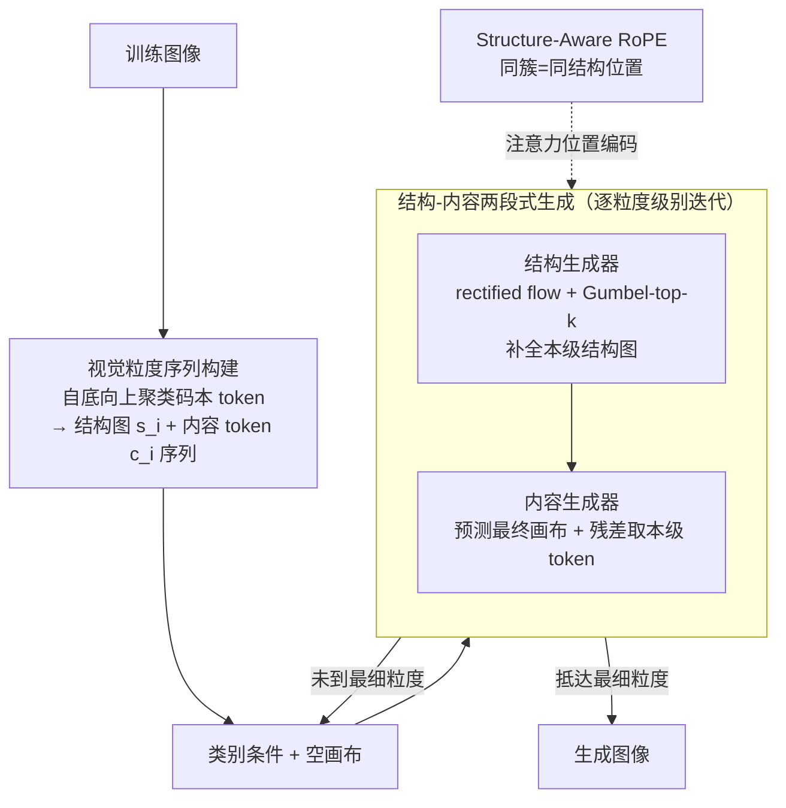

# Next Visual Granularity Generation

**会议**: ICLR 2026  
**arXiv**: [2508.12811](https://arxiv.org/abs/2508.12811)  
**代码**: [项目页面](https://yikai-wang.github.io/nvg)  
**领域**: 图像生成 / 视觉自回归  
**关键词**: 视觉粒度, 自回归生成, 结构化序列, 粗到细生成, ImageNet

## 一句话总结

提出 Next Visual Granularity (NVG) 生成框架，将图像分解为不同粒度级别的结构化序列，从全局布局到精细细节逐级生成，相比 VAR 系列在 FID 上一致提升。

## 研究背景与动机

- **现有生成范式的局限**：
    - Token 序列化方法忽略丰富的 2D 空间结构，存在曝光偏差
    - VAR 的视觉金字塔中，早期阶段单个 token 代表大且语义多样的区域，造成表示歧义
    - 扩散模型缺乏显式结构控制，需要额外模块
- **核心思路**：用不同数量的唯一 token 在相同空间分辨率下表示图像，构建粒度层次

## 方法详解

### 整体框架

NVG 要解决的是：自回归图像生成把图像拍平成一维 token 序列、丢掉了 2D 空间结构，而 VAR 那套空间金字塔在早期阶段又让一个 token 代表一大片语义混杂的区域、表示有歧义。它的思路是把一张图像在**固定空间分辨率**下拆成一串由粗到细的粒度级别：每个阶段都覆盖整张图，只是允许使用的唯一 token 数量不同——从少数 token 勾勒全局布局，逐级增加 token 还原精细细节。

整条 pipeline 分两步走。**先离线建序列**：用一个多粒度量化自编码器把图像编码进 $16\times16$ 潜空间，再自底向上聚类码本 token，得到结构化序列 $\mathcal{T} = \{(\boldsymbol{c}_i, \boldsymbol{s}_i)\}_{i=0}^K$——$\boldsymbol{c}_i$ 是阶段 $i$ 的内容 token（含 $|c_i| = n_i$ 个来自共享码本 $\mathcal{V}$ 的唯一 token），$\boldsymbol{s}_i$ 是 $h \times w$ 的结构图，标识每个空间位置该用哪个 token。**再在线生成**：把"预测下一个 token"换成"预测下一个粒度级别"，从空画布出发，每阶段先用结构生成器补全本级结构图、再用内容生成器填内容并细化画布，循环到最细粒度即得到最终图像；其间用 Structure-Aware RoPE 把"谁和谁同簇"写进注意力位置编码，让结构控制内建于生成过程。

### 关键设计

**1. 视觉粒度序列构建：在不缩放分辨率的前提下定义"粗到细"**

VAR 用空间下采样得到金字塔，早期一个 token 要代表一大片语义混杂的区域，表示天然有歧义。NVG 改成自底向上的聚类：从最细粒度（每个位置一个唯一 token）出发，按成对 $\ell_2$ 距离贪心地把 top-$k$ 最相似的 token 合并成一簇。取 $k=2$ 时每阶段 token 数减半，在 $16^2$ 潜空间上形成 $\{2^i\}_{i=0}^8$ 的级别序列。内容侧仍用类似 VAR 的残差金字塔，但每级的压缩由结构图引导而非空间缩放，因此每个 token 始终对应语义连贯的一簇区域、含义更清晰。为了让模型知道当前处在哪个层级，再用一个 $K$ 维向量编码跨阶段的层次关系：每个阶段贡献一个 bit（0 或 2），用 1 作填充。

**2. 结构-内容两段式生成：每阶段先画骨架再上色**

每个粒度级别的生成被拆成"先结构、后内容"。结构生成器是一个轻量 rectified flow 模型，用 v-prediction 配合 Gumbel-top-$k$ 采样从噪声恢复结构图，输入 $\boldsymbol{z}_s(t) = t \cdot \boldsymbol{\varepsilon} + (1-t) \cdot \boldsymbol{s}_e$，其中已确定的部分直接用 ground-truth 替换，保证已生成区域稳定、只对新增粒度采样。内容生成器则直接预测最终画布 $f_c(\boldsymbol{x}_i) \rightarrow \boldsymbol{x}$，当前阶段真正新增的 token 通过残差从画布中取出。它的训练目标同时约束画布回归和 token 分类：

$$\ell(\boldsymbol{x}_i) = \|\boldsymbol{x} - f_c(\boldsymbol{x}_i)\|_2^2 + \text{CE}(\hat{\boldsymbol{c}}_i, \boldsymbol{c}_i)$$

前一项让每阶段都朝完整画布逼近、后一项保证 token 预测准确。这种"残差建模 + 画布渐进细化"让模型每步都在修正整图而非盲目顺序填空，从而缓解自回归常见的曝光偏差与误差累积。

**3. Structure-Aware RoPE：把"谁和谁同簇"写进位置编码**

为了让注意力区分簇内/簇间关系，NVG 把 64 维注意力特征切成三段——8 维标识文本/图像、$2\times8$ 维编码结构层次、$20\times2$ 维表示空间位置。关键在于同一簇内的 token 共享同一结构位置、跨簇则不同，于是模型在做注意力时天然知道哪些位置属于同一粒度单元，结构控制由此内建进生成过程，而无需额外的条件模块。

## 实验关键数据

### ImageNet 256×256 类条件生成

| 类型 | 模型 | FID(↓) | IS(↑) | Prec(↑) | Rec(↑) | 参数量 |
|------|------|--------|-------|---------|--------|-------|
| X-AR | VAR-d16 | 3.30 | 274.4 | 0.84 | 0.51 | 310M |
| X-AR | VAR-d20 | 2.57 | 302.6 | 0.83 | 0.56 | 600M |
| X-AR | VAR-d24 | 2.09 | 312.9 | 0.82 | 0.59 | 1.0B |
| **X-AR** | **NVG-d16** | **3.03** | **291.6** | - | - | - |
| **X-AR** | **NVG-d20** | **2.44** | **305.0** | - | - | - |
| **X-AR** | **NVG-d24** | **2.06** | **323.0** | - | - | - |
| Mask | MAR-H | 1.55 | 303.7 | 0.81 | 0.62 | 943M |
| Diff | SiT-X | 2.06 | 270.3 | 0.82 | 0.59 | 675M |

### 消融实验：粒度分解 vs 空间分解

| 方法 | rFID(↓) | IS(↑) | 说明 |
|------|--------|-------|------|
| NVG（粒度分解） | **更优** | **更优** | 每个 token 语义更清晰 |
| VAR（空间分解） | 基线 | 基线 | 早期 token 语义混杂 |

### 关键发现

1. NVG 在所有模型规模上一致超越 VAR（FID: 3.30→3.03, 2.57→2.44, 2.09→2.06）
2. 清晰的缩放规律：更大模型持续提升性能
3. 生成图像与结构图高度对应，验证了结构控制的有效性
4. 可复用参考图像的结构图，实现跨内容的结构迁移

## 亮点与洞察

1. **优雅的问题重构**：将自回归生成从"下一个 token"转变为"下一个粒度级别"
2. **解决 VAR 的表示歧义问题**：基于粒度分解让每个 token 语义更清晰
3. **显式结构控制**：不需要额外的条件模块，结构控制内建于生成过程
4. **减轻曝光偏差**：残差建模 + 画布渐进细化，避免自回归的误差累积

## 局限性

- 贪心聚类策略可能不是最优的结构构建方式
- 双模型设计（结构+内容）增加了系统复杂度
- 当前仅在类条件生成上验证，文本到图像生成尚未探索
- 结构生成器的"冷启动"需要统一跨阶段训练来缓解

## 相关工作

- **视觉自回归**：VAR, LlamaGen, Open-MAGVIT2
- **扩散模型**：DiT, SiT, LDM
- **掩码模型**：MaskGIT, MAR, TiTok

## 评分

- 新颖性：⭐⭐⭐⭐⭐ — 视觉粒度序列的概念独特且直观
- 技术深度：⭐⭐⭐⭐ — 结构嵌入、Structure-Aware RoPE 设计精巧
- 实验完整性：⭐⭐⭐⭐ — 全面对比和清晰的缩放分析
- 实用价值：⭐⭐⭐⭐ — 提供了新的图像生成范式和结构控制能力

<!-- RELATED:START -->

## 相关论文

- [\[CVPR 2026\] FVAR: Next-Focus Prediction for Visual Autoregressive Modeling](../../CVPR2026/image_generation/fvar_next-focus_prediction_for_visual_autoregressive_modeling.md)
- [\[ICLR 2026\] Pyramidal Patchification Flow for Visual Generation](pyramidal_patchification_flow_for_visual_generation.md)
- [\[ICML 2026\] Semantic Granularity Navigation in Image Editing](../../ICML2026/image_generation/semantic_granularity_navigation_in_image_editing.md)
- [\[ICLR 2026\] SSG: Scaled Spatial Guidance for Multi-Scale Visual Autoregressive Generation](ssg_scaled_spatial_guidance_for_multi-scale_visual_autoregressive_generation.md)
- [\[CVPR 2026\] AS-Bridge: A Bidirectional Generative Framework Bridging Next-Generation Astronomical Surveys](../../CVPR2026/image_generation/as-bridge_a_bidirectional_generative_framework_bridging_next-generation_astronom.md)

<!-- RELATED:END -->
