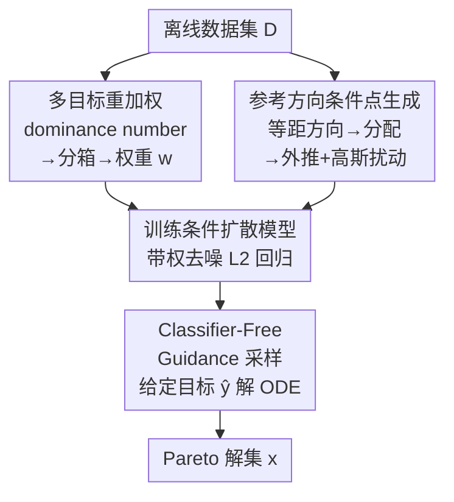

# Pareto-Conditioned Diffusion Models for Offline Multi-Objective Optimization

**会议**: ICLR 2026 Oral  
**arXiv**: [2602.00737](https://arxiv.org/abs/2602.00737)  
**代码**: [GitHub](https://github.com/jatan12/PCD)  
**领域**: 图像生成  
**关键词**: 离线多目标优化, 条件扩散模型, Pareto 前沿, 无代理模型, 参考方向

## 一句话总结

提出 Pareto-Conditioned Diffusion (PCD)，将离线多目标优化重构为条件采样问题，直接以目标权衡为条件生成高质量解，无需显式代理模型，在多种基准上实现最佳一致性。

## 研究背景与动机

- **离线 MOO 挑战**：仅有静态数据集，无法查询真实目标函数
- **现有方法依赖代理模型**：DNN 或 GP 近似目标函数 → MOEA 搜索 → 代理精度瓶颈
- **生成模型方法（如 ParetoFlow）仍依赖代理预测器引导**，继承了代理模型的不准确性风险
- **核心想法**：直接将 MOO 建模为条件生成任务 $p(\boldsymbol{x} | \boldsymbol{y}; \sigma)$

## 方法详解

### 整体框架

PCD 把离线多目标优化整个改写成一次条件采样：用数据集训练一个以目标向量 $\boldsymbol{y}$ 为条件的扩散模型 $D_\theta(\boldsymbol{x}; \boldsymbol{y}, \sigma)$，推理时只要给出想要的目标权衡向量 $\hat{\boldsymbol{y}}$，就直接采出对应的解 $\boldsymbol{x}$。整条管线里没有任何代理模型去预测目标值，方案生成和 Pareto 前沿建模被压进同一个生成器，因此也就绕开了"代理不准 → 搜索被误导"这条传统失败链路。训练侧由两件事喂养：**多目标重加权**给每个样本算一个偏向前沿的权重，**参考方向条件点生成**为条件向量铺出均匀覆盖前沿的"坐标"；推理侧靠 **Classifier-Free Guidance 采样** 把样本钉到指定的权衡区域。

### 关键设计

**1. 多目标重加权：让模型偏向可靠又靠前的样本**

离线数据集里的点质量参差不齐，直接均匀拟合会把模型拉向平庸区域。PCD 先用 dominance number $o(\boldsymbol{x}) = \sum_{\boldsymbol{x}' \in \mathcal{D}} \mathbb{I}[\boldsymbol{f}(\boldsymbol{x}) \prec \boldsymbol{f}(\boldsymbol{x}')]$ 衡量每个样本被多少其它点支配——值越小说明越靠近前沿。随后按这个数把样本分箱，给第 $i$ 箱赋权 $w_i = \frac{|B_i|}{|B_i| + K} \exp\!\left(\frac{-\frac{1}{|B_i|}\sum_{j=1}^{|B_i|} o(\boldsymbol{x}_{b_j})}{\tau}\right)$。这个权重同时编码了两层意图：前一项 $\frac{|B_i|}{|B_i|+K}$ 随箱内点数增加而趋近 1，让样本多、统计可靠的箱占更大份量（$K$ 控制对小箱的惩罚力度）；后一项的指数把平均 dominance 越低（越靠前）的箱抬得越高（$\tau$ 是温度，调节这种偏好的陡峭程度）。两者相乘，使训练既不被噪声小箱带偏、又持续向前沿倾斜。

**2. 参考方向条件点生成：给条件向量铺出均匀覆盖前沿的"坐标"**

要让条件采样真能覆盖整条 Pareto 前沿，训练时喂给模型的条件 $\boldsymbol{y}$ 必须在目标空间里分布均匀，否则前沿会出现空洞。PCD 借鉴 NSGA-III 的思路分三步构造这些条件点：先用 Riesz s-Energy 方法在目标空间生成 $L$ 个尽量等距的方向向量 $\boldsymbol{w}_i$，作为前沿上的"参考射线"；再按非支配排序逐层把数据点迭代分配给离它最近的方向向量，使每条射线都挂上一个代表点；最后把代表点沿对应方向向外推、再叠加一个零均值高斯扰动，既把条件点推向尚未被数据覆盖的前沿外缘，又用噪声补足局部多样性。这样得到的条件分布在整条前沿上均匀展开，模型推理时就能被引导到任意指定的权衡区域。

**3. Classifier-Free Guidance 采样：放大条件信号，把样本钉在目标区域**

训练阶段以一定概率丢弃条件，模型同时学到条件分数 $D_\theta(\boldsymbol{x}; \hat{\boldsymbol{y}}, \sigma)$ 和无条件分数 $D_\theta(\boldsymbol{x}; \sigma)$。采样时把两者按引导尺度 $\gamma$ 线性外插，求解 ODE $d\boldsymbol{x}/d\sigma = -(\gamma D_\theta(\boldsymbol{x}; \hat{\boldsymbol{y}}, \sigma) + (1-\gamma) D_\theta(\boldsymbol{x}; \sigma) - \boldsymbol{x})/\sigma$。取 $\gamma > 1$ 相当于沿"条件减无条件"的方向额外推一步，强化目标 $\hat{\boldsymbol{y}}$ 的牵引，把生成样本更紧地拉到与该权衡一致的区域。实践中 $\gamma$ 的收益较快饱和（$2.5$ 附近已接近顶点），因为第 1 步的重加权已经先把数据分布偏向前沿，留给引导项的提升空间有限。

### 损失函数 / 训练策略

训练目标是重加权后的条件去噪 $L_2$ 回归：$\theta = \arg\min_\theta \mathbb{E}\,[\,w(\boldsymbol{y})\,\lambda(\sigma)\,\|D_\theta(\boldsymbol{x} + \boldsymbol{n}; \boldsymbol{y}, \sigma) - \boldsymbol{x}\|_2^2\,]$。其中 $\boldsymbol{n}$ 是噪声尺度 $\sigma$ 下加到样本上的扰动，$\lambda(\sigma)$ 是标准的逐尺度损失权重，而 $w(\boldsymbol{y})$ 正是第 1 步算出的样本权重——它把"偏向可靠且靠前"的意图直接焊进了去噪损失，使模型在拟合阶段就向高质量解倾斜。

## 实验关键数据

### 跨任务平均排名（100th percentile HV, ↓ 越低越好）

| 方法 | 合成 | MORL | RE | Scientific | MONAS | 总平均 |
|------|------|------|-----|-----------|-------|-------|
| $\mathcal{D}$(best) | 5.45 | **1.70** | 2.60 | 9.35 | 11.53 | 7.43 |
| ParetoFlow | **2.44** | 8.50 | 1.74 | 9.05 | 11.19 | 6.74 |
| MM + IOM | 5.16 | 12.70 | 5.76 | 4.40 | 5.77 | 5.80 |
| E2E | 6.16 | 9.70 | 6.06 | 4.20 | 5.13 | 5.71 |
| **PCD** | 3.38 | 5.50 | **1.51** | **4.05** | 7.54 | **4.80** |

### 消融实验：组件贡献

| 变体 | ZDT2 | MO-Swimmer | RE34 | Regex | C10/MOP2 |
|------|------|------------|------|-------|----------|
| Ideal + N/A | 7.59 | 1.76 | 9.19 | 5.60 | 10.46 |
| Ref.Dir. + N/A | 7.89 | 3.53 | 10.11 | 5.55 | 10.47 |
| Ref.Dir. + Pruning | 5.64 | 3.63 | 10.16 | 4.20 | 10.55 |
| **PCD (完整)** | 6.25 | **3.69** | **10.17** | 4.80 | **10.59** |

### 关键发现

1. PCD 使用单一固定超参数组在所有任务类别上实现最佳总体排名
2. 参考方向机制在 MO-Swimmer 上将 HV 提升近一倍（1.76→3.53）
3. 重加权策略一致优于简单剪枝（Xue et al., 2024 的方法）
4. 引导尺度 $\gamma$ 的增益有限（2.5 已接近饱和），因为重加权已偏置了数据分布

## 亮点与洞察

1. **端到端框架**：将多阶段管线（代理+搜索）简化为单一条件生成模型
2. **跨任务一致性**：这是 PCD 最显著的优势——在连续、离散、分类任务上均表现稳健
3. **NSGA-III 启发的条件点生成**：巧妙结合了进化算法的方向向量思想和扩散模型的条件生成

## 局限性

- MORL 任务（~10,000 维参数空间）因 MLP 去噪器直接操作参数空间而受限
- MONAS 纯类别搜索空间对连续扩散模型构成挑战
- 未处理组合优化任务（如 TSP）
- 重加权在数据质量本身较好的数据集上可能反而有害

## 相关工作

- **代理模型方法**：COMs, ICT, IOM, Tri-Mentoring
- **生成模型方法**：ParetoFlow, LaMBO, MOGFNs
- **条件扩散**：DDOM, MINs, Reward-Directed Diffusion

## 评分

- 新颖性：⭐⭐⭐⭐ — 将离线 MOO 重构为条件采样是自然但有效的贡献
- 技术深度：⭐⭐⭐⭐ — 重加权策略和参考方向机制设计合理
- 实验完整性：⭐⭐⭐⭐⭐ — 覆盖 5 大类基准，对比 13 种基线方法
- 实用价值：⭐⭐⭐⭐ — 超参数鲁棒性使实际部署更可行

<!-- RELATED:START -->

## 相关论文

- [\[CVPR 2026\] MapReduce LoRA: Advancing the Pareto Front in Multi-Preference Optimization for Generative Models](../../CVPR2026/image_generation/mapreduce_lora_advancing_the_pareto_front_in_multi-preference_optimization_for_g.md)
- [\[ICML 2026\] Pareto-Guided Optimal Transport for Multi-Reward Alignment](../../ICML2026/image_generation/pareto-guided_optimal_transport_for_multi-reward_alignment.md)
- [\[ICLR 2026\] Intention-Conditioned Flow Occupancy Models](intention-conditioned_flow_occupancy_models.md)
- [\[ICML 2026\] Support-Proximity Augmented Diffusion Estimation for Offline Black-Box Optimization](../../ICML2026/image_generation/support-proximity_augmented_diffusion_estimation_for_offline_black-box_optimizat.md)
- [\[ICML 2026\] Offline Preference Optimization for Rectified Flow with Noise-Tracked Pairs](../../ICML2026/image_generation/offline_preference_optimization_for_rectified_flow_with_noise-tracked_pairs.md)

<!-- RELATED:END -->
