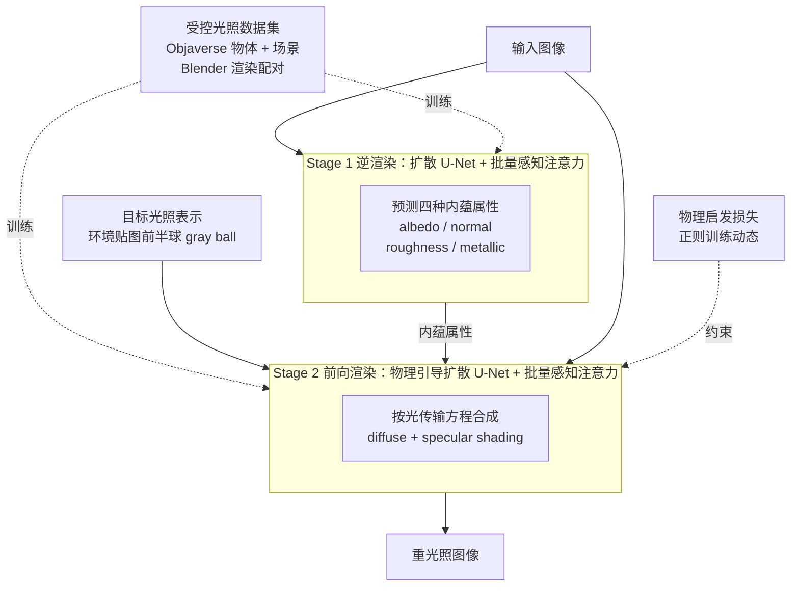

# PI-Light: Physics-Inspired Diffusion for Full-Image Relighting

**会议**: ICLR 2026  
**arXiv**: [2601.22135](https://arxiv.org/abs/2601.22135)  
**代码**: 无  
**领域**: 图像生成 / 图像重光照  
**关键词**: 扩散模型, 图像重光照, 逆渲染, 物理引导, 内蕴分解

## 一句话总结

提出 π-Light（PI-Light），一个两阶段的全图像重光照框架：第一阶段通过物理引导的扩散模型进行内蕴属性（albedo、法线、roughness 等）分解，第二阶段通过物理引导的神经渲染模块实现光照条件下的重新渲染，引入批量感知注意力机制和物理启发损失以实现对真实场景的优秀泛化能力。

## 研究背景与动机

全图像重光照（Full-Image Relighting）是计算机视觉与图形学中的长期挑战性问题，目标是在保持场景内容不变的情况下，改变图像中的光照条件。该任务面临三大核心困难：

**大规模成对数据稀缺**：相同场景在不同光照条件下的高质量配对数据极难收集，严重限制了数据驱动方法的训练

**物理合理性难以保证**：端到端学习容易产生物理上不合理的光照效果（如错误的阴影方向、不自然的高光反射）

**合成到真实的域差距**：用渲染数据训练的模型往往难以泛化到真实世界场景，已有的弥合 synthetic-to-real gap 的尝试仍不理想

现有方法大致分为两类：（1）直接端到端学习图像级暗箱变换，缺乏物理约束；（2）依赖精确的 3D 几何重建再渲染，计算量大且对重建质量敏感。本文的创新在于将物理约束"注入"到扩散模型中，在不需显式 3D 重建的情况下实现物理合理的重光照效果。

## 方法详解

### 整体框架

PI-Light 不去一步到位地学习「输入图像 → 重光照图像」这个暗箱映射，而是把全图像重光照拆成两个物理含义清楚的阶段：先把图像"拆开"，再用新光照"重新画"。**Stage 1 逆渲染**（Inverse Neural Rendering）复用一个预训练图像扩散模型（Stable Diffusion），从输入图像里同时分解出四种内蕴属性——albedo（反照率）、normal（法线）、roughness（粗糙度）、metallic（金属度）。这些属性只描述物体本身，与光照无关。**Stage 2 前向渲染**（Neural Forward Rendering）再把输入图像、Stage 1 得到的内蕴属性和一个目标光照条件一起喂回扩散模型，让它在物理光传输先验的引导下生成重光照图像，并附带输出漫反射（diffuse）和镜面（specular）shading。中间的内蕴属性充当物理"中转层"，使光照的改变只发生在 Stage 2，从而避免内容随光照一起被改坏。两个阶段的注意力都被扩成跨图共享，训练数据则来自一套 Blender 渲染的受控光照配对数据集。

### 关键设计

**1. 批量感知注意力：用跨图一致性破解单图内蕴分解的不适定**

单张图像的内蕴分解是高度不适定的——同一组像素既可以解释成"亮材质 + 暗光"，也可以解释成"暗材质 + 亮光"，单图信息不足以消歧。PI-Light 借鉴 Wonder3D 的多视角一致性思路，把标准 self-attention 层扩成"全局感知"（global-aware）：在一个 batch 内的多张图像之间打通注意力计算，让它们互相通信。这样无论是 Stage 1 预测内蕴、还是 Stage 2 渲染，同一物体在不同样本下的预测都被相互约束，迫使模型给出一致的内蕴和渲染结果。它同时带来两个收益——既压低了单图分解的歧义性、提升跨图一致性，又因为共享计算而提高了效率。

**2. 物理引导的前向渲染与物理启发损失：让 Stage 2 遵循光传输方程而非纯黑箱拟合**

Stage 2 接收内蕴属性和目标光照，要把它们"画"成重光照图像。若用纯神经网络硬拟合，很容易产生物理上不合理的结果（高光方向错、强度不对），且需要大量数据才能勉强收敛。PI-Light 让渲染遵循基于物理的渲染（PBR）规律，把漫反射和镜面反射分开建模：漫反射按 Lambertian 模型沿法线积分环境光，即 $D(p)=\int_{\Omega} L(\omega)\max(0, N(p)\cdot\omega)\,d\omega$，其中 $N(p)$ 是像素 $p$ 的法线、$L(\omega)$ 是入射方向 $\omega$ 的环境光。在此基础上引入一项**物理启发损失**，用解析算出的 diffuse shading 去监督网络输出，把训练动态正则到物理合理的解空间。这条损失并非可有可无的锦上添花——它本身就是高效的学习机制：让模型用更少的数据和算力就能收敛到正确的光传输，也正是合成到真实泛化的关键所在。

**3. 半球光照表示：用环境贴图前半球避开自发光干扰，换来可控的光向与强度**

直接用完整环境贴图或 irradiance 当光照条件，会把场景里自发光物体、内置光源的影响混进来，导致光向控制不准、还容易破坏背景。PI-Light 改用一个简单有效的表示：只取环境贴图的**前半球**（实现上用一个渲染的 gray ball 来建模光照）。这样既屏蔽了自发光和内置光照的干扰，又能让用户直观、精确地调节光的方向和强度，同时保持背景一致。正是这个设计让"全图像重光照"在不重建 3D 的前提下仍能做到可控。

**4. 受控光照数据集：用 Blender 渲染的多材质配对数据补上数据稀缺这一短板**

重光照训练最大的卡点是"同场景多光照"的高质量配对数据极难获取——真实世界几乎无法对同一场景拍到多组受控光照。PI-Light 因此自建一套数据：物体级从 Objaverse 里筛选带 BRDF 材质属性的资产，场景级补充带内蕴标注的数据，全部用 Blender 在受控光照下渲染成「RGB 图像 + ground-truth 内蕴 + 光照条件」三元组。它既是本文方法的训练基础，也作为重光照研究的标准化基准供社区做下游评测。

### 损失函数 / 训练策略

两个阶段都在预训练扩散模型上微调，主损失为隐空间扩散的 V-prediction 重建损失 $L_{\text{V-pred}}=\mathbb{E}_{z_0,\epsilon,t}\big[\lVert\hat v_\theta(z_t,t)-v_t\rVert_2^2\big]$。Stage 2 在此之外叠加上文的**物理启发损失**：用 Lambertian 解析式算出的 diffuse shading 监督网络的漫反射输出，把训练拉向物理合理的解。两阶段的注意力均采用批量感知（跨图共享）形式。

> ⚠️ 各损失的具体权重与训练超参以原文为准。

## 实验关键数据

### 主实验

| 方法 | 数据集 | PSNR ↑ | SSIM ↑ | LPIPS ↓ | 亮点 |
|------|--------|--------|--------|---------|------|
| 之前 SOTA | 合成测试集 | — | — | — | 物理合理性差 |
| PI-Light | 合成测试集 | **最佳** | **最佳** | **最佳** | 全面超越 |
| 之前 SOTA | 真实场景 | 较差泛化 | — | — | 域差距显著 |
| PI-Light | 真实场景 | **最佳泛化** | — | — | 保持物理合理性 |

**内蕴分解质量**：
- Albedo 预测：在不同光照条件下一致性优异
- 法线预测：与 GT 高度吻合
- 材质属性：正确区分金属/非金属等材质差异

**重光照效果**：
- 正确生成镜面高光（specular highlights）
- 正确处理漫反射（diffuse reflections）
- 在多样化材质（金属、塑料、织物等）上均表现良好
- 真实场景泛化能力显著优于之前方法

### 消融实验

| 组件 | 去除后效果 | 说明 |
|------|-----------|------|
| Batch-Aware Attention | 内蕴分解一致性下降 | 不同光照下的 albedo 预测出现不一致 |
| 物理引导渲染模块 | 物理合理性变差 | 高光方向和强度错误增加 |
| 物理启发损失 | 泛化能力下降 | 真实场景效果退化 |
| 精选数据集 | 材质覆盖不足 | 特定材质（如半透明材质）处理变差 |

### 关键发现

1. **物理引导是泛化的关键**：在有物理约束的情况下，即使在合成数据上训练，模型也能很好地泛化到真实场景
2. **批量感知注意力显著提升一致性**：同一物体不同光照下的内蕴属性预测一致性大幅提升，这对于后续渲染的质量至关重要
3. **两阶段设计优于端到端**：将问题分解为逆渲染+前向渲染两个物理上清晰的阶段，比端到端映射更可控
4. **扩散模型美术+物理强知识**：预训练扩散模型的丰富视觉先验与物理约束的结合是本文成功的基础

## 亮点与洞察

1. **物理先验与生成模型的优雅结合**：不是简单地将物理损失加到扩散模型上，而是在模型架构（batch-aware attention）、训练目标（physics-inspired losses）和推理流程（两阶段物理分解）三个层面同时嵌入物理先验
2. **批量感知注意力的创新设计**：利用同一场景多光照条件下内蕴属性不变的物理事实，在注意力机制层面实施约束，是将领域知识注入 Transformer 架构的好范例
3. **实用性强**：对于影视特效、虚拟现实、增强现实等应用场景具有直接实用价值，能在单张图像输入下实现高质量重光照
4. **数据贡献**：精心策划的受控光照数据集为社区提供了标准化基准

## 局限与展望

1. **两阶段流水线的误差累积**：内蕴分解的误差会传播到渲染阶段，端到端联合优化可能进一步提升性能
2. **光照表示的局限**：环境光照贴图（environment map）可能不足以表达复杂的近场光照、区域光照或多光源场景
3. **计算开销**：基于扩散模型的两阶段推理在速度上可能不如单阶段方法，限制实时应用
4. **室外场景泛化**：受控光照数据集主要覆盖室内/物体级场景，对复杂室外场景的泛化能力有待验证
5. **编辑灵活性**：固定的两阶段流程难以支持更灵活的编辑需求（如局部光照调整、光照插值等）
6. **分辨率限制**：受扩散模型生成分辨率限制，高分辨率图像可能需要额外的超分辨率处理

## 相关工作与启发

- **内蕴图像分解**（Intrinsic Image Decomposition）：Retinex 理论到深度学习方法的演化，PI-Light 将其升级为扩散模型驱动
- **神经辐射场与重光照**（NeRF-based Relighting）：NeRFactor、NVDiffrec 等通过 3D 重建实现重光照，PI-Light 避免了显式 3D 重建
- **扩散模型用于逆问题**（Diffusion for Inverse Problems）：DDPM/DDIM 用于去噪、超分辨率等逆问题，PI-Light 将其拓展到重光照
- **Zero-1-to-3, Wonder3D** 等工作中的多视角一致性注意力设计启发了 batch-aware attention 的概念

## 评分

- 新颖性: ⭐⭐⭐⭐ — 将物理引导系统性嵌入扩散模型重光照框架的方法设计新颖
- 实验充分度: ⭐⭐⭐⭐ — 合成和真实场景验证充分，消融完整，数据贡献有价值
- 写作质量: ⭐⭐⭐⭐ — 两阶段框架叙述清晰，物理动机阐述到位
- 价值: ⭐⭐⭐⭐ — 实用性强的重光照方案，物理引导+扩散模型的范式具有推广价值

<!-- RELATED:START -->

## 相关论文

- [\[NeurIPS 2025\] UniLumos: Fast and Unified Image and Video Relighting with Physics-Plausible Feedback](../../NeurIPS2025/image_generation/unilumos_fast_and_unified_image_and_video_relighting_with_physics-plausible_feed.md)
- [\[ICLR 2026\] GenCP: Towards Generative Modeling Paradigm of Coupled Physics](gencp_towards_generative_modeling_paradigm_of_coupled_physics.md)
- [\[ICLR 2026\] Condition Matters in Full-head 3D GANs](condition_matters_in_full-head_3d_gans.md)
- [\[CVPR 2025\] ScribbleLight: Single Image Indoor Relighting with Scribbles](../../CVPR2025/image_generation/scribblelight_single_image_indoor_relighting_with_scribbles.md)
- [\[ICLR 2026\] Continual Unlearning for Text-to-Image Diffusion Models: A Regularization Perspective](continual_unlearning_for_text-to-image_diffusion_models_a_regularization_perspec.md)

<!-- RELATED:END -->
