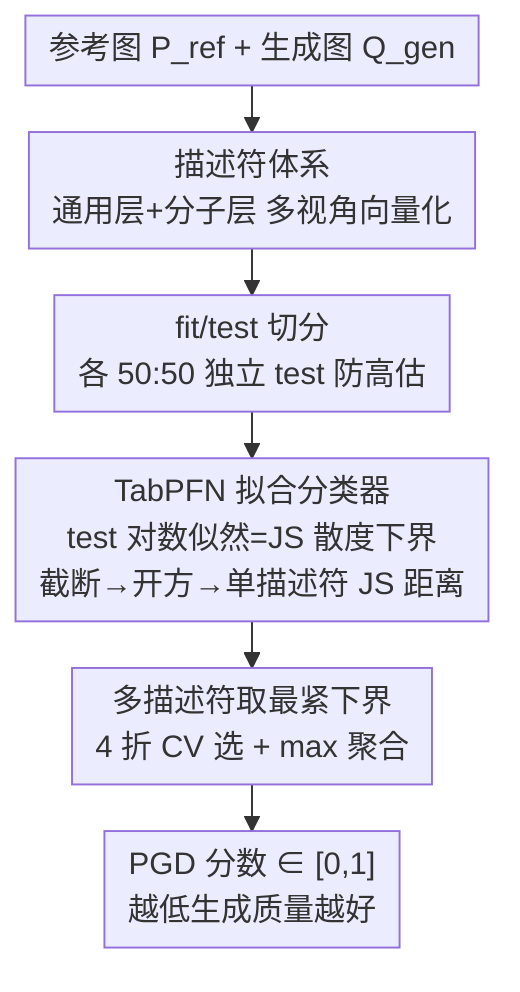

# PolyGraph Discrepancy: a classifier-based metric for graph generation

**会议**: ICLR 2026  
**arXiv**: [2510.06122](https://arxiv.org/abs/2510.06122)  
**代码**: PolyGraph 开源库（文中提及，将公开发布）  
**领域**: 图生成模型评估  
**关键词**: 图生成, Jensen-Shannon 距离, 分类器评估, MMD, TabPFN

## 一句话总结

提出 PolyGraph Discrepancy (PGD)，通过训练分类器区分真实图和生成图来逼近 Jensen-Shannon 距离的变分下界，解决了 MMD 指标缺乏绝对尺度、不同描述符间不可比、小样本高偏差高方差的三大核心问题。

## 研究背景与动机

图生成模型在药物发现、社交网络建模、材料科学等领域日益重要，但进展被评估方法的不足所制约。当前评估主要依赖基于图描述符的 Maximum Mean Discrepancy (MMD)，存在三个根本性缺陷：

**缺乏绝对尺度**：MMD 的值域是 $[0, \infty)$，取决于核函数和特征缩放。一个 MMD = 0.05 是好还是差？无法判断。线性核下，输入特征乘以任意标量会等比例缩放 MMD。

**描述符间不可比**：用度数直方图计算的 MMD 和用 orbit 计数计算的 MMD，数值完全不在同一量纲上，无法比较哪个描述符更能区分真实和生成图。

**小样本问题严重**：当前主流基准（Planar、SBM、Lobster）仅包含 20-40 个测试图，在这个规模下 MMD 估计的偏差和方差都极大，导致模型排名不可靠。

| 属性 | MMD | PGD |
|------|-----|-----|
| 值域 | $[0, \infty)$ | $[0, 1]$ |
| 绝对尺度 | ✗ | ✓ |
| 描述符可比 | ✗ | ✓ |
| 多描述符聚合 | ✗ | ✓ |
| 统一排名 | ✗ | ✓ |

## 方法详解

### 整体框架

PGD 把"评估图生成质量"重写成一个分类问题：训练一个分类器去区分真实图和生成图，若分类器轻松分开则生成质量差，若难以分开则生成质量好。关键在于，分类器在 test 集上的数据对数似然恰好是 Jensen-Shannon 散度的变分下界——它天然落在 $[0,1]$ 区间，且对任意分类器 $D$ 都成立、拟合越好下界越紧，对应的变分形式为 $D_{\text{JS}}(P \| Q) = \sup_{D:\mathcal{X}\to[0,1]} \frac{1}{2}\mathbb{E}_{x\sim P}[\log_2 D(x)] + \frac{1}{2}\mathbb{E}_{x\sim Q}[\log_2(1-D(x))] + 1$。整套流程是一条直链：先用一套描述符把图向量化，对每个描述符把真实图与生成图各自切成 fit/test 两半、在 fit 半上拟合 TabPFN 分类器、到 test 半上用对数似然算出该描述符的 JS 距离下界，最后在所有描述符里取最紧（最大）的那个下界作为最终的 PGD 分数。

### 关键设计

**1. 描述符体系：通用 + 领域特定双层把图变成分类器能吃的向量**

分类器只认向量，所以第一步要决定从哪些角度刻画一张图——描述符越丰富，JS 距离的估计就越可能逼近图分布的真实散度。作者为此设计了两层描述符：通用层包括度数直方图、聚类系数直方图、Laplacian 谱、4/5-node orbit 计数和 GIN 嵌入；分子层则补上拓扑指标（BertzCT、Kappa 等）、理化参数（Lipinski 规则）、Morgan 指纹以及 ChemNet/MolCLR 学习表示。通用描述符保证在任意图上可用，分子描述符则把 PGD 扩展到药物发现等场景，让指标对领域结构更敏感。

**2. fit/test 切分：用独立 test 集让 JS 下界成为无偏估计**

给定参考图集 $P_{\text{ref}}$、生成图集 $Q_{\text{gen}}$ 和一个描述符，若在同一批图上既训练分类器又评估，分类器会过拟合从而高估真实差异，下界就不再可信。PGD 因此把两个集合各自一分为二，得到 fit 半和 test 半（比例 50:50）：fit 半只用来拟合分类器，test 半只用来算对数似然。独立的 test 集让对数似然成为无偏的下界估计——分类越容易意味着下界越大、JS 距离越大、生成模型越差。

**3. TabPFN 分类器与 JS 下界：表格基础模型给出最紧估计**

下界对任意分类器都成立，但要让它尽量紧、又不引入调参负担，作者选了 TabPFN。它同时满足三个硬条件：能输出类别概率（对数似然必需）、训练快无需反复调参、本身无超参数（基于 transformer 的贝叶斯 in-context 推理，自动适应数据），这直接排除了又慢又要调参的深度网络，以及只给硬标签、不出概率的 SVM 和决策树。拿到 test 半的对数似然后，截断到 $\max(\cdot, 0)$ 保证非负，再取平方根得到 JS 距离（因为 JS 距离才是度量、JS 散度不是）。与逻辑回归的对比实验表明 TabPFN 一致给出更紧的下界，原因是它能建模非线性决策边界，而线性模型在描述符空间里区分力不足。

**4. 多描述符取最紧下界：让数据自己挑最有区分力的视角**

不同数据集、不同扰动类型下最敏感的描述符各不相同（度数、orbit、谱等），没有哪一个永远最好。因此用 $K$ 个描述符时，先对每个描述符在 fit 集上做 4 折交叉验证，选出平均验证指标最高的描述符 $d^\star$，再用 $d^\star$ 在整个 fit 集上训练、在 test 集上评估。由于每个描述符给出的都是下界，取其中最大者就是最紧的那个下界，对应最能拉开真实图与生成图的视角，整套选择完全由数据驱动而非人工指定。

### 损失函数 / 训练策略

PGD 不是生成模型而是评估指标，所谓"训练"只是 TabPFN 分类器的一次拟合——由于 TabPFN 是 in-context learner，这实际上是一次前向推理而非梯度迭代。关键实现细节为：fit/test 按 50:50 切分、描述符选择用 4 折交叉验证、JS 下界截断到 $\max(\cdot, 0)$ 以确保非负、最终取平方根把散度转成距离度量。

## 实验关键数据

### 主实验

**MMD 的偏差和方差问题**

在 20-40 个测试图的常见规模下：
- 有偏 MMD 估计受偏差严重影响（数量级差异）
- 无偏 MMD 估计的方差仍大到足以使模型比较不可靠
- 作者建议使用更大数据集（SBM-L、Planar-L、Lobster-L，各 4096 样本）

**PGD 与模型质量的相关性**

| 指标 | Planar-L 相关系数 | SBM-L | Lobster-L |
|------|-----------------|-------|-----------|
| PGD | **99.52** | 88.07 | 89.32 |
| Orbit RBF | 73.49 | 51.05 | -34.81 |
| Degree RBF | 70.79 | 15.77 | -33.40 |
| Spectral RBF | 73.34 | 36.76 | -22.79 |
| Clustering RBF | 71.48 | 83.97 | 87.05 |
| GIN RBF | 82.78 | 14.12 | -30.31 |

PGD 与 validity 的 Pearson 相关系数高达 99.52%（Planar-L），远超所有 MMD 变体。

**训练动态追踪**

| 指标 | Planar-L Spearman | SBM-L | Lobster-L |
|------|------------------|-------|-----------|
| Validity | 92.31 | 83.64 | 85.47 |
| **PGD** | **93.71** | **62.73** | **78.19** |
| Orbit RBF | 86.71 | 20.00 | -8.09 |
| Degree RBF | 41.96 | -19.09 | -4.66 |

PGD 随训练迭代数单调改善，而 MMD 指标表现不稳定甚至负相关。

**模型基准测试**（PGD × 100，越低越好）

| 数据集 | AutoGraph | DiGress | ESGG | GRAN |
|--------|-----------|---------|------|------|
| Planar-L | **34.0** | 45.2 | 54.2 | 65.1 |
| SBM-L | 30.3 | **23.7** | 35.1 | 50.1 |
| Lobster-L | **16.1** | 18.8 | 51.1 | 56.2 |
| Proteins | 72.5 | **68.2** | — | 73.3 |

### 消融实验

| 配置 | 关键指标 | 说明 |
|------|---------|------|
| TabPFN vs 逻辑回归 | TabPFN 一致更紧 | 非线性决策边界的优势 |
| PGD-JS vs PGD-TV | PGD-JS 更稳健 | TV 距离的二值化阈值引入噪声 |
| 样本量 < 256 | 高方差 | PGD 在 256+ 样本时稳定 |
| 样本量 > 256 | 稳定 | 均值和方差均收敛 |
| 单描述符 vs max-聚合 | 聚合更鲁棒 | 无单一描述符在所有场景下最优 |

### 关键发现

1. **没有单一描述符是万能的**：在不同数据集和扰动类型下，最具区分力的描述符各不相同。这证明了多描述符 + 数据驱动选择的必要性
2. **PGD 对扰动的单调响应**：无论扰动类型（边删除/添加/重连/交换/混合），PGD 都随扰动程度单调增加，且 Spearman 相关性与 MMD 相当
3. **边交换扰动的独特价值**：作者提出的新扰动类型（保持度数的边交换），度数和 GIN 基 MMD 无法检测，但 PGD 通过多描述符策略保持鲁棒
4. **Proteins 数据集最具挑战性**：PGD 值最高（~70），说明建模蛋白质图的难度最大
5. **5-node orbit 是强描述符**：在模型基准中，5-node orbit 计数经常产生最高的 PGD，是之前未被充分利用的描述符

## 亮点与洞察

1. **理论优雅**：将 GAN 的对抗训练思想用于评估而非训练——分类器的对数似然提供 JS 距离的变分下界，这是一个已知结论的巧妙应用
2. **实用价值极高**：绝对尺度 + 描述符可比 + 多描述符聚合，解决了图生成评估中最核心的三个痛点
3. **大数据集倡议**：通过详细的偏差/方差分析，强有力地论证了现有基准数据集（20-40 图）不足以可靠评估，提供了 SBM-L/Planar-L/Lobster-L 作为替代
4. **分子特定描述符**：将 PGD 框架扩展到分子图评估，设计了基于 RDKit 的拓扑/理化/指纹/学习表示的描述符体系
5. **代码与数据开源**：承诺发布 PolyGraph 库，降低社区使用门槛

## 局限与展望

1. **描述符依赖与信息损失**：PGD 操作在手工描述符而非原始图上，如果描述符分布的散度不能紧密逼近图分布的散度，PGD 也会是松弛的下界
2. **max-聚合的局限**：取最大值可能未充分利用不同描述符的互补信息。未来可探索将多个描述符特征拼接后直接输入 TabPFN
3. **样本量需求**：PGD 需要约 256 个以上的样本才能获得可靠估计，这对某些数据稀缺场景有限制
4. **TabPFN 的特征维度限制**：建议不超过 500 维，对高维描述符需要降维处理
5. **未探索的图类型**：仅验证了无向无权图和分子图，有向图、加权图、时序图、异质图需要进一步验证
6. **与生成对抗网络评估的联系**：GAN 社区已有多种基于分类器的评估方法（FID、C2ST 等），PGD 与这些方法的联系和对比可以更深入
7. **计算效率**：PGD 的计算时间约 170s（表15），虽然与描述符计算可共摊，但仍显著慢于单次 MMD 计算

## 相关工作与启发

- **MMD 框架**（You et al., 2018; O'Bray et al., 2022）：PGD 的直接比较对象，作者详细分析了 MMD 的各种变体（高斯 TV、RBF、有偏/无偏）
- **Classifier Two-Sample Test**（Lopez-Paz & Oquab, 2017）：PGD 的直接理论先驱，将分类器性能作为两样本检验的统计量
- **TabPFN**（Hollmann et al., 2025）：表格数据上的基础模型，PGD 选择它作为分类器的实用性依赖于此模型的强大性能
- **DiGress / AutoGraph**：当前 SOTA 图生成模型，PGD 的评估结果为这些模型提供了更可靠的排名
- 启发：评估指标的设计同样需要理论基础和工程考量的平衡；从信息论视角审视评估问题往往能得到更有原则的解决方案

## 评分

- 新颖性: ⭐⭐⭐⭐ — C2ST 思想在图领域的首次系统应用，多描述符聚合有创新但基础理论已知
- 实验充分度: ⭐⭐⭐⭐⭐ — 极其详尽：扰动实验、训练动态、模型基准、消融、多种 MMD 变体对比
- 写作质量: ⭐⭐⭐⭐⭐ — 结构清晰，理论推导严谨，图表信息量大
- 价值: ⭐⭐⭐⭐⭐ — 有望成为图生成评估的新标准，解决了长期困扰社区的核心问题

<!-- RELATED:START -->

## 相关论文

- [\[ICLR 2026\] HOG-Diff: Higher-Order Guided Diffusion for Graph Generation](hog-diff_higher-order_guided_diffusion_for_graph_generation.md)
- [\[CVPR 2026\] C$^2$FG: Control Classifier-Free Guidance via Score Discrepancy Analysis](../../CVPR2026/image_generation/c2fg_control_classifier-free_guidance_via_score_discrepancy_analysis.md)
- [\[ICLR 2026\] GGBall: Graph Generative Model on Poincaré Ball](ggball_graph_generative_model_on_poincaré_ball.md)
- [\[ICLR 2026\] Generate Any Scene: Scene Graph Driven Data Synthesis for Visual Generation Training](generate_any_scene_scene_graph_driven_data_synthesis_for_visual_generation_train.md)
- [\[ICML 2026\] Conformal Reliability: A New Evaluation Metric for Conditional Generation](../../ICML2026/image_generation/conformal_reliability_a_new_evaluation_metric_for_conditional_generation.md)

<!-- RELATED:END -->
