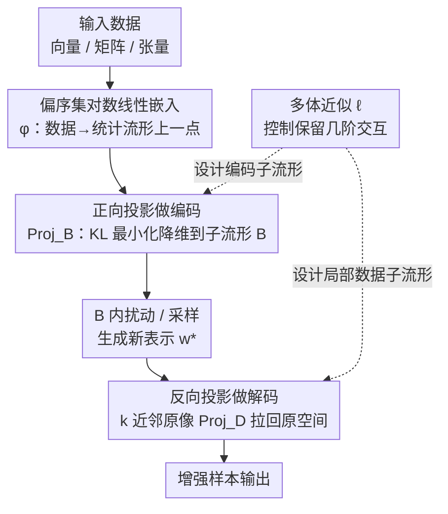

# Pseudo-Nonlinear Data Augmentation: A Constrained Energy Minimization Viewpoint

**会议**: ICLR 2026  
**arXiv**: [2410.00718](https://arxiv.org/abs/2410.00718)  
**代码**: [GitHub](https://github.com/sleepymalc/Pseudo-Nonlinear)  
**领域**: 数据增强 / 信息几何  
**关键词**: 数据增强, 信息几何, 能量模型, 偏序集, 无学习方法

## 一句话总结

基于能量模型和信息几何的对偶平坦结构，提出无需训练、高效可控的数据增强方法，通过正向投影（编码）和反向投影（解码）在统计流形上实现跨模态增强。

## 研究背景与动机

- **生成模型增强的根本困境**：
  1. 数据稀缺时先训练生成模型 → 重新引入数据不足问题
  2. 大规模生成的计算成本高昂
  3. 缺乏可解释性和可控性
- **线性降维增强的局限**：逆问题（从低维重建高维）困难
- **核心思路**：利用统计流形的对偶结构，投影是流形内坐标中的线性操作但在环境空间中非线性

## 方法详解

### 整体框架

这篇论文想解决一个老问题：数据稀缺时怎么做增强，又不想训练生成模型（重新引入数据不足）、也不想被线性降维的"逆问题"卡住。它的整体思路是把任意结构的数据（向量、矩阵、张量）映射成统计流形上的概率分布，借助信息几何的对偶平坦坐标，让"降维—增强—重建"全部变成流形内的凸投影。一个样本的旅程是：先用偏序集对数线性嵌入把它变成流形上一点，再用正向投影编码到低维平坦子流形 $\mathcal{B}$，在 $\mathcal{B}$ 里扰动或采样生成新点，最后用反向投影解回原始数据空间得到增强样本。而保留哪些结构（形状、颜色、高阶交互）则由一个多体近似阶数 $\ell$ 统一调控编码与解码两端的子流形。整个过程没有可学习参数，投影都有闭式解，所以叫"伪非线性"——坐标内是线性操作，回到环境空间却呈现非线性效果。

### 关键设计

**1. 偏序集对数线性嵌入：把数据变成流形上一点**

数据增强要在"几何上有意义"的空间里做插值，而原始像素/特征空间的欧氏插值往往穿过低密度区。本文先把数据结构建模为实值偏序集 $\Omega$，再通过 $\varphi: \Omega_\mathbb{R} \to \mathcal{S}$ 把它嵌入为统计流形上的概率分布——对正张量 $P$，归一化为 $P'_v = P_v / \sum_{w \in \Omega} P_w$。借助 Sugiyama 等人的对数线性模型，每个分布同时拥有自然参数 $\theta$ 和期望参数 $\eta$ 两套对偶平坦坐标，这正是后续所有投影能闭式求解的根基。

**2. 正向投影做编码：用 KL 最小化保证降维不丢信息**

降维若破坏数据分布，增强出来的样本就不可信。编码定义为 $\mathsf{Enc} = \text{Proj}_\mathcal{B} \circ \varphi: \Omega_\mathbb{R} \to \mathcal{B}$，即先嵌入再投影到低维平坦子流形 $\mathcal{B} \subseteq \mathcal{S}$。因为 $\mathcal{B}$ 是平坦子流形，投影点唯一存在，且它恰好是 KL 散度意义下离原分布最近的点。于是降维有了明确的信息论保证，而非任意截断。

**3. 反向投影做解码：用近邻原像绕开逆问题**

线性降维增强最大的痛点是逆问题——从低维表示重建高维数据通常病态。本文不直接求逆，而是用"数据的投影逆"做近似映射：对潜空间中的新点 $w^*$，先取其 $k$ 近邻 $N \subseteq [n]$，用这些近邻的原像就地拼出一个局部数据子流形 $\mathcal{D}$，再把 $w^*$ 投影回去 $z'^* = \text{Proj}_\mathcal{D}(w^*)$。这样解码始终落在真实数据撑起的局部结构上，避免凭空生成离群样本。

**4. 多体近似：用阶数 ℓ 调控保留哪些结构**

前面编码与解码各要选一个子流形，到底保留数据的几阶交互需要一个统一旋钮——这就是多体（$\ell$-body）近似，它同时决定编码子流形 $\mathcal{B}$ 和解码端局部子流形的设计。编码侧的基础子流形把高于 $\ell$ 阶的自然参数清零：$\mathcal{M}_\ell = \{\theta \in \mathbb{R}^{\dim(\mathcal{S})} \mid \theta_x = 0 \text{ for all non } \ell\text{-body } x \in \Omega\}$；解码侧则对偶地用近邻平均构造局部子流形 $\mathcal{M}_\ell^*(N) = \{\theta \mid \theta_x = \frac{1}{k}\sum_{i^* \in N}(\theta(z_{i^*}'))_x \text{ for all } \ell\text{-body } x\}$。$\ell$ 越小越粗（CIFAR-10 上 1-body 只保形状），越大越细（5-body 能留住形状—颜色的精细关系），从而把"保留哪些属性、增强哪些属性"做成可调旋钮。

### 一个完整示例

以一张图像样本 $z_i$ 为例走一遍增强流程。先编码：$w_i = \mathsf{Enc}(z_i) = \text{Proj}_{\mathcal{B}} \circ \varphi(z_i)$，把图像变成低维平坦子流形 $\mathcal{B}$ 上的一点。再增强：在 $\mathcal{B}$ 内用核密度采样或受控扰动生成新表示 $w^*$，因为这里是几何上对偶平坦的坐标，扰动得到的依然是合法分布。最后解码：$z^* = \mathsf{Dec}(w^*) = \varphi^{-1} \circ \text{Proj}_\mathcal{B}^{-1}(w^*)$，借第 3 点的近邻原像把 $w^*$ 拉回原始空间，得到一张新的增强图像。整条链路无需任何训练，每步都是凸投影。

## 实验关键数据

### 下游分类性能

| 训练集 | MNIST | CIFAR-10 | Speech | Connectionist | Bankruptcy | Wine |
|-------|-------|----------|--------|---------------|-----------|------|
| OG | 97.98% | 88.57% | 84.48% | 88.10±8.58% | 96.54% | 55.00% |
| OG+STD | 97.98% | **89.89%** | 82.98% | 85.24±7.66% | 96.17% | 57.85% |
| OG+AE | 97.97% | 88.36% | 83.13% | 82.86±7.59% | 95.92% | 57.23% |
| OG+MU | 96.45% | 86.60% | 81.85% | 89.29±4.97% | 96.55% | 57.76% |
| OG+MMU | 97.52% | 88.02% | 83.06% | 91.19±5.06% | 96.44% | 58.70% |
| **OG+PNL** | 97.91% | 88.07% | **84.35%** | **93.81±4.54%** | **96.53%** | **59.03%** |

### 消融：能量感知 vs 环境空间插值

| 几何 | 插值能量（交互能量） |
|------|-------------------|
| 基础子流形（能量感知） | **持续更低** |
| 环境空间（欧氏） | 持续更高 |

能量感知方法在所有插值点上能量一致低于环境空间几何。

### 关键发现

1. PNL 在 6 个数据集/4 种模态上一致优于或持平其他增强方法
2. **稳定性优势突出**：Connectionist Bench（208 样本）上标准差从 8.58% 降至 4.54%
3. CIFAR-10 上 1-body 近似保留形状、5-body 近似保留精细形状-颜色关系
4. 子流形维度选择存在固有权衡（信息保留 vs 增强效果）

## 亮点与洞察

1. **理论优雅**：将数据增强与信息几何的对偶平坦结构自然连接
2. **多模态通用性**：同一框架处理图像、音频、表格数据
3. **精细可控性**：通过设计偏序集结构和子流形选择控制增强属性
4. **无需训练**：投影为凸优化，梯度有闭式解，计算极为高效
5. **稳定性保证**：投影最小化 KL 散度，有明确的信息论保证

## 局限性

- **排列不变性缺失**：偏序集依赖特定索引排序，对图数据等无自然序的场景引入偏差
- 正张量假设限制了对含负值数据的直接应用
- 图像模态上未超越标准增强（如翻转/裁剪），因标准方法编码了模态先验
- 高阶张量reshape 的选择需要领域知识

## 相关工作

- **学习型增强**：VAE、GAN、扩散模型增强
- **无学习增强**：Mixup, Manifold Mixup, PCA 增强
- **信息几何**：Amari (2016), 对偶平坦结构
- **偏序集对数线性模型**：Sugiyama et al. (2017)

## 评分

- 新颖性：⭐⭐⭐⭐⭐ — 信息几何+数据增强的联姻非常独特
- 技术深度：⭐⭐⭐⭐⭐ — 理论基础扎实，数学推导严谨
- 实验完整性：⭐⭐⭐⭐ — 多模态覆盖，但缺乏大规模验证
- 实用价值：⭐⭐⭐ — 通用性强但在主流视觉任务上优势有限

<!-- RELATED:START -->

## 相关论文

- [\[CVPR 2026\] OntoAug: Rethinking Generative Data Augmentation via Ontology Guidance](../../CVPR2026/image_generation/ontoaug_rethinking_generative_data_augmentation_via_ontology_guidance.md)
- [\[NeurIPS 2025\] Graph Distance as Surprise: Free Energy Minimization in Knowledge Graph Reasoning](../../NeurIPS2025/image_generation/graph_distance_as_surprise_free_energy_minimization_in_knowledge_graph_reasoning.md)
- [\[NeurIPS 2025\] Non-Asymptotic Analysis of Data Augmentation for Precision Matrix Estimation](../../NeurIPS2025/image_generation/non-asymptotic_analysis_of_data_augmentation_for_precision_matrix_estimation.md)
- [\[ICLR 2026\] RNE: plug-and-play diffusion inference-time control and energy-based training](rne_plug-and-play_diffusion_inference-time_control_and_energy-based_training.md)
- [\[NeurIPS 2025\] UtilGen: Utility-Centric Generative Data Augmentation with Dual-Level Task Adaptation](../../NeurIPS2025/image_generation/utilgen_utility-centric_generative_data_augmentation_with_dual-level_task_adapta.md)

<!-- RELATED:END -->
