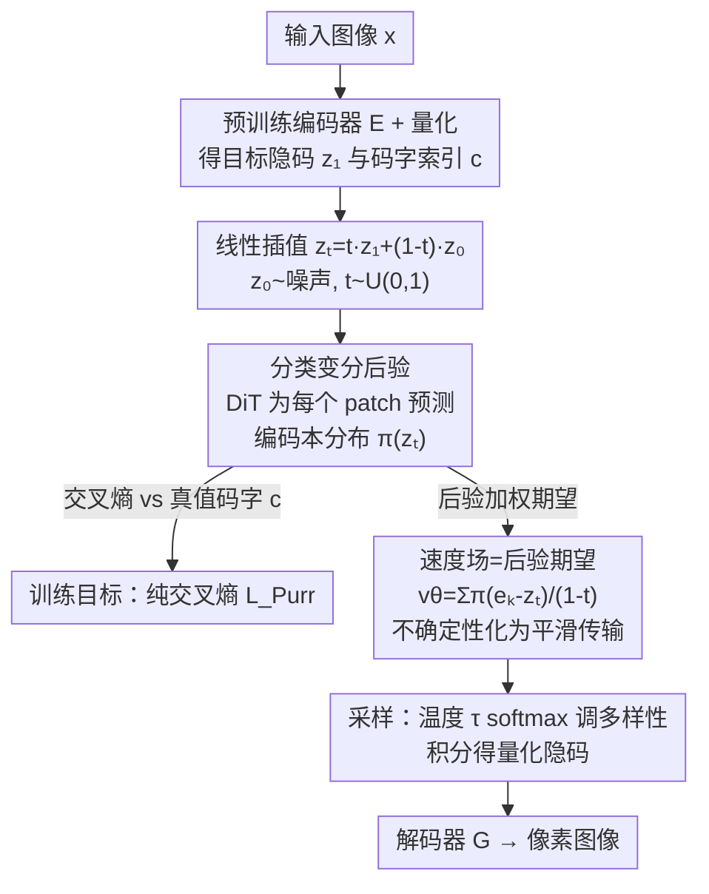

# Purrception: Variational Flow Matching for Vector-Quantized Image Generation

**会议**: ICLR 2026  
**arXiv**: [2510.01478](https://arxiv.org/abs/2510.01478)  
**代码**: 无  
**领域**: 图像生成 (Image Generation)  
**关键词**: 变分流匹配, 向量量化, 离散扩散, 分类后验, 图像生成

## 一句话总结

提出 Purrception，一种将变分流匹配（Variational Flow Matching）适配到向量量化（VQ）隐空间的图像生成方法，通过在连续嵌入空间中计算速度场的同时学习编码本索引上的分类后验分布，桥接了连续传输动力学和离散监督，在 ImageNet-1k 256×256 上实现了更快的训练收敛和与 SOTA 可比的 FID 分数。

## 研究背景与动机

图像生成领域的核心范式正在经历深刻变革。在隐空间（latent space）中进行生成已成为主流方法，而**如何在隐空间中建模生成过程**是一个核心设计选择。目前存在两大技术路径，各有优劣：

### 连续方法（Continuous Methods）

以 Flow Matching 和扩散模型为代表，在连续空间中定义从噪声到数据的传输路径。

- **优势**：具有几何感知能力（geometric awareness），传输路径在连续空间中有良好的数学性质，梯度估计平滑
- **劣势**：无法提供对离散编码本索引的显式监督信号；当底层隐空间是离散的（如 VQ-VAE 的编码本）时存在天然不匹配

### 离散方法（Discrete Methods）

以 Discrete Flow Matching 和掩码语言模型为代表，直接在离散 token 空间中建模。

- **优势**：提供在编码本索引上的显式分类监督，与 VQ 隐空间天然匹配
- **劣势**：缺乏连续空间中的几何结构信息，训练可能不够高效

本文的核心动机是：**能否结合两种方法的优势？**具体来说，能否在保持连续传输动力学的同时，提供离散编码本索引上的显式分类监督？

变分流匹配（Variational Flow Matching, VFM）提供了一个天然的框架来实现这种桥接——它在连续流匹配的基础上引入了变分推断，允许定义关于离散变量的后验分布。Purrception 正是将 VFM 适配到 VQ 图像生成中的首次尝试。

## 方法详解

### 整体框架

Purrception 想解决的是 VQ 隐空间天生的"双重身份"矛盾：每个隐变量既是编码本里的一个离散索引，又是一个携带几何关系（远近、方向）的连续嵌入向量——连续流匹配只把它当向量、丢了离散监督，纯离散流匹配只预测索引、丢了几何结构。它的破解办法是：在 VQ-VAE 的隐空间里，让一个扩散 Transformer（DiT）针对插值中间态 $z_t$ 为每个 patch 预测一个**编码本上的分类后验** $\pi$，然后把传输用的**速度场直接从这个后验解析地算出来**（后验加权的端点期望），训练就退化成对真值码字的一条**纯交叉熵**损失。采样时再用 softmax 温度调节多样性，最后把生成的量化隐码交给解码器还原成像素图。整条链路只有一个网络、一个损失，却同时拿到了离散监督和连续几何。

### 关键设计

**1. 分类变分后验：用编码本上的分布表达"端点该是哪个码字"**

纯连续方法从不接收任何类别学习信号，纯离散方法又把语义相近的码字当成毫不相干的 token、预测退化成索引之间的"瞬移"。Purrception 借了变分流匹配（VFM）的核心观察——$t$ 时刻的速度可写成对端点后验的期望 $u_t(z_t)=\mathbb{E}_{p_t(z_1|z_t)}[u_t(z_t|z_1)]$——再用一个关键事实收窄它：在 VQ 隐空间里，端点 $z_1$ 必然是有限编码本里的某个嵌入 $e_k$，所以这个端点后验天然就是编码本上的**分类分布** $q^\theta_t(c|z_t)=\mathrm{Cat}(c|\pi^\theta_t(z_t))$。于是模型（一个 DiT）只需对插值中间态 $z_t$ 输出每个 patch 在编码本上的概率 $\pi^\theta_t(z_t)$，就能表达"这里可能是码字 42、也可能是 87"的犹豫，自带对多个候选码字的不确定性量化，也保留了 softmax 之前的 logits 供后面的温度控制使用。

**2. 速度场=后验加权期望：不单独回归速度，从分类后验解析地推出连续传输**

这是把离散监督和连续几何缝在一起的关键一步，也纠正了"拼两个损失"的常见误解。Purrception **不**额外训练一个速度回归头，而是把上一步的分类后验直接代回 VFM 的期望式，解析地得到速度场

$$v^\theta_t(z_t)=\sum_{k=1}^{K}\pi^{\theta,k}_t(z_t)\,\frac{e_k-z_t}{1-t}=\frac{\mu_t(z_t)-z_t}{1-t},\qquad \mu_t(z_t)=\sum_{k=1}^{K}\pi^{\theta,k}_t(z_t)\,e_k$$

即速度指向"后验加权的编码本重心" $\mu_t$。这样一来，对多个相近码字的不确定性会被翻译成**平滑、几何感知的运动**，而不是离散索引间的瞬移；而由于速度完全由后验决定，整个训练目标随之退化成预测后验与真值码字之间的一条交叉熵损失 $\mathcal{L}_{\text{Purr}}(\theta)=-\mathbb{E}_{t,x,z_t}[\log q^\theta(c|z_t)]$。一个网络、一个损失就同时拿到了离散类别监督（交叉熵）和连续传输动力学（解析速度），无需在两个损失之间调权重，这也是它比纯连续 / 纯离散基线收敛更快的根源。

**3. 温度控制：用 softmax 温度 τ 把后验的"尖锐度"变成推理期可调旋钮**

因为 $\pi^\theta_t$ 由 logits 经带温度 $\tau$ 的 softmax 得到，$\pi^{\theta,k}_t(z_t)=\exp(\tilde\pi^{\theta,k}_t/\tau)\big/\sum_i\exp(\tilde\pi^{\theta,i}_t/\tau)$，框架就自然带来一个推理期自由度。$\tau$ 小时后验坍缩到最可能的码字，提前"下决心"、生成更锐利高保真，但可能过度简化；$\tau$ 大时分布被摊平、给邻近码字分配可观权重，注入更多细节和多样性，但重心偏离最优嵌入会让保真度下降；中间值常达到最佳折中，与生成里常见的偏差-方差权衡呼应。这种可控性在纯连续 FM 里不存在（没有类别 logits），在纯离散 FM 里也无意义（索引被立刻坍缩），它直接源自混合 VQ–VFM 形式，把温度变成一个面向任务自适应推理的有原则旋钮。

### 损失函数 / 训练策略

训练目标只有**一条交叉熵**，由 VFM 目标在 VQ 情形下退化而来：

$$\mathcal{L}_{\text{Purr}}(\theta)=-\mathbb{E}_{t,x,z_t}\big[\log q^\theta(c\mid z_t)\big]$$

其中 $x\sim\mathcal{D}$，$z_1$ 与 $c$ 是对应的量化隐码与码字索引，插值中间态 $z_t:=t z_1+(1-t)z_0$（$z_0\sim p_0$，$t\sim U(0,1)$）。速度场不单独回归、由后验解析推出，故无需第二个损失或损失权重。实现上用 DiT-L/2 与 DiT-XL/2 主干，配 Stable Diffusion 的 vq-f8 与 LlamaGen 的 vq-ds8-c2i 两种 tokenizer。

## 实验关键数据

### 主实验

在 ImageNet-1k 256×256 无条件/类条件图像生成上的评估：

| 方法 | FID↓ | 训练收敛速度 | 类型 |
|------|------|------------|------|
| Continuous Flow Matching | 基线 | 慢 | 纯连续 |
| Discrete Flow Matching | 基线 | 慢 | 纯离散 |
| **Purrception** | **可比SOTA** | **更快** | 连续+离散桥接 |
| 其他SOTA模型 | 参考值 | - | 各类方法 |

### 消融实验

| 配置 | 关键指标 | 说明 |
|------|---------|------|
| 仅连续流匹配 | FID较差，收敛慢 | 缺少离散监督 |
| 仅离散监督 | FID较差 | 缺少连续几何信息 |
| Purrception（完整） | 最优 FID + 最快收敛 | 双重信号互补 |
| 温度=0.5 | 质量高，多样性低 | 低温确定性选择 |
| 温度=1.0 | 质量-多样性平衡 | 标准设定 |
| 温度=1.5 | 多样性高，质量略降 | 高温软化后验 |
| 无分类后验 | 收敛变慢 | 验证离散监督的加速作用 |

### 关键发现

1. **训练收敛加速**：Purrception 比纯连续流匹配和纯离散流匹配基线都更快收敛。分类后验提供的离散监督信号为模型提供了更"尖锐"的学习目标，加速了参数更新的方向性。

2. **质量可比 SOTA**：在 FID 分数上与当前最先进方法可比，证明桥接连续和离散方法不会牺牲生成质量。

3. **温度可控性**：通过单一温度参数即可平滑控制生成的多样性-质量权衡，提供了直观的生成调节手段。

4. **不确定性量化**：分类后验天然提供了对每个空间位置可能编码的不确定性估计，这在其他方法中通常不可用。

## 亮点与洞察

1. **优雅的理论桥接**：Purrception 通过变分流匹配框架在理论上优雅地桥接了连续和离散两种生成范式。不是简单地拼接两种损失，而是在统一的变分推断框架下自然融合。

2. **实用的速度提升**：训练收敛加速是非常实际的贡献——在大规模 ImageNet 训练中，训练效率的提升直接转化为 GPU 小时和成本的节省。

3. **概率化的码字选择**：将确定性的码字查找（argmin 距离）替换为概率化的分类后验，不仅提升了训练效率，还引入了不确定性量化能力。这种"软量化"思想在 VQ 领域具有推广价值。

4. **温度控制的可解释性**：与 classifier-free guidance 的 scale 参数相比，温度参数的物理意义更加直观——直接控制后验分布的"尖锐程度"，可解释性更强。

5. **命名的巧思**："Purrception"（Purr = 猫叫声 + Perception）是一个有趣的命名，暗示了模型对编码本的"感知"（perception）过程是柔和的（purr），而非硬决策。

## 局限与展望

1. **仅在 ImageNet 256×256 上验证**：当前实验规模相对有限。在更高分辨率（如 512×512 或 1024×1024）、更大规模数据集上的表现尚未验证。

2. **与最新 SOTA 的差距**：虽然 FID 与 SOTA "可比"，但可能仍有差距。需要更详细的定量对比才能准确定位。

3. **编码本大小的敏感性**：分类后验的计算复杂度与编码本大小线性相关。对于非常大的编码本（如 16384 个码字），可能面临效率挑战。

4. **文本条件生成**：当前主要在类条件生成上验证，文本条件图像生成（text-to-image）的效果尚不清楚。

5. **与现代编码器架构的兼容性**：如何与最新的 VQ 编码器（如改进的 VQGAN、FSQ 等）以及 continuous latent VAE（如 SD 的 KL-VAE）结合，值得探索。

6. **可扩展至视频生成**：将 Purrception 的框架扩展到视频 VQ 隐空间中，可能在时序一致性上获得额外优势。

## 相关工作与启发

- **Flow Matching**：Lipman et al. 的 Flow Matching 框架，定义了连续传输路径的理论基础
- **Variational Flow Matching**：在 Flow Matching 中引入变分推断的框架，Purrception 的理论基石
- **Discrete Flow Matching / Discrete Diffusion**：在离散 token 空间中进行生成建模
- **VQ-VAE / VQ-GAN**：向量量化隐空间的构建方法，提供了 Purrception 操作的底层空间
- **Masked Image Modeling (MIM)**：如 MaskGIT，在 VQ token 上使用掩码预测
- **Autoregressive VQ 生成**：如 VQVAE + Transformer，按序列生成 VQ token
- 启发方向：**变分推断作为统一框架**允许在单一模型中同时处理连续和离散结构，这一范式可能在其他涉及混合连续-离散空间的生成任务中也有价值（如分子生成、程序合成等）

## 评分

- 新颖性: ⭐⭐⭐⭐ （将变分流匹配适配到 VQ 空间是自然但非平凡的贡献，桥接思路清晰）
- 实验充分度: ⭐⭐⭐ （仅在 ImageNet-1k 256×256 上验证，规模有限，需要更多基准对比）
- 写作质量: ⭐⭐⭐⭐ （理论推导清晰，动机阐述到位）
- 价值: ⭐⭐⭐⭐ （训练效率提升有实际意义，为 VQ 生成提供了新范式，但影响范围取决于 VQ 方法的后续发展）

<!-- RELATED:START -->

## 相关论文

- [\[ICLR 2026\] SenseFlow: Scaling Distribution Matching for Flow-based Text-to-Image Distillation](senseflow_scaling_distribution_matching_for_flow-based_text-to-image_distillatio.md)
- [\[ICLR 2026\] Latent Diffusion Model without Variational Autoencoder](latent_diffusion_model_without_variational_autoencoder.md)
- [\[ICLR 2026\] FlowCast: Advancing Precipitation Nowcasting with Conditional Flow Matching](flowcast_advancing_precipitation_nowcasting_with_conditional_flow_matching.md)
- [\[ICLR 2026\] Laplacian Multi-scale Flow Matching for Generative Modeling](laplacian_multi-scale_flow_matching_for_generative_modeling.md)
- [\[CVPR 2026\] Frequency-Aware Flow Matching for High-Quality Image Generation](../../CVPR2026/image_generation/freqflow_frequency_aware_flow_matching.md)

<!-- RELATED:END -->
