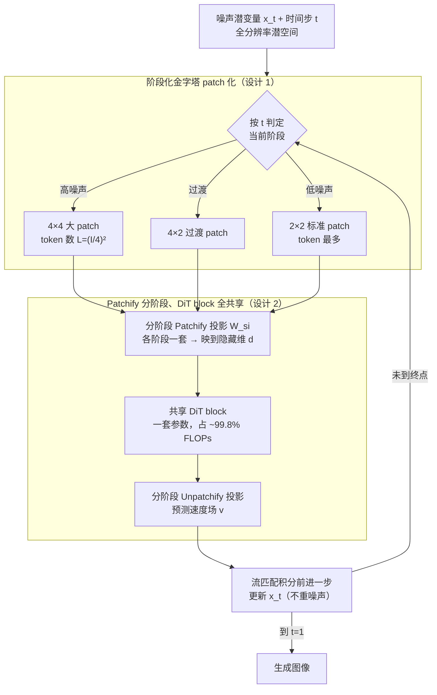

# Pyramidal Patchification Flow for Visual Generation

**会议**: ICLR 2026  
**arXiv**: [2506.23543](https://arxiv.org/abs/2506.23543)  
**代码**: [GitHub](https://github.com/fudan-generative-vision/PPFlow)  
**领域**: 扩散模型加速 / 图像生成  
**关键词**: 金字塔 patch 化, 流匹配, DiT, 推理加速, 可变 token 数量

## 一句话总结

提出 Pyramidal Patchification Flow (PPFlow)，通过在高噪声时间步使用大 patch、低噪声时使用小 patch，在保持生成质量的同时实现 1.6-2.0× 去噪加速，且无需重噪声技巧。

## 研究背景与动机

- DiT 在全部时间步使用相同 patch 大小（通常 2×2），导致高噪声时间步浪费计算
- 现有加速方法的局限：
    - **减少步数**（DDIM、蒸馏）：牺牲质量
    - **降低单步成本**（量化、剪枝）：可能性有限
    - **金字塔/级联生成**（Pyramidal Flow）：引入"跳跃点"，需要复杂的重噪声技巧
- **核心观察**：高噪声时空间细节不重要，可用更少 token 表示

## 方法详解

### 整体框架

PPFlow 想解决的痛点很直接：DiT 在所有去噪时间步都用同一种 $2\times2$ patch、喂进同样多的 token，可高噪声时图像几乎没有空间细节，这些算力纯属浪费。它的做法是把整条去噪轨迹按时间步切成几个阶段，每个阶段配一套不同的 patch 大小——高噪声段用大 patch（token 少、算得快），低噪声段退回标准的 $2\times2$ patch（token 多、保细节）。整个推理流程和普通 DiT 别无二致：每一步先按当前时间步 $t$ 落到某个阶段，用该阶段专属的 Patchify 投影把潜变量切成 token，过一遍**所有阶段共享**的 DiT block 预测速度场，再用该阶段的 Unpatchify 投影还原，积分前进一步；唯一变化的是不同时间步喂进去的 token 数。整个过程始终在全分辨率潜空间上完成，阶段间不切换分辨率、也不重新加噪。

### 关键设计

**1. 阶段化金字塔 patch 化：让高噪声步用更少 token**

针对"高噪声步白白算细节"这个痛点，PPFlow 把时间区间 $[0,1]$ 划成多段，越靠近高噪声（$t$ 越小）patch 越大。以三级方案为例：$[0,t_{s_1})$ 用 $4\times4$ patch，token 数降到 $L=(I/4)^2$；$[t_{s_1},t_{s_2})$ 用过渡的 $4\times2$；$[t_{s_2},1]$ 回到 $2\times2$ 的正常 DiT。之所以有效，是因为每个 DiT block 的复杂度是 $\mathcal{O}(L_s^2 d + L_s d)$，token 数 $L_s$ 一减，注意力的平方项立刻塌下来，整段去噪的算力随之大幅下降。

**2. Patchify 分阶段、DiT block 全共享：几乎零额外参数换来提速**

要让上一步落地又不膨胀模型，PPFlow 每个阶段只配一对独立的投影矩阵 $\mathbf{W}_{s_i}\in\mathbb{R}^{d\times d_{s_i}}$ 负责把不同尺寸的 patch 映到同一隐藏维 $d$，而占模型绝大部分容量的 DiT block 一套参数走天下。这样做的底气在于成本结构：Patchify 这步的代价 $L_s\times d_s\times d = I^2 C d$ 其实与 patch 大小无关（patch 越大、token 越少但每个 token 越宽，正好抵消），真正吃算力的 DiT block 才依赖 token 数。在 DiT-XL/2 里约 99.8% 的 FLOPs 都落在 DiT block，所以只要把高噪声段的 token 砍掉，整体 FLOPs 就直接下降——二级方案减 37.8%，三级方案减 50.6%，而新增参数几乎可以忽略。

**3. 从预训练 DiT 平滑初始化：低成本微调即可上手**

大 patch 的投影矩阵如果从头随机学会很慢，PPFlow 让它由现成的 $2\times2$ 投影复制扩展而来，使新阶段一开始就站在预训练模型的肩膀上。Patchify 端用平均化把 $2\times2$ 投影摊到 $4\times4$，$\mathbf{W}_2=\frac{1}{4}[\mathbf{W},\mathbf{W},\mathbf{W},\mathbf{W}]$；Unpatchify 端则直接堆叠复制，$\mathbf{W}_2^u=[(\mathbf{W}^u)^\top,(\mathbf{W}^u)^\top,(\mathbf{W}^u)^\top,(\mathbf{W}^u)^\top]^\top$。靠这套初始化，从预训练 SiT-XL/2 出发只需约 8% 的额外训练量就能恢复同等质量，省去了重训整个模型的代价。

**4. 全分辨率潜空间操作：绕开 Pyramidal Flow 的重噪声技巧**

同样是金字塔思路，PPFlow 与 Pyramidal Flow 的根本差别在于它始终在全分辨率潜空间上做去噪，只是改变 patch 划分粒度，而不像后者那样在多分辨率之间切换。这一点保证了流过程满足连续性方程，阶段切换处不会出现"跳跃点"，也就不需要 Pyramidal Flow 那套为了缝合不同分辨率而设计的复杂重噪声技巧，推理流程可以和标准 DiT 完全对齐——这也是框架图里去噪回环能直接绕回阶段判定、无需任何额外加噪节点的原因。

| 特性 | PPFlow | Pyramidal Flow |
|------|--------|---------------|
| 操作分辨率 | 全分辨率潜空间 | 金字塔（多分辨率） |
| 连续性方程 | 满足 | 不满足 |
| 跳跃点 | 无 | 有（需重噪声技巧） |
| 推理流程 | 与正常 DiT 相同 | 需特殊处理 |

## 实验关键数据

### 从头训练（ImageNet 256×256, SiT-B）

| 方法 | 训练步数 | FID-50K(↓) | IS(↑) | 测试 FLOPs(%) | 加速 |
|------|---------|-----------|-------|-------------|------|
| SiT-B/2 | 7M | 4.46 | - | 100% | 1.00× |
| PPF-B-2 | 7M | **3.83** | - | ~62% | **1.61×** |
| PPF-B-3 | 7M | 4.43 | - | ~49% | **2.04×** |

### 从预训练 SiT-XL/2 微调

| 方法 | 额外训练 FLOPs | FID-50K(↓) | 测试加速 |
|------|---------------|-----------|---------|
| SiT-XL/2 | 基线 | ~2.06 | 1.00× |
| PPF-XL-2 | +8.9% | 同等质量 | **1.60×** |
| PPF-XL-3 | +7.1% | 同等质量 | **2.02×** |

### 文本到图像（基于 FLUX.1-dev）

| 分辨率 | 加速倍数 | GenEval | DPG-bench |
|-------|---------|---------|-----------|
| 512×512 | 1.61× | 可比 | 可比 |
| 1024×1024 | 1.76× | 可比 | 可比 |
| 2048×2048 | 1.86× | 可比 | 可比 |

### 关键发现

1. 二级和三级 PPFlow 分别实现 1.6× 和 2.0× 推理加速且质量保持
2. 从预训练模型微调仅需 ~8% 的额外训练成本
3. PPF-B-2 从头训练甚至优于基线 SiT-B/2（FID: 3.83 vs 4.46）
4. 高分辨率加速更显著（2048 分辨率 1.86×），因大 patch 阶段 token 减少更多
5. 阶段感知 CFG 调度（如 [1.5, 3.5, 4.0]）进一步提升质量

## 亮点与洞察

1. **极简设计**：仅修改 Patchify/Unpatchify 的线性投影，DiT blocks 完全共享
2. **无重噪声技巧**：始终操作全分辨率潜空间，消除了 Pyramidal Flow 的复杂性
3. **训练-推理一致性**：每个 patch 大小仅在对应时间步训练（不同于 FlexiDiT/Lumina-Video 的全时间步训练）
4. **Patch n' Pack**：利用变长 token 打包减少训练 FLOPs

## 局限性

- 三级以上的更激进金字塔方案未充分探索
- patch 大小和时间步分割点的选择较为启发式
- 对于小分辨率（如 256×256），大 patch 可能丢失过多空间信息
- 阶段感知 CFG 调度增加了超参数搜索空间

## 相关工作

- **推理加速**：DDIM, Progressive Distillation, Consistency Models
- **金字塔/级联**：Pyramidal Flow, PixelFlow, Cascaded Diffusion
- **变 patch 大小**：FlexiViT, FlexiDiT, Lumina-Video
- **DiT 架构**：DiT, SiT, FLUX

## 评分

- 新颖性：⭐⭐⭐⭐ — 思路简单清晰但区别于 Pyramidal Flow 的全分辨率操作是关键创新
- 技术深度：⭐⭐⭐ — 方法直观，理论分析相对简单
- 实验完整性：⭐⭐⭐⭐⭐ — 从头训练和预训练微调双验证，覆盖类条件和文本到图像
- 实用价值：⭐⭐⭐⭐⭐ — 即插即用，低成本微调即可获得显著加速

<!-- RELATED:START -->

## 相关论文

- [\[CVPR 2026\] DPAR: Dynamic Patchification for Efficient Autoregressive Visual Generation](../../CVPR2026/image_generation/dpar_dynamic_patchification_for_efficient_autoregressive_visual_generation.md)
- [\[ICLR 2026\] Next Visual Granularity Generation](next_visual_granularity_generation.md)
- [\[ICLR 2026\] Purrception: Variational Flow Matching for Vector-Quantized Image Generation](purrception_variational_flow_matching_for_vector-quantized_image_generation.md)
- [\[CVPR 2026\] NAMI: Efficient Image Generation via Bridged Progressive Rectified Flow Transformers](../../CVPR2026/image_generation/nami_efficient_image_generation_via_bridged_progressive_rectified_flow_transform.md)
- [\[ICLR 2026\] SSG: Scaled Spatial Guidance for Multi-Scale Visual Autoregressive Generation](ssg_scaled_spatial_guidance_for_multi-scale_visual_autoregressive_generation.md)

<!-- RELATED:END -->
