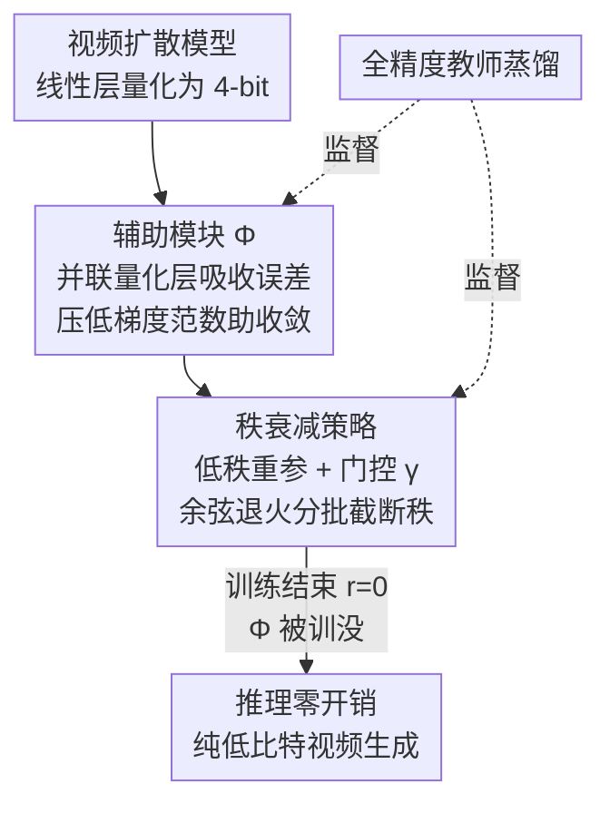

# QVGen: Pushing the Limit of Quantized Video Generative Models

**会议**: ICLR 2026  
**arXiv**: [2505.11497](https://arxiv.org/abs/2505.11497)  
**代码**: [https://github.com/ModelTC/QVGen](https://github.com/ModelTC/QVGen)  
**领域**: 图像生成  
**关键词**: 视频扩散模型, 量化感知训练, 低比特量化, 秩衰减策略, 辅助模块

## 一句话总结

提出 QVGen，一种面向视频扩散模型的量化感知训练（QAT）框架，通过引入辅助模块降低梯度范数以改善收敛性，并设计秩衰减策略在训练中逐步消除辅助模块的推理开销，首次在 4-bit 量化下实现接近全精度的视频生成质量。

## 研究背景与动机

视频扩散模型（如 CogVideoX、Wan）虽然能生成高质量视频，但对计算和内存的需求极高——Wan 14B 在单张 H100 上生成 10 秒 720p 视频需要超过 30 分钟和 50GB 显存。模型量化是一种有效的压缩方案，4-bit 量化可实现约 3× 加速和 4× 模型体积缩减。

然而，直接将图像扩散模型的量化方法迁移到视频扩散模型上效果不佳。现有 QAT 方法（如 Q-DM、EfficientDM、LSQ）在 4-bit 视频量化下都产生严重的质量退化，核心原因在于量化后的视频模型存在**收敛性困难**。

## 方法详解

### 整体框架

QVGen 要解决的是视频扩散模型在 4-bit 量化下"训不收敛"的难题。整体只有一条训练时间线：先把线性层量化成 4-bit，旁边并联一个全精度**辅助模块 $\Phi$** 来吸收量化误差、压低梯度范数让训练能收敛；训练全程用全精度教师做蒸馏把量化学生拉回正确去噪轨迹；与此同时**秩衰减策略**在训练里把 $\Phi$ 的秩一批批削到零，等训练结束 $\Phi$ 已被"训没"，推理时只剩纯低比特计算、零额外开销。前者负责"训得好"，后者负责"跑得快"，二者配合是整个框架能在极低比特下逼近全精度的关键。

### 关键设计

**1. 辅助模块：把量化误差喂给梯度，让低比特也能收敛**

视频扩散模型的 4-bit QAT 之所以崩，根子在收敛困难。作者从遗憾（regret）分析切入，给出平均遗憾的上界 $\frac{R(T)}{T} \leq \frac{dD_\infty^2}{2T\eta_T^m} + \frac{1}{T}\sum_{t=1}^{T}\frac{\eta_t^M}{2}\|\mathbf{g}_t\|_2^2$；当训练步数 $T$ 足够大时第一项可忽略，于是压低梯度范数 $\|\mathbf{g}_t\|_2$ 就成了改善收敛的抓手。据此他们在每个量化线性层旁并联一个辅助模块，前向变为 $\hat{\mathbf{Y}} = \mathcal{Q}_b(\mathbf{W})\mathcal{Q}_b(\mathbf{X}) + \Phi(\mathcal{Q}_b(\mathbf{X}))$，其中 $\Phi(\mathcal{Q}_b(\mathbf{X})) = \mathbf{W}_\Phi \mathcal{Q}_b(\mathbf{X})$，并把 $\mathbf{W}_\Phi$ 初始化为权重量化误差 $\mathbf{W} - \mathcal{Q}_b(\mathbf{W})$。这样 $\Phi$ 一上来就承接了量化引入的偏差，训练中持续吸收难以被低比特表达的残差，实测梯度范数全程低于纯 QAT，收敛因此变得平稳。

**2. 秩衰减策略：让辅助模块在训练里自己消失，推理零开销**

$\Phi$ 在推理时是一次额外的全精度矩阵乘法，若直接留着就违背了量化的初衷，所以必须在训练结束前彻底移除——但又不能粗暴砍掉，否则前面积累的收敛收益会丢失。作者的依据来自一个观察：对 $\mathbf{W}_\Phi$ 做 SVD，小奇异值的占比会随训练自然上升，从第 0 步的 73% 涨到第 2K 步的 99%，说明绝大多数分量贡献越来越弱、本就可弃。于是把 $\mathbf{W}_\Phi = \sum_{s=1}^d \sigma_s \mathbf{u}_s \mathbf{v}_s^\top$ 重写成低秩形式 $\Phi(\mathcal{Q}_b(\mathbf{X})) = \mathbf{L}\mathbf{R}\mathcal{Q}_b(\mathbf{X})$，再施加一个秩正则化门控 $\boldsymbol{\gamma}$，使前向成为 $\hat{\mathbf{Y}} = \mathcal{Q}_b(\mathbf{W})\mathcal{Q}_b(\mathbf{X}) + (\boldsymbol{\gamma} \odot \mathbf{L})\mathbf{R}\mathcal{Q}_b(\mathbf{X})$，其中 $\boldsymbol{\gamma} = \text{concat}([1]_{n \times (1-\lambda)r}, [u]_{n \times \lambda r})$ 把一部分秩固定为 1、另一部分由 $u$ 按余弦退火从 1 衰减到 0。当 $u$ 归零便截断这批低贡献分量、把秩从 $r$ 缩到 $(1-\lambda)r$，如此分批重复直到 $r=0$，$\Phi$ 被平滑地"训没"，推理时只剩纯低比特计算。

### 损失函数 / 训练策略

训练以全精度模型为教师做知识蒸馏，让量化学生在输出空间对齐教师：

$$\mathcal{L} = \mathbb{E}_{\mathbf{x}_0, \mathcal{C}, \tau}\left[\|\hat{\boldsymbol{\epsilon}}_\theta(\mathbf{x}_\tau, \mathcal{C}, \tau) - \boldsymbol{\epsilon}_\theta(\mathbf{x}_\tau, \mathcal{C}, \tau)\|_F^2\right]$$

辅助模块的引入与秩衰减都在这一蒸馏目标下进行，保证逐步移除 $\Phi$ 的同时学生始终被教师拉回正确的去噪轨迹。

## 实验

### 主实验

在 VBench 上的结果：

| 方法 | 比特 (W/A) | 成像质量↑ | 动态程度↑ | 场景一致性↑ |
|------|-----------|----------|----------|-----------|
| CogVideoX-2B 全精度 | 16/16 | 59.15 | 67.78 | 36.24 |
| SVDQuant (PTQ) | 4/6 | 58.27 | 40.83 | 27.69 |
| Q-DM (QAT) | 4/4 | 54.96 | 48.61 | 28.02 |
| **QVGen (Ours)** | **4/4** | **60.16** | **67.22** | **31.42** |
| **QVGen (Ours)** | **3/3** | **58.36** | **53.89** | **23.85** |

3-bit QVGen 在 Dynamic Degree 上比 Q-DM 提升 +25.28，Scene Consistency 提升 +8.43。

### 消融实验

| 组件 | FID↓ |
|------|------|
| 无辅助模块（纯 QAT） | 基线差 |
| 有辅助模块 + 直接衰减所有参数 | 次优 |
| 有辅助模块 + 秩衰减 ($\lambda=1/2$) | **最优** |

### 关键发现

- QVGen 是首个在 4-bit 下达到全精度可比质量的视频 QAT 方法
- 该框架具有通用性，在 CogVideoX 和 Wan 两大视频模型系列上均有效
- 应用于 Wan 14B（最大开源模型之一）时，在 VBench-2.0 上性能损失可忽略
- 梯度范数分析验证：QVGen 的 $\|\mathbf{g}_t\|_2$ 始终低于 Q-DM

## 亮点

- 首次从理论角度分析视频 QAT 的收敛性，揭示梯度范数与收敛性的关系
- 秩衰减策略设计精巧，巧妙利用训练过程中奇异值自然收缩的现象
- 在 3-bit 和 4-bit 极低比特上的效果显著优于所有基线

## 局限性

- 训练成本较高（Wan 14B 需要 32×H100 GPU 训练 16 个 epoch）
- 需要全精度教师模型进行知识蒸馏
- 当前仅验证了线性层的量化，未涉及注意力机制等其他组件

## 相关工作

- **PTQ 方法**：ViDiT-Q、SVDQuant 等后训练量化方法在极低比特下效果有限
- **QAT 方法**：Q-DM、EfficientDM、LSQ 等量化感知训练方法在视频模型上收敛困难
- **模型压缩**：低秩分解、剪枝等替代压缩手段

## 评分

- 新颖性：⭐⭐⭐⭐ — 辅助模块 + 秩衰减的组合设计新颖
- 理论性：⭐⭐⭐⭐ — 收敛性理论分析扎实
- 实验：⭐⭐⭐⭐⭐ — 覆盖 4 个 SOTA 视频模型，参数量从 1.3B 到 14B
- 实用性：⭐⭐⭐⭐⭐ — 直接解决视频模型部署的关键瓶颈

<!-- RELATED:START -->

## 相关论文

- [\[NeurIPS 2025\] EditInfinity: Image Editing with Binary-Quantized Generative Models](../../NeurIPS2025/image_generation/editinfinity_image_editing_with_binary-quantized_generative_models.md)
- [\[ICLR 2026\] Purrception: Variational Flow Matching for Vector-Quantized Image Generation](purrception_variational_flow_matching_for_vector-quantized_image_generation.md)
- [\[ICLR 2026\] LVTINO: LAtent Video consisTency INverse sOlver for High Definition Video Restoration](lvtino_latent_video_consistency_inverse_solver_for_high_definition_video_restora.md)
- [\[ICLR 2026\] Beyond Confidence: The Rhythms of Reasoning in Generative Models](beyond_confidence_the_rhythms_of_reasoning_in_generative_models.md)
- [\[ICLR 2026\] NeuralOS: Towards Simulating Operating Systems via Neural Generative Models](neuralos_towards_simulating_operating_systems_via_neural_generative_models.md)

<!-- RELATED:END -->
