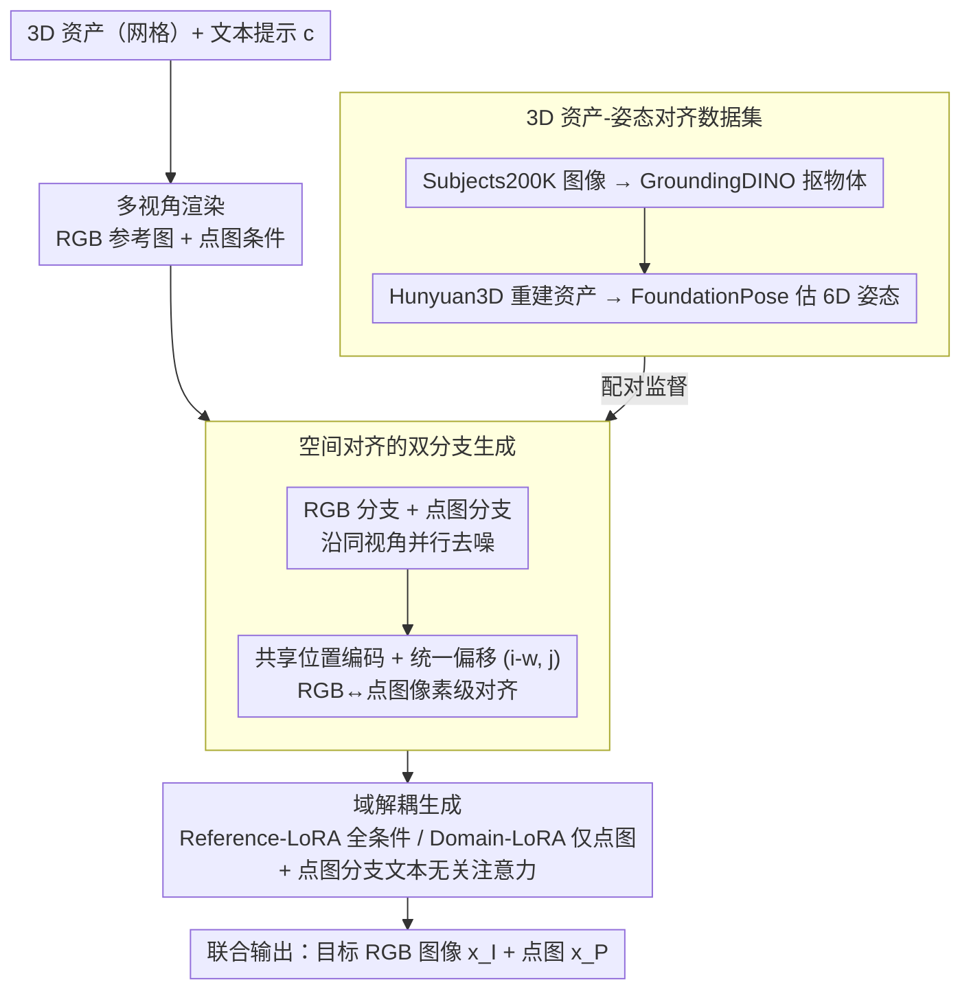

# RefAny3D: 3D Asset-Referenced Diffusion Models for Image Generation

**会议**: ICLR 2026  
**arXiv**: [2601.22094](https://arxiv.org/abs/2601.22094)  
**代码**: [https://judgementh.github.io/RefAny3D](https://judgementh.github.io/RefAny3D)  
**领域**: 3D 引导图像生成 / 扩散模型  
**关键词**: 3D 资产参考, 双分支生成, 点图 (point map), 域解耦, 主题驱动生成

## 一句话总结

提出 RefAny3D，一个 3D 资产参考的图像生成框架，通过联合建模 RGB 图像和点图（point map）的双分支生成策略，实现生成图像与 3D 参考资产在几何和纹理上的精确一致性。

## 研究背景与动机

**领域现状**：现有的参考图像生成方法（如 IP-Adapter、OminiControl）依赖 2D 参考图像，无法有效利用 3D 资产。而在实际创作中，设计者往往需要直接拿网格等 3D 资产当参考，来可视化同一物体在不同场景、不同视角下的样子。

**现有痛点**：把 3D 资产用于参考生成面临三大难题。其一是**一致性不足**，生成结果难以与资产的几何结构和纹理精确对齐；其二是**视角受限**，单张参考图无法覆盖物体的完整外观；其三是**视角冲突**，多图像条件方法缺乏 3D 结构先验，跨视角时容易出现几何漂移和不一致。

**核心思路**：RefAny3D 把 3D 资产的多视角 RGB 与对应点图（point map）一起作为条件，让点图充当几何锚点、与 RGB 并行生成，从结构上把"生成结果贴住 3D 参考"这件事约束住。

## 方法详解

### 整体框架

RefAny3D 基于 Flux.1-dev 扩散模型构建，把 3D 资产的多视角 RGB 图像和对应点图（point map）一起作为条件，在去噪时联合生成目标 RGB 图像 $x_I$ 及其点图 $x_P$。整个任务被形式化为联合分布建模 $p(x_I, x_P \mid y, c)$，其中 $y$ 是参考 3D 模型、$c$ 是文本提示。点图分支充当几何锚点：它与 RGB 分支沿同一套视角并行去噪，靠**共享位置编码**在像素级把二者对齐（设计 1），再用**双 LoRA 域解耦**把 RGB 与点图各自的信息职责拆开、避免互相污染（设计 2）；而支撑训练的「图像-3D 资产-姿态」三元组，则由一条自建的**数据集构建管线**提供配对监督（设计 3）。

### 关键设计

**1. 空间对齐的双分支生成：让 RGB 与点图建立像素级对应**

仅靠把 3D 资产渲染成参考图喂进去，模型很难判断生成图像的哪个像素该对应资产的哪个表面点，跨视角时几何就会漂移。RefAny3D 让 RGB 和点图沿同一套视角并行去噪，并对二者在同一视角下的令牌施加**共享位置编码**——利用 DiT 中位置编码越近注意力分数越高的特性，相同空间位置的 RGB 令牌与点图令牌天然互相对齐。为避免多个条件令牌之间因排布距离不一致而产生偏差，进一步引入统一位置偏移项 $(i-w, j)$ 把所有条件令牌拉回一致的相对坐标系，从而在像素级稳定建立 RGB 与几何之间的对应关系。

**2. 域解耦生成：化解 RGB 与点图的信息不对称**

RGB 和点图承载的信息天然不对等：点图只描述 3D 几何与姿态，而 RGB 还要画出整个场景的写实细节，用同一组参数去拟合两者会让背景信息污染几何、产生伪影。RefAny3D 用两套 LoRA 把职责拆开——**Reference-LoRA** 对所有条件令牌激活、负责参考驱动的生成，**Domain-LoRA** 只对点图令牌激活、专门吸收点图域的几何知识。同时在点图分支加上**文本无关注意力**掩码，屏蔽文本令牌对点图的影响，防止提示里的背景描述泄漏进几何通道，使点图保持干净的纯结构表示。

**3. 3D 资产-姿态对齐数据集：为新任务提供训练监督**

该任务缺乏现成的「图像-3D 资产-姿态」三元组数据，作者基于 Subjects200K 自建数据管线：先用 GroundingDINO 从图像中框出并抠取目标物体，再用 Hunyuan3D 把抠出的物体重建为 3D 资产，最后用 FoundationPose 估计该资产在原图中的 6D 姿态，从而把每张图像与一个带姿态的 3D 参考严格对齐，为双分支生成提供配对监督。

## 实验

### 主实验（GPT 评估 + 视觉模型评估）

| 方法 | 纹理↑ | 几何↑ | 美学↑ | 总分↑ | CLIP Avg↑ | DINO Avg↑ | GIM↑ |
|------|------|------|------|------|----------|----------|------|
| Textual Inversion | 2.89 | 4.42 | 6.26 | 4.53 | 0.827 | 0.548 | 3360 |
| DreamBooth | 5.37 | 6.68 | 6.89 | 6.32 | 0.867 | 0.695 | 3483 |
| OminiControl | 5.63 | 6.58 | 6.89 | 6.37 | 0.855 | 0.665 | 3474 |
| **RefAny3D** | **6.32** | **7.37** | **7.69** | **7.12** | **0.873** | **0.720** | **3901** |

### 消融实验

| 设置 | 效果 |
|------|------|
| 无共享位置编码 | 点图与 RGB 像素级对应失败，几何一致性下降 |
| 无文本无关注意力 | 点图受文本影响，背景区域出现颜色混合 |
| 无域特定 LoRA | 单一 LoRA 同时学习两个域，导致背景伪影 |
| 无点图分支 | 缺乏 3D 线索，训练不稳定，3D 一致性差 |

### 用户研究

RefAny3D 在忠实度（4.655）、ID 保持（4.737）、美学质量（4.632）和整体排名（1.579）上均优于所有基线。

## 亮点与洞察

- 首次探索以 3D 资产为参考条件的图像生成任务
- 点图作为结构锚点的设计有效建立了跨视角的像素级对应
- 域解耦策略优雅地解决了 RGB 与点图的信息不对称问题
- 可与多视图到 3D 生成模型集成，形成完整工作流

## 局限与展望

- 对非刚性物体（如绳索、靠垫）效果较差，因数据集限制
- 大量视角条件输入带来显著的计算和时间开销
- 依赖 Hunyuan3D 和 FoundationPose 的质量进行数据构建

## 相关工作

- **主题驱动生成**：Textual Inversion、DreamBooth、IP-Adapter、OminiControl 等
- **3D 引导生成**：ThemeStation、Phidias 等侧重于 3D 资产生成而非图像生成
- **多模态生成**：Marigold、GeoWizard 等联合生成 RGB 和几何信息

## 评分

- 新颖性：⭐⭐⭐⭐ — 3D 资产参考图像生成是全新任务定义
- 技术性：⭐⭐⭐⭐ — 双分支 + 域解耦设计合理
- 实验：⭐⭐⭐⭐ — GPT 评估 + 视觉模型 + 用户研究，评估全面
- 实用性：⭐⭐⭐⭐ — 对 3D 内容创作有实际价值

<!-- RELATED:START -->

## 相关论文

- [\[CVPR 2025\] 3DTopia-XL: Scaling High-Quality 3D Asset Generation via Primitive Diffusion](../../CVPR2025/image_generation/3dtopia-xl_scaling_high-quality_3d_asset_generation_via_primitive_diffusion.md)
- [\[ICLR 2026\] Asynchronous Denoising Diffusion Models for Aligning Text-to-Image Generation](asynchronous_denoising_diffusion_models_for_aligning_text-to-image_generation.md)
- [\[ICLR 2026\] Generalization of Diffusion Models Arises with a Balanced Representation Space](generalization_of_diffusion_models_arises_with_a_balanced_representation_space.md)
- [\[ICLR 2026\] Unified Multi-Modal Interactive & Reactive 3D Motion Generation via Rectified Flow](unified_multi-modal_interactive_reactive_3d_motion_generation_via_rectified_flow.md)
- [\[ICLR 2026\] RIDER: 3D RNA Inverse Design with Reinforcement Learning-Guided Diffusion](rider_3d_rna_inverse_design_with_reinforcement_learning-guided_diffusion.md)

<!-- RELATED:END -->
