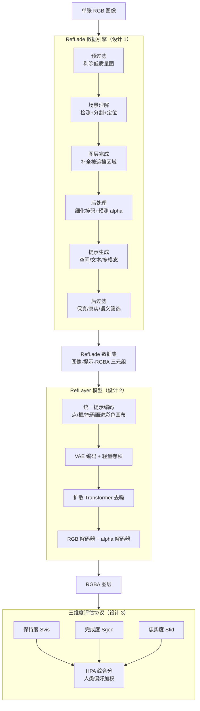

# Referring Layer Decomposition

**会议**: ICLR 2026  
**arXiv**: [2602.19358](https://arxiv.org/abs/2602.19358)  
**代码**: [https://yaojie-shen.github.io/project/RLD/](https://yaojie-shen.github.io/project/RLD/)  
**领域**: 图像分解 / 图像编辑  
**关键词**: 图层分解, RGBA 层, 多模态引用输入, 数据引擎, RefLayer

## 一句话总结

提出 Referring Layer Decomposition (RLD) 任务，根据用户提供的灵活提示（空间/文本/混合）从单张 RGB 图像中预测完整的 RGBA 图层，并构建了包含 111 万样本的 RefLade 数据集和自动评估协议。

## 研究背景与动机

现代生成模型通常将图像作为整体进行处理，缺乏对单个场景元素的显式表示，使得选择性操纵、跨编辑一致性维护和语义对齐困难重重。图像图层（RGBA 格式的透明视觉单元）提供了更直观的框架，类似于 Photoshop 中的图层工作流。

现有方法的局限：
- MuLAn：数据规模有限（44K 图像），成功率仅 36%
- Text2Layer：只能分离前景/背景两层
- LayerDecomp：依赖合成监督，需要目标掩码

RLD 任务的核心创新在于支持多种用户提示（点、框、掩码、文本），实现按需提取目标 RGBA 图层。

## 方法详解

### 整体框架

RLD 把"按提示抽图层"这件事拆成三块互相支撑的工作，整条链路是「造数据 → 训模型 → 评质量」。第一块是 **RefLade 数据引擎**，用六阶段流水线把单张 RGB 图自动加工成"提示 + 对应完整 RGBA 图层"的训练三元组，并把被前景遮挡的部分补全；第二块是 **RefLayer 模型**，基于 Stable Diffusion 3，把任意空间/文本提示统一编进输入、再吐出带透明通道的 RGBA 图层；第三块是**三维度评估协议**，从可见区保真、遮挡区补全、合成自然三个轴自动给抽取质量打分，并对齐人类偏好。三者合起来既给出了任务的训练数据，又给出了参照实现和判分标准。

### 关键设计

**1. RefLade 数据引擎：用六阶段流水线把 RLD 三元组的产出成功率从 36% 拉到 70%**

RLD 任务最大的拦路虎是没有现成数据——同一张 RGB 图必须配上"提示 + 对应完整 RGBA 图层"，而被前景遮挡的部分还得补全。引擎把这件难事拆成六步串起来做：先用规则**预过滤**剔除低质量图像（约 86.1% 的图像通过适用性判定），再做**场景理解**把封闭集检测、开放词汇检测和 MLLM 定位融在一起找出候选目标；接着**图层完成**重建被遮挡的物体区域、**后处理**细化掩码并预测 alpha 遮罩，**提示生成**为每个目标合成空间/文本/多模态三类提示，最后**后过滤**从保真度、真实性、语义一致性三方面把不合格的 RGBA 图层筛掉。这条流水线让单样本的端到端产出成功率从 MuLAn 的 36% 提升到 70%，是 RefLade 能做到百万量级的根本原因。

**2. RefLayer 模型与统一提示编码：用一张彩色 RGB 图把点/框/掩码/文本等异构提示喂给扩散模型，并加一条 alpha 解码分支直接产出透明图层**

数据引擎产出三元组之后，需要一个能吃下这些提示、直接生成图层的模型。难点在于让一个生成器同时接收形态各异的提示、还要输出带透明通道的图层。提示编码策略把所有空间提示画进同一张彩色画布里统一表达：蓝色画布代表背景，绿色区域标边界框，红色区域标掩码，点则渲染成高斯热图，这样不同粒度的提示在输入端就被对齐成同一种模态，模型据此从粗到细地响应。模型基于 Stable Diffusion 3，VAE 编码器把原始图像和这张位置提示图一起编码，经一层轻量卷积压缩通道后送入扩散 Transformer 去噪；解码端在标准 RGB 解码器之外额外接一个自定义 alpha 解码器（结构与 VAE 解码器一致、仅把输出通道设为 1），使网络在生成 RGB 内容的同时直接在隐空间预测 alpha 遮罩，省去事后抠图。训练时冻结 VAE，让扩散 Transformer 与 alpha 解码器在共享隐空间下独立训练，既降低优化难度又让模型对未见提示展现零样本泛化能力。

**3. 三维度评估协议 + HPA 综合分：把"抽得好不好"拆成可见区保真、遮挡区补全、合成自然三个互补的轴，再用人类偏好把它们合成一个能信的分**

有了模型还需要一把能信的尺子，否则无法判断图层抽得好不好。单一指标在 RLD 上都会偏科：只看可见区域的相似度会奖励"原样抠图"，只看 FID 又抓不住补全是否对。协议因此并行测三件事。**保持度** $\mathcal{S}_{\text{vis}}$ 在可见掩码 $g_v$ 圈定的区域内对比预测图层与真值的 LPIPS，$\mathcal{S}_{\text{vis}} = \mathbb{E}_{(p,g)\sim\mathcal{D}}[\text{LPIPS}(g_{\text{rgb}} \odot g_v, p_{\text{rgb}} \odot g_v)]$，衡量"该保留的有没有被改坏"。**完成度** $\mathcal{S}_{\text{gen}}$ 用 CLIP 特征的方向相似度盯住被补全出来的那部分，$\mathcal{S}_{\text{gen}} = \mathbb{E}[\cos(f(g_{\text{rgb}}) - f(g_{\text{rgb}} \odot g_v),\, f(p_{\text{rgb}}) - f(g_{\text{rgb}} \odot g_v))]$，比较的是"真值从可见到完整的语义变化方向"和"预测的变化方向"是否一致。**忠实度** $\mathcal{S}_{\text{fid}}$ 则把预测图层 alpha 混回背景后算 FID，看合成结果整体真不真。由于这三轴各自都无法稳定反映人类偏好，协议进一步用人类偏好 Elo 排名的归一化加权平均得到 **HPA** 综合分，使自动评分能与人类判断强相关，把图层质量评估从"靠人眼盯"变成可规模化复现。

## 实验

### 数据集统计

| 数据集 | 任务 | #图像 | #类别 | #实例 | 遮挡率 |
|--------|------|-------|-------|-------|--------|
| MuLAn | LD | 44,860 | 759 | 101,269 | 7.7% |
| **RefLade** | **RLD** | **430,488** | **12K** | **871,829** | **60.8%** |

### 评估协议验证

HPA 分数与人类 ELO 排名强相关，而单独的 $\mathcal{S}_{\text{vis}}$、$\mathcal{S}_{\text{fid}}$、$\mathcal{S}_{\text{gen}}$ 均无法一致地反映人类偏好。

### 质量评估

- 74.7% 的前景图层和 70.2% 的背景图层达到质量阈值
- 人工标注历时 43 天，由 9 名专业标注员完成
- 精心筛选获得 59K 高质量图像和 110K 验证图层

### 关键发现

- 粗粒度提示（单个点）可能导致粗粒度输出，而精确提示产生准确的物体级图层
- RefLayer 展现出强零样本泛化能力
- 多粒度提示系统支持从粗到细的灵活控制

## 亮点

- 首次定义了基于多模态引用输入的图层分解任务
- 数据引擎设计系统全面，将成功率从 36% 提升到 70%
- 评估协议与人类偏好高度对齐，解决了评估瓶颈
- RefLade 数据集规模远超现有同类（430K vs MuLAn 的 44K）

## 局限性

- 数据引擎依赖多个外部模型（检测/分割/补全），级联错误不可避免
- 人工标注成本高（43 天 × 9 人）
- 评估协议中 Ground Truth 图层本身可能不完美

## 相关工作

- **图像理解与编辑**：检测、分割、修复、alpha matting 等
- **组合图像表示**：MuLAn、Text2Layer 等 RGBA 图层方法
- **参考表达分割**：SAM 等可提示分割方法仅输出掩码，不重建遮挡内容

## 评分

- 新颖性：⭐⭐⭐⭐⭐ — 任务定义新颖，填补了研究空白
- 数据贡献：⭐⭐⭐⭐⭐ — 百万级数据集 + 数据引擎 + 人工标注
- 评估：⭐⭐⭐⭐ — 三维度评估协议对齐人类偏好
- 实用性：⭐⭐⭐⭐ — 对图像编辑和合成有直接应用价值

<!-- RELATED:START -->

## 相关论文

- [\[CVPR 2026\] From Inpainting to Layer Decomposition: Repurposing Generative Inpainting Models for Image Layer Decomposition](../../CVPR2026/image_generation/from_inpainting_to_layer_decomposition_repurposing_generative_inpainting_models_.md)
- [\[CVPR 2026\] Qwen-Image-Layered: Towards Inherent Editability via Layer Decomposition](../../CVPR2026/image_generation/qwen-image-layered_towards_inherent_editability_via_layer_decomposition.md)
- [\[CVPR 2025\] Generative Image Layer Decomposition with Visual Effects](../../CVPR2025/image_generation/generative_image_layer_decomposition_with_visual_effects.md)
- [\[ICLR 2026\] Generalization of Diffusion Models Arises with a Balanced Representation Space](generalization_of_diffusion_models_arises_with_a_balanced_representation_space.md)
- [\[CVPR 2026\] Pluggable Pruning with Contiguous Layer Distillation for Diffusion Transformers](../../CVPR2026/image_generation/pluggable_pruning_with_contiguous_layer_distillation_for_diffusion_transformers.md)

<!-- RELATED:END -->
