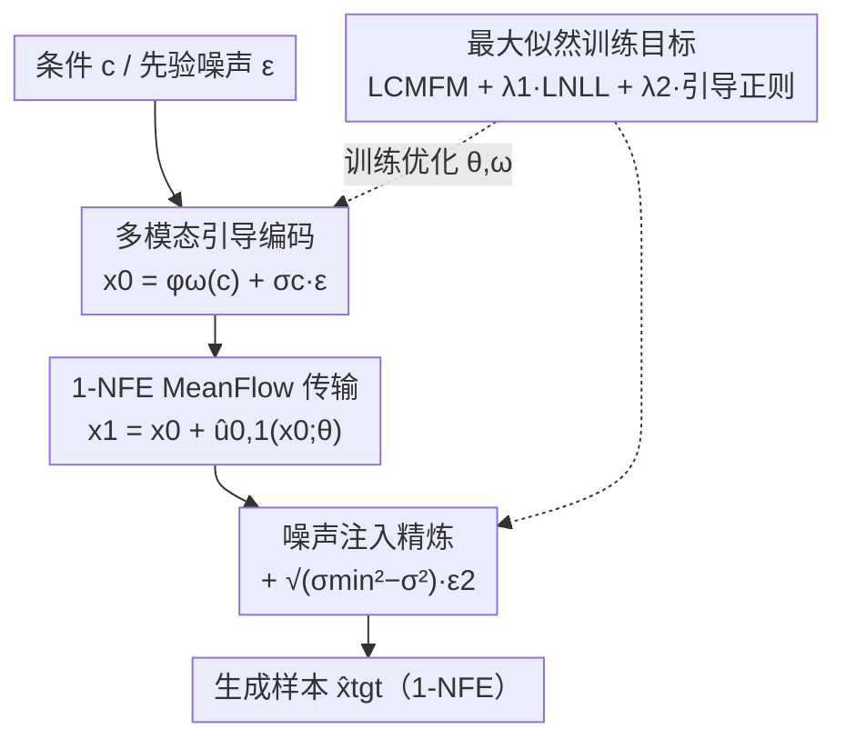

# RMFlow: Refined Mean Flow by a Noise-Injection Step for Multimodal Generation

**会议**: ICLR 2026  
**arXiv**: [2602.00849](https://arxiv.org/abs/2602.00849)  
**代码**: 无  
**领域**: 扩散模型 / 单步生成 / Mean Flow 改进  
**关键词**: mean flow, noise injection refinement, 1-NFE, likelihood maximization, multimodal generation  

## 一句话总结
提出 RMFlow，在 1-NFE MeanFlow 传输后加入一步噪声注入精炼来弥补单步传输的误差，同时在训练中加入最大似然目标来最小化学习分布与目标分布间的 KL 散度，在 T2I、分子生成、时间序列生成上实现接近 SOTA 的 1-NFE 结果。

## 研究背景与动机

**领域现状**：MeanFlow 通过学习平均速度场实现少步生成，无需预训练或蒸馏。但 1-NFE 时性能显著下降——单步传输不够精确，生成样本偏离目标分布。

**现有痛点**：1-NFE MeanFlow 在高斯混合分布上偏差大、在分子生成上生成无效结构（断裂分子）。多步（8/32 NFE）效果好但失去了效率优势。

**核心矛盾**：1-NFE 传输的确定性输出偏离真实分布（因为平均速度近似带误差），但不能增加 NFE。

**本文目标** 在保持 1-NFE 的前提下改善 MeanFlow 的生成质量。

**切入角度**：将 1-NFE 看作"粗传输"，然后加一步噪声注入来"精炼"——本质上是将 MeanFlow 的确定性输出转化为概率性输出，用噪声来补偿传输误差。训练时额外加入最大似然目标以最小化 KL 散度。

**核心 idea**：1-NFE MeanFlow 的确定性输出 + 高斯噪声注入 ≈ 更好的目标分布近似。

## 方法详解

### 整体框架

RMFlow 想解决的是：1-NFE MeanFlow 单步传输太糙、生成样本偏离目标分布，但又不能加 NFE。它的整体思路是把生成显式拆成「粗传输 + 噪声精炼」两阶段，再配一个引导编码器支持跨模态。一条样本这样走：先把条件 $c$ 经编码器嵌入得到先验 $x_0$，用 1-NFE MeanFlow 把 $x_0$ 一步搬到中间态 $x_1$，再补一步噪声注入得到最终样本。三阶段最终合并成一条单步生成公式

$$\hat{x}_{\text{tgt}} = x_0 + \hat{u}_{0,1}(x_0;\theta) + \sqrt{\sigma_{\min}^2-\sigma^2}\,\epsilon_2,\quad \epsilon_2\sim\mathcal{N}(\mathbf{0},I),$$

其中 $\hat{u}_{0,1}$ 是 MeanFlow 学到的平均速度场（一次网络评估），噪声项与它并行相加、几乎零开销，所以虽然概念上两阶段、生成仍是 1-NFE。训练时联合优化三件事：让平均速度场把路走对（Wasserstein 控制）、让加噪后的终端分布贴近目标（KL 控制）、以及约束引导编码。

### 关键设计

**1. 多模态引导编码：让一套框架同时支持有条件与无条件生成**

MeanFlow 本身是无条件传输，但 RMFlow 要做 T2I、context-to-molecule、时间序列这类跨模态生成，得把条件信号塞进来。做法是用一个编码器 $\phi_\omega(c)$ 把条件嵌入，并据此构造先验：有引导时 $x_0=\phi_\omega(c)+\sigma_c\epsilon$（$\sigma_c\ll1$，如 $10^{-3}$），无引导时退化为 $x_0=\epsilon$。这样同一套 MeanFlow 既能从「条件嵌入附近的噪声」出发做有条件生成，也能从纯高斯噪声做无条件生成，编码器与 MeanFlow 联合训练。论文明确指出（Remark 1），引导编码与噪声注入正是 RMFlow 区别于原始 MeanFlow 的两点。

**2. 噪声注入精炼：把确定性点估计软化成有方差的分布**

1-NFE MeanFlow 的输出 $x_0+\hat{u}_{0,1}$ 是一个确定的点，而平均速度只是真实速度场沿路径的近似，单步传输必然带误差，于是这个点系统性地偏离目标——在高斯混合上表现为 TV 偏大，在分子生成上直接搬出断裂的无效结构。RMFlow 把生成显式拆成两阶段：第一阶段 1-NFE 把先验搬到中间态 $x_1=x_{\text{data}}+\sigma\epsilon_1$（$\sigma<\sigma_{\min}$），第二阶段补一步噪声注入 $x_{\text{tgt}}=x_1+\sqrt{\sigma_{\min}^2-\sigma^2}\,\epsilon_2$，把方差恰好补到 $\sigma_{\min}^2$，对齐论文采用的平滑目标 $x_{\text{tgt}}=x_{\text{data}}+\sigma_{\min}\epsilon$。注意这里的噪声系数是 $\sqrt{\sigma_{\min}^2-\sigma^2}$ 而非随手一个 $\sigma$——它由「中间态已有 $\sigma$ 噪声、终端要凑够 $\sigma_{\min}$」反推而来。这一步把「模型把样本放偏了」的硬误差，软化成以传输结果为中心、方差 $\sigma_{\min}^2-\sigma^2$ 的散布，从而盖住真实模式而不是卡在一个偏点上。

**3. 最大似然训练目标：给噪声注入一个 KL 意义下的原理依据**

光加噪声不够，还得让加噪前的传输落点落在对的位置，并说清为什么这样能逼近目标分布。噪声注入让最终样本服从条件高斯 $\hat{x}_{\text{tgt}}\mid x_0\sim\mathcal{N}\big(x_0+\hat{u}_{0,1},(\sigma_{\min}^2-\sigma^2)I\big)$，于是它的对数似然正好是一个平方误差项，据此定义负对数似然损失

$$\mathcal{L}_{\text{NLL}} = \mathbb{E}\big[\|(x_{\text{data}}+\sigma_{\min}\epsilon)-(x_0+\hat{u}_{0,1}(x_0;\theta))\|^2\big].$$

论文证明（Theorem 4.1）$-A\cdot\mathcal{L}_{\text{NLL}}+C$ 是目标分布期望对数似然 $-H(p_{\text{tgt}})-D_{\text{KL}}(p_{\text{tgt}}\|p_\theta)$ 的下界，所以最小化 $\mathcal{L}_{\text{NLL}}$ 就是在压低学习分布与目标分布的 KL 散度。这恰好补上了原始 MeanFlow 的短板：Boffi 等只证明了 MeanFlow 损失 $\mathcal{L}_{\text{CMFM}}$ 约束 Wasserstein 距离 $W_2^2(p_{\text{tgt}},p_\theta)$，而经验上额外的 KL 约束往往带来更好的生成质量。

### 损失函数 / 训练策略

最终目标把三项加权合并：

$$\mathcal{L}_{\text{RMFlow}}(\theta,\omega)=\underbrace{\mathcal{L}_{\text{CMFM}}}_{\text{Wasserstein 控制}}+\lambda_1\underbrace{\mathcal{L}_{\text{NLL}}}_{\text{KL 控制}}+\lambda_2\underbrace{\mathbb{E}_{(x_{\text{data}},c)}[\|\phi_\omega(c)\|^2]}_{\text{引导正则}}.$$

三项分工明确：$\mathcal{L}_{\text{CMFM}}$ 管「路走对」（约束整条概率路径），$\mathcal{L}_{\text{NLL}}$ 管「终点准」（约束终端分布），$\lambda_2$ 项正则引导编码。大规模任务（如 T2I）采用两阶段训练：先按常规训好 MeanFlow，再用 PEFT/LoRA 微调阶段引入 NLL 精炼，避免从头联合训练的开销。具体设置上，T2I 用 COCO + 480M U-Net 在 SD-VAE 潜空间生成，分子生成在 QM9 与 Geom-Drugs 上验证。

## 实验关键数据

### 主实验

| 方法 | NFE | Mixture Gaussian TV ↓ | QM9 分子稳定性 ↑ |
|------|-----|---------------------|----------------|
| MeanFlow | 1 | 1.44 | 低（生成断裂） |
| MeanFlow | 8 | 0.80 | 中等 |
| MeanFlow | 32 | 0.67 | 高 |
| **RMFlow** | **1** | **0.76** | **接近 32-NFE** |

T2I (COCO FID-30K): RMFlow 达到与 Distilled SD、StyleGAN-T 可比的 FID，且不需要辅助模型。

### 关键发现
- 1-NFE RMFlow 超越 8-NFE MeanFlow（TV 0.76 vs 0.80），接近 32-NFE
- 分子生成中噪声注入有效避免了结构断裂
- 训练成本与 MeanFlow 相当（噪声注入几乎零开销）

## 亮点与洞察
- **极简改进**：只加一步 $\sigma\epsilon$ 就显著改善 1-NFE 质量——本质上是将点估计问题转为分布估计，用噪声补偿模型误差。
- **多模态通用**：同一框架处理图像、分子、时间序列，说明噪声注入精炼是模态无关的通用技巧。
- 理论上证明了 NLL 损失与 KL 散度的联系，为噪声注入提供了原理性解释。

## 局限与展望
- 噪声注入的 $\sigma$ 是超参数需要调优
- T2I 实验用 COCO + 小 U-Net，缺少 ImageNet/大模型验证
- 与 SoFlow、TwinFlow 等最新单步方法缺少直接对比
- 噪声注入是否在所有任务上都有益？高维图像中可能引入模糊

## 相关工作与启发
- **vs MeanFlow**: 1-NFE RMFlow > 8-NFE MeanFlow，核心改进是噪声注入+NLL 损失
- **vs SoFlow**: 不同的改进思路——SoFlow 学解函数，RMFlow 学平均速度+精炼

## 评分
- 新颖性: ⭐⭐⭐ 噪声注入思路简单，但在 MeanFlow 上是首次
- 实验充分度: ⭐⭐⭐⭐ 多模态验证（图像/分子/时间序列），但图像实验规模小
- 写作质量: ⭐⭐⭐⭐ 清晰有条理，理论推导严谨
- 价值: ⭐⭐⭐⭐ 提供了一个简单有效的 MeanFlow 改善方案

<!-- RELATED:START -->

## 相关论文

- [\[CVPR 2026\] Functional Mean Flow in Hilbert Space](../../CVPR2026/image_generation/functional_mean_flow_in_hilbert_space.md)
- [\[ICLR 2026\] CMT: Mid-Training for Efficient Learning of Consistency, Mean Flow, and Flow Map Models](cmt_mid-training_for_efficient_learning_of_consistency_mean_flow_and_flow_map_mo.md)
- [\[ICLR 2026\] Flow Matching with Injected Noise for Offline-to-Online Reinforcement Learning](flow_matching_with_injected_noise_for_offline-to-online_reinforcement_learning.md)
- [\[ICLR 2026\] Diverse Text-to-Image Generation via Contrastive Noise Optimization](diverse_text-to-image_generation_via_contrastive_noise_optimization.md)
- [\[ICLR 2026\] SSCP: Flow-Based Single-Step Completion for Efficient and Expressive Policy Learning](flow-based_single-step_completion_for_efficient_and_expressive_policy_learning.md)

<!-- RELATED:END -->
