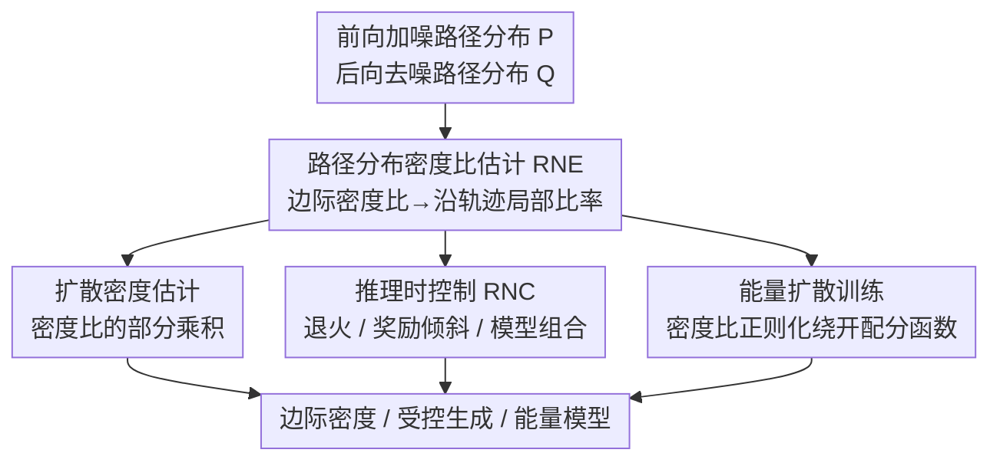

# RNE: plug-and-play diffusion inference-time control and energy-based training

**会议**: ICLR 2026  
**arXiv**: [2506.05668](https://arxiv.org/abs/2506.05668)  
**代码**: 无  
**领域**: Image Generation / Diffusion Models  
**关键词**: 扩散模型, 密度比估计, 推理时控制, 能量模型训练, Radon-Nikodym 导数

## 一句话总结

提出 Radon-Nikodym 估计器 (RNE)，基于路径分布间的密度比揭示边际密度与转移核的基本联系，提供统一的即插即用框架，同时实现扩散密度估计、推理时控制和能量扩散训练。

## 研究背景与动机

扩散模型通过逐步去噪生成数据，对应加噪过程的时间反转。在许多应用中，仅获取去噪核 (denoising kernels) 是不够的，我们需要知道生成轨迹上的**边际密度** (marginal densities)。边际密度的知识可以支持：

**密度估计**：评估生成模型在任意点的概率密度

**推理时控制 (inference-time control)**：在生成过程中动态引导输出，如条件生成、组合多个模型

**能量扩散训练**：训练能量函数来参数化扩散模型

然而，获取扩散模型的边际密度是一个长期难题：
- 直接计算需要积分所有可能的前向路径，计算上不可行
- 现有方法（如 ODE 概率流的似然估计）计算昂贵或精度不足
- 推理时控制方法通常需要特定假设（如 Tweedie 公式的近似），适用范围有限

**核心洞察**：利用 Radon-Nikodym 导数（密度比）的概念，可以建立边际密度与转移核之间的基本数学联系。这个联系无需训练额外模型，也不依赖特定的扩散模型架构。

## 方法详解

### 整体框架

扩散模型逐步去噪生成数据，但很多应用真正需要的不是单步去噪核，而是生成轨迹上的**边际密度**——直接算它要对所有前向路径积分，计算上不可行。RNE 的破题思路是把整条轨迹当成一个对象，去比较前向（加噪）路径分布 $\mathbb{P}$ 和后向（去噪）路径分布 $\mathbb{Q}$：借助 Radon-Nikodym 导数，两者的密度比可以完全用已知的转移核写出来，且天然分解成沿轨迹逐步累乘的局部比率。这个密度比估计器（RNE）就是整套方法的引擎，它一次性把三件看似无关的事——密度估计、推理时控制、能量训练——都归结为对同一个密度比的估计与操纵；又因为推导只依赖"路径分布"这个抽象，它对连续和离散扩散一视同仁。

### 关键设计

**1. 路径分布密度比估计（RNE）：把难算的全局边际密度化成逐步可算的局部比率**

边际密度难算的根源在于它要对所有前向路径积分。RNE 不去碰边际密度本身，而是看两条完整路径分布的比值。对前向过程 $q(x_0, x_1, \dots, x_T)$ 和后向过程 $p(x_T, x_{T-1}, \dots, x_0)$，Radon-Nikodym 导数把它们直接联系起来：

$$\frac{d\mathbb{Q}}{d\mathbb{P}}(x_{0:T}) = \frac{p(x_T) \prod_{t=1}^{T} p_\theta(x_{t-1}|x_t)}{q(x_0) \prod_{t=1}^{T} q(x_t|x_{t-1})}.$$

这个比率天然分解成逐步局部比率的连乘，每一步只涉及已知的转移核，不需要任何额外训练的模型。理论基石是一条干净的事实：一个扩散过程与它的**精确时间反转**诱导出同一个路径测度，两者的 RN 导数恒等于 1——正是这个等式让"用转移核反推边际密度比"成为可能。整套推导只依赖路径分布这一抽象、不依赖状态空间是否连续，所以 RNE 不限于连续扩散，对离散扩散（如文本的离散去噪）同样成立，从一个图像扩散技巧升级为跨模态通用工具。

**2. 扩散密度估计：用密度比的部分乘积直接读出边际密度**

有了路径密度比，任意中间时刻 $t$ 的状态 $x_t$ 的边际密度，就能用路径密度比的**部分乘积**估计出来，全程复用扩散模型自身的转移核，无需再训练一个密度模型。实际计算时在路径空间做蒙特卡洛采样逼近这个比率，于是"评估生成模型在任意点的概率密度"这件原本昂贵的事，变成用现成模型即可完成。

**3. 推理时控制（RNC）：把退火、奖励倾斜、模型组合统一成对密度比的重要性采样校正**

RNE 作为即插即用模块挂在冻结的预训练模型上，不改任何权重就能把采样从原分布 $p_0$ 引导到一个新目标 $q_0$。论文把多种控制手段纳入同一视角：**退火**（annealing，$q_0 \propto p_0^{\,t}$ 调温度）、**奖励倾斜 / 后验采样**（reward-tilting，$q_0 \propto p_0 \exp(r)$，按奖励或似然 $r$ 重加权）、**模型组合**（composition，把多个模型的密度比相乘以叠加条件）。落地手段是 Radon-Nikodym 校正器（RNC）：直接对终点做重要性采样会方差很大，RNC 改用序贯蒙特卡洛（SMC）把重要性权重**摊到整条轨迹上**逐步重采样，显著降低方差。由于控制力来自采样路径的多少，RNE 天然支持推理时缩放——多给计算预算就换来更好的控制效果。

**4. 能量扩散训练：用密度比正则化绕开配分函数**

传统能量扩散模型训练卡在配分函数（partition function）的估计上，计算困难。RNE 换了个思路：用密度比作为正则项约束能量函数的训练，让学到的能量与真实密度比保持一致，从而完全避免显式估计配分函数，把训练流程大幅简化。

### 损失函数 / 训练策略

RNE 在推理时控制场景下不需要任何额外训练：冻结预训练模型，仅通过 RNC 的密度比校正调节采样轨迹即可。在能量扩散训练场景下，它充当辅助正则项——在标准去噪损失之上叠加基于 RNE 的正则化，约束学到的能量函数与真实密度比一致，以此替代昂贵的配分函数估计。

## 实验关键数据

### 主实验

| 任务 | 方法 | 关键指标 | 说明 |
|------|------|----------|------|
| 退火采样 | RNE | 优于标准方法 | 更精确的条件采样 |
| 模型组合 | RNE | 多条件生成质量高 | 组合多个预训练模型 |
| 推理时缩放 | RNE | 性能随计算量提升 | 验证 scaling 特性 |
| 能量扩散训练 | RNE 正则化 | 简单高效 | 无需估计配分函数 |

### 消融实验

| 配置 | 关键指标 | 说明 |
|------|----------|------|
| 无 RNE 密度估计 | 密度估计不准确 | 缺少路径级别的密度比信息 |
| 有 RNE | 密度估计精度提升 | 利用了转移核的完整信息 |
| 连续扩散 | 验证有效 | 标准场景 |
| 离散扩散 | 同样有效 | 验证模态无关性 |

### 关键发现

1. **推理时控制的统一框架**：RNE 将退火、模型组合等看似不同的推理时控制方法统一到密度比的视角下
2. **推理时缩放**：增加计算量（更多采样路径）可以持续提升控制精度，这与 inference-time compute scaling 的趋势一致
3. **能量训练简化**：RNE 正则化避免了传统能量模型训练中配分函数估计的困难
4. **模态通用性**：在连续和离散扩散模型上都验证了 RNE 的有效性

## 亮点与洞察

1. **理论优美**：利用 Radon-Nikodym 导数这一测度论基本工具，建立了扩散模型中看似独立的三个问题（密度估计、推理控制、能量训练）之间的统一联系
2. **即插即用设计**：不需要修改预训练模型，不需要训练额外的控制网络（如 ControlNet），大幅降低了使用门槛
3. **路径分布视角的创新**：不在单步转移层面工作，而是在完整轨迹的分布层面建立联系，这是一个更高层次的抽象
4. **推理时缩放特性**：呼应了当前 AI 社区对 test-time compute 和 inference-time scaling 的关注趋势
5. **离散扩散的适用性**：扩展了框架的适用范围，对文本和蛋白质等离散序列的扩散生成有潜在价值

## 局限与展望

1. **蒙特卡洛估计的方差**：路径空间中的密度比估计可能有较高方差，特别是在长扩散轨迹中
2. **计算成本**：虽然不需要额外训练，但推理时需要多次采样路径来估计密度比，增加了推理延迟
3. **在大规模视觉生成上的验证不足**：需要在如 Stable Diffusion、DALL-E 等大规模模型上验证
4. **与已有推理控制方法的系统比较**：如 Classifier Guidance、Classifier-Free Guidance、DPS 等的详细对比
5. **理论与实践的差距**：理论框架基于精确的前向/后向核，实际中使用的是学到的近似模型，近似误差的影响需要更深入分析

## 相关工作与启发

- **扩散模型密度估计**：与 Song et al. 的连续正规化流 (CNF) 方法相比，RNE 不需要求解 ODE，而是直接在路径分布层面操作
- **推理时控制**：与 Classifier Guidance (Dhariwal & Nichol, 2021)、DPS (Chung et al., 2022)、FreeDoM (Yu et al., 2023) 等方法互补，但 RNE 提供了更统一的理论视角
- **能量模型**：与 EBM-based diffusion 的训练方法互补，简化了配分函数估计问题
- **启发**：RNE 展示了在分布层面而非点层面思考生成模型的力量，这种视角可能启发更多统一框架

## 评分

- 新颖性: ⭐⭐⭐⭐⭐ — 用 Radon-Nikodym 导数统一三个独立问题是原创性强的理论贡献
- 实验充分度: ⭐⭐⭐ — 概念验证充分，但大规模验证不足
- 写作质量: ⭐⭐⭐⭐ — 理论清晰，框架统一
- 价值: ⭐⭐⭐⭐ — 即插即用特性和理论统一性有重要的实用和学术价值

<!-- RELATED:START -->

## 相关论文

- [\[ICLR 2026\] Diffusion Blend: Inference-Time Multi-Preference Alignment for Diffusion Models](diffusion_blend_inference-time_multi-preference_alignment_for_diffusion_models.md)
- [\[CVPR 2026\] PromptLoop: Plug-and-Play Prompt Refinement via Latent Feedback for Diffusion Model Alignment](../../CVPR2026/image_generation/promptloop_plug-and-play_prompt_refinement_via_latent_feedback_for_diffusion_mod.md)
- [\[CVPR 2025\] Taming Score-Based Denoisers in ADMM: A Convergent Plug-and-Play Framework](../../CVPR2025/image_generation/taming_score-based_denoisers_in_admm_a_convergent_plug-and-play_framework.md)
- [\[ICLR 2026\] Unsupervised Conformal Inference: Bootstrapping and Alignment to Control LLM Uncertainty](unsupervised_conformal_inference_bootstrapping_and_alignment_to_control_llm_unce.md)
- [\[ICCV 2025\] Trans-Adapter: A Plug-and-Play Framework for Transparent Image Inpainting](../../ICCV2025/image_generation/trans-adapter_a_plug-and-play_framework_for_transparent_image_inpainting.md)

<!-- RELATED:END -->
