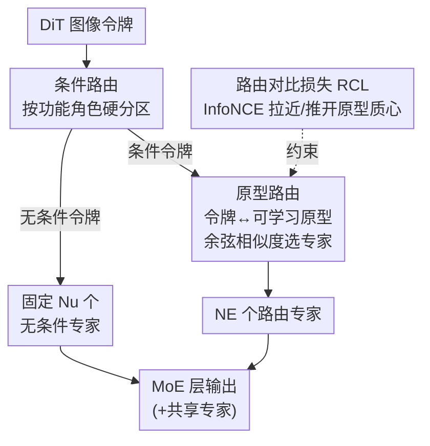

# Routing Matters in MoE: Scaling Diffusion Transformers with Explicit Routing Guidance

**会议**: ICLR 2026  
**arXiv**: [2510.24711](https://arxiv.org/abs/2510.24711)  
**代码**: [https://github.com/ali-vilab/ProMoE](https://github.com/ali-vilab/ProMoE)  
**领域**: 扩散模型 / 混合专家  
**关键词**: Mixture-of-Experts, DiT, 显式路由引导, 原型路由, 路由对比损失

## 一句话总结

提出 ProMoE，一种针对扩散 Transformer 的 MoE 框架，通过两步路由器（条件路由 + 原型路由）和路由对比损失提供显式语义引导，促进专家特化，在 ImageNet 上显著超越现有 MoE 和稠密模型。

## 研究背景与动机

MoE 在 LLM 中取得了巨大成功，但在 DiT 中的表现令人失望：
- DiT-MoE（令牌选择路由）性能甚至不如稠密模型
- EC-DiT（专家选择路由）仅获得微弱提升
- DiffMoE（全局令牌分布路由）改进也很有限

**根本原因分析**：语言令牌和视觉令牌存在本质差异：

**高空间冗余**：视觉令牌连续、空间耦合、高度冗余（类间/类内距离比仅 0.748 vs LLM 的 19.283），导致专家学习同质特征

**功能异质性**：CFG 引入了条件/无条件两种功能不同的输入类型，朴素 MoE 未区分处理

## 方法详解

### 整体框架

ProMoE 在 DiT 的每个 MoE 层前接一个两步路由器，先按令牌的功能角色把它们劈成无条件与条件两支，再用可学习原型为条件令牌挑选专家，最后用一项路由对比损失从外部约束原型，逼着"同一专家盯住相似模式、不同专家彼此分开"。整套设计想同时达成两件事——内部专家一致性（同一专家持续处理相似模式）与跨专家多样性（不同专家特化于不同任务）。

### 关键设计

**1. 条件路由：先按功能角色把混在一起的两类令牌拆开** CFG 训练让同一批图像块里既有特定条件下的输入、又有空标签/文本下的无条件输入，二者功能截然不同，朴素 MoE 把它们丢进同一个 softmax router 会让路由信号互相污染。ProMoE 在第一步就做硬分区：无条件令牌 $\mathbf{X}_u$ 直接送进固定的 $N_u$ 个无条件专家，条件令牌 $\mathbf{X}_c$ 才进入第二步的原型路由决定去向。整层前向写成

$$\text{MoE}(\mathbf{x}) = \underbrace{\sum_{i=1}^{N_s} E_i^S(\mathbf{x})}_{\text{Shared}} + \begin{cases}\sum_{j=1}^{N_E}\mathbf{G}_j E_j(\mathbf{x}) & \mathbf{x} \in \mathbf{X}_c \\ \sum_{k=1}^{N_u}E_k^U(\mathbf{x}) & \mathbf{x} \in \mathbf{X}_u\end{cases}$$

其中 $N_s$ 个共享专家始终参与、承接两类令牌的公共部分。这样无条件令牌不再去抢路由专家的容量，路由专家可以专注在真正需要区分的条件语义上。

**2. 原型路由：用可学习原型替代线性 router，给路由一个可解释的语义锚点** 视觉令牌高度冗余、类间/类内距离比仅 0.748，普通线性 router 学不出有区分度的子空间。ProMoE 为每个专家配一个可学习原型 $\mathbf{P} \in \mathbb{R}^{N_E \times D}$，令牌与原型的匹配度用余弦相似度算，$\mathbf{Z}_{i,j} = \alpha \frac{\mathbf{x}_i \mathbf{p}_j^\top}{\|\mathbf{x}_i\| \|\mathbf{p}_j\|}$，缩放系数 $\alpha$ 把相似度拉回合适的量级。激活函数刻意选恒等映射 $\mathcal{A}(\mathbf{Z}) = \mathbf{Z}$ 而非 softmax 或 sigmoid——后两者会压缩相似度差异、削弱专家间的区分，实验里恒等映射效果最好。原型把"专家代表什么语义"显式参数化出来，路由从此对着一个可被监督的目标走。

**3. 路由对比损失（RCL）：从外部把原型推成彼此分离的语义簇心，顺带做负载均衡** 光有原型还不够，没有外部约束时多个原型会塌缩到相似方向、专家照样同质化。RCL 把分配给专家 $E_i$ 的所有令牌求质心 $\mathbf{m}_i$，再以 InfoNCE 的形式拉近每个原型与自己正集质心、推开其它负集质心：

$$\mathcal{L}_{\text{RCL}} = -\frac{1}{N_a}\sum_{i=1}^{N_a}\log\frac{\exp(\text{sim}(\mathbf{p}_i, \mathbf{m}_i)/\tau)}{\sum_{j=1}^{N_a}\exp(\text{sim}(\mathbf{p}_i, \mathbf{m}_j)/\tau)}$$

温度 $\tau$ 控制簇心分离的锐度。它不依赖任何人工标签，比用分类损失做引导更灵活、比离线 K-Means 更鲁棒；而"推开其它质心"这一项天然让令牌摊薄到各专家上，所以无需再额外挂传统的负载均衡损失。

### 损失函数 / 训练策略

总目标在原扩散损失上加权叠加 RCL：

$$\mathcal{L} = \mathcal{L}_{\text{diffusion}} + \lambda_{\text{RCL}} \mathcal{L}_{\text{RCL}}$$

$\lambda_{\text{RCL}}$ 平衡生成质量与路由引导强度。该框架在 DDPM 与 Rectified Flow 两种训练范式下均适用。

## 实验

### 与稠密模型对比（Rectified Flow，500K 步）

| 模型 | 激活参数 | 总参数 | FID↓ (cfg=1.0) | FID↓ (cfg=1.5) |
|------|---------|-------|---------------|---------------|
| Dense-DiT-B | 130M | 130M | 30.61 | 9.02 |
| ProMoE-B | 130M | 300M | 24.44 | 6.39 |
| Dense-DiT-L | 458M | 458M | 15.44 | 3.56 |
| ProMoE-L | 458M | 1.063B | 11.61 | 2.79 |
| Dense-DiT-XL | 675M | 675M | 13.38 | 3.23 |
| ProMoE-XL | 675M | 1.568B | 9.44 | 2.59 |

ProMoE-L 使用更少的激活参数（458M）即超越 Dense-DiT-XL（675M）。

### 语义引导验证

| 方法 | FID↓ (cfg=1.5) | IS↑ |
|------|---------------|-----|
| Dense-DiT-B | 9.02 | 131.13 |
| DiT-MoE-B | 8.94 | 131.66 |
| DiffMoE-B | 8.22 | 137.46 |
| 分类路由引导 | **5.91** | **165.45** |
| K-Means 路由引导 | 6.24 | 159.77 |

显式/隐式语义引导均带来显著提升，验证了视觉 MoE 需要语义引导。

### 与 MoE 基线对比

ProMoE 在所有规模和训练范式（DDPM/RF）上均超越 DiT-MoE、EC-DiT、DiffMoE。

### 关键发现

- 视觉 MoE 的核心瓶颈是专家同质化（缺乏引导时专家子空间高度相似）
- 条件路由有效消除了功能异质性对路由的干扰
- RCL 无需人工标签，比分类损失更灵活，比 K-Means 更鲁棒
- RCL 的推开操作自然替代了传统的负载均衡损失

## 亮点

- 深入分析了 MoE 在视觉与语言中效果差异的根因
- 两步路由 + 对比损失的设计简洁有效，可推广到其他视觉 MoE
- 参数效率突出：更少激活参数超越更大稠密模型
- 在 DDPM 和 Rectified Flow 两种范式上均验证有效

## 局限性

- 仅在类条件 ImageNet 上评估，未验证文生图等更复杂场景
- 条件路由要求 CFG 推理，不适用于不使用 CFG 的场景
- 聚类/对比学习的计算开销未详细分析
- 总参数量约为稠密模型的 2.3 倍

## 相关工作

- **DiT MoE**：DiT-MoE、EC-DiT、DiffMoE 等在视觉 MoE 上的尝试
- **LLM MoE**：DeepSeek-MoE、Mixtral 等语言领域的成功应用
- **扩散模型**：DiT、SiT 等 Transformer 架构的扩散模型

## 评分

- 新颖性：⭐⭐⭐⭐⭐ — 分析深入，两步路由 + RCL 组合新颖
- 技术性：⭐⭐⭐⭐ — 实验设计严谨，消融充分
- 实验：⭐⭐⭐⭐ — 多尺度多范式验证
- 影响力：⭐⭐⭐⭐⭐ — 为视觉 MoE 指明了方向

<!-- RELATED:START -->

## 相关论文

- [\[CVPR 2026\] CARE-Edit: Condition-Aware Routing of Experts for Contextual Image Editing](../../CVPR2026/image_generation/care-edit_condition-aware_routing_of_experts_for_contextual_image_editing.md)
- [\[CVPR 2026\] MapRoute: Semantic Routing for Precise Concept Erasure with Mapper](../../CVPR2026/image_generation/maproute_semantic_routing_concept_erasure.md)
- [\[CVPR 2026\] Mixture of States: Routing Token-Level Dynamics for Multimodal Generation](../../CVPR2026/image_generation/mixture_of_states_routing_token-level_dynamics_for_multimodal_generation.md)
- [\[NeurIPS 2025\] Scaling Diffusion Transformers Efficiently via μP](../../NeurIPS2025/image_generation/scaling_diffusion_transformers_efficiently_via_μp.md)
- [\[ICLR 2026\] Improving Discrete Diffusion Unmasking Policies Beyond Explicit Reference Policies (UPO)](improving_discrete_diffusion_unmasking_policies_beyond_explicit_reference_polici.md)

<!-- RELATED:END -->
