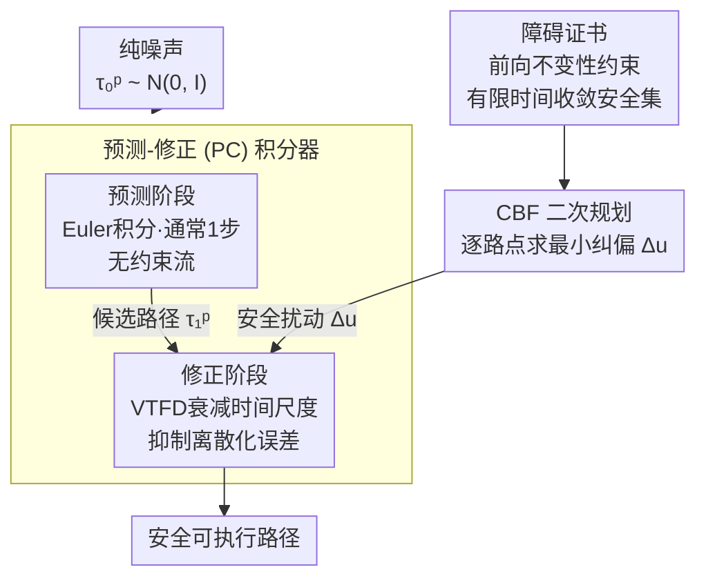

# SafeFlowMatcher: Safe and Fast Planning using Flow Matching with Control Barrier Functions

**会议**: ICLR 2026  
**arXiv**: [2509.24243](https://arxiv.org/abs/2509.24243)  
**代码**: 见项目页面  
**领域**: 图像生成  
**关键词**: Flow Matching, 控制障碍函数 (CBF), 安全规划, 预测-修正积分器, 有限时间收敛

## 一句话总结

提出 SafeFlowMatcher，一种将流匹配与控制障碍函数 (CBF) 结合的安全规划框架，通过预测-修正 (PC) 积分器将路径生成与安全认证解耦，在保持流匹配高效性的同时提供形式化安全保证。

## 研究背景与动机

**领域现状**：基于生成模型（扩散 / 流匹配）的路径规划近年来表现亮眼，但要部署到机器人这类安全攸关的场景，面临两大挑战。一是**安全性缺失**——这些模型的采样动态由隐式学习到的规则驱动，没有任何机制保证生成的路径不违反障碍约束，可能直接撞上障碍物。二是**效率瓶颈**——扩散模型需要几十步迭代去噪才能采出一条路径，对要求实时响应的规划任务来说代价过高。

**现有痛点**：为给生成路径加上安全性，一类做法是安全引导（如 classifier guidance），用一个数据驱动的代理模型把采样往安全区域推。但这种引导是软的、经验性的，依赖代理模型的拟合质量，无法给出形式化的强安全保证，遇到训练分布外的障碍布局就可能失效。

**核心矛盾**：另一类做法走认证路线（如 SafeDiffuser），直接在去噪的中间潜在状态上施加控制障碍函数 (CBF) 约束。问题在于**语义错位**——认证真正关心的是最终被执行的那条路径，约束却被加在了从未执行、只是去噪过程产物的中间状态上。这一错位会**扭曲学习到的流场**，并制造**局部陷阱**：路径被困在障碍边界附近反复纠缠、到不了目标。如何既保住流匹配的高效，又给出作用在执行路径上的形式化安全保证，是本文要解决的核心矛盾。

## 方法详解

### 整体框架

SafeFlowMatcher 把路径生成拆成两个解耦的阶段：先用无约束的流匹配快速预测出一条候选路径，再在这条候选路径上施加控制障碍函数 (CBF) 做安全认证与修正。预测阶段从纯噪声出发、用极少步 Euler 积分得到候选路径，把生成的高效性留住；修正阶段以候选路径为起点，一边用衰减时间尺度流动力学 (VTFD) 压低离散化误差，一边按障碍证书逐路点求解 CBF 二次规划、施加最小安全扰动，把路径在有限时间内拉进并锁在安全集内。关键在于安全约束只作用在最终会被执行的路径上，而非中间潜在状态，从而既保住流匹配单步/少步的高效性，又给出形式化的安全保证。

### 关键设计

**1. 预测-修正 (PC) 积分器：把生成与认证拆开**

现有认证方法（如 SafeDiffuser）在去噪的中间潜在状态上施加 CBF，但这些状态从未被真正执行，约束会扭曲学习到的流并把路径困在障碍边界附近形成局部陷阱。PC 积分器的做法是分两步走：预测阶段从纯噪声 $\boldsymbol{\tau}_0^p \sim \mathcal{N}(0, I)$ 出发，用 Euler 积分（通常只需 $T^p = 1$ 步）得到候选路径 $\boldsymbol{\tau}_1^p = \Psi_{0 \to 1}^{(T^p)}(\boldsymbol{\tau}_0^p) = \boldsymbol{\tau}_1^\star + \varepsilon$，其中 $\varepsilon$ 是离散化误差；修正阶段再以 $\boldsymbol{\tau}_0^c = \boldsymbol{\tau}_1^p$ 为起点细化。由于安全约束推迟到修正阶段、只施加在这条即将执行的路径上，自然避开了语义错位与局部陷阱。

修正阶段同时做两件事。一是衰减时间尺度流动力学 (VTFD) 来压低离散化误差，把向量场改写为 $\frac{d\boldsymbol{\tau}_t^c}{dt} = \alpha(1-t) v_t(\boldsymbol{\tau}_t^c; \theta) \triangleq \tilde{v}_t(\boldsymbol{\tau}_t^c; \theta)$，因子 $(1-t)$ 随 $t \to 1$ 渐进抑制向量场、产生收缩效应，Lemma 3 据此证明误差按 $\mathbf{e}_t = O((1-t)^2) + (\varepsilon + O(1))e^{-\alpha t}$ 衰减。二是叠加 CBF 安全扰动 $\Delta\mathbf{u}_t$，得到带约束的修正动力学 $\frac{d\boldsymbol{\tau}_t^c}{dt} = \tilde{v}_t(\boldsymbol{\tau}_t^c; \theta) + \Delta\mathbf{u}_t$，这个 $\Delta\mathbf{u}_t$ 取最小扰动，尽量贴着原流走而只在必要时纠偏。

**2. 障碍证书：用有限时间不变性给安全上锁**

光有 CBF 扰动还不够，需要证明它真的能把路径锁在安全区内。定义鲁棒安全集 $\mathcal{C}_\delta = \{\boldsymbol{\tau}^{c,k} \in \mathcal{D} \mid b(\boldsymbol{\tau}^{c,k}) \geq \delta\}$，其中 $b$ 是障碍函数、$\delta$ 是安全裕度。定理 1（前向不变性）给出一个充分条件：只要每个路点的控制 $\mathbf{u}_t^k$ 满足障碍证书 $\nabla b(\boldsymbol{\tau}_t^{c,k})^\top \mathbf{u}_t^k + \epsilon \cdot \text{sgn}(b(\boldsymbol{\tau}_t^{c,k}) - \delta)|b(\boldsymbol{\tau}_t^{c,k}) - \delta|^\rho + w_t^k r_t^k \geq 0$，那么流在有限时间内保持不变，即路径一旦进入安全集就不会逃出。更进一步，命题 1 给出收敛时间上界 $T \leq t_w + \frac{(\delta - b(\boldsymbol{\tau}_{t_w}^{c,k}))^{1-\rho}}{\epsilon(1-\rho)}$，说明即便初始候选路径略微越界，也能在可计算的有限步内被拉回安全区，而非渐近逼近。证书里的松弛权重 $w_t^k$ 在修正早期提供数值稳定性。

**3. CBF 二次规划：逐路点求最小纠偏**

障碍证书是一组不等式约束，落地时对每个路点独立求解一个二次规划 $\mathbf{u}_t^{k*} = \arg\min_{\mathbf{u}_t^k} \|\mathbf{u}_t^k - \tilde{v}_t^k\|^2 \;\text{s.t. CBF constraint}$。目标是让安全控制 $\mathbf{u}_t^k$ 尽量贴近原向量场 $\tilde{v}_t^k$，因此在远离障碍时几乎不改动路径、只在逼近边界时施加最小必要的修正。路点之间解耦求解使整体开销随路点数线性增长，配合预测阶段的少步采样，保持了实时规划所需的效率。

## 实验

### 实验设置

- 迷宫导航（Maze2D）
- 运动控制（Locomotion）
- 机器人操作（Robot Manipulation）

### 主要结果

SafeFlowMatcher 相比基线方法：
- **更快**：流匹配单步/少步即可生成高质量路径
- **更平滑**：PC 积分器避免了中间状态约束导致的路径扭曲
- **更安全**：CBF 提供形式化安全保证

### 消融实验

验证了 PC 积分器和障碍证书各自的贡献：
- 移除修正阶段 → 安全性下降
- 移除 VTFD → 路径质量下降
- 直接在中间状态约束 → 局部陷阱问题

### 关键发现

- **安全约束仅在执行路径上施加**是关键设计——避免了分布漂移和局部陷阱
- VTFD 的衰减因子有效减少了预测误差
- CBF 的松弛权重 $w_t^k$ 在早期修正阶段提供数值稳定性

## 亮点与洞察

- 完美结合流匹配（高效）和 CBF（安全认证），理论保证扎实
- PC 积分器的解耦设计从根本上解决了现有方法的局部陷阱问题
- 理论贡献突出：前向不变性定理 + 有限收敛时间保证
- 框架通用性强：适用于动力学和代价图未知的场景

## 局限与展望

- CBF 的构造依赖于障碍函数 $b$ 的定义，对复杂环境的适用性需进一步研究
- QP 求解的计算开销随路点数和约束数增加
- 假设流匹配模型已经合理预训练
- 仅在特定任务上验证，未涉及高维状态空间

## 相关工作

- **流匹配规划**：FlowPolicy、EquiBot 等将 FM 应用于机器人控制
- **安全扩散规划**：SafeDiffuser 在中间状态施加 CBF 约束
- **CBF 方法**：有限时间收敛 CBF、学习型 CBF 等

## 评分

- 新颖性：⭐⭐⭐⭐⭐ — PC 积分器解耦设计优雅，解决了关键问题
- 理论性：⭐⭐⭐⭐⭐ — 前向不变性和收敛性证明完整
- 实验：⭐⭐⭐⭐ — 多任务验证 + 充分消融
- 实用性：⭐⭐⭐⭐ — 对安全关键的机器人部署有直接价值

<!-- RELATED:START -->

## 相关论文

- [\[ICLR 2026\] Laplacian Multi-scale Flow Matching for Generative Modeling](laplacian_multi-scale_flow_matching_for_generative_modeling.md)
- [\[ICLR 2026\] Flow Matching with Injected Noise for Offline-to-Online Reinforcement Learning](flow_matching_with_injected_noise_for_offline-to-online_reinforcement_learning.md)
- [\[ICLR 2026\] DenseGRPO: From Sparse to Dense Reward for Flow Matching Model Alignment](densegrpo_from_sparse_to_dense_reward_for_flow_matching_model_alignment.md)
- [\[ICLR 2026\] SenseFlow: Scaling Distribution Matching for Flow-based Text-to-Image Distillation](senseflow_scaling_distribution_matching_for_flow-based_text-to-image_distillatio.md)
- [\[ICLR 2026\] FlowCast: Trajectory Forecasting for Scalable Zero-Cost Speculative Flow Matching](flowcast_trajectory_forecasting_for_scalable_zero-cost_speculative_flow_matching.md)

<!-- RELATED:END -->
