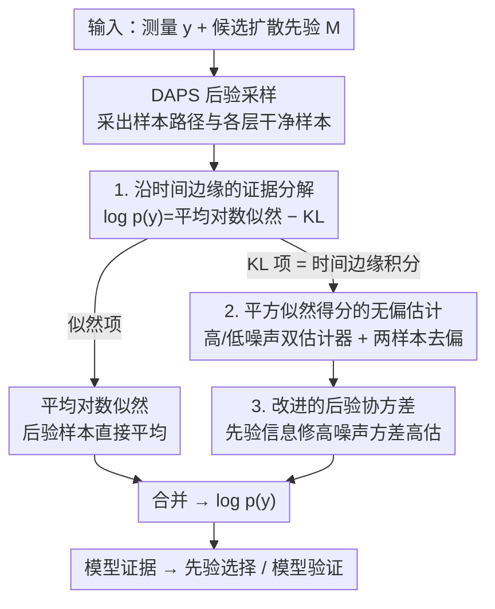

# Sample-Efficient Evidence Estimation of Score-Based Priors for Model Selection

**会议**: ICLR 2026  
**arXiv**: [2602.20549](https://arxiv.org/abs/2602.20549)  
**代码**: —  
**领域**: 贝叶斯推断 / 扩散模型  
**关键词**: 模型证据, 扩散先验, 后验采样, 模型选择, 黑洞成像

## 一句话总结

提出 DiME，一种沿扩散后验时间边缘积分的模型证据估计器，无需先验评分或密度评估，仅用少量后验样本（如 20 个）即可准确估计扩散模型先验下的模型证据，用于先验选择和模型验证。

## 研究背景与动机

在贝叶斯逆问题中，先验分布 $p(\boldsymbol{x})$ 对后验 $p(\boldsymbol{x}|\boldsymbol{y})$ 有决定性影响。选择一个不合适的先验会导致重建结果严重偏差。理想的做法是通过模型证据 $p(\boldsymbol{y}|M)$ 评估不同先验模型。

然而，对于扩散模型先验，直接计算模型证据是不可行的：
- 需要对完整先验积分 $\log p(\boldsymbol{y}|M) = \log \int p(\boldsymbol{y}|\boldsymbol{x}) p(\boldsymbol{x}|M) d\boldsymbol{x}$
- 现有方法（SMC、AIS、嵌套采样）要求干净先验得分 $\nabla_{\boldsymbol{x}} \log p(\boldsymbol{x})$ 或非归一化密度
- 扩散模型学习的是中间噪声先验的得分，干净先验得分不准确
- 密度估计方法方差高，需数千个后验样本

## 方法详解

### 整体框架

DiME 要解决的问题是：在贝叶斯逆问题里想用模型证据 $p(\boldsymbol{y}|M)$ 来比较不同的扩散先验，但证据 $\log p(\boldsymbol{y}) = \log \int p(\boldsymbol{y}|\boldsymbol{x})p(\boldsymbol{x})d\boldsymbol{x}$ 直接算不出来——传统估计器（SMC、AIS、嵌套采样）都要"干净先验的得分或密度"，而扩散模型只学到了各噪声层的中间得分，干净先验得分既不准又病态。DiME 的破局点是绕开先验得分：把对数证据恒等地拆成两项，一项是后验下的平均对数似然，另一项是"后验到先验"的 KL 散度，而 KL 项又能沿逆向扩散的时间边缘积分，改写成"逐时间步的似然得分平方"的积分。这样一来，整个证据估计只需要后验样本，而这些样本恰好是 DAPS 后验采样器在跑采样时自然产生的——复用它的采样轨迹，几乎不增加额外计算，仅约 20 条样本路径就够。

整套流程是：输入测量值 $\boldsymbol{y}$ 和一个候选扩散先验，先用 DAPS 采出后验样本路径 $\{\boldsymbol{x}_{t_i}\}$ 及每个噪声层的干净样本 $\tilde{\boldsymbol{x}}_0$，再按证据分解分别估计两项（平均似然项直接平均、KL 项靠时间边缘积分），合并得到 $\log p(\boldsymbol{y})$，最后用证据值在多个候选先验间做选择或验证。

### 关键设计

**1. 沿时间边缘的证据分解：把不可算的证据拆成只靠后验样本的两项**

证据 $\log p(\boldsymbol{y})$ 之所以难算，是因为它要对整个先验积分，而扩散先验的密度/得分都不可靠。DiME 给出一个恒等分解：$\log p(\boldsymbol{y}) = \mathbb{E}_{\boldsymbol{x}_0 \sim p(\boldsymbol{x}_0|\boldsymbol{y})}[\log p(\boldsymbol{y}|\boldsymbol{x}_0)] - D_{\text{KL}}(p(\boldsymbol{x}_0|\boldsymbol{y}) \| p(\boldsymbol{x}_0))$。前一项是后验下的平均对数似然，拿后验样本一平均就有了。后一项是"后验到先验"的 KL，看似又要碰到先验，但关键观察是：它可以沿逆向扩散的时间边缘积分，重写成只含**似然得分**的形式

$$D_{\text{KL}}(p(\boldsymbol{x}_0|\boldsymbol{y}) \| p(\boldsymbol{x}_0)) \approx \sum_{i=1}^N c_{t_i} \Delta t_i\, \mathbb{E}_{\boldsymbol{x}_{t_i} \sim p(\boldsymbol{x}_{t_i}|\boldsymbol{y})} \|\nabla_{\boldsymbol{x}_{t_i}} \log p(\boldsymbol{y}|\boldsymbol{x}_{t_i})\|^2$$

其中系数 $c_{t_i} = \sigma_{t_i}' \sigma_{t_i} - \sigma_{t_i}^2 \frac{a_{t_i}'}{a_{t_i}}$ 只取决于扩散调度、$\Delta t_i = t_i - t_{i-1}$。这一步是全文的支点：它把"对先验积分"换成了"沿时间步对似然得分平方积分"，而似然 $p(\boldsymbol{y}|\boldsymbol{x}_t)$ 是已知的前向模型，再不需要先验得分。直觉上，这一项度量的就是采得的后验样本 $\boldsymbol{x}_0$ 离先验有多远——测量越是分布外，KL 越大，证据越低。

**2. 平方似然得分的无偏估计：高/低噪声双估计器加两样本去偏**

分解式里要的 $\nabla_{\boldsymbol{x}_t} \log p(\boldsymbol{y}|\boldsymbol{x}_t)$ 本身仍无法直接求值，但积分只需要它的**无偏估计**。若用 $\boldsymbol{x}_0|\boldsymbol{x}_t$ 的无条件样本去估，这些样本似然普遍很低、得分极不稳定，方差爆炸。DiME 改用 DAPS 在每个噪声层顺手采出的后验干净样本 $\tilde{\boldsymbol{x}}_0 \sim p(\boldsymbol{x}_0|\boldsymbol{x}_t, \boldsymbol{y})$，构造两个互补的无偏估计器：高噪声端方差趋零的 $\Theta_{\text{high}}(\tilde{\boldsymbol{x}}_0) = \frac{a_t}{\sigma_t^2}(\tilde{\boldsymbol{x}}_0 - \mathbb{E}[\boldsymbol{x}_0|\boldsymbol{x}_t])$（靠样本到后验均值的距离），低噪声端方差趋零的 $\Theta_{\text{low}}(\tilde{\boldsymbol{x}}_0) = \frac{a_t}{\sigma_t^2}\boldsymbol{\Sigma}_{\boldsymbol{x}_0|\boldsymbol{x}_t} \nabla_{\tilde{\boldsymbol{x}}_0} \log p(\boldsymbol{y}|\tilde{\boldsymbol{x}}_0)$（靠 $\tilde{\boldsymbol{x}}_0$ 处的似然得分）。两者都便宜，每个时间步都算一遍、挑方差更小的那个用，于是采样早期用 $\Theta_{\text{high}}$、后期用 $\Theta_{\text{low}}$。还有一个微妙的偏差：积分要的是得分的**平方**，而 $\mathbb{E}\|\Theta\|^2 = \|\mathbb{E}\Theta\|^2 + \text{Tr}(\text{Cov}(\Theta))$，直接平方单个样本会多出一个协方差迹的偏差项。DiME 的处理是对每个 $\boldsymbol{x}_t$ 独立采两份 $\tilde{\boldsymbol{x}}_0^{(1)}, \tilde{\boldsymbol{x}}_0^{(2)}$，用内积 $\Theta(\tilde{\boldsymbol{x}}_0^{(1)})^T\Theta(\tilde{\boldsymbol{x}}_0^{(2)})$ 替代平方，得到对平方得分的无偏估计。

**3. 改进的后验协方差：用先验信息修掉高噪声端的方差高估**

上面的低噪声估计器和 DAPS 的高斯近似采样都依赖条件协方差 $\boldsymbol{\Sigma}_{\boldsymbol{x}_0|\boldsymbol{x}_t}$。DAPS 原本用启发式 $\sigma_t^2$，它只考虑了 $p(\boldsymbol{x}_t|\boldsymbol{x}_0)$、忽略了先验 $p(\boldsymbol{x}_0)$：低噪声时还算准，但高噪声时会严重高估方差——在终端 $t=T$ 本应 $\text{Cov}(\boldsymbol{x}_0|\boldsymbol{x}_T)\approx\text{Cov}(\boldsymbol{x}_0)$，启发式却给出 $\sigma_T^2 \gg \text{Cov}(\boldsymbol{x}_0)$，把后验样本推向错误的模态、造成大偏差。由于 DiME 用到**所有**时间边缘，每一层的协方差都得准。它把先验近似成高斯 $\mathcal{N}(\boldsymbol{\mu}_0, \boldsymbol{\Sigma}_0)$（$\boldsymbol{\Sigma}_0$ 由训练数据经验估计），两个高斯相乘得到收紧后的协方差

$$\boldsymbol{\Sigma}_{\boldsymbol{x}_0|\boldsymbol{x}_t} = \left[\boldsymbol{\Sigma}_0^{-1} + \frac{a_t^2}{\sigma_t^2}\mathbf{I}\right]^{-1}$$

相当于在高噪声端用先验信息把过宽的协方差拉回先验尺度，从而在不增加样本的前提下显著压低偏差。因为 DAPS 每个退火步都重新采样，这些高斯近似误差不会逐步累积。

## 实验

### 高斯混合先验基准测试

| 方法 | 分布内 $\boldsymbol{x}^*$ 相对误差↓ | 分布外相对误差↓ | 鞍点处相对误差↓ |
|------|------|------|------|
| Naive MC (1000) | 2451% | 2357% | 2299% |
| 原始 DAPS 启发式 | 146% | 3.3% | 7.3% |
| TI | 3.2% | 5.6% | 1.2% |
| SMC | 2.6% | 1.2% | **0.7%** |
| **DiME** | **1.5%** | **0.6%** | 0.8% |

DiME 在不使用先验得分的情况下达到与 SMC 可比的精度。

### MNIST 模型选择

给定单个噪声测量值，从 10 个扩散模型中选择正确先验。DiME 一致选出正确的数字类别，而基线方法失败。

### M87* 黑洞成像

- DiME 表明 GRMHD 先验比 RIAF、空间图像、人脸和 MNIST 先验的似然更高
- 先验预测检验表明 M87* 观测与 GRMHD 先验统计相容

### 关键发现

- 仅需 20 个后验样本即可获得准确估计
- 高/低噪声估计器的自动切换策略有效降低方差
- 改进的协方差近似在高噪声时显著减少偏差
- DiME 可推广到任意退火路径下的模型证据估计

## 亮点

- 首个不依赖先验得分或密度的扩散模型证据估计器
- 样本效率极高（20 个样本 vs 基线方法需要数千个）
- 理论推导优雅，利用了扩散采样中自然产生的中间样本
- 真实科学应用（黑洞成像）验证了方法的实用价值

## 局限性

- 依赖高斯近似 $p(\boldsymbol{x}_0|\boldsymbol{x}_t) \approx \mathcal{N}$，在多模态先验下可能不准确
- 与特定后验采样方法（DAPS）耦合，泛化到其他方法需要额外推导
- 对角协方差近似在复杂高维问题中精度有限
- 估计器的方差随问题维度增加可能增大

## 相关工作

- **证据估计**：SMC、AIS、嵌套采样、调和均值估计器等
- **扩散后验采样**：DAPS、DPS、PnP-DM 等方法
- **模型选择**：贝叶斯因子、交叉验证等替代框架

## 评分

- 新颖性：⭐⭐⭐⭐⭐ — 完全新的扩散证据估计范式
- 理论性：⭐⭐⭐⭐⭐ — 推导严格，多个引理支撑
- 实验：⭐⭐⭐⭐ — 从玩具到真实科学应用的全面验证
- 实用性：⭐⭐⭐⭐ — 对科学成像和模型选择有直接价值

<!-- RELATED:START -->

## 相关论文

- [\[AAAI 2026\] Diffusion Reconstruction-Based Data Likelihood Estimation for Core-Set Selection](../../AAAI2026/image_generation/diffusion_reconstruction-based_data_likelihood_estimation_for_core-set_selection.md)
- [\[ICML 2026\] DiScoFormer: Plug-In Density and Score Estimation with Transformers](../../ICML2026/image_generation/discoformer_plug-in_density_and_score_estimation_with_transformers.md)
- [\[ICLR 2026\] Monocular Normal Estimation via Shading Sequence Estimation](monocular_normal_estimation_via_shading_sequence_estimation.md)
- [\[ICLR 2026\] Learning a Distance Measure from the Information-Estimation Geometry of Data](learning_a_distance_measure_from_the_information-estimation_geometry_of_data.md)
- [\[CVPR 2026\] Efficient Weighted Sampling via Score-based Generative Models](../../CVPR2026/image_generation/efficient_weighted_sampling_via_score-based_generative_models.md)

<!-- RELATED:END -->
