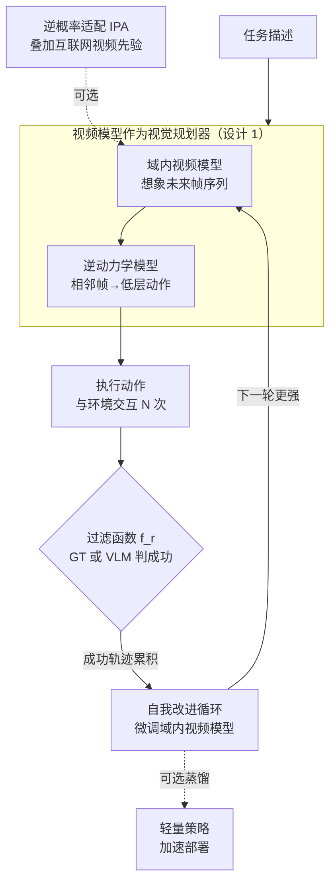

# Self-Improving Loops for Visual Robotic Planning

**会议**: ICLR 2026  
**arXiv**: [2506.06658](https://arxiv.org/abs/2506.06658)  
**代码**: [https://diffusion-supervision.github.io/silvr/](https://diffusion-supervision.github.io/silvr/)  
**领域**: 图像生成  
**关键词**: 视觉规划, 自我改进, 视频生成模型, 逆动力学模型, 在线经验

## 一句话总结

提出 SILVR 框架，通过迭代更新域内视频生成模型在自收集的在线轨迹上进行微调，实现视觉机器人规划器在未见任务上的持续自我改进，在 MetaWorld 和真实机器人上实现高达 285% 的性能提升。

## 研究背景与动机

**领域现状**：视频生成模型作为文本条件的视觉规划器，已展现出强大的机器人任务规划能力——给定任务描述，模型把未来想象成一段帧序列，再由逆动力学模型翻译成动作去执行。

**现有痛点**：对未见任务的泛化仍是挑战。现有方法主要依赖离线数据（预收集的演示或互联网视频），规划器一旦训完部署就停止进步，碰到分布外任务只能干瞪眼，缺乏从在线自收集行为中持续改进的能力。

**核心 idea**：能否设计一个在线自我改进的视觉规划智能体？让规划器把自己跑出来的成功轨迹反过来微调视频模型，越用越强，在未见任务上一轮轮抬升成功率。

## 方法详解

### 整体框架

SILVR 把视觉规划器变成一个能从自己产生的经验里持续长进的智能体。核心是一个**自我改进的闭环**：一个文本条件的域内视频模型先把任务想象成一段未来帧序列（视觉规划），逆动力学模型再把相邻帧之间的视觉变化翻译成可执行的低层动作；智能体拿这些动作去环境里试，用一个过滤函数把成功的轨迹挑出来、累积起来反过来微调视频模型，下一轮就生成得更靠谱——如此循环往复，未见任务上的成功率一轮轮抬升。采样阶段还可选地接入互联网视频先验（逆概率适配），把通用视频模型的语言泛化和运动常识叠加进域内模型，托住真实世界里的改进趋势。

### 关键设计

**1. 视频模型作为视觉规划器：把「想象未来」和「执行动作」解耦**

直接端到端学一个状态到动作的策略，在未见任务上很难泛化，因为视觉动力学和动作映射这两件难度差很远的事被搅在一起。SILVR 沿用 UniPi 的思路把它们拆开：文本到视频模型 $\epsilon_\theta$ 接收任务描述，预测出一段未来帧序列当作「视觉规划」，描述的是环境该如何演化；逆动力学模型（IDM）只负责一件简单的事——看相邻两帧的视觉差异，回归出让环境从前一帧走到后一帧的低层动作。规划层只关心「画面会怎么变」、动作层只关心「怎么把画面变过去」，各自的学习目标都更干净，所以新任务来了也更容易迁移。域内视频模型基于 AVDC，通过文本交叉注意力把任务描述注入到帧生成中。

**2. 逆概率适配（IPA）：借互联网视频先验补上域内模型缺的泛化力**

只在机器人自己环境里训出来的域内模型，环境视觉知识够用但语言泛化和运动常识薄弱，碰到没见过的物体颜色或新指令容易失手。SILVR 在采样时把域内模型 $\epsilon_\theta$ 和一个互联网预训练的通用视频模型（AnimateDiff，约 2B 参数）$\epsilon_{\text{general}}$ 做得分组合，让两者的去噪方向叠加：

$$\tilde{\epsilon}_{\text{inv}} = \epsilon_{\text{general}}(\tau_t, t) + \alpha\big(\epsilon_{\text{general}}(\tau_t, t\,|\,\text{text}) + \gamma\,\epsilon_\theta(\tau_t, t\,|\,\text{text}) - \epsilon_{\text{general}}(\tau_t, t)\big)$$

其中 $\gamma$ 控制域内先验的强度、$\alpha$ 是文本引导尺度。通用模型贡献文本泛化和自然的运动先验，域内模型贡献这套机器人环境特定的视觉知识，组合后生成的规划既「认得」新指令、又符合真实环境的物理。真实世界实验里正是靠这一项才把自我改进的趋势托住——去掉它，改进就会停滞甚至恶化。

**3. 自我改进循环：用成功轨迹反哺视频模型，越用越强**

离线数据训出来的规划器一旦部署就停止进步，这正是前面痛点的根源。SILVR 让规划器在线滚雪球（Algorithm 1）：每一轮先（可选地）用 IPA 接入互联网视频先验来提升当轮生成质量，然后用当前模型执行 $N$ 次视觉规划与环境交互，拿一个过滤函数 $f_r$ 依据成功信号把好轨迹筛出来——这个信号可以是环境真值（GT），也可以是 VLM（如 Gemini-2.5-Pro）的判断。筛出的成功轨迹累积进数据集去微调域内视频模型，模型对这类任务的规划就更准，下一轮采集到的成功样本更多，形成正反馈。最后还可（可选地）把成熟的视频规划器蒸馏成一个轻量策略，换取部署时的推理速度。

## 实验

### MetaWorld 结果（12 个未见任务，平均成功率）

| 方法 | 迭代 0 | 迭代 1 | 迭代 2 | 迭代 3 | 迭代 4 |
|------|--------|--------|--------|--------|--------|
| DSRL（GT 过滤） | 9.4 | 8.3 | 7.4 | 7.5 | 7.7 |
| BCIL（GT 过滤） | 5.6 | 12.3 | 20.9 | 23.3 | 23.2 |
| **SILVR（GT 过滤）** | **14.7** | **27.7** | **33.5** | **43.5** | **44.2** |
| SILVR（VLM 过滤） | 17.0 | 24.4 | 28.7 | 34.4 | 38.4 |

SILVR 在迭代 4 后成功率达到 44.2%，远超 BCIL（23.2%）和 DSRL（7.7%）。

### 真实机器人实验

- **推杯任务**：在未见颜色上持续改进
- **开抽屉任务**：SILVR + 互联网视频先验成功引导自我改进
- 没有互联网视频先验时，真实世界实验中改进趋势停滞或恶化

### 蒸馏

SILVR 最终视频规划器蒸馏为 Diffusion Policy 后性能进一步略有提升（44.2% → 49.2%）。

### 消融实验

| 设置 | 结论 |
|------|------|
| 无数据过滤 | MetaWorld 上改进缓慢；真实世界仍能改进 |
| VLM 代替 GT 过滤 | Gemini-2.5-Pro 效果最佳，仍能实现自我改进 |
| 次优初始数据 | SILVR 仍然能持续改进 |
| 10 轮迭代 | 第 5 轮后趋于饱和 |

### 关键发现

- 视觉规划的解耦设计（动力学建模 vs 动作预测）使泛化更容易
- 互联网视频先验对真实世界实验至关重要
- 无过滤时次优经验仍能通过得分组合传递有用信息
- SILVR 比 RL 微调方法更具样本效率

## 亮点与洞察

- 首个系统性的视觉规划自我改进框架
- 将离线数据和在线经验有机结合
- 互联网视频先验的引入优雅地解决了真实世界泛化问题
- 对过滤信号的鲁棒性强（GT/VLM/无过滤均可工作）
- 蒸馏方案平衡了规划质量和推理速度

## 局限与展望

- 假设初始模型有合理的基础成功率（冷启动问题）
- 大规模预训练视频模型的选择引入效率/质量权衡
- 10 轮后趋于饱和，可能陷入策略局部最优
- 视频生成的推理速度仍然是部署瓶颈
- 未探索如何引入"探索"机制突破单模态行为

## 相关工作

- **视频规划**：UniPi、AVDC 等视频模型用于决策
- **自我改进模型**：LLM 中的自我改进、VideoAgent 等
- **RL 微调 BC 策略**：DPPO、DSRL、ResIP 等

## 评分

- 新颖性：⭐⭐⭐⭐ — 视觉规划 + 自我改进循环的结合新颖
- 实验：⭐⭐⭐⭐⭐ — 仿真+真实、多消融、多基线的全面评估
- 实用性：⭐⭐⭐⭐ — 真实机器人验证+蒸馏方案兼顾部署
- 完整性：⭐⭐⭐⭐ — 对各种设计决策的消融研究充分

<!-- RELATED:START -->

## 相关论文

- [\[CVPR 2026\] Image Generation as a Visual Planner for Robotic Manipulation](../../CVPR2026/image_generation/image_generation_as_a_visual_planner_for_robotic_manipulation.md)
- [\[CVPR 2026\] SOLACE: Improving Text-to-Image Generation with Intrinsic Self-Confidence Rewards](../../CVPR2026/image_generation/solace_self_confidence_rewards_t2i.md)
- [\[ICLR 2026\] SafeFlowMatcher: Safe and Fast Planning using Flow Matching with Control Barrier Functions](safeflowmatcher_safe_and_fast_planning_using_flow_matching_with_control_barrier_.md)
- [\[CVPR 2026\] OSPO: Object-Centric Self-Improving Preference Optimization for Text-to-Image Generation](../../CVPR2026/image_generation/ospo_object-centric_self-improving_preference_optimization_for_text-to-image_gen.md)
- [\[ICLR 2026\] Steer Away From Mode Collisions: Improving Composition In Diffusion Models](steer_away_from_mode_collisions_improving_composition_in_diffusion_models.md)

<!-- RELATED:END -->
