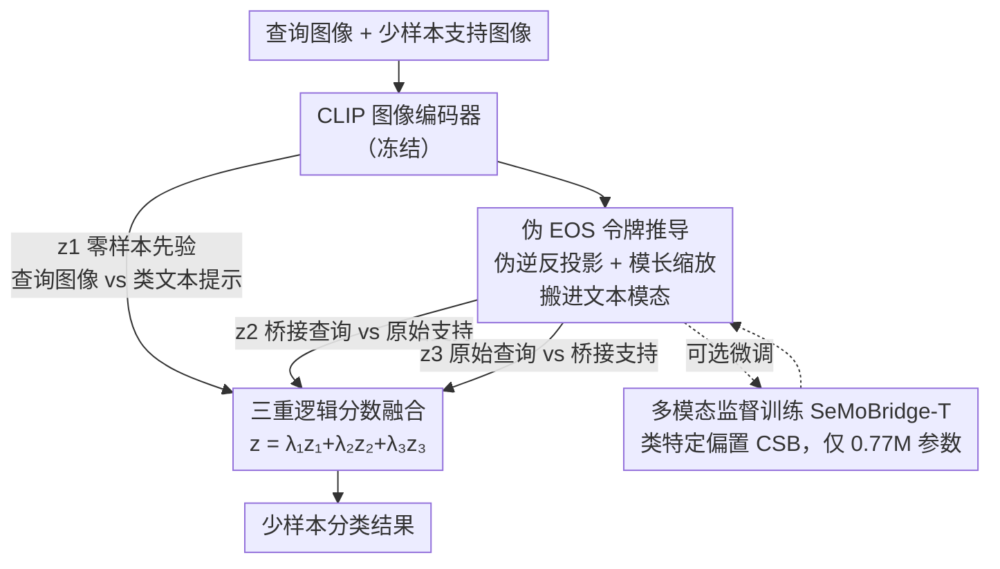

# SeMoBridge: Semantic Modality Bridge for Efficient Few-Shot Adaptation of CLIP

**会议**: ICLR 2026  
**arXiv**: [2509.26036](https://arxiv.org/abs/2509.26036)  
**代码**: [https://github.com/christti98/semobridge](https://github.com/christti98/semobridge)  
**领域**: 少样本学习 / 视觉语言模型  
**关键词**: CLIP 适配, 模态间隙, 模态内不对齐, 少样本分类, 伪 EOS 令牌

## 一句话总结

提出 SeMoBridge，一种轻量级语义模态桥，通过将图像嵌入映射到文本模态，将不可靠的模态内（图像-图像）比较转换为可靠的模态间（文本-图像）比较，以极低训练开销在少样本分类中超越现有方法。

## 研究背景与动机

CLIP 通过对比学习将图像和文本对齐到共享嵌入空间，在零样本任务上表现优秀。但在少样本分类中存在**模态内不对齐**问题：

- CLIP 存在固有的**模态间隙 (modality gap)**——图像和文本嵌入之间的系统性分离
- CLIP 的对比训练目标仅关注跨模态对齐，未校准同模态内部的语义结构
- 导致查询图像可能被错误地放置在距离错误类别的少样本质心更近的位置

现有方法的局限：
- Tip-X、APE 等在逻辑分数层面操作，无法充分利用 CLIP 的模态间语义先验
- Cross the Gap 通过逐样本优化解决，但计算开销巨大

## 方法详解

### 整体框架

SeMoBridge 的核心是一座轻量级"语义模态桥"：它把查询图像和少样本支持图像的嵌入沿 CLIP 自带的方向先验映射进文本模态，于是原本不可靠的图像-图像比较被替换成校准良好的图像-文本比较。整套流程不动 CLIP 主干，只在嵌入层面做一次闭合形式的投影与缩放，再把三路逻辑分数加权融合得到最终分类；若额外引入少量可学参数（SeMoBridge-T），则在 27 秒内把桥微调到当前数据集上。

### 关键设计

**1. 伪 EOS 令牌推导：把图像嵌入闭式地搬进文本空间**

CLIP 的对比目标只保证配对的图像与文本在方向上对齐，即 $\frac{\mathbf{f}_{\text{img}}}{\|\mathbf{f}_{\text{img}}\|} \approx \frac{\hat{\mathbf{f}}_{\text{txt}}}{\|\hat{\mathbf{f}}_{\text{txt}}\|}$，但模态间隙让两者的绝对位置系统性错开，导致直接拿图像质心做最近邻并不靠谱。SeMoBridge 反过来利用这一方向对齐：既然文本编码器最后一步是用投影矩阵 $\mathbf{W}_{\text{txt}}$ 把 EOS 令牌映射成文本嵌入，那就用它的 Moore-Penrose 伪逆 $\mathbf{W}_{\text{txt}}^+$ 把图像嵌入反投影回 EOS 空间，并按真实 EOS 令牌的模长 $\|\mathbf{T}_{\text{eos}}\|$ 重新缩放，得到伪 EOS 令牌 $\hat{\mathbf{f}}_{\text{eos}} \approx \frac{\|\mathbf{T}_{\text{eos}}\|}{\|\mathbf{W}_{\text{txt}}^+ \mathbf{f}_{\text{img}}\|} \mathbf{W}_{\text{txt}}^+ \mathbf{f}_{\text{img}}$。再用 $\mathbf{W}_{\text{txt}}$ 投回去就是桥接嵌入 $\hat{\mathbf{f}}_{\text{txt}} = \mathbf{W}_{\text{txt}} \hat{\mathbf{f}}_{\text{eos}}$。由于 $\mathbf{W}_{\text{txt}}\mathbf{W}_{\text{txt}}^+$ 近似单位矩阵，整个变换其实坍缩成对原图像嵌入的一次缩放 $\hat{\mathbf{f}}_{\text{txt}} \approx \frac{\|\mathbf{T}_{\text{eos}}\|}{\|\mathbf{W}_{\text{txt}}^+ \mathbf{f}_{\text{img}}\|} \mathbf{f}_{\text{img}}$——既保住了语义内容，又把嵌入摆到了文本模态该在的位置，这正是它能以一次矩阵乘法换来跨模态对齐的原因。

**2. 三重逻辑分数融合：让桥接信号与零样本先验互相纠错**

单靠桥接后的图文比较仍可能被个别样本带偏，所以最终分类逻辑是三路加权之和 $\mathbf{z}_q = \lambda_1 \mathbf{z}_1 + \lambda_2 \mathbf{z}_2 + \lambda_3 \mathbf{z}_3$。其中 $\mathbf{z}_1$ 是 CLIP 原生的零样本先验，即查询图像与类文本提示直接比对，提供与少样本无关的稳定锚点；$\mathbf{z}_2$ 把桥接后的查询放到文本空间里和原始少样本图像比较，是桥接带来的主信号；$\mathbf{z}_3$ 则反过来用原始查询去比对桥接后的少样本，构成一路"反置"信号。两路方向相反的桥接比较加上零样本先验，使任何单路的系统性偏差都能被另外两路抵消，融合权重 $\lambda_1,\lambda_2,\lambda_3$ 在验证集上调出。

**3. 多模态监督训练（SeMoBridge-T）：用少量可学参数把桥微调到当前任务**

无训练版本已经可用，但桥本身可以进一步学习。SeMoBridge-T 为每个类引入类特定偏置（CSB）$\hat{\boldsymbol{\tau}} \in \mathbb{R}^{C \times d_t}$，在反投影时叠加到 EOS 令牌上：$\hat{\mathbf{F}}_{\text{eos}}^c \approx \frac{\|\mathbf{T}_{\text{eos}}\|}{\|\hat{\mathbf{W}}_{\text{txt}}^+ \mathbf{F}_{\text{img}}^c + \hat{\boldsymbol{\tau}}^c\|} (\hat{\mathbf{W}}_{\text{txt}}^+ \mathbf{F}_{\text{img}}^c + \hat{\boldsymbol{\tau}}^c)$，让每个类的桥接方向有一点可学的偏移空间。训练由多模态损失驱动：$\mathcal{L} = \lambda_{\text{it}} \mathcal{L}_{\text{img}} + (1-\lambda_{\text{it}})\frac{\mathcal{L}_{\text{txte}} + \mathcal{L}_{\text{txtp}}}{2} + \lambda_c \mathcal{L}_{\text{cons}} + \lambda_b \mathcal{L}_{\text{bias}}$，其中 $\mathcal{L}_{\text{img}}$ 约束桥接嵌入贴合原始图像嵌入，$\mathcal{L}_{\text{txte}}$ 与 $\mathcal{L}_{\text{txtp}}$ 分别让桥接结果对齐类描述的 EOS 令牌和文本投影，$\mathcal{L}_{\text{cons}}$ 鼓励同类少样本桥接后保持一致，$\mathcal{L}_{\text{bias}}$ 对 CSB 做正则以防过拟合（实验表明图文权重固定 1:1 即 $\lambda_{\text{it}}=0.5$ 就足够）。全程只更新桥与 CSB 这 0.77M 参数，CLIP 完全冻结，这是它训练只要 27 秒的根本原因。

## 实验

### 训练效率比较

| 方法 | 参数量 | 平均训练时间 | 平均准确率 |
|------|--------|-------------|-----------|
| CoOp | 0.01M | 10h 00min | 63.90% |
| PromptSRC | 0.05M | 1h 42min | 77.90% |
| APE-T | 0.51M | 3min 30s | 77.18% |
| LDC | 69M | 2min | 77.17% |
| **SeMoBridge-T** | **0.77M** | **27s** | **78.15%** |

SeMoBridge-T 仅需 27 秒训练，准确率最高。

### 少样本分类结果

- **无训练 SeMoBridge** 在 11 个数据集中 7 个超越 APE
- **SeMoBridge-T** 在低样本场景（1/2/4-shot）中整体表现最佳
- 在 OxfordPets 等类别相似的数据集上改进最为显著

### 分布外泛化（16-shot ImageNet）

| 方法 | ImageNet | ImageNet-V2 | ImageNet-Sketch |
|------|----------|-------------|-----------------|
| APE | 71.81 | 64.81 | 49.95 |
| SeMoBridge | 71.86 | 64.90 | 49.55 |
| APE-T | 74.13 | 66.21 | 49.73 |
| SeMoBridge-T | 与 APE-T 竞争 | — | — |

### 关键发现

- 模态内不对齐是 CLIP 少样本失败的主要原因
- 简单的模态桥（缩放 + 投影）即可有效解决该问题
- CSB 对 ImageNet 等大类别数量的数据集有帮助，但对小数据集可有可无
- 多模态损失中图像和文本的平衡权重固定为 1:1 已足够

## 亮点

- 方法极其简洁优雅——核心计算是一个伪逆矩阵乘法
- 训练时间极短（27 秒），比次优方法快一个数量级
- 无训练版本已具竞争力，训练版进一步提升
- 理论动机清晰：从 CLIP 训练目标出发推导桥接
- 在低样本场景（1/2/4-shot）中优势最明显

## 局限性

- 假设 $\mathbf{W}_{\text{txt}}\mathbf{W}_{\text{txt}}^+$ 近似单位矩阵，这在某些 CLIP 变体中可能不成立
- CSB 在训练时使用但推理时不对查询使用，可能导致训练-推理分布不匹配
- 主要在 ViT-B/16 上验证，对更大模型的效果未充分探索
- 三重逻辑融合的权重需要验证集调优

## 相关工作

- **CLIP 适配**：CoOp、Tip-Adapter、APE 等提示/适配器方法
- **模态间隙研究**：Liang et al. 发现的 CLIP 嵌入空间模态间隙
- **模态反转**：OTI/OVI（逐样本优化）、SD-IPC（闭合形式投影）

## 评分

- 新颖性：⭐⭐⭐⭐ — 模态桥的思路及从 SD-IPC 的迁移巧妙
- 简洁性：⭐⭐⭐⭐⭐ — 方法优雅，易于理解和复现
- 实验：⭐⭐⭐⭐ — 11 个数据集 + 训练效率对比 + OOD 泛化
- 实用性：⭐⭐⭐⭐⭐ — 27 秒训练，极低门槛

<!-- RELATED:START -->

## 相关论文

- [\[CVPR 2026\] Uni-DAD: Unified Distillation and Adaptation of Diffusion Models for Few-step Few-shot Image Generation](../../CVPR2026/image_generation/uni-dad_unified_distillation_and_adaptation_of_diffusion_models_for_few-step_few.md)
- [\[CVPR 2025\] V-Bridge: Bridging Video Generative Priors to Versatile Few-shot Image Restoration](../../CVPR2025/image_generation/v-bridge_bridging_video_generative_priors_to_versatile_few-shot_image_restoratio.md)
- [\[ICLR 2026\] When One Modality Rules Them All: Backdoor Modality Collapse in Multimodal Diffusion Models](when_one_modality_rules_them_all_backdoor_modality_collapse_in_multimodal_diffus.md)
- [\[ICML 2025\] Zero-Shot Adaptation of Parameter-Efficient Fine-Tuning in Diffusion Models](../../ICML2025/image_generation/zero-shot_adaptation_of_parameter-efficient_fine-tuning_in_diffusion_models.md)
- [\[ICLR 2026\] Branched Schrödinger Bridge Matching](branched_schrödinger_bridge_matching.md)

<!-- RELATED:END -->
