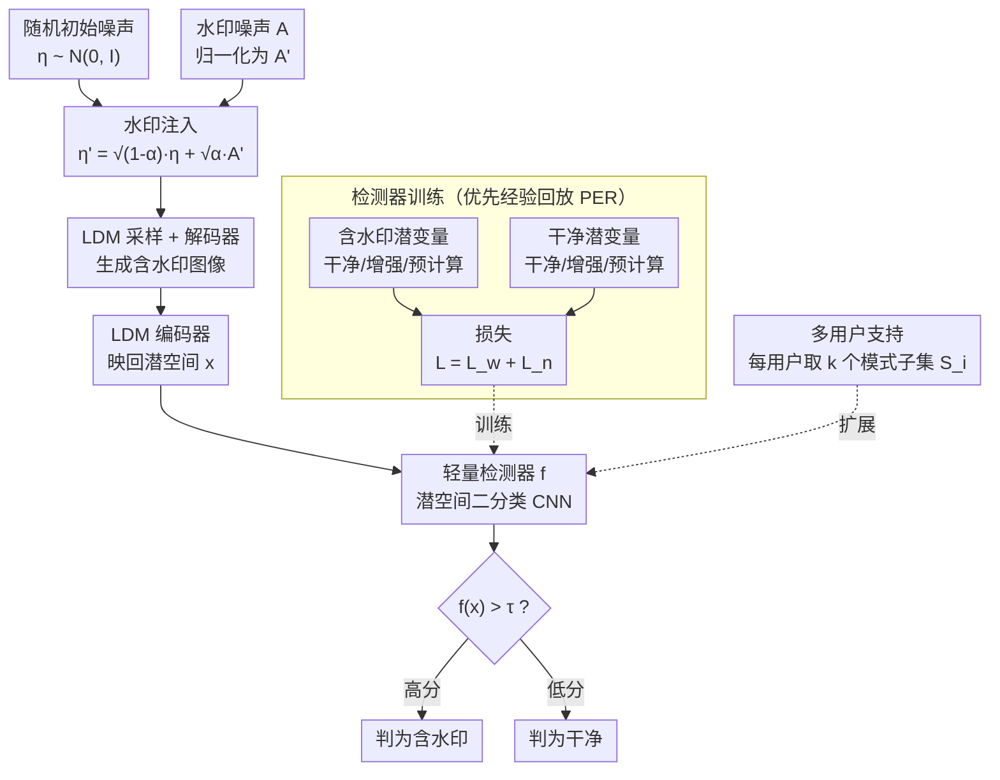

# SERUM: Simple, Efficient, Robust, and Unifying Marking for Diffusion-based Image Generation

**会议**: ICLR 2026  
**arXiv**: [2603.13396](https://arxiv.org/abs/2603.13396)  
**代码**: [GitHub](https://github.com/Hubizon/SERUM)  
**领域**: 图像生成  
**关键词**: 扩散模型水印, 轻量检测器, 噪声注入, 鲁棒性, 多用户

## 一句话总结
提出SERUM水印方法，将唯一水印噪声添加到扩散模型初始噪声中，训练轻量检测器直接从生成图像识别水印（无需昂贵的DDIM反演），在多种攻击下达到最高检测率，且注入/检测极快，支持多用户场景。

## 研究背景与动机

**领域现状**：扩散模型能生成高度逼真的图像，这就需要水印来区分生成内容与真实内容。现有方法分两类：调参式（如 Stable Signature 微调解码器）和免调式（如 Tree-Ring、GaussMarker 向初始噪声加水印）。

**现有痛点**：Stable Signature 需要大量训练，且对高级攻击不鲁棒；Tree-Ring、GaussMarker 等免调方法虽然鲁棒，但检测依赖昂贵的 DDIM 反演（$O(T)$ 步）。两者不可兼得——要么快但弱，要么强但慢。

**核心矛盾**：水印检测需要 DDIM 反演来恢复初始噪声，计算昂贵，不适合大规模部署。

**切入角度**：不做 DDIM 反演，转而训练一个轻量的外部检测器，直接从生成图像中识别水印噪声的签名。这样既享受噪声注入带来的鲁棒性，又得到即时检测，把免调方法的「强」和调参方法的「快」合到一起。

## 方法详解

### 整体框架

SERUM 想解决的是「鲁棒水印检测必须做昂贵 DDIM 反演」这个痛点，整条流水线分三段衔接。第一段是**离线训练检测器**：用含水印潜变量（干净/增强/预计算三种）和干净潜变量两类样本，训练一个轻量 CNN 二分类器；第二段是**注入与生成**，在扩散开始前把一段固定的水印噪声按权重混进随机初始噪声，再走正常采样并解码出图像；第三段是**在线检测**，把待测图像用 LDM 编码器映回潜空间，直接喂给训练好的检测器输出 0–1 分数，完全绕开 DDIM 反演。这样从生成到检测都只需一次前向，既保留了噪声注入的鲁棒性，又把检测从 $O(T)$ 步压到即时；扩展到多用户时只需为每个用户分配若干噪声模式的组合即可复用同一套检测器。

### 关键设计

**1. 水印注入：把归一化后的水印噪声混进初始噪声，既留下指纹又不伤画质**

免调方法直接往初始噪声里塞水印往往会拉高与标准正态分布的偏离，进而损害图像质量。SERUM 的注入公式是 $\eta' = \sqrt{1-\alpha}\,\eta + \sqrt{\alpha}\,A'$，把随机噪声 $\eta$ 和水印噪声 $A'$ 加权混合，$\alpha$ 控制水印强度。关键在于水印噪声先做归一化 $A' = (A - \text{mean}(A))/\text{std}(A)$，使混合后的 $\eta'$ 仍然接近标准正态分布。作者据此证明 SERUM 的 KL 散度比 GaussMarker 更低，也就是注入水印后偏离真实噪声分布更小，因而图像质量损失更小。

**2. 轻量检测器：在潜空间训练二分类 CNN，用优先经验回放专攻困难样本**

这是 SERUM 绕开 DDIM 反演的核心。检测器是一个二分类 CNN，但不在像素空间、而在维度小得多的 LDM 潜空间里工作，因此训练和推理都很快。训练集由水印潜变量和干净潜变量两类构成，损失写作 $\mathcal{L} = \mathcal{L}_w + \mathcal{L}_n$，水印项和干净项各自又含干净、增强、预计算三部分。为了让检测器对各种攻击都稳，作者借鉴强化学习里的优先经验回放（PER），优先采样那些当前最难判对的扰动样本，使检测器自动把注意力集中到自己的弱点上，而不必手工挑选增强策略。

**3. 多用户支持：给每个用户分配一个噪声模式子集，检测分数取子集乘积**

要支持大量用户，逐一为每人训练一个检测器并不现实。SERUM 让用户 $i$ 使用 $k$ 个噪声模式的组合 $S_i$，单用户的检测分数定义为各模式检测分数的乘积 $D_i(x) = \prod_{p \in S_i} d_p(x)$。这样系统只需训练基础噪声模式的检测器，再以组合方式覆盖海量用户，训练规模从 $O(n)$ 降到 $O(n^{1/k})$，而用户之间的水印干扰可以忽略。

## 实验关键数据

### 主实验

| 方法 | TPR@1%FPR(标准攻击) | TPR@1%FPR(去水印) | 注入速度 | 检测速度 |
|------|------------------|------------------|---------|---------|
| Stable Signature | 中 | 差 | 快 | 快 |
| Tree-Ring | 好 | 好 | 快 | **极慢**(DDIM) |
| GaussMarker | 好 | 好 | 快 | **极慢**(DDIM) |
| **SERUM** | **最优** | **最优** | **极快** | **极快** |

### 消融实验

| 方法 | FID↓ | CLIP Score↑ | 说明 |
|------|------|-------------|------|
| 无水印 | 基线 | 基线 | 参考 |
| **SERUM** | **接近基线** | **接近基线** | 质量几乎无损 |

### 关键发现
- SERUM在8种扰动和7种去水印攻击中几乎全部最高TPR
- 检测无需DDIM反演→比Tree-Ring/GaussMarker快几十倍
- 水印具有"放射性"——即使模型在水印图像上微调，输出仍可检测
- 多用户场景下用户间水印干扰可忽略

## 亮点与洞察
- **简洁统一两大范式**：噪声注入(免调方法的鲁棒性) + 外部检测器(调参方法的速度) = 最佳组合。这个想法直觉简单但之前无人尝试。
- **KL散度保证**：归一化水印噪声的KL散度理论保证比GaussMarker更低→图像质量更好的数学基础。
- **优先经验回放训练**：借鉴RL中的PER来采样"困难"增强→检测器自动聚焦弱点→不需要手动选择增强策略。

## 局限与展望
- 需要访问LDM编码器做检测——纯像素级检测未探索
- $\alpha$ 的选择需平衡检测率和图像多样性
- 多用户时组合数限制了用户上限
- 仅在SD系列验证，其他扩散模型(DALL-E/Imagen)效果未知

## 评分
- 新颖性: ⭐⭐⭐⭐ 噪声注入+外部检测器的组合虽简单但有效且之前未尝试
- 实验充分度: ⭐⭐⭐⭐⭐ 8种扰动+7种攻击+3个SD版本+多用户+放射性
- 写作质量: ⭐⭐⭐⭐ 方法清晰，理论保证到位
- 价值: ⭐⭐⭐⭐⭐ 对AI生成内容检测有直接实际部署价值

<!-- RELATED:START -->

## 相关论文

- [\[ICCV 2025\] LiT: Delving into a Simple Linear Diffusion Transformer for Image Generation](../../ICCV2025/image_generation/lit_delving_into_a_simple_linear_diffusion_transformer_for_image_generation.md)
- [\[CVPR 2026\] SimplePoster: A Simple Baseline for Product Poster Generation](../../CVPR2026/image_generation/simpleposter_a_simple_baseline_for_product_poster_generation.md)
- [\[CVPR 2026\] OneHOI: Unifying Human-Object Interaction Generation and Editing](../../CVPR2026/image_generation/onehoi_unifying_human-object_interaction_generation_and_editing.md)
- [\[NeurIPS 2025\] More Than Generation: Unifying Generation and Depth Estimation via Text-to-Image Diffusion Models](../../NeurIPS2025/image_generation/more_than_generation_unifying_generation_and_depth_estimation_via_text-to-image_.md)
- [\[ICLR 2026\] Locality-aware Parallel Decoding for Efficient Autoregressive Image Generation](locality-aware_parallel_decoding_for_efficient_autoregressive_image_generation.md)

<!-- RELATED:END -->
