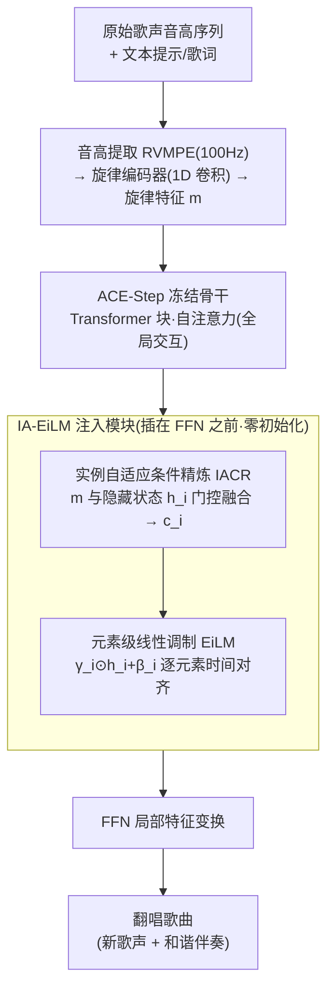

# SongEcho: Towards Cover Song Generation via Instance-Adaptive Element-wise Linear Modulation

**会议**: ICLR 2026  
**arXiv**: [2602.19976](https://arxiv.org/abs/2602.19976)  
**代码**: [GitHub](https://github.com/lsfhuihuiff/SongEcho_ICLR2026)  
**领域**: 图像生成  
**关键词**: 翻唱歌曲生成, FiLM, 元素级线性调制, 旋律控制, 参数高效

## 一句话总结

提出 SongEcho 框架，通过实例自适应元素级线性调制（IA-EiLM）实现翻唱歌曲生成，在保持原始歌曲旋律轮廓的同时生成新的歌声和伴奏。

## 研究背景与动机

翻唱歌曲是音乐文化的重要组成部分，保留原曲核心旋律的同时注入新的情感深度和主题。然而：

**翻唱生成任务未被充分探索**：虽然已有旋律引导的器乐生成，但同时生成新歌声和伴奏的翻唱生成基本空白

**现有条件注入机制的不足**：
   - 交叉注意力需要额外建模时间对齐，间接且引入计算冗余
   - 元素级加法虽利用时间对应但灵活性有限（固定缩放因子的仿射变换）

**条件表示缺乏自适应性**：现有方法独立编码旋律条件，忽略与生成模型隐藏状态的兼容性

## 方法详解

### 整体框架

SongEcho 把翻唱生成形式化为一个条件生成任务——给定原始歌声的旋律轮廓（一条音高序列）和一段文本提示，同时合成新的歌声与和谐伴奏。它以文本到歌曲模型 ACE-Step（一个 Linear Diffusion Transformer）为底座，先用音高提取器与旋律编码器把音高序列编成旋律特征 $m$，再把 $m$ 通过一个名为 IA-EiLM 的轻量模块注入到每个 Transformer 块的 FFN 层之前。注入分两步：IACR 先让旋律条件「看一眼」当前的隐藏状态、精炼成实例自适应条件 $c_i$，EiLM 再用 $c_i$ 逐元素地调制隐藏状态。整个底模权重全程冻结，只训练 IA-EiLM 与旋律编码器，因此用极少的可训练参数（约 49M）就完成了旋律可控的翻唱。配套还构建了 Suno70k 数据集来支撑这一训练范式。

### 关键设计

**1. 元素级线性调制（EiLM）：让旋律条件在时间维度上逐点对齐注入**

旋律是一条随时间变化的序列，与隐藏状态天然存在逐帧的时间对应关系，但已有的两种注入方式都用不好它：交叉注意力虽灵活，却要额外建模时间对齐、在可能错位的维度上引入计算冗余；元素级加法直接利用了时间对应，却退化成一个固定缩放因子的仿射变换、调制灵活性受限。EiLM 把经典 FiLM 从「只在特征通道维做仿射」扩展到「所有维」，调制写作 $h_i^m = \text{EiLM}(h_i \mid c) = \gamma_i \odot h_i + \beta_i$，其中 $(\gamma_i, \beta_i) = f_i(c)$ 的形状精确匹配隐藏状态、含时间维 $T$，即 $\gamma_i, \beta_i \in \mathbb{R}^{B \times T \times D_i}$。这样每个时间步、每个通道都拿到独立的缩放和偏移，旋律被逐元素、时间对齐地写进隐藏状态，既保留了加法利用时间对应的好处，又摆脱了固定缩放因子的灵活性瓶颈；与 TFiLM 用 RNN 分块递归生成参数不同，EiLM 一次操作就生成全部调制参数、无时间依赖。

**2. 实例自适应条件精炼（IACR）：让条件随当前隐藏状态动态适配**

EiLM 单独用还有个隐患：若旋律条件只从输入独立编码、再固定地映射进网络，同一段旋律就要兼容千变万化的隐藏状态，形成一个欠约束的多对一映射，注入质量随之下降。IACR 让条件特征先「看见」当前的隐藏状态再决定怎么注入——把两路各自线性投影后，借鉴 WaveNet 的门控机制做跨模态交互，$c_i = \tanh(L_{h_i}(h_i)) \odot \tanh(L_{m_i}(m))$。由于精炼时直接访问了隐藏状态 $h_i$，原本的多对一映射被收紧成一对一映射，缓解了静态注入带来的特征冲突与音质退化。EiLM 与 IACR 合起来即论文的核心模块 IA-EiLM，二者分别改进了「注入机制」与「条件表示」。

**3. 零初始化与参数高效集成：在不破坏底模的前提下接入控制**

IA-EiLM 被插在每个 Transformer 块的 FFN 层之前——因为自注意力负责跨 token 的全局交互、FFN 做局部特征变换，放在 FFN 前能注入旋律又避免它被全局注意力稀释。为了让训练从原始模型行为平滑出发、不被随机初始化的参数扰乱隐藏状态，调制采用零初始化形式 $\text{EiLM-zero}(h_i \mid c_i) = (\gamma_i + 1) \odot h_i + \beta_i$，初始时等价于恒等映射。训练时冻结 Linear DiT、歌词编码器、文本编码器等全部预训练参数，只更新 IA-EiLM 和旋律编码器，使可训练参数压到约 49M，仅为 SA ControlNet 的约 3%。

**4. Suno70k 数据集：补上全曲翻唱训练数据的空缺**

翻唱生成长期受困于缺乏成对的全曲数据。作者从 Suno.ai 的 659K 首歌曲中筛选构建了 69,469 首的 AI 歌曲数据集 Suno70k：先用 SongEval 在五个维度上做质量评估过滤，再用 Qwen2-audio 生成增强标注，为旋律可控的翻唱训练提供了规模化、带文本标签的素材。

## 实验

### 对比方法
- ACE-Step + SA ControlNet（1.6B 可训练参数）
- ACE-Step + SA ControlNet + LoRA（331M）
- ACE-Step + MuseControlLite（188M）
- SongEcho（**49M**，仅约 3% 的 ControlNet 参数）

### 主要结果（Suno70k 测试集）

| 方法 | RPA↑ | RCA↑ | OA↑ | CLAP↑ | FD↓ | KL↓ | PER↓ | 参数量 |
|------|------|------|-----|-------|-----|-----|------|-------|
| ACE-Step 原始 | - | - | - | 0.293 | 73.5 | 0.267 | 0.417 | - |
| +SA ControlNet | 0.621 | 0.644 | 0.686 | 0.288 | 106.0 | 0.202 | 0.371 | 1.6B |
| +MuseControlLite | 0.521 | - | - | - | - | - | - | 188M |
| **SongEcho** | **最佳** | **最佳** | **最佳** | **最佳** | **最佳** | **最佳** | **最佳** | **49M** |

### 消融实验

| 配置 | RPA | CLAP | FD |
|------|-----|------|----|
| 仅 EiLM（无 IACR） | 降低 | 降低 | 升高 |
| 仅加法注入 | 降低 | 降低 | 升高 |
| 仅交叉注意力 | 降低 | 降低 | 升高 |
| IA-EiLM（完整） | 最佳 | 最佳 | 最佳 |

## 亮点

1. **参数极其高效**：仅需不到3%的ControlNet参数即超越所有基线
2. **统一的条件注入范式**：EiLM 融合了加法和注意力方法的优点
3. **IACR 的理论动机清晰**：从欠约束到一对一映射的优化分析
4. **构建了高质量开源歌曲数据集 Suno70k**

## 局限性

1. 基于 AI 生成歌曲训练，对真实歌曲的泛化能力未充分评估
2. 翻唱定义较窄（全局风格转换+旋律保持），不涉及局部定制化改编
3. 受限于基模型 ACE-Step 的4分钟生成上限
4. 旋律控制基于音高序列，未考虑节奏变化等更丰富的音乐控制维度

## 相关工作

- **文本到歌曲**：Jukebox、Suno、DiffRhythm、ACE-Step
- **歌声合成/转换**：SVS、SVC 系列工作
- **可控音乐生成**：ControlNet、MuseControlLite
- **条件归一化**：FiLM、AdaIN、TFiLM

## 评分

- **创新性**: ⭐⭐⭐⭐ — EiLM+IACR 组合新颖，IACR 理论动机充分
- **实用性**: ⭐⭐⭐⭐ — 参数高效且质量优异，有实际应用价值
- **实验**: ⭐⭐⭐⭐ — 多数据集评估，消融充分
- **写作**: ⭐⭐⭐⭐ — 结构清晰，动机解释到位

<!-- RELATED:START -->

## 相关论文

- [\[CVPR 2026\] Test-Time Instance-Specific Parameter Composition: A New Paradigm for Adaptive Generative Modeling](../../CVPR2026/image_generation/test-time_instance-specific_parameter_composition_a_new_paradigm_for_adaptive_ge.md)
- [\[CVPR 2025\] RayFlow: Instance-Aware Diffusion Acceleration via Adaptive Flow Trajectories](../../CVPR2025/image_generation/rayflow_instance-aware_diffusion_acceleration_via_adaptive_flow_trajectories.md)
- [\[CVPR 2026\] Linear Image Generation by Synthesizing Exposure Brackets](../../CVPR2026/image_generation/linear_image_generation_by_synthesizing_exposure_brackets.md)
- [\[ICLR 2026\] TAVAE: A VAE with Adaptable Priors Explains Contextual Modulation in the Visual Cortex](tavae_a_vae_with_adaptable_priors_explains_contextual_modulation_in_the_visual_c.md)
- [\[ICLR 2026\] Mod-Adapter: Tuning-Free and Versatile Multi-concept Personalization via Modulation Adapter](mod-adapter_tuning-free_and_versatile_multi-concept_personalization_via_modulati.md)

<!-- RELATED:END -->
