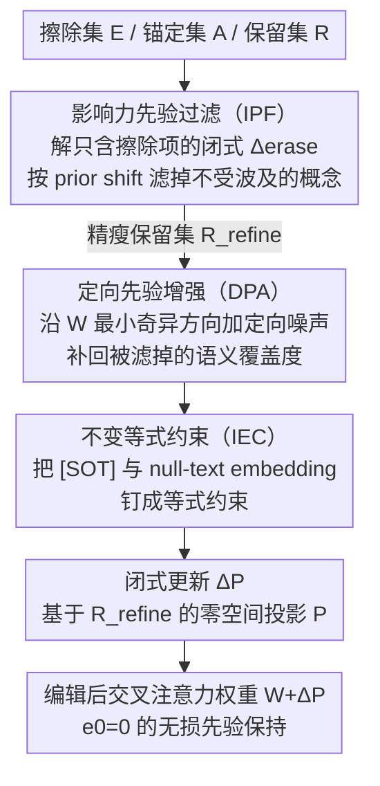

# SPEED: Scalable, Precise, and Efficient Concept Erasure for Diffusion Models

**会议**: ICLR 2026  
**arXiv**: [2503.07392](https://arxiv.org/abs/2503.07392)  
**代码**: [GitHub](https://github.com/Ouxiang-Li/SPEED)  
**领域**: 扩散模型 / 安全 / 遗忘  
**关键词**: 概念擦除, 零空间约束, 模型编辑, 先验保持, 多概念擦除  

## 一句话总结

SPEED 提出基于零空间（null space）约束的闭式模型编辑方法，通过影响力先验过滤（IPF）、定向先验增强（DPA）和不变等式约束（IEC）三种互补技术精化保留集，实现可扩展（5 秒内擦除 100 个概念）、精确（非目标概念语义零损失）且高效的概念擦除。

## 研究背景与动机

**领域现状**：T2I 扩散模型的概念擦除分为两大范式——训练式（fine-tuning，如 ESD、MACE）和编辑式（closed-form，如 UCE、RECE）。编辑式方法因不需要额外训练而天然适合多概念场景。

**现有痛点**：编辑式方法（如 UCE）使用加权最小二乘同时优化擦除误差 $e_1$ 和保留误差 $e_0$，但 $e_0$ 存在可证明的非零下界。随着擦除概念增多，$e_0$ 累积导致非目标概念语义退化。

**核心矛盾**：零空间方法（如 AlphaEdit）可以将 $e_0$ 强制为零，但保留集增大会使特征矩阵趋近满秩，零空间维度 $\dim = d_0 - \text{rank}(\mathbf{C}_0\mathbf{C}_0^\top)$ 萎缩，必须使用近似零空间，又引回语义退化。

**本文目标** 在多概念擦除中同时保证：(a) 擦除有效性、(b) 非目标概念零损失、(c) 运行效率。

**切入角度**：不是简单扩大保留集，而是策略性精化（refine）保留集——过滤掉影响小的概念防止满秩，增强影响大的概念提升覆盖度。

**核心 idea**：通过先验知识精化使零空间约束在大规模擦除中保持准确，实现 $e_0 = 0$ 的无损先验保持。

## 方法详解

### 整体框架

SPEED 要解决的是多概念擦除里"擦得掉、又不伤及无辜、还得快"的三难。输入是三个概念集合：擦除集 $\mathbf{E}$（目标概念）、锚定集 $\mathbf{A}$（替代概念，如 Snoopy→Dog）、保留集 $\mathbf{R}$（非目标概念）。整条流水线的核心动作是先把保留集**精化**成一个更精瘦但够用的 $\mathbf{R}_{\text{refine}}$，再据此对交叉注意力层的投影权重 $\mathbf{W}$ 算一次闭式更新 $\bm{\Delta}\mathbf{P}$——其中 $\mathbf{P}$ 是 $\mathbf{R}_{\text{refine}}$ 对应的零空间投影矩阵，零空间约束保证保留误差 $e_0=0$。精化分三步串行：IPF 先剔掉不受擦除波及的冗余概念、防止相关矩阵满秩，DPA 再沿权重的最小奇异方向加定向噪声补回被剔掉的语义覆盖度，IEC 最后把所有生成共享的不变 embedding 钉成硬约束；三步走完才进入闭式求解、写回权重。

### 关键设计

SPEED 的三个组件围绕同一个矛盾展开：保留集越大，零空间维度 $\dim = d_0 - \text{rank}(\mathbf{C}_0\mathbf{C}_0^\top)$ 越小，越逼近满秩就越只能退而求其次用近似零空间。IPF 负责"瘦身"——把对擦除不敏感的概念剔出保留集；DPA 负责"补位"——用语义贴合的定向噪声替补被滤掉的覆盖度；IEC 则把那些在所有生成里都出现的 invariant embedding 钉死不动。三者协同，让零空间约束在大规模擦除下依旧站得住。

**1. 影响力先验过滤（IPF）：剔掉不受擦除波及的保留概念，防止相关矩阵满秩**

零空间方法的命门是保留集一大，特征矩阵 $\mathbf{C}_0\mathbf{C}_0^\top$ 就接近满秩，零空间被压扁。但保留集里其实大量概念跟被擦除的目标八竿子打不着，根本不会因擦除而漂移——把它们留在集合里只会白白吃掉秩空间。IPF 的做法是先解一个**只含擦除项 $e_1$**、不考虑保留的闭式更新 $\bm{\Delta}_{\text{erase}}$，再用它去量化每个保留概念 $\bm{c}_0$ 真正受到的扰动，即 prior shift $\|\bm{\Delta}_{\text{erase}} \bm{c}_0\|^2$。只有 shift 高于均值的概念才被认为"确实会被殃及、值得保护"而留下，其余一律滤除。这样保留集规模骤降，相关矩阵远离满秩，零空间精度得以保住——而且整个度量过程只是一次闭式矩阵运算，无需训练。

**2. 定向先验增强（DPA）：用贴合权重的定向噪声补回覆盖度，而非引入无意义 embedding**

IPF 瘦身后会留下一个隐患：保留集变小，覆盖的语义范围也跟着缩水，对未被显式列入的非目标概念保护变弱。直觉上可以加噪声扩充，但随机噪声在权重 $\mathbf{W}$ 的映射下往往跑到语义上毫无意义的位置，反而浪费秩空间。DPA 的关键是让噪声"有方向"：对参数矩阵 $\mathbf{W}$ 做 SVD，取**最小奇异值方向**构建投影 $\mathbf{P}_{\text{min}}$，把随机噪声先投影到这个方向再加到概念 embedding 上：

$$\bm{c}_0' = \bm{c}_0 + \bm{\epsilon} \cdot \mathbf{P}_{\text{min}}$$

因为最小奇异方向上 $\mathbf{W}$ 的放大倍数最小，扰动经过 $\mathbf{W}$ 映射后产生的语义偏移也最小，等于在原概念附近"密集采样"了一圈语义近邻，既扩了覆盖度又不至于把秩空间填满垃圾。消融里 DPA 把非目标 FID 从随机增强（RPA）的 32.62 进一步压到 29.35，正是这种语义一致性的回报。

**3. 不变等式约束（IEC）：把 [SOT] 与 null-text embedding 钉死，天然守住先验**

[SOT] token 和 null-text embedding 有个特殊性质——它们出现在**每一次**生成里，几乎是所有概念的公共底座。SPEED 顺势把"保护它们"作为硬约束：要求擦除前后这些 invariant embedding 的输出严格不变，即在闭式优化中加入等式约束 $(\bm{\Delta}\mathbf{P})\mathbf{C}_2 = \mathbf{0}$，并用拉格朗日乘子法求闭式解。守住这批公共底座，等于以极低成本天然保住了一大片先验知识，消融里单加 IEC 就把非目标 FID 从 50.43 降到 48.17。

### 损失函数 / 训练策略

最终闭式解：

$$(\bm{\Delta}\mathbf{P})_{\text{Ours}} = \mathbf{W}(\mathbf{C}_*\mathbf{C}_1^\top - \mathbf{C}_1\mathbf{C}_1^\top)\mathbf{P}\mathbf{Q}\mathbf{M}$$

其中 $\mathbf{M} = (\mathbf{C}_1\mathbf{C}_1^\top\mathbf{P} + \mathbf{I})^{-1}$，$\mathbf{Q} = \mathbf{I} - \mathbf{M}\mathbf{C}_2(\mathbf{C}_2^\top\mathbf{P}\mathbf{M}\mathbf{C}_2)^{-1}\mathbf{C}_2^\top\mathbf{P}$。整个过程无需训练，直接矩阵运算。

## 实验关键数据

### 多概念擦除（名人）

| 擦除数 | 指标 | UCE | MACE | RECE | **SPEED** |
|--------|------|-----|------|------|-----------|
| 10 | $\text{Acc}_r$↑ / $H_o$↑ | 71.19 / 83.10 | 87.73 / 92.75 | 67.43 / 80.44 | **89.09 / 93.42** |
| 50 | $\text{Acc}_r$↑ / $H_o$↑ | 31.94 / 48.41 | 84.31 / 90.03 | 19.77 / 32.95 | **88.48 / 92.34** |
| 100 | $\text{Acc}_r$↑ / $H_o$↑ | 20.92 / 34.60 | 80.20 / 87.06 | 23.71 / 38.16 | **85.54 / 89.63** |
| 100 | Runtime(s) | 2.1 | 1736 | 11.0 | **5.0** |

### 消融实验

| 配置 | 目标 CS↓ | 非目标 FID↓ | MS-COCO FID↓ |
|------|----------|-------------|--------------|
| 基线（Eq.3，无精化） | 27.20 | 50.43 | 26.33 |
| +IEC | 27.20 | 48.17 | 24.95 |
| +IEC+IPF | 26.68 | 38.02 | 20.57 |
| +IEC+IPF+DPA (SPEED) | **26.29** | **29.35** | **20.36** |

### 关键发现

- IPF 贡献最大：非目标 FID 从 48.17 降到 38.02，说明过滤错误概念避免满秩是核心
- DPA 比随机增强（RPA）更优：定向噪声保持语义一致性，非目标 FID 从 32.62 降到 29.35
- SPEED 对 MACE 的速度优势为 350×（5s vs 1736s），且先验保持更好
- 可迁移到 SDXL、SDv3（DiT 架构），支持知识编辑（修改 anchor concept）

## 亮点与洞察

- **零空间约束 + 精化 = 可证明 $e_0=0$**：不是近似保持而是精确保持，这在概念数增多时优势尤其明显
- **IPF 的 prior shift 指标**：用闭式擦除更新量化影响，简洁优雅且计算高效（无需训练）
- **DPA 的定向噪声设计**：将噪声投影到 $\mathbf{W}$ 最小奇异方向是一个巧妙的 trick，可迁移到其他模型编辑任务

## 局限与展望

- 仅修改交叉注意力层权重，对不经过交叉注意力的内部表征（如 self-attention）影响有限
- 闭式解依赖线性假设，对高度非线性的概念交互可能不完美
- 保留集仍需预定义，对完全未知的非目标概念无法保证
- 擦除效果在部分场景下不如最激进的训练式方法（但换来了速度和保持）

## 相关工作与启发

- **vs UCE**：同为编辑式方法，但 UCE 的加权最小二乘有非零 $e_0$ 下界，多概念时严重退化（100 概念 $\text{Acc}_r$ 仅 20.92%）
- **vs MACE**：训练式方法用 LoRA 实现大规模擦除，效果接近但需 1736 秒 vs SPEED 的 5 秒
- **vs RECE**：迭代对抗训练提升鲁棒性，但扩展性差（100 概念 $\text{Acc}_r$ 仅 23.71%）
- 零空间约束从 continual learning 迁移到概念擦除是一个有潜力的方向

## 评分

- 新颖性: ⭐⭐⭐⭐ 零空间约束 + 先验精化的组合是核心创新，IPF/DPA/IEC 设计合理
- 实验充分度: ⭐⭐⭐⭐⭐ few/multi/implicit concept 三种任务，消融充分，跨架构验证
- 写作质量: ⭐⭐⭐⭐ 公式推导清晰，图表说明性强
- 价值: ⭐⭐⭐⭐⭐ 5 秒擦除 100 概念且先验保持最优，实用价值极高

<!-- RELATED:START -->

## 相关论文

- [\[ICML 2026\] Orthogonal Concept Erasure for Diffusion Models](../../ICML2026/image_generation/orthogonal_concept_erasure_for_diffusion_models.md)
- [\[CVPR 2026\] MapRoute: Semantic Routing for Precise Concept Erasure with Mapper](../../CVPR2026/image_generation/maproute_semantic_routing_concept_erasure.md)
- [\[ICLR 2026\] Localized Concept Erasure in Text-to-Image Diffusion Models via High-Level Representation Misdirection](localized_concept_erasure_in_text-to-image_diffusion_models_via_high-level_repre.md)
- [\[CVPR 2026\] Erasing Thousands of Concepts: Towards Scalable and Practical Concept Erasure for Text-to-Image Diffusion Models](../../CVPR2026/image_generation/erasing_thousands_of_concepts_towards_scalable_and_practical_concept_erasure_for.md)
- [\[AAAI 2026\] Mass Concept Erasure in Diffusion Models with Concept Hierarchy](../../AAAI2026/image_generation/mass_concept_erasure_in_diffusion_models_with_concept_hierarchy.md)

<!-- RELATED:END -->
